# UCLM Platform — Detailed End-to-End Flow

> This document traces every user action and system event through all 18 services, from the first login to message delivery and analytics.  
> Read in conjunction with `HLD-FULL-SYSTEM.md` for architecture context.  
> Last updated: 2026-05-13

---

## Table of Contents

1. [Flow Overview](#1-flow-overview)
2. [Phase 0 — Authentication & Identity](#2-phase-0--authentication--identity)
3. [Phase 1 — Content Setup](#3-phase-1--content-setup)
4. [Phase 2 — Campaign Creation & Approval](#4-phase-2--campaign-creation--approval)
5. [Phase 3 — Audience Acquisition](#5-phase-3--audience-acquisition)
6. [Phase 4 — Event Enrichment](#6-phase-4--event-enrichment)
7. [Phase 5 — Time Validation & Channel Dispatch](#7-phase-5--time-validation--channel-dispatch)
8. [Phase 6 — Bummlebee Delivery Pipeline](#8-phase-6--bummlebee-delivery-pipeline)
9. [Phase 7 — DLR (Delivery Report) Tracking](#9-phase-7--dlr-delivery-report-tracking)
10. [Phase 8 — Analytics & Reporting](#10-phase-8--analytics--reporting)
11. [Campaign State Machine Reference](#11-campaign-state-machine-reference)
12. [Kafka Topic Reference](#12-kafka-topic-reference)
13. [Error & Compensation Flows](#13-error--compensation-flows)
14. [IAM Header Contract](#14-iam-header-contract)

---

## 1. Flow Overview

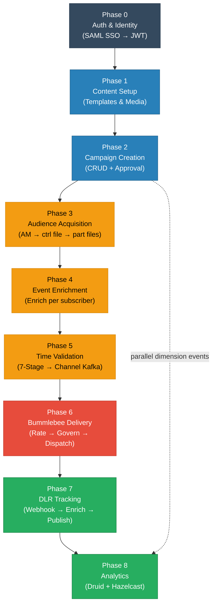

---

## 2. Phase 0 — Authentication & Identity

**Services involved:** `uclm-auth-manager`  
**Databases:** Oracle DB, Aerospike  
**External:** SAML IdP (AD FS)

### 2.1 SSO Login Sequence

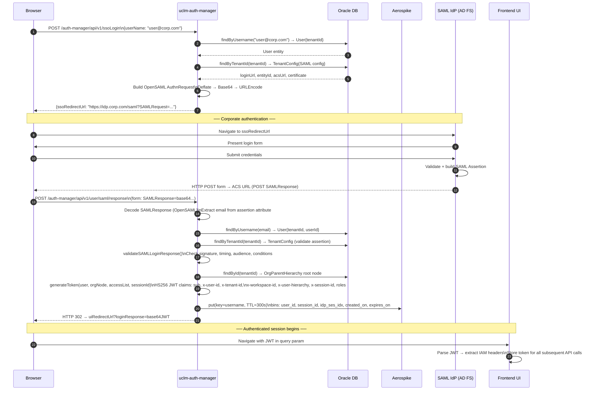

### 2.2 Workspace Switch

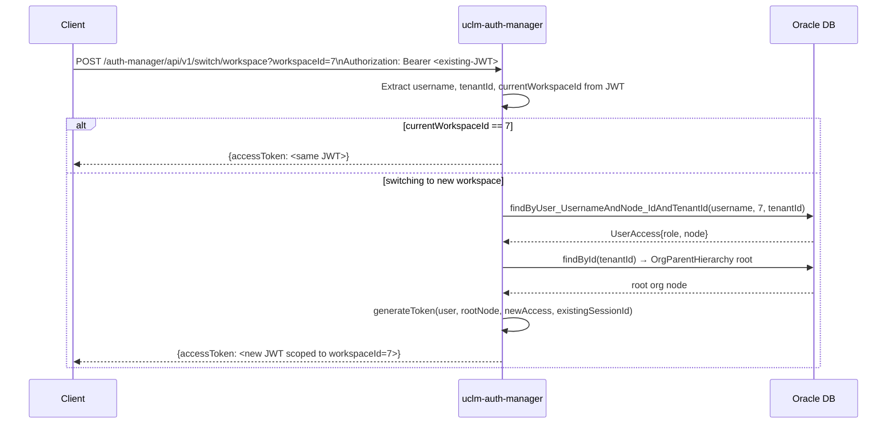

---

## 3. Phase 1 — Content Setup

**Services involved:** `uclm-contentmgmt`  
**Databases:** MongoDB, GCS/S3  
**External:** WhatsApp IQ Platform, RCS IQ Platform, Kafka

### Template Lifecycle

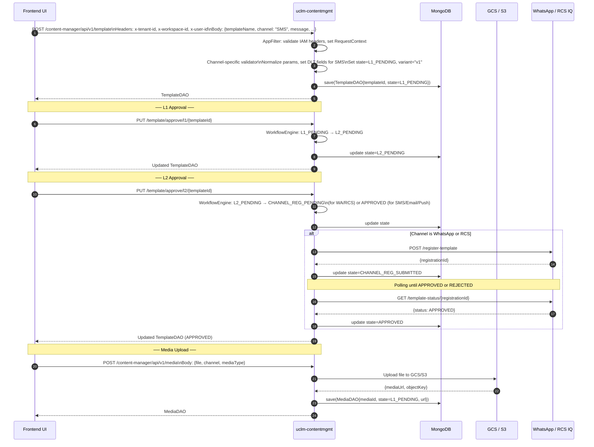

---

## 4. Phase 2 — Campaign Creation & Approval

**Services involved:** `uclm-campaign-manager`  
**Databases:** Oracle/MySQL  
**External:** Apache Airflow (DAGs), SMTP

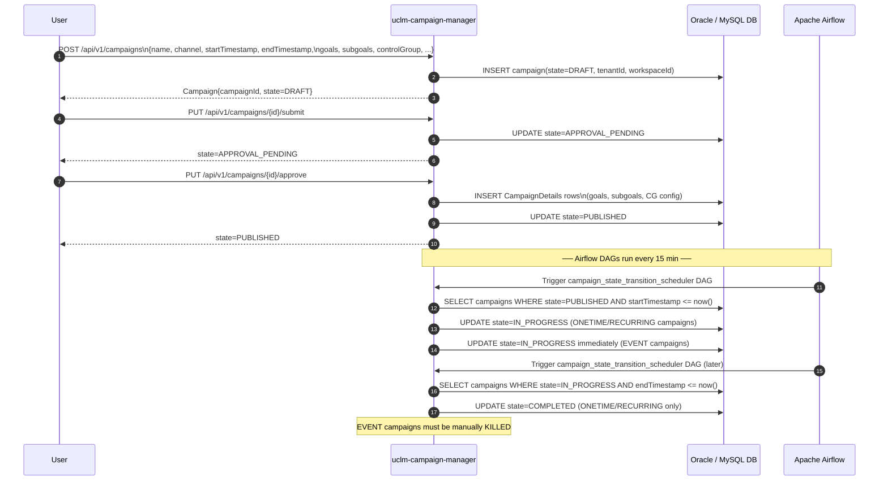

---

## 5. Phase 3 — Audience Acquisition

**Services involved:** `uclm-campaign-audience-push`, `uclm-campaign-processor`, `uclm-campaign-data-file-download`  
**External:** Audience Manager (AM), Auth Manager, AWS S3

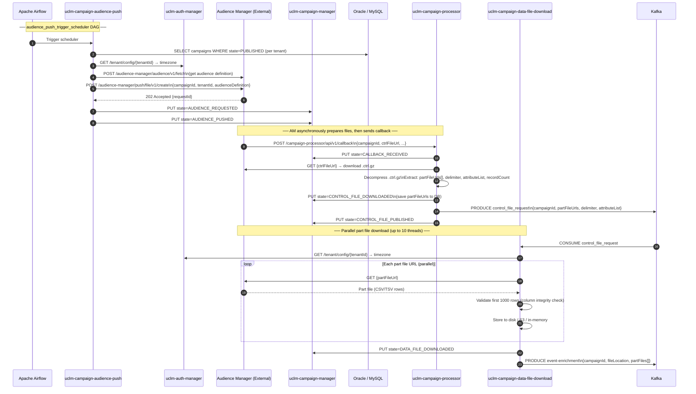

---

## 6. Phase 4 — Event Enrichment

**Services involved:** `uclm-campaign-manager-event-enrichment`, `uclm-campaign-cg-exclusion`, `uclm-campaign-exclusion-scan`, `uclm-contentmgmt`

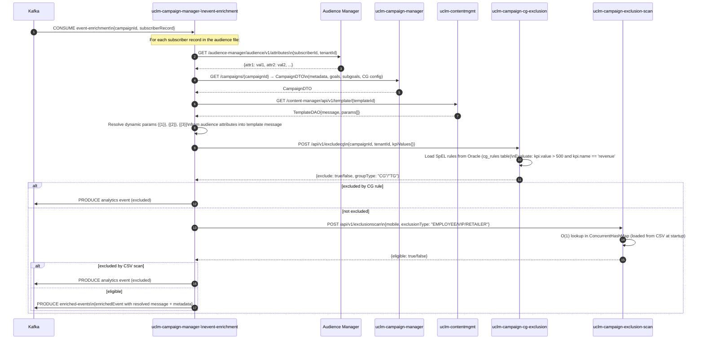

---

## 7. Phase 5 — Time Validation & Channel Dispatch

**Services involved:** `uclm-campaign-time-validation`, `uclm-test-campaign` (parallel), `uclm-campaign-cg-exclusion`, `uclm-campaign-exclusion-scan`, `uclm-contentmgmt`

### 7-Stage Validation Pipeline

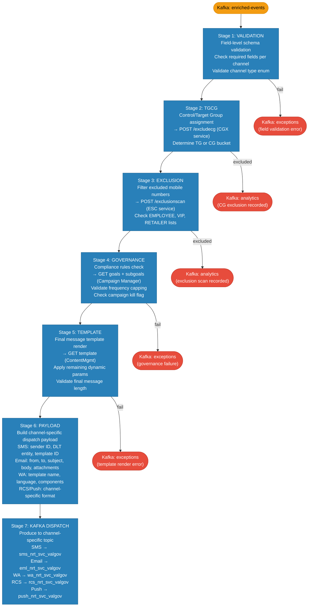

---

## 8. Phase 6 — Bummlebee Delivery Pipeline

**Services involved:** `uclm-rate-controller-service`, `uclm-validation-governance-service`, `uclm-orchestrator-service`, `uclm-dlr-aerospike-cache-loader`  
**External:** Airtel SMS IQ, Netcore Email, Airtel IQ WhatsApp, Airtel IQ Conversation (RCS), FCM Push, DLT API, CMS Quota API

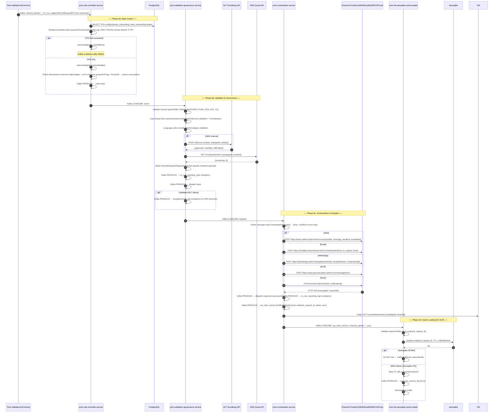

---

## 9. Phase 7 — DLR (Delivery Report) Tracking

**Services involved:** `uclm-dlr-api-service`, `uclm-dlr-enricher`  
**External:** Channel Providers (SMS/WA/RCS gateways)

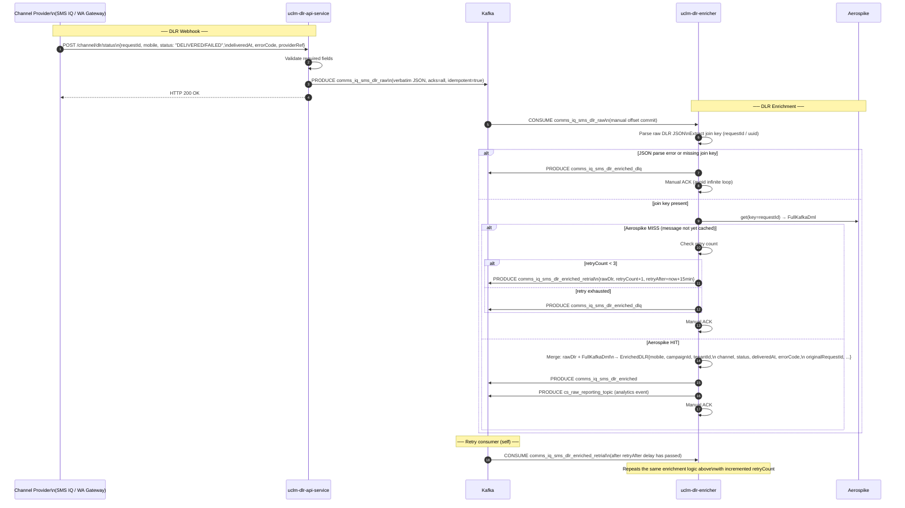

**Retry Schedule:**

| Attempt | Delay Before Re-Consume |
|---------|------------------------|
| 1st retry | 15 minutes |
| 2nd retry | 30 minutes |
| 3rd retry | 60 minutes |
| After 3rd | → `dlr_enriched_dlq` (permanent failure) |

---

## 10. Phase 8 — Analytics & Reporting

**Services involved:** `uclm-analytics-reporting-service`  
**Databases:** Oracle/MySQL, Apache Druid  
**Cache:** Hazelcast in-memory

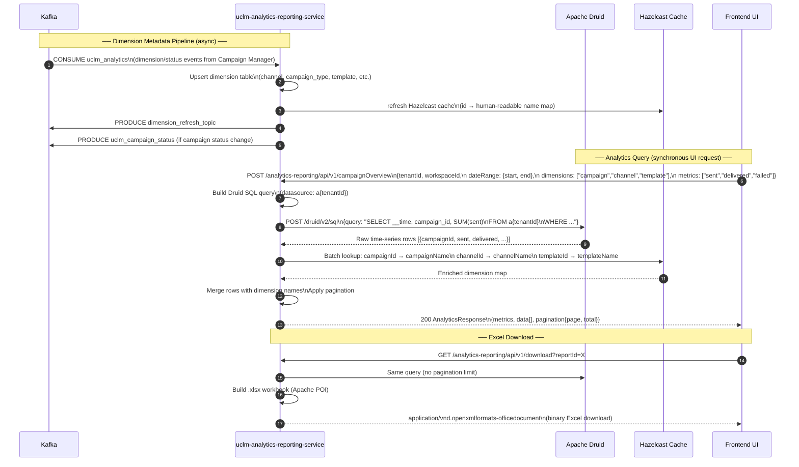

---

## 11. Campaign State Machine Reference

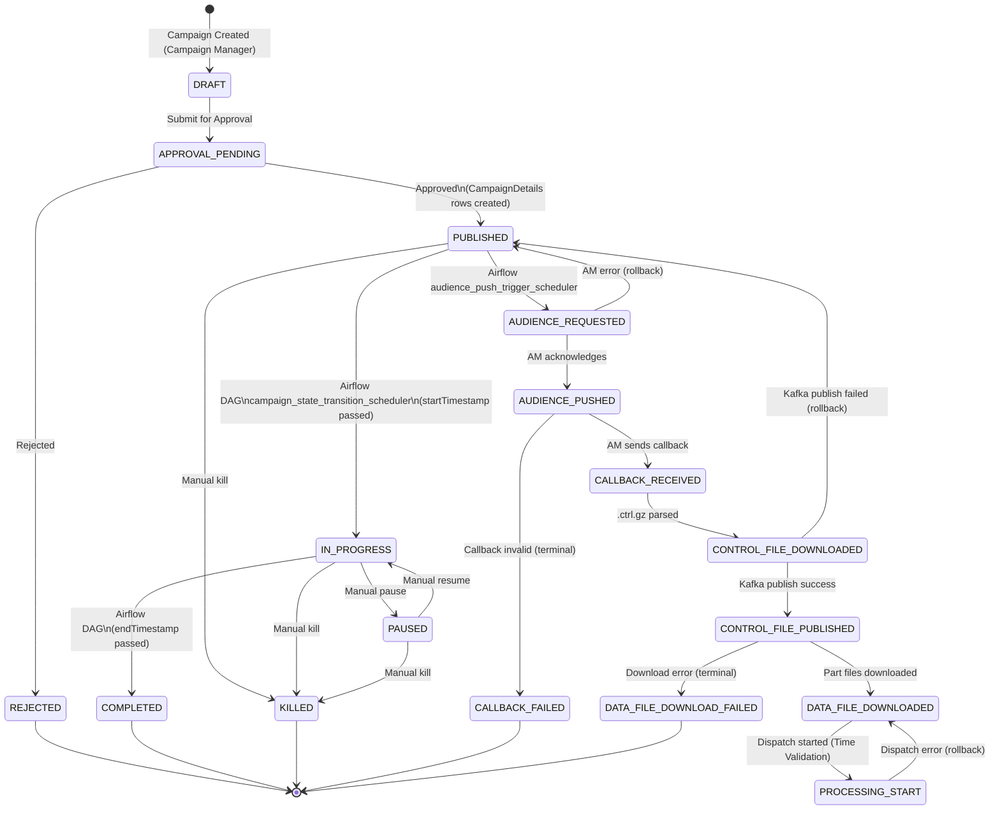

**State Ownership:**

| Transition | Responsible Service | Trigger |
|------------|--------------------|---------| 
| → `DRAFT` | Campaign Manager | REST API |
| `DRAFT` → `APPROVAL_PENDING` | Campaign Manager | REST API |
| `APPROVAL_PENDING` → `PUBLISHED` | Campaign Manager | REST API (approve action) |
| `PUBLISHED` → `IN_PROGRESS` | Campaign Manager | Airflow DAG (every 15 min) |
| `IN_PROGRESS` → `COMPLETED` | Campaign Manager | Airflow DAG (every 15 min) |
| `PUBLISHED` → `AUDIENCE_REQUESTED` | Audience Push | Airflow DAG (every 15 min) |
| `AUDIENCE_REQUESTED` → `AUDIENCE_PUSHED` | Audience Push | AM API response |
| `AUDIENCE_PUSHED` → `CALLBACK_RECEIVED` | Campaign Processor | AM async callback |
| `CALLBACK_RECEIVED` → `CONTROL_FILE_DOWNLOADED` | Campaign Processor | ctrl.gz parsed |
| `CONTROL_FILE_DOWNLOADED` → `CONTROL_FILE_PUBLISHED` | Campaign Processor | Kafka produce success |
| `CONTROL_FILE_PUBLISHED` → `DATA_FILE_DOWNLOADED` | Data File Download | All parts downloaded |
| `DATA_FILE_DOWNLOADED` → `PROCESSING_START` | Time Validation | Airflow DAG |

---

## 12. Kafka Topic Reference

### Comms Pipeline Topics

| Topic | Producer | Consumer | Payload |
|-------|----------|----------|---------|
| `control_file_request` | Campaign Processor | Data File Download | Control file metadata, partFile URLs |
| `event-enrichment` | Data File Download | Event Enrichment | Per-subscriber records + file location |
| `enriched-events` | Event Enrichment | Time Validation | Enriched subscriber events |
| `*_nrt_svc_valgov` (per channel) | Time Validation | Rate Controller | Validated EventRequestDTO |
| `uclm_analytics` | Campaign Manager, ContentMgmt | Analytics Reporting | Dimension/status change events |

### Bummlebee Dispatch Topics

| Topic | Producer | Consumer | Payload |
|-------|----------|----------|---------|
| `comms-input` / `channel-partner-rate-controller-input` | Upstream / Time Validation | Rate Controller | EventRequestDTO |
| `event` | Rate Controller | Validation Governance | EventRequestDTO (TPS-cleared) |
| `dispatch` / `channel_partner_*_endpoint` | Validation Governance | Orchestrator | ChannelDispatchRequest |
| `channel_partner_*_succ` / `wa_main_service` | Orchestrator | Aerospike Cache Loader | FullKafkaDml (success) |
| `channel_partner_*_err` | Orchestrator | Monitoring | FullKafkaDml (failure) |
| `cs_raw_reporting_topic` | VG, Orchestrator, DLR Enricher | Analytics | AnalyticsEventDTO |
| `exceptions` | Validation Governance | Monitoring | ExceptionEvent |
| `apb-exceptions` | Validation Governance | APB Monitoring | APB ExceptionEvent |
| `orchestrator-exceptions` | Orchestrator | Monitoring | Unhandled error |
| `d2c-clm-sit` (external Kafka) | Validation Governance | D2C downstream | D2C/FS events |

### DLR Topics

| Topic | Producer | Consumer | Payload |
|-------|----------|----------|---------|
| `comms_iq_sms_dlr_raw` | DLR API Service | DLR Enricher | Raw SMS DLR (verbatim from provider) |
| `comms_iq_wa_dlr_raw` | DLR API Service | DLR Enricher | Raw WhatsApp DLR |
| `comms_iq_sms_dlr_enriched` | DLR Enricher | Analytics/Downstream | Enriched DLR |
| `comms_iq_sms_dlr_enriched_retrial` | DLR Enricher | DLR Enricher (retry) | DLR retry envelope |
| `comms_iq_sms_dlr_enriched_dlq` | DLR Enricher | Manual recovery | Permanently failed DLRs |
| `wa_main_service_dlq` / `comms_iq_sms_dlr_cache_dlq` | Cache Loader | Manual recovery | Failed Aerospike writes |

### Analytics Output Topics

| Topic | Producer | Consumer |
|-------|----------|----------|
| `dimension_refresh_topic` | Analytics Reporting | Downstream analytics |
| `uclm_campaign_status` | Analytics Reporting | Downstream |

---

## 13. Error & Compensation Flows

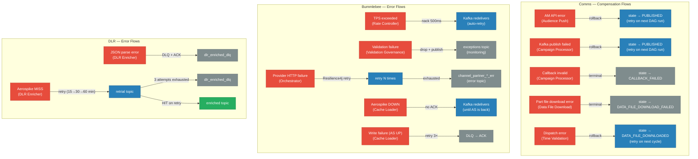

### Summary Table

| Service | Error Condition | Recovery Action |
|---------|----------------|-----------------|
| Audience Push | AM API error | Rollback state → PUBLISHED |
| Campaign Processor | Callback invalid | State → CALLBACK_FAILED (terminal) |
| Campaign Processor | Kafka publish fail | Rollback state → PUBLISHED |
| Data File Download | Download error | State → DATA_FILE_DOWNLOAD_FAILED (terminal) |
| Time Validation | Dispatch error | Rollback state → DATA_FILE_DOWNLOADED |
| Rate Controller | TPS limit exceeded | `nack(500ms)` — Kafka redelivers |
| Validation Governance | Validation/DLT failure | Publish to `exceptions` — drop message |
| Orchestrator | Provider HTTP failure | Resilience4j retry → `channel_partner_*_err` |
| Orchestrator | Message expired | Drop + publish error |
| Aerospike Cache Loader | Aerospike DOWN | No ACK — Kafka holds message |
| Aerospike Cache Loader | Write failure | Retry 3× → DLQ → ACK |
| DLR Enricher | JSON parse error | DLQ → ACK |
| DLR Enricher | Aerospike MISS | Retry topic (15/30/60 min) → DLQ after 3 |
| DLR Enricher | Aerospike HIT | Enriched topic → ACK |

---

## 14. IAM Header Contract

All authenticated requests between services must carry these headers, populated from the JWT issued by `uclm-auth-manager`:

| Header | JWT Claim | Format | Example |
|--------|-----------|--------|---------|
| `x-tenant-id` | `x-tenant-id` | Integer string | `"1"` |
| `x-workspace-id` | `x-workspace-id` | Integer string | `"5"` |
| `x-user-id` | `x-user-id` | Email / username | `"user@corp.com"` |
| `x-user-hierarchy` | `x-user-hierarchy` | Hyphen-separated node IDs | `"1-3-5"` |
| `Authorization` | — | `Bearer <JWT>` | `"Bearer eyJhbGci..."` |

### Whitelisted Paths (No Auth Required)

| Service | Path | Reason |
|---------|------|--------|
| auth-manager | `POST /ssoLogin` | Login initiation |
| auth-manager | `POST /user/saml/response` | SAML IdP callback |
| auth-manager | `GET /tenant/config/**` | Public tenant lookup |
| auth-manager | `GET /user/saml/logout/response` | SAML logout callback |
| contentmgmt | `POST /template/callback/sms` | DLT webhook |
| campaign-processor | `POST /api/v1/callback` | Audience Manager async callback |
| dlr-api-service | `POST /channel/dlr/status` | Channel provider DLR webhook |
