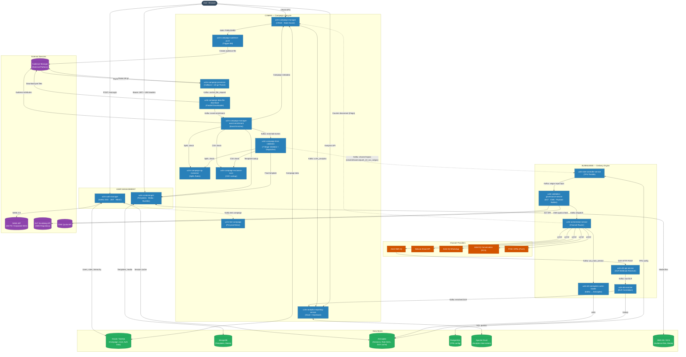

# UCLM Platform — Full System High-Level Design

> **UCLM (Unified Customer Lifecycle Management)** is a multi-tenant, multi-channel marketing campaign platform.  
> It orchestrates the entire journey from campaign creation to message delivery and analytics across SMS, Email, WhatsApp, RCS, and Push channels.  
> Last updated: 2026-05-13

---

## Table of Contents

1. [System Purpose & Scope](#1-system-purpose--scope)
2. [Platform Architecture Overview](#2-platform-architecture-overview)
3. [Module Breakdown](#3-module-breakdown)
   - [User Management](#31-user-management)
   - [Comms (Campaign Lifecycle)](#32-comms-campaign-lifecycle)
   - [Bummlebee (Message Delivery Engine)](#33-bummlebee-message-delivery-engine)
4. [Full System Architecture Diagram](#4-full-system-architecture-diagram)
5. [Service Catalog](#5-service-catalog)
6. [Technology Stack](#6-technology-stack)
7. [Data Stores](#7-data-stores)
8. [Messaging Infrastructure](#8-messaging-infrastructure)
9. [External System Dependencies](#9-external-system-dependencies)
10. [Cross-Cutting Concerns](#10-cross-cutting-concerns)
11. [Deployment Model](#11-deployment-model)
12. [Non-Functional Characteristics](#12-non-functional-characteristics)

---

## 1. System Purpose & Scope

UCLM enables marketing and communications teams to:

- **Create** multi-channel campaigns (SMS, Email, WhatsApp, RCS, Push) with full approval workflows
- **Manage** content templates and media assets per tenant and workspace
- **Execute** campaigns against audience segments supplied by an external Audience Manager
- **Deliver** messages reliably through multiple channel providers with rate limiting, governance, and DLT compliance
- **Track** delivery receipts (DLRs) and report campaign performance through real-time analytics

The platform is **multi-tenant**: all data and processing is isolated by `tenantId` and `workspaceId` at runtime, without physical service separation.

---

## 2. Platform Architecture Overview

UCLM is divided into **three loosely coupled modules**, each owning a distinct concern:

```
┌─────────────────────────────────────────────────────────────────┐
│                        FRONTEND / API CLIENTS                    │
└────────────────────────────┬────────────────────────────────────┘
                             │  REST / JWT
         ┌───────────────────┼──────────────────────┐
         ▼                   ▼                      ▼
┌─────────────────┐  ┌───────────────────┐  ┌──────────────────┐
│  USER MANAGEMENT │  │      COMMS        │  │   BUMMLEBEE      │
│  (Identity &    │  │  (Campaign        │  │  (Delivery       │
│   Content)      │  │   Lifecycle)      │  │   Engine)        │
└────────┬────────┘  └────────┬──────────┘  └────────┬─────────┘
         │                    │  Kafka                │  Kafka
         │              ┌─────▼────────┐        ┌────▼──────────┐
         │              │   comms-     │        │  dispatch /   │
         │              │   input      │        │  DLR topics   │
         └──────────────┴─────────────-┴────────┴───────────────┘
                             │
                    ┌────────▼──────────┐
                    │  CHANNEL PROVIDERS │
                    │  SMS · Email · WA  │
                    │  RCS · Push        │
                    └───────────────────┘
```

| Module | Primary Concern | Communication Style |
|--------|----------------|---------------------|
| **User Management** | Authentication, RBAC, content templates | REST (synchronous) |
| **Comms** | Campaign CRUD, audience processing, enrichment, validation | REST + Kafka (async) |
| **Bummlebee** | Rate limiting, governance, dispatch, DLR tracking | Kafka-only (async) |

---

## 3. Module Breakdown

### 3.1 User Management

Handles **identity, access control, and content lifecycle** for the platform.

**Services:**

| Service | Role |
|---------|------|
| `uclm-auth-manager` | SAML 2.0 SSO, JWT issuance, RBAC, org hierarchy, workspace switching, session management |
| `uclm-contentmgmt` | Campaign content templates, media assets, bundles, L1/L2 approval workflow, WhatsApp/RCS template registration |

**Key characteristics:**
- All downstream services receive **IAM headers** (`x-tenant-id`, `x-workspace-id`, `x-user-id`, `x-user-hierarchy`) extracted from the JWT
- Sessions stored in Aerospike with 300-second TTL
- Content stored in MongoDB; media files in GCS/S3

---

### 3.2 Comms (Campaign Lifecycle)

Manages the **end-to-end campaign journey** from creation to audience dispatch.

**Services:**

| Service | Role |
|---------|------|
| `uclm-campaign-manager` | Central state owner — CRUD APIs for campaigns, goals, control groups |
| `uclm-campaign-audience-push` | Triggers audience file creation at external Audience Manager (AM) |
| `uclm-campaign-processor` | Receives AM callback, parses `.ctrl.gz` control file, publishes to Kafka |
| `uclm-campaign-data-file-download` | Downloads audience part files from AM in parallel (up to 10 threads) |
| `uclm-campaign-manager-event-enrichment` | Enriches per-subscriber events with campaign metadata, templates, and exclusion checks |
| `uclm-campaign-time-validation` | 7-stage validation pipeline; dispatches validated events to channel-specific Kafka topics |
| `uclm-campaign-cg-exclusion` | SpEL-based control/target group rule evaluation |
| `uclm-campaign-exclusion-scan` | In-memory CSV lookup for employee/VIP/retailer exclusions |
| `uclm-test-campaign` | Pre-production mirror of `time-validation` for safe feature rollout |
| `uclm-analytics-reporting-service` | Druid-backed analytics query engine + dimension metadata pipeline |

**Campaign state progression (simplified):**

```
DRAFT → APPROVAL_PENDING → PUBLISHED → AUDIENCE_REQUESTED → AUDIENCE_PUSHED
    → CALLBACK_RECEIVED → CONTROL_FILE_DOWNLOADED → CONTROL_FILE_PUBLISHED
    → DATA_FILE_DOWNLOADED → PROCESSING_START
```

---

### 3.3 Bummlebee (Message Delivery Engine)

A **Kafka-native delivery pipeline** that accepts pre-validated events from Comms, enforces rate limits, governs compliance, dispatches to external channel providers, and tracks delivery receipts.

**Services:**

| Service | Role |
|---------|------|
| `uclm-rate-controller-service` | Per-team/channel TPS throttle gate (Resilience4j); global cap 2000 TPS |
| `uclm-validation-governance-service` | Multi-channel payload validation, DLT SMS compliance scrubbing, CMS quota checks, payload construction |
| `uclm-orchestrator-service` | Routes dispatch requests to SMS IQ, Netcore Email, WhatsApp IQ, RCS IQ, FCM Push providers |
| `uclm-dlr-api-service` | HTTP webhook receiver for delivery report callbacks from channel providers |
| `uclm-dlr-aerospike-cache-loader` | Stores dispatch outcome records in Aerospike for DLR correlation |
| `uclm-dlr-enricher` | Joins raw DLRs with original dispatch records from Aerospike; publishes enriched DLRs |

**Two internal pipelines:**
- **Dispatch Pipeline**: `comms-input → event → dispatch → HTTP to provider`
- **DLR Pipeline**: `HTTP POST from provider → raw-dlr → enriched-dlr → analytics`


---

## 4. Full System Architecture Diagram



---

## 5. Service Catalog

| # | Module | Service | Port | Role | DB | Kafka |
|---|--------|---------|------|------|----|-------|
| 1 | User Mgmt | `uclm-auth-manager` | `${PORT}` | SAML SSO, JWT, RBAC, org hierarchy | Oracle + Aerospike | — |
| 2 | User Mgmt | `uclm-contentmgmt` | `${PORT}` | Templates, media, bundles, approval workflow | MongoDB + GCS/S3 | Consumer + Producer |
| 3 | Comms | `uclm-campaign-manager` | `80` | Central CRUD + state owner | Oracle/MySQL | Producer |
| 4 | Comms | `uclm-campaign-audience-push` | `8095` | Trigger AM audience file creation | Oracle/MySQL | — |
| 5 | Comms | `uclm-campaign-processor` | `8080` | Receive AM callback, parse ctrl file | Oracle/MySQL | Producer |
| 6 | Comms | `uclm-campaign-data-file-download` | `8070` | Download audience part files (parallel) | Oracle/MySQL | Consumer |
| 7 | Comms | `uclm-campaign-manager-event-enrichment` | `8091` | Enrich events with audience attrs + templates | Oracle/MySQL | Consumer + Producer |
| 8 | Comms | `uclm-campaign-time-validation` | `8091` | 7-stage validate → dispatch to channel Kafka | Oracle/MySQL | Consumer + Producer |
| 9 | Comms | `uclm-campaign-cg-exclusion` | `8080` | SpEL rule evaluation (CG/TG logic) | Oracle | — |
| 10 | Comms | `uclm-campaign-exclusion-scan` | `8080` | In-memory CSV exclusion lookup | CSV files | — |
| 11 | Comms | `uclm-test-campaign` | varies | Pre-prod mirror of time-validation | Oracle/MySQL | Consumer + Producer |
| 12 | Comms | `uclm-analytics-reporting-service` | `8080` | Druid analytics + dimension metadata pipeline | Oracle/MySQL + Druid | Consumer + Producer |
| 13 | Bummlebee | `uclm-rate-controller-service` | `8081` | Per-team TPS throttle gate (Resilience4j) | PostgreSQL | Consumer + Producer |
| 14 | Bummlebee | `uclm-validation-governance-service` | `7777` | Multi-channel validation, DLT scrubbing, CMS | Lookup files | Consumer + Producer |
| 15 | Bummlebee | `uclm-orchestrator-service` | — | Route dispatch requests to channel providers | — | Consumer + Producer |
| 16 | Bummlebee | `uclm-dlr-api-service` | `8080` | HTTP DLR webhook receiver | — | Producer |
| 17 | Bummlebee | `uclm-dlr-aerospike-cache-loader` | — | Write dispatch records to Aerospike | Aerospike | Consumer + DLQ |
| 18 | Bummlebee | `uclm-dlr-enricher` | — | Enrich raw DLRs from Aerospike | Aerospike (read) | Consumer + Producer |

---

## 6. Technology Stack

| Layer | Technology | Used By |
|-------|-----------|---------|
| **Language / Runtime** | Java 17, Spring Boot 3.x | All 18 services |
| **Service Communication** | Apache Kafka (async), Spring Cloud OpenFeign (sync), Spring WebClient (reactive) | All |
| **Authentication** | SAML 2.0 (OpenSAML), HS256 JWT | auth-manager |
| **Rate Limiting** | Resilience4j RateLimiter | rate-controller |
| **Circuit Breaking** | Resilience4j CircuitBreaker | rate-controller, dlr-enricher, orchestrator |
| **Scheduled Jobs** | Apache Airflow DAGs, Spring `@Scheduled` | audience-push, campaign-manager, analytics |
| **Distributed Locking** | ShedLock (via MongoDB) | contentmgmt |
| **Object Storage** | AWS S3, Google Cloud Storage (GCS) | campaign-processor, campaign-data-file-download, contentmgmt |
| **Container / Orchestration** | Kubernetes (K8s), Helm | All |
| **Secret Management** | Kubernetes Secrets / env vars | All |
| **Observability** | Kafka `cs_raw_reporting_topic` (analytics events) | Validation Governance, Orchestrator, DLR Enricher |

---

## 7. Data Stores

| Store | Type | Used By | Purpose |
|-------|------|---------|---------|
| **Oracle DB / MySQL** | Relational RDBMS | Campaign Manager, Audience Push, Processor, DFD, Event Enrichment, Time Validation, CG Exclusion, Auth Manager, Analytics | Campaign data, user data, roles, org hierarchy, tenant config |
| **PostgreSQL** | Relational RDBMS | Rate Controller | Team/tenant TPS configuration (`tenant_onboarding`, `team_onboarding`) |
| **MongoDB** | Document NoSQL | ContentMgmt | Templates, media assets, bundles, channel configs, ShedLock state |
| **Aerospike** | In-memory NoSQL | Auth Manager, Rate Controller, Validation Governance, DLR Cache Loader, DLR Enricher | Sessions (TTL), rate-limit counters, bounce/unsubs/kill-campaign flags, dispatch records for DLR correlation |
| **Apache Druid** | Time-series OLAP | Analytics Reporting | Campaign performance metrics indexed as `a{tenantId}` datasources |
| **AWS S3 / GCS** | Object Storage | Campaign Processor, Data File Download, ContentMgmt | Audience control files, audience part files (up to 500 MB), media assets |
| **Local FS / In-memory** | File / Heap | Exclusion Scan, Validation Governance | Exclusion CSV lists, schema lookup files |

---

## 8. Messaging Infrastructure

All asynchronous communication uses **Apache Kafka**. Three separate pipelines exist:

### 8.1 Comms → Bummlebee Handoff

| Topic | From | To |
|-------|------|----|
| `*_nrt_svc_valgov` (SMS/Email/WA/RCS/Push) | Time Validation | Rate Controller (entry into Bummlebee) |

### 8.2 Bummlebee Dispatch Pipeline

| Topic | From | To |
|-------|------|----|
| `comms-input` | Upstream/Comms | Rate Controller |
| `event` | Rate Controller | Validation Governance |
| `dispatch` | Validation Governance | Orchestrator |
| `channel_partner_*_succ` / `wa_main_service` | Orchestrator | Aerospike Cache Loader |
| `channel_partner_*_err` | Orchestrator | Monitoring |
| `cs_raw_reporting_topic` | VG, Orchestrator, DLR Enricher | Analytics |
| `exceptions` / `apb-exceptions` | Validation Governance | Monitoring |
| `orchestrator-exceptions` | Orchestrator | Monitoring |

### 8.3 DLR Pipeline

| Topic | From | To |
|-------|------|----|
| `comms_iq_sms_dlr_raw` / `comms_iq_wa_dlr_raw` | DLR API Service | DLR Enricher |
| `comms_iq_sms_dlr_enriched` | DLR Enricher | Analytics/Downstream |
| `comms_iq_sms_dlr_enriched_retrial` | DLR Enricher | DLR Enricher (retry) |
| `comms_iq_sms_dlr_enriched_dlq` | DLR Enricher | Manual recovery |

### 8.4 Analytics / Dimension

| Topic | From | To |
|-------|------|----|
| `uclm_analytics` | Campaign Manager, ContentMgmt | Analytics Reporting |
| `dimension_refresh_topic` | Analytics Reporting | Downstream analytics |
| `uclm_campaign_status` | Analytics Reporting | Downstream |

### 8.5 Kafka Security

| Environment | Protocol | Auth |
|-------------|----------|------|
| Local / DEV | `PLAINTEXT` | None |
| UAT | `SASL_PLAINTEXT` | Kerberos (GSSAPI) |
| PROD | `SASL_SSL` | Kerberos (GSSAPI) + TLS |

---

## 9. External System Dependencies

| System | Protocol | Used By | Purpose |
|--------|----------|---------|---------|
| **SAML IdP (AD FS)** | SAML 2.0 | Auth Manager | Corporate Single Sign-On |
| **Audience Manager (AM)** | REST HTTP | Audience Push, Processor, Data File Download, Event Enrichment | Audience file creation and retrieval |
| **Airtel SMS IQ** | REST HTTP | Orchestrator, DLR API Service | SMS delivery + DLR callbacks |
| **Netcore Email API** | REST HTTP | Orchestrator | Transactional email delivery |
| **Airtel IQ WhatsApp** | REST HTTP | Orchestrator | WhatsApp message delivery |
| **Airtel IQ Conversation** | REST HTTP | Orchestrator | RCS message delivery |
| **FCM / APNs** | REST HTTP | Orchestrator | Mobile push notification delivery |
| **DLT Scrubbing API** | REST HTTP | Validation Governance | SMS regulatory compliance (India DLT) |
| **CMS Quota API** | REST HTTP | Validation Governance, Orchestrator | Campaign message quota enforcement |
| **WhatsApp IQ Platform** | REST HTTP | ContentMgmt | Template registration + approval polling |
| **RCS IQ Platform** | REST HTTP | ContentMgmt | Template registration + approval polling |
| **Apache Airflow** | DAG Scheduler | Campaign Manager, Audience Push | Campaign lifecycle state transitions |
| **SMTP Server** | SMTP | Campaign Manager | Email notifications (campaign alerts) |

---

## 10. Cross-Cutting Concerns

### IAM Headers (Authorization Context)

Every inter-service request carries tenant/user context via HTTP headers injected from the JWT:

| Header | Purpose |
|--------|---------|
| `x-tenant-id` | Tenant data isolation |
| `x-workspace-id` | Workspace/department scoping |
| `x-user-id` | Audit trail, self-service prevention |
| `x-user-hierarchy` | Hierarchical access checks (format: `1-3-5`) |

### Multi-Tenancy

- All services are **multi-tenant-in-a-single-instance** — no physical tenant separation
- Tenant scoping is enforced at the application layer via `tenantId` column partitioning in all DB tables
- Aerospike uses namespaced sets per channel; keys include `tenantId` as prefix where relevant

### Error Handling & Resilience

| Pattern | Where Applied |
|---------|--------------|
| Kafka `nack` with backoff | Rate Controller — TPS exceeded |
| Resilience4j Circuit Breaker | DLR Enricher (Aerospike), Orchestrator (channel providers) |
| Retry with exponential backoff | DLR Enricher (15 min → 30 min → 60 min) |
| Dead Letter Queue (DLQ) | Cache Loader, DLR Enricher |
| Kafka `acks=all` + idempotent producer | DLR API Service |
| Manual Kafka offset commit | DLR Enricher (zero data loss) |
| State rollback | Audience Push, Campaign Processor (revert to `PUBLISHED` on failure) |

---

## 11. Deployment Model

### Pod Count by Service

| Service | Pods | Isolation |
|---------|------|-----------|
| `uclm-validation-governance-service` | **10** | 1 pod per channel (`SMS-IQ`, `SMS-Lobby`, `Email`, `Email-SMTP`, `Email-Attachment`, `Push`, `RCS`, `WhatsApp`, `D2C`) |
| `uclm-orchestrator-service` | **5** | 1 pod per channel (`SMS-IQ`, `SMS-Lobby`, `Email-SMTP`, `Email-Netcore`, `RCS`) |
| `uclm-dlr-aerospike-cache-loader` | **5** | 1 pod per channel (`SMS`, `Email-Netcore`, `Push`, `RCS`, `WhatsApp`) |
| `uclm-dlr-enricher` | **5** | 1 pod per channel (`SMS`, `Email-Netcore`, `Push`, `RCS`, `WhatsApp`) |
| `uclm-dlr-api-service` | **3** | 1 pod per channel (`SMS`, `Email-Netcore`, `RCS`) |
| `uclm-campaign-manager` | **2–6** | Auto-scales via Helm HPA |
| All other services | **1** | Global instance |

Channel selection is driven by `SPRING_PROFILES_ACTIVE` environment variable in each pod.

### Helm & Kubernetes

- All services are managed with **Helm charts**
- Per-channel pods use different Helm release names with the same chart
- Kubernetes Ingress or ALB routes external DLR webhooks to `uclm-dlr-api-service`

---

## 12. Non-Functional Characteristics

| Attribute | Detail |
|-----------|--------|
| **Throughput** | Global dispatch: 2000 TPS max · Per-tenant: 5 TPS default (configurable) |
| **Audience file size** | Up to 500 MB per campaign audience control file |
| **Session TTL** | 300 seconds inactivity · JWT validity 360,000 ms (~6 min) |
| **DLR retry window** | 15 min → 30 min → 60 min (3 attempts total before DLQ) |
| **Data isolation** | Tenant-level isolation via `tenantId` on all data; workspace-level for campaign data |
| **Channels supported** | SMS, Email, WhatsApp, RCS, Push (FCM/APNs), D2C, FS |
| **DB portability** | Oracle/MySQL/Aurora switchable via Spring profile across all Comms services |
| **Observability** | All events emit to `cs_raw_reporting_topic`; Druid stores time-series for dashboarding |
| **Exclusion freshness** | CSV exclusion lists reload daily at 00:30 AM without pod restart |
| **Analytics caching** | Hazelcast in-memory cache for dimension ID→name enrichment |
