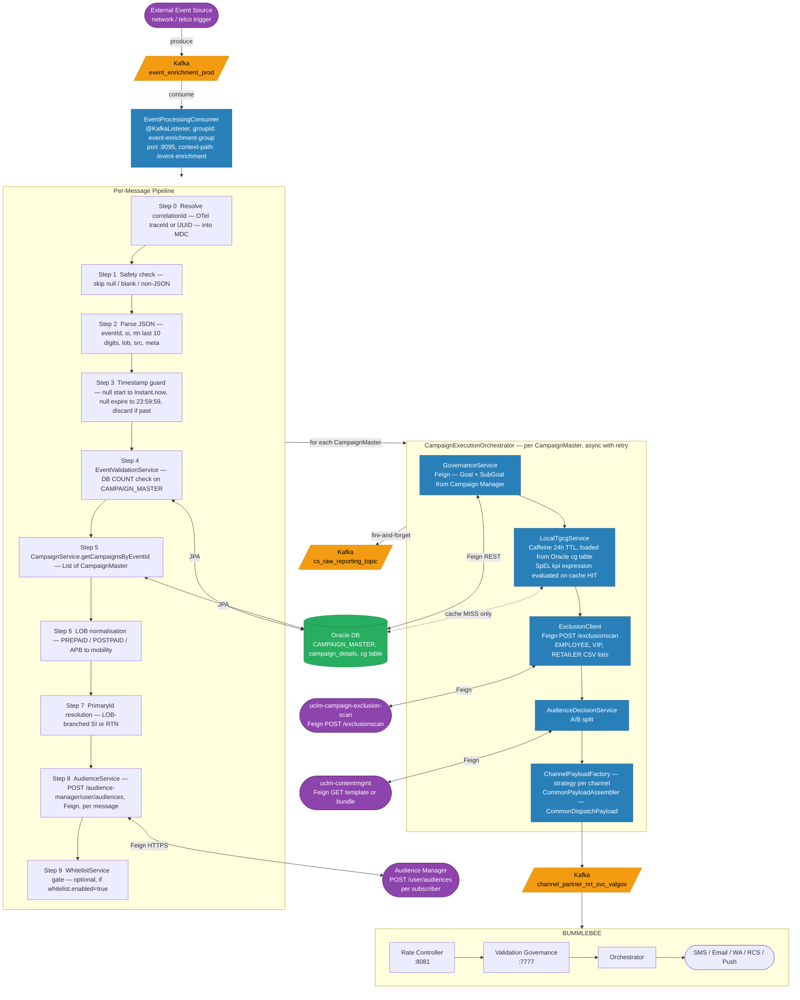
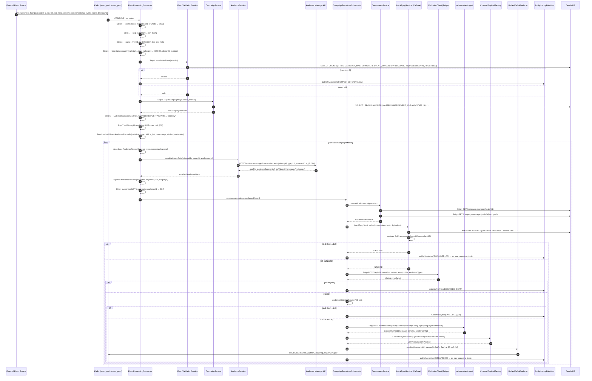
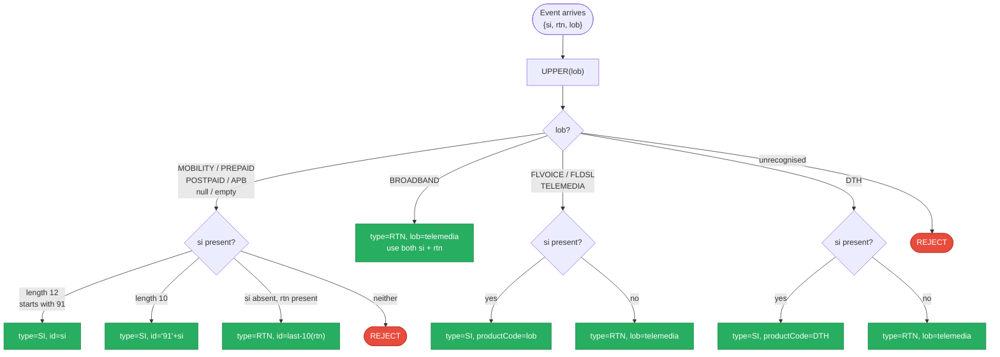
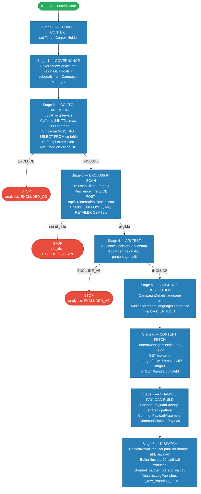
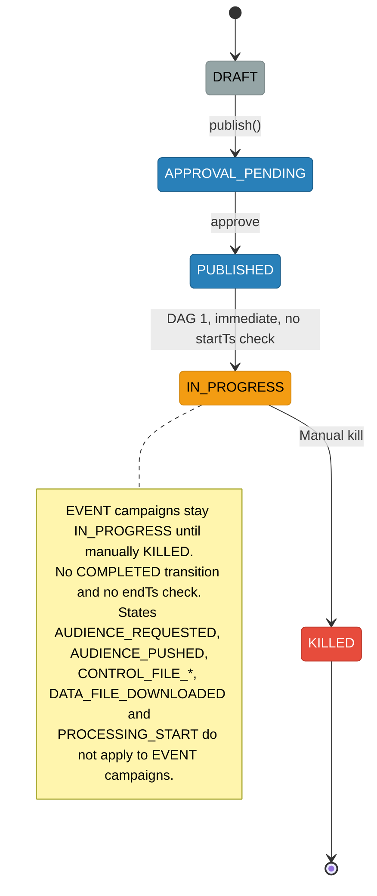

# HLD — NRT Campaign Flow (EVENT / Near Real-Time)

**Role:** Real-time event-triggered campaign execution path — an external system event fires a Kafka message that is immediately consumed by `uclm-campaign-manager-event-enrichment`, which validates, enriches, excludes, and dispatches per-subscriber without any audience file, batch download, or Airflow scheduling.

---

## 1. Purpose & Responsibilities

| Responsibility | Detail |
|---|---|
| Real-time event consumption | `EventProcessingConsumer` listens on `event_enrichment_prod`; processes each message end-to-end in-band |
| Campaign DB validation | Confirms a PUBLISHED or IN_PROGRESS campaign with matching `eventId` exists before any enrichment |
| Subscriber identity resolution | LOB-branched logic maps `si` / `rtn` / `lob` fields to a typed `PrimaryId` (SI or RTN) for Audience Manager lookup |
| Per-subscriber real-time enrichment | Feign call to Audience Manager API per campaign — fetches profile attributes, audience segment IDs, KPI values, language preference |
| Audience membership filter | Subscriber must belong to the campaign's configured `audienceId`; otherwise dropped |
| CG / TG exclusion | `LocalTgcgService` (Caffeine cache, 24h TTL, loaded from Oracle) evaluates SpEL expressions without a DB round-trip per message |
| Exclusion scan | Feign call to `uclm-campaign-exclusion-scan` for EMPLOYEE / VIP / RETAILER list check |
| A/B test split | `AudienceDecisionServiceImpl` applies percentage split from campaign config |
| Content fetch | Feign call to `uclm-contentmgmt` for template or bundle; language-aware |
| Channel payload build | `ChannelPayloadFactory` strategy pattern per channel (SMS / EMAIL / PUSH / WA / RCS) |
| Kafka dispatch | `UnifiedKafkaProducer` publishes `CommonDispatchPayload` to `channel_partner_*_nrt_svc_valgov`; buffered flush at 50; soft-fail |
| Analytics | `AnalyticsLogPublisher` → `cs_raw_reporting_topic` fire-and-forget at every gate |
| Whitelist gate | Optional in-memory `Set<String>` (refreshed on schedule); controlled by `whitelist.enabled` |
| OTel tracing | Correlation ID = OTel `traceId` if available, else random UUID; attached to MDC per message |
| No Airflow DAGs | `EVENT` campaigns transition `PUBLISHED → IN_PROGRESS` immediately via DAG 1 — no audience push, no ctrl file, no DAG 2 or DAG 3 |

---

## 2. High-Level Architecture



---

## 3. Detailed Processing Flow

### 3a. Full Per-Message Pipeline



### 3b. LOB-based PrimaryId Resolution



---

## 4. Key Business Logic

### Per-Campaign Execution Stages



### LocalTgcgService Cache Design

```
Cache type:     Caffeine (in-process, JVM-local)
Maximum size:   10,000 entries
TTL:            expireAfterWrite = 24 hours
Cache key:      campaignId + cgId
On cache MISS:  JPA SELECT FROM Oracle cg table
On cache HIT:   SpEL expression evaluated with zero I/O
                (critical: EVENT campaigns can receive thousands of events/minute)
Remote TGCG:    uclm-campaign-cg-exclusion service is NOT called in the NRT flow
                LocalTgcgService replaces it entirely for performance
```

### Whitelist Gate (when enabled)

```
whitelist.enabled = true  (production env)
WhitelistService holds Set<String> of allowed si / rtn values
Refreshed on configurable schedule (e.g. daily)
Subscriber NOT in set → DISCARD before enrichment (before AM API call)
```

### Kafka Producer Buffer

```
UnifiedKafkaProducer internal buffer: List<CommonDispatchPayload>
Flush condition: buffer.size() >= 50 OR end of campaign loop
Failure handling: soft-fail — error is logged, flow continues
                  never blocks or fails the Kafka consumer
```

---

## 5. Campaign State for EVENT Type

EVENT campaigns use a simpler state path — no audience file states:



---

## 6. Kafka Topics

| Topic | Direction | Consumer Group | Payload |
|-------|-----------|---------------|---------|
| `event_enrichment_prod` | CONSUME | `event-enrichment-group` | Raw trigger event JSON (`event_enrichment` in DEV) |
| `channel_partner_sms_nrt_svc_valgov` | PRODUCE | Rate Controller (Bummlebee) | SMS `CommonDispatchPayload` |
| `channel_partner_wa_nrt_svc_valgov` | PRODUCE | Rate Controller (Bummlebee) | WhatsApp `CommonDispatchPayload` |
| `channel_partner_eml_nrt_svc_valgov` | PRODUCE | Rate Controller (Bummlebee) | Email `CommonDispatchPayload` |
| `channel_partner_push_nrt_svc_valgov` | PRODUCE | Rate Controller (Bummlebee) | Push `CommonDispatchPayload` |
| `channel_partner_rcs_nrt_svc_valgov` | PRODUCE | Rate Controller (Bummlebee) | RCS `CommonDispatchPayload` |
| `cs_raw_reporting_topic` | PRODUCE | Analytics Reporting | `AnalyticsLogEvent` (fire-and-forget per gate) |

---

## 7. External Dependencies

| System | Type | Base URL | Purpose |
|--------|------|----------|---------|
| Audience Manager | REST / Feign HTTPS | `https://uclm-audience-manager.apps...` | Per-subscriber profile enrichment + segment membership |
| `uclm-contentmgmt` | REST / Feign HTTP | `http://contentmanager-deployment...:7002/content-manager` | Template / bundle fetch per campaign |
| `uclm-campaign-manager` | REST / Feign HTTP | `http://campaign-manager-uclm...:80` | Goal + SubGoal resolution for governance |
| `uclm-campaign-exclusion-scan` | REST / Feign HTTP | `http://exclusion-scan-service...:8080` | Employee / VIP / retailer exclusion check |
| Oracle DB | JPA / JDBC | `jdbc:oracle:thin:@...` | Campaign master, details, CG rules, whitelist |
| Kafka Cluster | SASL_PLAINTEXT (Kerberos GSSAPI) | `10.92.36.48:9092,...` (dev) | Inbound events + outbound dispatch + analytics |

---

## 8. Configuration Reference

| Property | Default / Dev Value | Description |
|----------|---------------------|-------------|
| `server.port` | `8095` | Service HTTP port |
| `server.servlet.context-path` | `/event-enrichment` | Context path |
| `spring.kafka.consumer.group-id` | `event-enrichment-group` | Kafka consumer group |
| `kafka.topics.inbound` | `event_enrichment` (dev) / `event_enrichment_prod` (prod) | Topic consumed |
| `kafka.campaign.topics.SMS` | `channel_partner_sms_nrt_svc_valgov` | SMS outbound topic |
| `kafka.campaign.topics.WHATSAPP` | `channel_partner_wa_nrt_svc_valgov` | WA outbound topic |
| `kafka.campaign.topics.EMAIL` | `channel_partner_eml_nrt_svc_valgov` | Email outbound topic |
| `kafka.campaign.topics.PUSH` | `channel_partner_push_nrt_svc_valgov` | Push outbound topic |
| `kafka.campaign.topics.RCS` | `channel_partner_rcs_nrt_svc_valgov` | RCS outbound topic |
| `kafka.logs.analytics-topic` | `cs_raw_reporting_topic` | Analytics topic |
| `whitelist.enabled` | `false` | Enable subscriber whitelist gate |
| `audience.bb_to_comms` | `N` | Enable BROADBAND LOB processing when `Y` |
| `resilience4j.retry.maxAttempts` | `3` | Retry attempts for downstream Feign calls |
| `resilience4j.retry.waitDuration` | `500ms` | Wait between retries |
