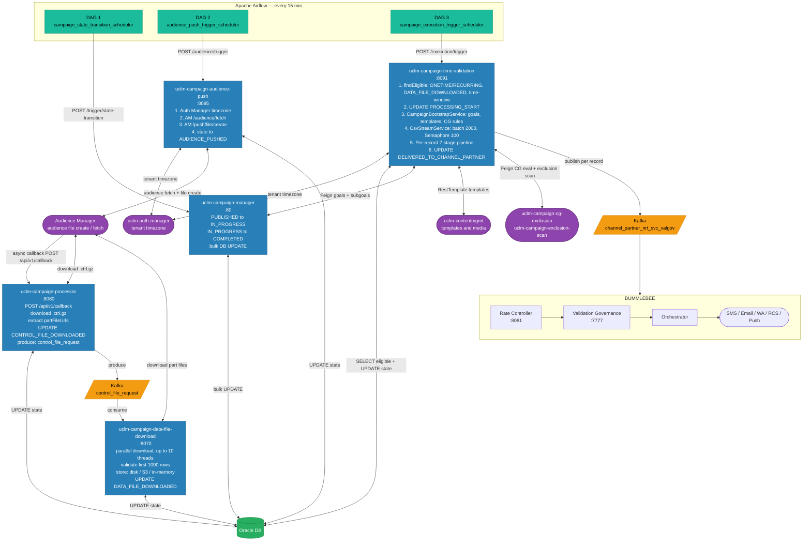
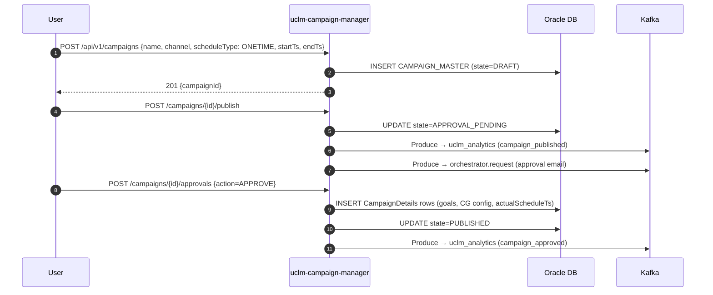
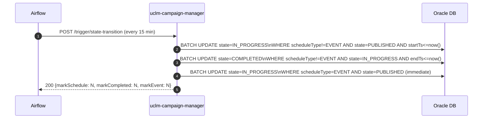
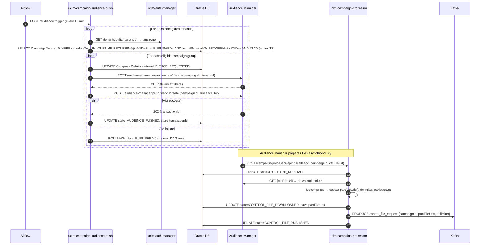
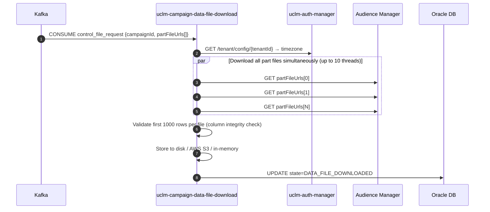
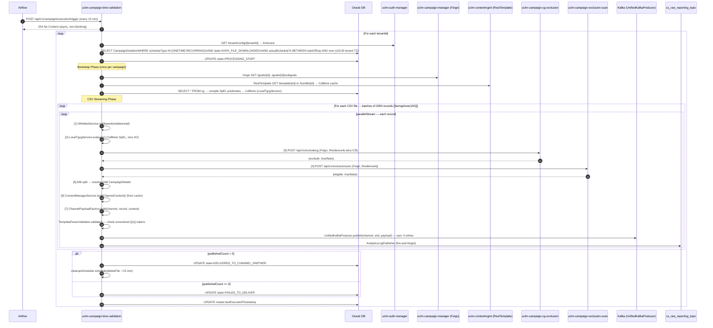
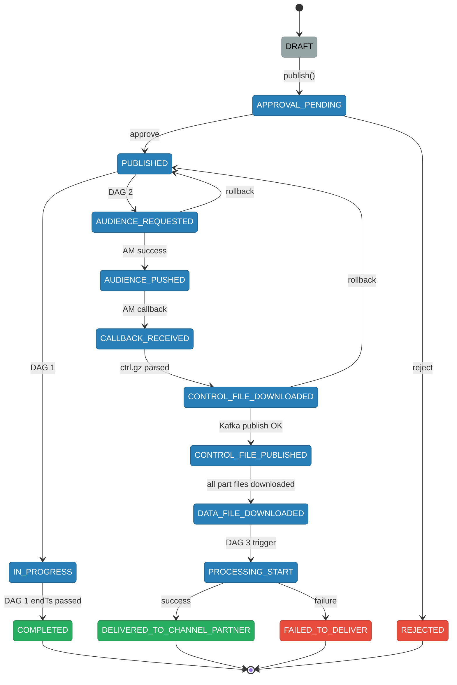

# HLD — Scheduled Campaign Flow (ONETIME / RECURRING)

**Role:** End-to-end execution path for time-scheduled campaigns — from Airflow DAG trigger through audience file acquisition, CSV streaming, 7-stage per-record validation, and channel dispatch into Bummlebee.

---

## 1. Purpose & Responsibilities

| Responsibility | Detail |
|---|---|
| State lifecycle management | Campaign Manager owns all transitions: `DRAFT → PUBLISHED → IN_PROGRESS → COMPLETED` |
| Airflow-driven triggers | Three DAGs fire every 15 min to advance state and execute campaigns |
| Audience file acquisition | Audience Push calls Audience Manager to create an audience file; Campaign Processor downloads the `.ctrl.gz` control file and extracts part-file URLs |
| Parallel part-file download | Data File Download fetches all audience CSV part-files concurrently (up to 10 threads), validates first 1000 rows, stores to disk / S3 |
| Per-record 7-stage pipeline | Time Validation streams CSVs, runs whitelist → TGCG → exclusion scan → A/B test → template resolve → payload build → Kafka publish per record |
| State machine ownership | Campaign Processor and Data File Download drive sub-states; Time Validation sets `PROCESSING_START → DELIVERED_TO_CHANNEL_PARTNER` |
| Bummlebee handoff | Time Validation publishes `CommonDispatchPayload` to `channel_partner_*_nrt_svc_valgov` — the shared entry into Bummlebee's Rate Controller |
| Analytics | Every record outcome fires to `cs_raw_reporting_topic` (fire-and-forget) |
| Schedule types covered | `ONETIME`, `RECURRING` — EVENT campaigns do **not** use this path |

---

## 2. High-Level Architecture



---

## 3. Detailed Processing Flow

### 3a. Campaign Creation → Approval → PUBLISHED



### 3b. Airflow DAG 1 — State Transitions



### 3c. Airflow DAG 2 — Audience Push → Audience Manager → Campaign Processor



### 3d. Data File Download (Parallel)



### 3e. Airflow DAG 3 — Time Validation: CSV Streaming + 7-Stage Per-Record Pipeline



---

## 4. Key Business Logic

### Campaign State Machine



### DAG 2 — Audience Push Eligibility Query

```sql
SELECT cd FROM CampaignDetails cd
JOIN cd.campaignMaster cm
WHERE LOWER(cm.scheduleType) IN ('onetime', 'recurring')
  AND LOWER(cd.state) = 'published'
  AND cd.actualScheduleTs >= :startOfDay       -- 00:00 in tenant TZ
  AND cd.actualScheduleTs < :endOfDay          -- 23:30 in tenant TZ
  AND cm.tenantId = :tenantId
ORDER BY cd.actualScheduleTs ASC
```

### DAG 3 — Time Validation Time-Window

```
startOfDay  = ZonedDateTime.now(tenantTZ).truncatedTo(DAYS)
currentTime = ZonedDateTime.now(tenantTZ)
if currentTime.toLocalTime() > 23:30 → cap at today@23:30

eligible if: startOfDay ≤ actualScheduleTs ≤ currentTime
             AND state = DATA_FILE_DOWNLOADED
             AND scheduleType IN (ONETIME, RECURRING)
```

### LocalTgcgService Cache (Time Validation)

```
Type:    Caffeine (in-process)
Key:     campaignId + cgId
TTL:     loaded once per bootstrap phase (not time-based)
Purpose: zero I/O per-record CG evaluation during CSV streaming
         avoids DB round-trip for every one of potentially millions of records
```

---

## 5. Kafka Topics

| Topic | Producer | Consumer | Payload |
|-------|----------|----------|---------|
| `uclm_analytics` | Campaign Manager | Analytics Reporting | Campaign created / approved events |
| `orchestrator.request` | Campaign Manager | Orchestrator (email) | Approval notification emails |
| `control_file_request` | Campaign Processor | Data File Download | ctrl.gz metadata + part-file URLs |
| `channel_partner_sms_nrt_svc_valgov` | Time Validation | Rate Controller (Bummlebee) | SMS CommonDispatchPayload |
| `channel_partner_wa_nrt_svc_valgov` | Time Validation | Rate Controller (Bummlebee) | WhatsApp CommonDispatchPayload |
| `channel_partner_eml_nrt_svc_valgov` | Time Validation | Rate Controller (Bummlebee) | Email CommonDispatchPayload |
| `channel_partner_push_nrt_svc_valgov` | Time Validation | Rate Controller (Bummlebee) | Push CommonDispatchPayload |
| `channel_partner_rcs_nrt_svc_valgov` | Time Validation | Rate Controller (Bummlebee) | RCS CommonDispatchPayload |
| `cs_raw_reporting_topic` | Time Validation | Analytics Reporting | Per-record outcome analytics event |

---

## 6. External Dependencies

| System | Called By | Method | Purpose |
|--------|-----------|--------|---------|
| Audience Manager | Audience Push, Data File Download | REST / WebClient | Audience file creation, part-file download |
| `uclm-auth-manager` | Audience Push, Data File Download, Time Validation | Feign | Tenant timezone resolution |
| `uclm-contentmgmt` | Time Validation | RestTemplate (cached) | Template / bundle fetch |
| `uclm-campaign-cg-exclusion` | Time Validation | Feign (Resilience4j) | SpEL CG rule evaluation |
| `uclm-campaign-exclusion-scan` | Time Validation | Feign (Resilience4j) | Employee / VIP / retailer exclusion lookup |
| `uclm-campaign-manager` | Time Validation | Feign | Goal + subgoal resolution for governance |
| Apache Airflow | — | HTTP POST (DAGs) | Scheduled trigger source for all three execution phases |
| AWS S3 | Data File Download | SDK | Audience part-file storage (when S3 profile active) |
