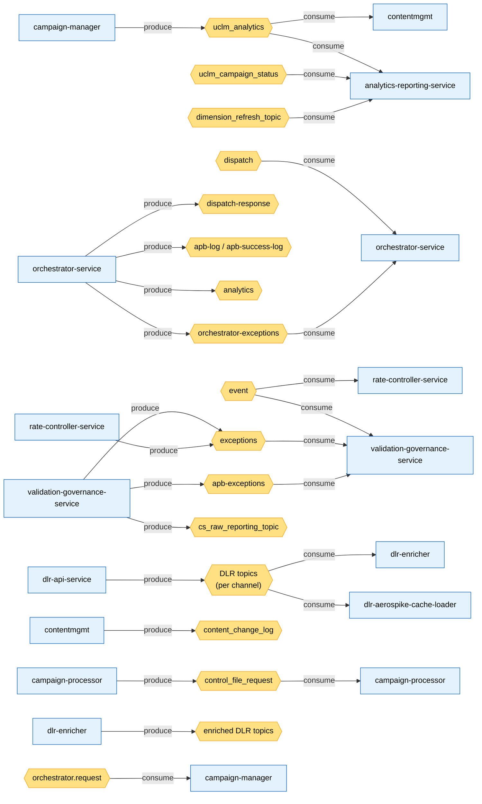
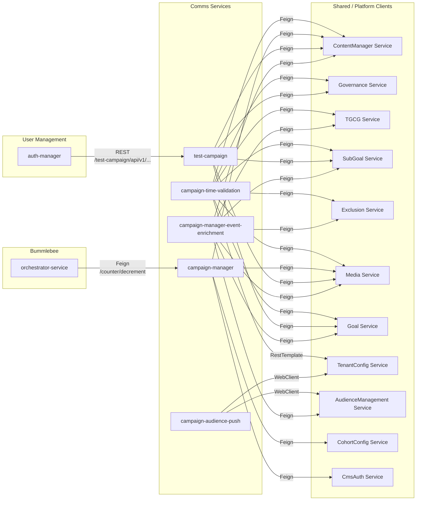
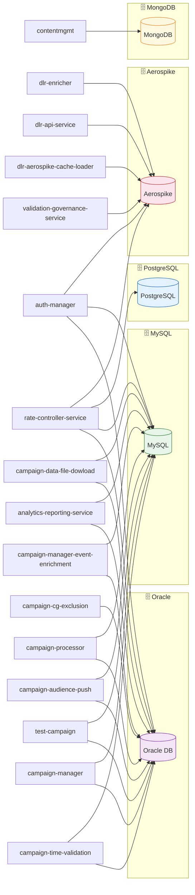
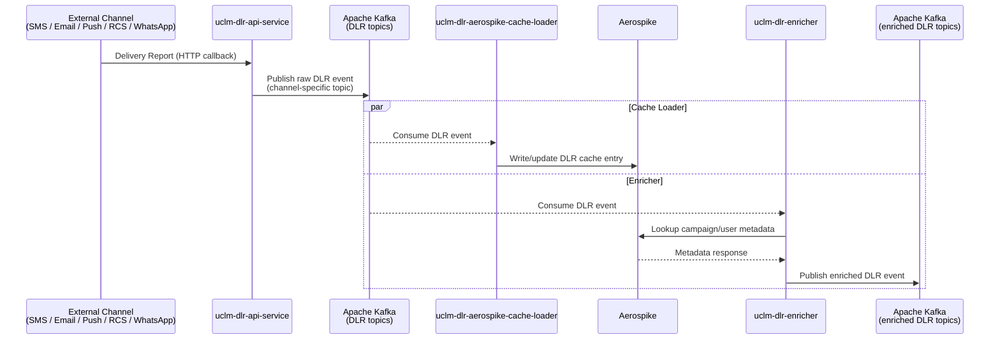

# UCLM Service Dependencies

> Auto-generated by scanning all repos under `/Documents/UCLM`.  
> Last updated: 2026-05-12

---

## Table of Contents

- [Comms Group](#comms-group)
  - [uclm-campaign-cg-exclusion](#1-uclm-campaign-cg-exclusion)
  - [uclm-campaign-time-validation](#2-uclm-campaign-time-validation)
  - [uclm-campaign-manager](#3-uclm-campaign-manager)
  - [uclm-test-campaign](#4-uclm-test-campaign)
  - [uclm-campaign-exclusion-scan](#5-uclm-campaign-exclusion-scan)
  - [uclm-campaign-audience-push](#6-uclm-campaign-audience-push)
  - [uclm-campaign-processor](#7-uclm-campaign-processor)
  - [uclm-campaign-manager-event-enrichment](#8-uclm-campaign-manager-event-enrichment)
  - [uclm-analytics-reporting-service](#9-uclm-analytics-reporting-service)
  - [uclm-campaign-data-file-dowload](#10-uclm-campaign-data-file-dowload)
- [Bummlebee Group](#bummlebee-group)
  - [uclm-validation-governance-service](#11-uclm-validation-governance-service)
  - [uclm-dlr-aerospike-cache-loader](#12-uclm-dlr-aerospike-cache-loader)
  - [uclm-orchestrator-service](#13-uclm-orchestrator-service)
  - [uclm-dlr-api-service](#14-uclm-dlr-api-service)
  - [uclm-rate-controller-service](#15-uclm-rate-controller-service)
  - [uclm-dlr-enricher](#16-uclm-dlr-enricher)
- [User Management Group](#user-management-group)
  - [uclm-contentmgmt](#17-uclm-contentmgmt)
  - [uclm-auth-manager](#18-uclm-auth-manager)
- [Dependency Matrix](#dependency-matrix)
- [Mermaid Diagrams](#mermaid-diagrams)
  - [System Architecture Overview](#1-system-architecture-overview)
  - [Kafka Topic Flow](#2-kafka-topic-flow)
  - [Internal Service Calls (Feign / REST)](#3-internal-service-calls-feign--rest)
  - [Database Dependency Map](#4-database-dependency-map)
  - [DLR Pipeline](#5-dlr-pipeline)

---

## Mermaid Diagrams

### 1. System Architecture Overview

> High-level view of all three service groups, Kafka, databases, and external channels.

```mermaid
graph TD
    subgraph COMMS["📦 Comms Group"]
        CM["campaign-manager"]
        CTV["campaign-time-validation"]
        TC["test-campaign"]
        CCE["campaign-cg-exclusion"]
        CES["campaign-exclusion-scan"]
        CAP["campaign-audience-push"]
        CP["campaign-processor"]
        CMEE["campaign-manager-event-enrichment"]
        ARS["analytics-reporting-service"]
        CDFD["campaign-data-file-dowload"]
    end

    subgraph BB["⚙️ Bummlebee Group"]
        VGS["validation-governance-service"]
        DACL["dlr-aerospike-cache-loader"]
        OS["orchestrator-service"]
        DLRAPI["dlr-api-service"]
        RC["rate-controller-service"]
        DLRE["dlr-enricher"]
    end

    subgraph UM["👤 User Management Group"]
        CMGMT["contentmgmt"]
        AUTH["auth-manager"]
    end

    subgraph EXT["🌐 External Channels"]
        EMAIL["Email API\n(Netcore)"]
        SMS_EXT["SMS API\n(Airtel IQ)"]
        WA["WhatsApp API\n(Airtel IQ)"]
        RCS_EXT["RCS API\n(Airtel IQ)"]
        PUSH["Push — APB"]
        CMS_EXT["CMS API"]
    end

    subgraph INFRA["🏗️ Infrastructure"]
        KAFKA[["Apache Kafka"]]
        S3["AWS S3"]
    end

    subgraph DBS["🗄️ Databases"]
        ORA[("Oracle")]
        MYSQL[("MySQL")]
        PG[("PostgreSQL")]
        MONGO[("MongoDB")]
        AS[("Aerospike")]
    end

    %% Kafka flows
    CM -->|"uclm_analytics"| KAFKA
    KAFKA -->|"uclm_analytics"| ARS
    KAFKA -->|"uclm_analytics"| CMGMT
    KAFKA -->|"orchestrator.request"| CM
    KAFKA -->|"dispatch"| OS
    OS -->|"dispatch-response\napb-log / analytics"| KAFKA
    KAFKA -->|"event"| VGS
    KAFKA -->|"event"| RC
    VGS -->|"exceptions\ncs_raw_reporting_topic"| KAFKA
    RC -->|"exceptions"| KAFKA
    DLRAPI -->|"DLR topics"| KAFKA
    KAFKA -->|"DLR topics"| DACL
    KAFKA -->|"DLR topics"| DLRE
    DLRE -->|"enriched DLR"| KAFKA
    CP <-->|"control_file_request"| KAFKA
    CMGMT -->|"content_change_log"| KAFKA

    %% External HTTP
    OS --> EMAIL
    OS --> SMS_EXT
    OS --> WA
    OS --> RCS_EXT
    OS --> PUSH
    OS -->|"Feign: /counter/decrement"| CM
    AUTH -->|"REST"| TC
    CM --> CMS_EXT

    %% S3
    CP --- S3
    CDFD --- S3

    %% DB connections
    CM --- ORA & MYSQL
    CCE --- ORA
    CTV --- ORA & MYSQL
    TC --- ORA & MYSQL
    CAP --- ORA & MYSQL
    CP --- ORA & MYSQL
    CMEE --- ORA & MYSQL
    ARS --- ORA & MYSQL
    CDFD --- ORA & MYSQL
    AUTH --- ORA & MYSQL & AS
    VGS --- AS
    DACL --- AS
    DLRE --- AS
    RC --- AS & PG
    DLRAPI --- AS
    CMGMT --- MONGO
```



---

### 2. Kafka Topic Flow

> Shows every Kafka topic and which service produces or consumes it.



---

### 3. Internal Service Calls (Feign / REST)

> Shows which UCLM services make HTTP/Feign calls to other UCLM services or shared clients.



---

### 4. Database Dependency Map

> Which services depend on which database engines.



---

### 5. DLR Pipeline

> End-to-end Delivery Report flow — from channel response to enriched event in Kafka.



---

## Comms Group

---

### 1. uclm-campaign-cg-exclusion

> Exclusion data management for campaign contact groups.

| Category | Dependency |
|----------|-----------|
| **Database** | Oracle (JDBC) |
| **Kafka — Consume** | — |
| **Kafka — Produce** | — |
| **External Services** | — |
| **Other** | JPA / Hibernate |

**Notes:**
- Oracle host (UAT/PROD): `10.222.164.174:1535/NCHBDEV`
- MySQL config is present but commented out; Oracle is active.

---

### 2. uclm-campaign-time-validation

> Validates campaign scheduling, timing rules, and eligibility before dispatch.

| Category | Dependency |
|----------|-----------|
| **Database** | Oracle, MySQL |
| **Kafka — Consume** | Multiple topics (channel/context-specific) |
| **Kafka — Produce** | Multiple topics |
| **External Services (Feign)** | `ContentManagerClient`, `GovernanceClient`, `TgcgClient`, `SubGoalClient`, `ExclusionClient`, `MediaClient`, `GoalClient` |
| **External Services (REST)** | `TenantConfigClient` (RestTemplate) |
| **Other** | Resilience4j, Caffeine cache, HttpClient5, OpenAPI |

**Kafka Brokers:**
- DEV: `10.92.36.48:9092`, `10.92.36.44:9092`, `10.92.36.46:9092`
- PROD/UAT: `10.20.5.166:9092`, `10.20.5.177:9092`, `10.20.5.142:9092`

---

### 3. uclm-campaign-manager

> Core campaign lifecycle management — create, approve, schedule campaigns.

| Category | Dependency |
|----------|-----------|
| **Database** | Oracle (23.2.0.0), MySQL |
| **Kafka — Consume** | `orchestrator.request` (approval notifications) |
| **Kafka — Produce** | `uclm_analytics` |
| **External Services (Feign)** | `ContentManagerClient`, `MediaFilterClient`, `CohortConfigClient`, `CampaignConfigClient`, `CmsAuthClient` |
| **External Services (HTTP)** | CMS API — `https://cms-dev.airtel.com` (DEV), `http://cms-deployment.nextgenclm-api-develop.svc.cluster.local:7002` (UAT) |
| **Other** | spring-boot-starter-mail, spring-boot-starter-cache, Resilience4j, Cron-utils, OpenAPI |

**Kafka Brokers:**
- LOCAL: `localhost:9092`
- UAT: `10.92.36.48:9092`
- PROD: `prod-kafka:9092`

---

### 4. uclm-test-campaign

> Runs test/dry-run campaigns to validate behavior before live dispatch.

| Category | Dependency |
|----------|-----------|
| **Database** | Oracle, MySQL |
| **Kafka — Consume** | Multiple topics |
| **Kafka — Produce** | Multiple topics |
| **External Services (Feign)** | `ContentManagerClient`, `GovernanceClient`, `SubGoalClient`, `MediaClient`, `GoalClient` |
| **Other** | Resilience4j, Feign, HttpClient5 |

**Notes:** Architecture mirrors `uclm-campaign-time-validation`.

---

### 5. uclm-campaign-exclusion-scan

> Scans and processes exclusion lists for campaigns.

| Category | Dependency |
|----------|-----------|
| **Database** | — (file-based) |
| **Kafka — Consume** | — |
| **Kafka — Produce** | — |
| **External Services** | — |
| **Other** | Local file system (`INGEST_BASE_FOLDER`) |

**Notes:** Fully self-contained; no external service or DB dependency.

---

### 6. uclm-campaign-audience-push

> Pushes audience data to downstream audience management systems.

| Category | Dependency |
|----------|-----------|
| **Database** | Oracle (ojdbc11), MySQL |
| **Kafka — Consume** | — |
| **Kafka — Produce** | — |
| **External Services (WebClient)** | `TenantConfigClient`, `AudienceManagementClient` |
| **Other** | Spring WebFlux (Netty), Reactive stack |

---

### 7. uclm-campaign-processor

> Processes control files for campaigns (S3-backed batch processing).

| Category | Dependency |
|----------|-----------|
| **Database** | Oracle (ojdbc11), MySQL |
| **Kafka — Consume** | `control_file_request` |
| **Kafka — Produce** | `control_file_request` |
| **External Services** | AWS S3 |
| **Other** | AWS SDK 2.25.56, Resilience4j |

**Kafka Brokers (UAT):** `10.92.36.48:9092`  
**Notes:** Max file size 500 MB; S3 used for control file storage.

---

### 8. uclm-campaign-manager-event-enrichment

> Enriches campaign manager events with data from multiple downstream sources.

| Category | Dependency |
|----------|-----------|
| **Database** | Oracle, MySQL |
| **Kafka — Consume** | Multiple topics |
| **Kafka — Produce** | Multiple topics |
| **External Services (Feign)** | `TgcgClient`, `SubGoalClient`, `ExclusionClient`, `AudienceClient`, `MediaClient`, `GoalClient`, `ContentManagerClient` |
| **Other** | Resilience4j, Feign, HttpClient5 |

---

### 9. uclm-analytics-reporting-service

> Aggregates and reports analytics from campaign events.

| Category | Dependency |
|----------|-----------|
| **Database** | Oracle (23.2.0.0), MySQL |
| **Kafka — Consume** | `uclm_analytics`, `dimension_refresh_topic`, `uclm_campaign_status` |
| **Kafka — Produce** | — |
| **External Services** | — |
| **Other** | Analytical aggregation processing |

---

### 10. uclm-campaign-data-file-dowload

> Handles downloading campaign data files from S3 storage.

| Category | Dependency |
|----------|-----------|
| **Database** | Oracle, MySQL |
| **Kafka — Consume** | — |
| **Kafka — Produce** | — |
| **External Services** | AWS S3 |
| **Other** | Spring WebFlux (Netty), AWS SDK, Resilience4j |

---

## Bummlebee Group

---

### 11. uclm-validation-governance-service

> Governance layer — validates events, manages bounce/unsubscribe/kill-campaign data.

| Category | Dependency |
|----------|-----------|
| **Database** | Aerospike |
| **Kafka — Consume** | `event`, `exceptions`, `apb-exceptions`, `d2c-clm-sit` (DEV) |
| **Kafka — Produce** | `exceptions`, `apb-exceptions`, `cs_raw_reporting_topic` |
| **External Services** | — |
| **Other** | Kerberos auth, spring-data-aerospike, spring-data-jdbc |

**Aerospike:**
- LOCAL: `localhost:3000` — namespace `test`
- DEV: `10.5.247.156:3000` — namespace `arch`
- Sets: `bounce_data`, `unsubs_data`, `kill_campaign_data`
- Max connections: 100

---

### 12. uclm-dlr-aerospike-cache-loader

> Loads Delivery Report (DLR) data into Aerospike cache per channel.

| Category | Dependency |
|----------|-----------|
| **Database** | Aerospike (per-channel) |
| **Kafka — Consume** | Channel-specific DLR topics (SMS, Email, Push, RCS, WhatsApp, Email-Netcore) |
| **Kafka — Produce** | Channel-specific topics |
| **External Services** | — |
| **Other** | Aerospike client 7.1.0, Kerberos SCRAM auth, Spring Retry, Micrometer metrics |

**Channels supported:** SMS · Email (Netcore) · Push · RCS · WhatsApp  
**Aerospike Auth:**
- UAT: `aerospike-loader@UAT-REALM.COM`
- PROD: `aerospike-loader@PROD-REALM.COM`

---

### 13. uclm-orchestrator-service

> Orchestrates actual message dispatch across all communication channels.

| Category | Dependency |
|----------|-----------|
| **Database** | — |
| **Kafka — Consume** | `dispatch`, `orchestrator-exceptions` |
| **Kafka — Produce** | `dispatch-response`, `apb-log`, `apb-success-log`, `analytics`, `orchestrator-exceptions`, `channel_partner_eml_nrt_svc_succ` (DEV) |
| **External Services (Feign)** | Email (Netcore): `https://emailapi.netcorecloud.net` |
| | SMS: `https://iqsms.airtel.in` |
| | WhatsApp: `https://iqwhatsapp.airtel.in` |
| | RCS: `https://www.iqconversation.airtel.in` |
| | SMS Lobby: `http://10.92.230.97:10200/cgi-bin/sendsms` |
| | Push (APB): `https://channels-connect-api-apb.prd.adl.internal` |
| | CMS Client (Feign) — `/counter/decrement` |
| **Other** | Resilience4j (retry + circuit breaker), OpenTelemetry API |

**Notes:**  
- Channel enable/disable is profile-driven.  
- Calls `uclm-campaign-manager` CMS endpoint (`/counter/decrement`) on dispatch.

---

### 14. uclm-dlr-api-service

> Receives Delivery Reports from channels and publishes them to Kafka.

| Category | Dependency |
|----------|-----------|
| **Database** | — |
| **Kafka — Consume** | Channel-specific DLR topics |
| **Kafka — Produce** | Channel-specific topics |
| **External Services** | — |
| **Other** | Aerospike (lookup), Kerberos SCRAM auth |

**Channels supported:** SMS · Email · Push · RCS · WhatsApp

---

### 15. uclm-rate-controller-service

> Controls dispatch rate per tenant and per channel to prevent over-messaging.

| Category | Dependency |
|----------|-----------|
| **Database** | PostgreSQL, Oracle (ojdbc11), MySQL (switchable via profiles) |
| **Aerospike** | Rate state / counters |
| **Kafka — Consume** | `comms-input` (default), `channel-partner-rate-controller-input` (DEV), `event` |
| **Kafka — Produce** | `exceptions` |
| **External Services** | — |
| **Other** | spring-data-aerospike, spring-data-jdbc, Kerberos auth |

**Rate Limits:**
- Global TPS: 2000
- Per-tenant TPS: 5 (default)
- Max consumer lag allowed: 10,000

**Consumer Groups:** `valgov-consumer-group`, `orch-consumer-group`

---

### 16. uclm-dlr-enricher

> Enriches DLR events with campaign/user metadata from Aerospike before forwarding.

| Category | Dependency |
|----------|-----------|
| **Database** | Aerospike |
| **Kafka — Consume** | Channel-specific DLR topics |
| **Kafka — Produce** | Channel-specific enriched topics |
| **External Services** | — |
| **Other** | Aerospike client 7.1.0, Kerberos SCRAM auth |

---

## User Management Group

---

### 17. uclm-contentmgmt

> Content management — stores and manages creative content for campaigns.

| Category | Dependency |
|----------|-----------|
| **Database** | MongoDB |
| **Kafka — Consume** | `uclm_analytics` (DEV), `uclm_analytics_uat` (UAT) |
| **Kafka — Produce** | `content_change_log` (DEV), `content_change_log_uat` (UAT) |
| **External Services** | — |
| **Other** | ShedLock (distributed locking via MongoDB), MapStruct, MVEL2, ModelMapper, OpenAPI |

---

### 18. uclm-auth-manager

> Authentication and authorization manager for the UCLM platform.

| Category | Dependency |
|----------|-----------|
| **Database** | Oracle, MySQL (switchable via profiles), Aerospike (session store) |
| **Kafka — Consume** | — |
| **Kafka — Produce** | — |
| **External Services (HTTP)** | `uclm-test-campaign` — `https://uclm-test-campaign-nextgenclm-api-develop.apps.n2ocp-dart-tclus-01.india.airtel.itm/test-campaign/api/v1/campaigns/{campaignId}/test` |
| **Other** | JWT (RSA keys), OAuth/SAML, OpenTelemetry API |

**Session:** 300s inactivity timeout · JWT validity: 360,000ms

---

## Dependency Matrix

### Kafka Topics — Who Produces / Who Consumes

| Topic | Producer | Consumer |
|-------|----------|----------|
| `uclm_analytics` | `uclm-campaign-manager` | `uclm-analytics-reporting-service`, `uclm-contentmgmt` |
| `uclm_analytics_uat` | `uclm-contentmgmt` | — |
| `uclm_campaign_status` | — | `uclm-analytics-reporting-service` |
| `dimension_refresh_topic` | — | `uclm-analytics-reporting-service` |
| `orchestrator.request` | — | `uclm-campaign-manager` |
| `dispatch` | — | `uclm-orchestrator-service` |
| `dispatch-response` | `uclm-orchestrator-service` | — |
| `apb-log` / `apb-success-log` | `uclm-orchestrator-service` | — |
| `analytics` | `uclm-orchestrator-service` | — |
| `orchestrator-exceptions` | `uclm-orchestrator-service` | `uclm-orchestrator-service` |
| `event` | — | `uclm-validation-governance-service`, `uclm-rate-controller-service` |
| `exceptions` | `uclm-validation-governance-service`, `uclm-rate-controller-service` | `uclm-validation-governance-service` |
| `apb-exceptions` | `uclm-validation-governance-service` | `uclm-validation-governance-service` |
| `cs_raw_reporting_topic` | `uclm-validation-governance-service` | — |
| `control_file_request` | `uclm-campaign-processor` | `uclm-campaign-processor` |
| `content_change_log` | `uclm-contentmgmt` | — |
| DLR topics (per channel) | `uclm-dlr-api-service` | `uclm-dlr-aerospike-cache-loader`, `uclm-dlr-enricher` |
| Channel-specific enriched | `uclm-dlr-enricher` | — |

---

### Database Usage Summary

| Database | Services |
|----------|---------|
| **Oracle** | campaign-cg-exclusion, campaign-time-validation, campaign-manager, test-campaign, campaign-audience-push, campaign-processor, campaign-manager-event-enrichment, analytics-reporting-service, campaign-data-file-dowload, rate-controller-service, auth-manager |
| **MySQL** | campaign-time-validation, campaign-manager, test-campaign, campaign-audience-push, campaign-processor, campaign-manager-event-enrichment, analytics-reporting-service, campaign-data-file-dowload, rate-controller-service, auth-manager |
| **PostgreSQL** | rate-controller-service |
| **MongoDB** | uclm-contentmgmt |
| **Aerospike** | validation-governance-service, dlr-aerospike-cache-loader, dlr-enricher, rate-controller-service, auth-manager, dlr-api-service (lookup) |

---

### External API Calls Summary

| Calling Service | External System | URL / Endpoint |
|----------------|----------------|---------------|
| `uclm-orchestrator-service` | Email (Netcore) | `https://emailapi.netcorecloud.net` |
| `uclm-orchestrator-service` | SMS | `https://iqsms.airtel.in` |
| `uclm-orchestrator-service` | WhatsApp | `https://iqwhatsapp.airtel.in` |
| `uclm-orchestrator-service` | RCS | `https://www.iqconversation.airtel.in` |
| `uclm-orchestrator-service` | SMS Lobby | `http://10.92.230.97:10200/cgi-bin/sendsms` |
| `uclm-orchestrator-service` | Push (APB) | `https://channels-connect-api-apb.prd.adl.internal` |
| `uclm-orchestrator-service` | CMS | `http://cms-deployment…:7002/counter/decrement` |
| `uclm-campaign-manager` | CMS API | `https://cms-dev.airtel.com` (DEV) |
| `uclm-auth-manager` | uclm-test-campaign | `.../test-campaign/api/v1/campaigns/{campaignId}/test` |
| `uclm-campaign-time-validation` | TenantConfig | RestTemplate (URL in config) |
| Multiple comms services | ContentManager, Governance, SubGoal, Media, Goal, TGCG, Exclusion, Audience | Feign clients (URLs in config per env) |

---

### Internal Feign Client Dependency Graph

```
uclm-campaign-time-validation ──→ ContentManagerClient
                               ──→ GovernanceClient
                               ──→ TgcgClient
                               ──→ SubGoalClient
                               ──→ ExclusionClient
                               ──→ MediaClient
                               ──→ GoalClient
                               ──→ TenantConfigClient

uclm-campaign-manager ─────────→ ContentManagerClient
                               ──→ MediaFilterClient
                               ──→ CohortConfigClient
                               ──→ CampaignConfigClient
                               ──→ CmsAuthClient

uclm-campaign-manager-event-enrichment ──→ TgcgClient
                                        ──→ SubGoalClient
                                        ──→ ExclusionClient
                                        ──→ AudienceClient
                                        ──→ MediaClient
                                        ──→ GoalClient
                                        ──→ ContentManagerClient

uclm-test-campaign ─────────────→ ContentManagerClient
                               ──→ GovernanceClient
                               ──→ SubGoalClient
                               ──→ MediaClient
                               ──→ GoalClient

uclm-campaign-audience-push ───→ TenantConfigClient
                               ──→ AudienceManagementClient

uclm-orchestrator-service ─────→ CmsClient (campaign-manager)
                               ──→ Email / SMS / WhatsApp / RCS / Push (external)

uclm-auth-manager ─────────────→ uclm-test-campaign (REST)
```

---

### AWS S3 Usage

| Service | Usage |
|---------|-------|
| `uclm-campaign-processor` | Read/write control files (max 500 MB) |
| `uclm-campaign-data-file-dowload` | Download campaign data files |
