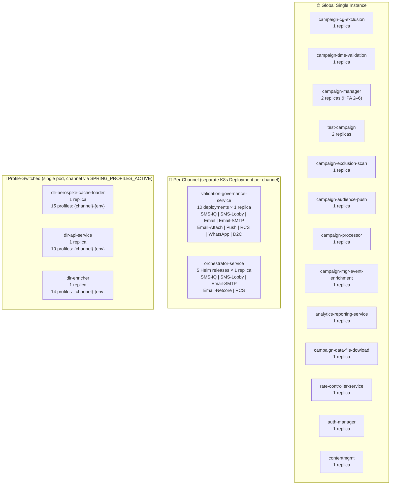
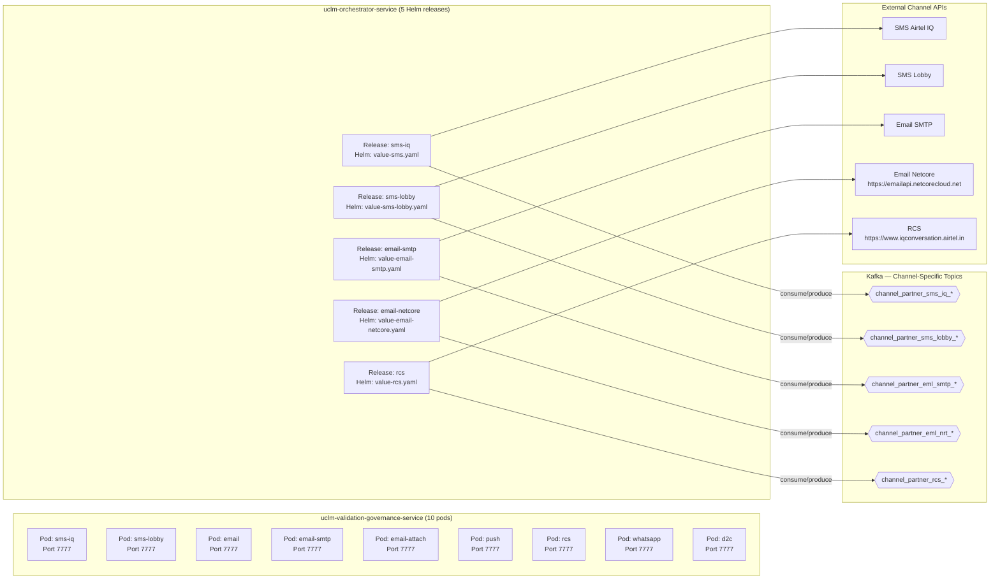
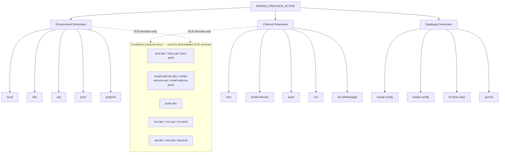

# UCLM — Service Deployment Patterns

> Covers how each service is deployed: globally, per-channel, or per-tenant.  
> Sourced from Helm values, Spring profiles, Kubernetes manifests, and workflow CI files.  
> Last updated: 2026-05-12

---

## Table of Contents

- [Deployment Model Legend](#deployment-model-legend)
- [Quick Reference Table](#quick-reference-table)
- [Comms Group](#comms-group)
- [Bummlebee Group](#bummlebee-group)
- [User Management Group](#user-management-group)
- [Mermaid Diagrams](#mermaid-diagrams)
  - [Deployment Model Overview](#1-deployment-model-overview)
  - [Per-Channel Deployment Detail](#2-per-channel-deployment-detail)
  - [Spring Profile Strategy](#3-spring-profile-strategy)

---

## Deployment Model Legend

| Symbol | Model | Meaning |
|--------|-------|---------|
| 🌐 | **Global** | One deployment for the entire platform (all tenants, all channels) |
| 📡 | **Per-Channel** | Separate Kubernetes Deployment per communication channel |
| 🔀 | **Profile-Switched** | Single deployment, channel activated via `SPRING_PROFILES_ACTIVE` |
| 🏢 | **Per-Tenant** | Separate deployment per tenant *(not currently used in any service)* |

---

## Quick Reference Table

| Service | Group | Model | Replicas | Channels Served | Helm Managed | Autoscaling |
|---------|-------|-------|----------|----------------|:---:|:---:|
| uclm-campaign-cg-exclusion | Comms | 🌐 Global | 1 | — | ❌ | ❌ |
| uclm-campaign-time-validation | Comms | 🌐 Global | 1 | — | ❌ | ❌ |
| uclm-campaign-manager | Comms | 🌐 Global | 2 | All (5) | ✅ | ✅ 2–6 |
| uclm-test-campaign | Comms | 🌐 Global | 2 | — | ❌ | ❌ |
| uclm-campaign-exclusion-scan | Comms | 🌐 Global | 1 | — | ❌ | ❌ |
| uclm-campaign-audience-push | Comms | 🌐 Global | 1 | Push | ✅ | ❌ |
| uclm-campaign-processor | Comms | 🌐 Global | 1 | — | ❌ | ❌ |
| uclm-campaign-manager-event-enrichment | Comms | 🌐 Global | 1 | — | ❌ | ❌ |
| uclm-analytics-reporting-service | Comms | 🌐 Global | 1 | — | ❌ | ❌ |
| uclm-campaign-data-file-dowload | Comms | 🌐 Global | 1 | — | ❌ | ❌ |
| uclm-validation-governance-service | Bummlebee | 📡 Per-Channel | 1 × 10 | SMS-IQ, SMS-Lobby, Email, Email-SMTP, Email-Attach, Push, RCS, WhatsApp, D2C | ❌ | ❌ |
| uclm-dlr-aerospike-cache-loader | Bummlebee | 🔀 Profile-Switched | 1 | SMS, Email, Push, RCS, WhatsApp | ✅ | ❌ |
| uclm-orchestrator-service | Bummlebee | 📡 Per-Channel | 1 × 5 | SMS-IQ, SMS-Lobby, Email-SMTP, Email-Netcore, RCS | ✅ | ❌ |
| uclm-dlr-api-service | Bummlebee | 🔀 Profile-Switched | 1 | SMS, Email, RCS | ❌ | ❌ |
| uclm-rate-controller-service | Bummlebee | 🌐 Global | 1 | — | ❌ | ❌ |
| uclm-dlr-enricher | Bummlebee | 🔀 Profile-Switched | 1 | SMS, Email, Push, RCS, WhatsApp | ❌ | ❌ |
| uclm-contentmgmt | User Mgmt | 🌐 Global | 1 | — | ❌ | ❌ |
| uclm-auth-manager | User Mgmt | 🌐 Global | 1 | — | ❌ | ❌ |

> **No service uses per-tenant deployment.** Multi-tenancy is handled at the application/DB layer, not at the infrastructure layer.

---

## Comms Group

---

### uclm-campaign-cg-exclusion

| Property | Value |
|----------|-------|
| **Deployment Model** | 🌐 Global — single instance |
| **Replicas** | 1 |
| **Channels** | — (no channel dependency) |
| **Tenants** | All (shared) |
| **Helm Managed** | ❌ (plain `deployment.yaml`) |
| **Autoscaling** | ❌ |
| **K8s Namespace** | default |

**Spring Profiles:**

| Profile | Purpose |
|---------|---------|
| `local` | Local development |
| `uat` | UAT environment |
| `prod` | Production environment |

**Notes:** Minimal stateless service. No channel or tenant isolation needed — serves only as a data-management layer for campaign exclusion groups.

---

### uclm-campaign-time-validation

| Property | Value |
|----------|-------|
| **Deployment Model** | 🌐 Global — single instance |
| **Replicas** | 1 |
| **Channels** | — |
| **Tenants** | All (shared) |
| **Helm Managed** | ❌ |
| **Autoscaling** | ❌ |

**Spring Profiles:**

| Profile | Purpose |
|---------|---------|
| `dev` | Development environment |
| `mysql` | MySQL datasource active |
| `oracle` | Oracle datasource active |
| `preprod` | Pre-production environment |
| `uat` | UAT environment |
| `prod` | Production environment |

**Notes:** DB-agnostic — uses `mysql` or `oracle` profile at deploy time. Single global instance regardless of channel or tenant.

---

### uclm-campaign-manager

| Property | Value |
|----------|-------|
| **Deployment Model** | 🌐 Global — single instance |
| **Replicas** | 2 (min) |
| **Channels** | SMS, Email, Push, WhatsApp, RCS (all handled in one pod) |
| **Tenants** | All (shared) |
| **Helm Managed** | ✅ (`helm/uclm-campaign-manager/values.yaml`) |
| **Autoscaling** | ✅ min: 2 · max: 6 (HPA) |
| **K8s Namespace** | `nextgenclm-api-develop` (OpenShift) |

**Spring Profiles:**

| Profile | Purpose |
|---------|---------|
| `uat` | UAT environment |
| `prod` | Production environment |

**Helm Config:**
```yaml
replicaCount: 2
minReplicas: 2
maxReplicas: 6
```

**Channel Config (single deployment handles all):**
```
CAMPAIGN_ALLOWED_CHANNELS = sms, email, push, whatsapp, rcs
```

**Notes:**
- Uses **pod anti-affinity** for distribution across nodes.
- OpenShift Route configured for external access.
- Only Comms service with real autoscaling (2–6 replicas).

---

### uclm-test-campaign

| Property | Value |
|----------|-------|
| **Deployment Model** | 🌐 Global — single instance |
| **Replicas** | 2 |
| **Channels** | — (test/admin only) |
| **Tenants** | All (shared) |
| **Helm Managed** | ❌ (`deployment.yaml` + `secret.yaml`) |
| **Autoscaling** | ❌ |

**Spring Profiles:**

| Profile | Purpose |
|---------|---------|
| `dev` | Development |
| `mysql` | MySQL datasource |
| `oracle` | Oracle datasource |
| `preprod` | Pre-prod |
| `uat` | UAT |
| `prod` | Production |

**Notes:** 2 replicas for HA. Architecture mirrors `campaign-time-validation`.

---

### uclm-campaign-exclusion-scan

| Property | Value |
|----------|-------|
| **Deployment Model** | 🌐 Global — single instance |
| **Replicas** | 1 |
| **Channels** | — |
| **Tenants** | All (shared) |
| **Helm Managed** | ❌ |
| **Autoscaling** | ❌ |

**Spring Profiles:** `local`, `uat`, `prod`

**Notes:** Batch/scan service. Reads from local file system (`INGEST_BASE_FOLDER`). No network dependencies beyond DB.

---

### uclm-campaign-audience-push

| Property | Value |
|----------|-------|
| **Deployment Model** | 🌐 Global — single instance |
| **Replicas** | 1 |
| **Channels** | Push (hardcoded) |
| **Tenants** | All (shared) |
| **Helm Managed** | ✅ (`helm/values.yaml`) |
| **Autoscaling** | ❌ |

**Spring Profiles:**

| Profile | Purpose |
|---------|---------|
| `local` | Local dev |
| `mysql-config` | MySQL datasource |
| `oracle-config` | Oracle datasource |
| `uat` | UAT |
| `prod` | Production |

**Notes:** Push-channel specific audience push service. Despite being channel-specific in function, it runs as a single global instance (not per-channel deployment).

---

### uclm-campaign-processor

| Property | Value |
|----------|-------|
| **Deployment Model** | 🌐 Global — single instance |
| **Replicas** | 1 |
| **Channels** | — |
| **Tenants** | All (shared) |
| **Helm Managed** | ❌ |
| **Autoscaling** | ❌ |

**Spring Profiles:** `local`, `mysql-config`, `oracle-config`, `uat`, `prod`

**Notes:** S3-backed control-file processor. Heavy batch workloads (up to 500 MB files). No channel differentiation needed.

---

### uclm-campaign-manager-event-enrichment

| Property | Value |
|----------|-------|
| **Deployment Model** | 🌐 Global — single instance |
| **Replicas** | 1 |
| **Channels** | — |
| **Tenants** | All (shared) |
| **Helm Managed** | ❌ |
| **Autoscaling** | ❌ |

**Spring Profiles:** `dev`, `local`, `uat`, `prod`

**Notes:** Event enrichment pipeline — Kafka consumer/producer. Single instance handles all campaign events.

---

### uclm-analytics-reporting-service

| Property | Value |
|----------|-------|
| **Deployment Model** | 🌐 Global — single instance |
| **Replicas** | 1 |
| **Channels** | — |
| **Tenants** | All (shared) |
| **Helm Managed** | ❌ |
| **Autoscaling** | ❌ |

**Spring Profiles:** `local`, `mysql-config`, `oracle-config`, `uat`, `prod`

**Kafka Consumer Group:** `analytics-metadata-service`

**Notes:** Pure analytics aggregation — consumes `uclm_analytics`, `dimension_refresh_topic`, `uclm_campaign_status`. Read-only toward DB.

---

### uclm-campaign-data-file-dowload

| Property | Value |
|----------|-------|
| **Deployment Model** | 🌐 Global — single instance |
| **Replicas** | 1 |
| **Channels** | — |
| **Tenants** | All (shared) |
| **Helm Managed** | ❌ |
| **Autoscaling** | ❌ |

**Spring Profiles:** `local`, `mysql-config`, `oracle-config`, `uat`, `prod`

**Notes:** Reactive (WebFlux) file download service backed by AWS S3.

---

## Bummlebee Group

> ⚠️ **Bummlebee is where per-channel deployment patterns live.** Two services deploy one instance per channel; three services use Spring profile switching.

---

### uclm-validation-governance-service

| Property | Value |
|----------|-------|
| **Deployment Model** | 📡 **Per-Channel** — 10 separate K8s Deployments |
| **Replicas** | 1 per channel (10 total) |
| **Channels** | SMS-IQ, SMS-Lobby, Email, Email-SMTP, Email-Attachment, Push, RCS, WhatsApp, D2C |
| **Tenants** | All (shared per channel) |
| **Helm Managed** | ❌ (individual `deployment-{channel}.yaml` files) |
| **Autoscaling** | ❌ |
| **Port** | 7777 (all deployments) |

**Per-Channel Kubernetes Resources:**

| Channel | Deployment File | Container Name | Service Name |
|---------|----------------|---------------|-------------|
| SMS-IQ | `deployment-sms-iq.yaml` | `validation-computation-service-sms-iq` | `validation-computation-service-sms-iq` |
| SMS-Lobby | `deployment-lobby.yaml` | `validation-computation-service-lobby` | `validation-computation-service-lobby` |
| Email | `deployment-email.yaml` | `validation-computation-service-email` | `validation-computation-service-email` |
| Email-SMTP | `deployment-email-smtp.yaml` | `validation-computation-service-email-smtp` | `validation-computation-service-email-smtp` |
| Email-Attachment | `deployment-eml-attch.yaml` | `validation-computation-service-eml-attch` | `validation-computation-service-eml-attch` |
| Push | `deployment-push.yaml` | `validation-computation-service-push` | `validation-computation-service-push` |
| RCS | `deployment-rcs.yaml` | `validation-computation-service-rcs` | `validation-computation-service-rcs` |
| WhatsApp | `deployment-wa.yaml` | `validation-computation-service-wa` | `validation-computation-service-wa` |
| D2C | `deployment-d2c.yaml` | `validation-computation-service-d2c` | `validation-computation-service-d2c` |

**Spring Profiles:** `dev`, `local`

**Kafka Consumer Group:** `event-consumer` (same group across all channels)

**Aerospike Sets (per channel):**
- `bounce_data`, `unsubs_data`, `kill_campaign_data`

**Notes:**
- Each deployment uses a separate container image tag: `…/validation-governance-service-{channel}:TAG`
- Each deployment has its own Service, ConfigMap, and PVC for logs.
- Complete isolation between channels at the Kubernetes level.

---

### uclm-dlr-aerospike-cache-loader

| Property | Value |
|----------|-------|
| **Deployment Model** | 🔀 **Profile-Switched** — single pod, channel via `SPRING_PROFILES_ACTIVE` |
| **Replicas** | 1 |
| **Channels** | SMS, Email (Netcore), Push, RCS, WhatsApp |
| **Tenants** | All (shared) |
| **Helm Managed** | ✅ (`helm/values.yaml`) |
| **Autoscaling** | ❌ |

**Spring Profiles (15 total — `{channel}-{env}`):**

| Channel | DEV Profile | UAT Profile | PROD Profile |
|---------|------------|------------|-------------|
| SMS | `sms-dev` | `sms-uat` | `sms-prod` |
| Email (Netcore) | `email-netcore-dev` | `email-netcore-uat` | `email-netcore-prod` |
| Push | `push-dev` | `push-uat` | `push-prod` |
| RCS | `rcs-dev` | `rcs-uat` | `rcs-prod` |
| WhatsApp | `wa-dev` | `wa-uat` | `wa-prod` |

**Aerospike Sets per Channel:**

| Channel | Aerospike Set |
|---------|--------------|
| SMS | `uat_iq_sms_main` |
| Email (Netcore) | `uat_email_netcore_main` |
| Push | `uat_push_main` |
| RCS | `uat_rcs_main` |
| WhatsApp | `uat_iq_wa_main` |

**Kafka Consumer Groups:** `iq-sms-cache-loader-group-uat` (SMS); similar pattern per channel.

**Notes:**
- One pod — channel is selected at deploy time by setting `SPRING_PROFILES_ACTIVE=sms-uat` (for example).
- Kerberos SCRAM authentication for Aerospike.
- Micrometer metrics exposed per channel instance.

---

### uclm-orchestrator-service

| Property | Value |
|----------|-------|
| **Deployment Model** | 📡 **Per-Channel** — separate Helm release per channel |
| **Replicas** | 1 per channel (5+ total) |
| **Channels** | SMS-IQ, SMS-Lobby, Email-SMTP, Email-Netcore, RCS |
| **Tenants** | All (shared per channel) |
| **Helm Managed** | ✅ (one `value-{channel}.yaml` per channel) |
| **Autoscaling** | ❌ |

**Per-Channel Helm Values Files:**

| Channel | Helm Values File | Kafka Consumer Group | Input Topic | Success Topic | Error Topic |
|---------|-----------------|---------------------|------------|--------------|------------|
| SMS-IQ | `value-sms.yaml` | `dispatch-request-consumer-group` | `channel_partner_sms_iq_nrt_svc_endpoint` | `channel_partner_sms_iq_nrt_svc_succ` | `channel_partner_sms_iq_nrt_svc_err` |
| SMS-Lobby | `value-sms-lobby.yaml` | `default` | `channel_partner_sms_lobby_nrt_svc_endpoint` | `channel_partner_sms_lobby_nrt_svc_succ` | `channel_partner_sms_lobby_nrt_svc_err` |
| Email-SMTP | `value-email-smtp.yaml` | `dispatch-request-consumer-group` | `channel_partner_eml_smtp_nrt_svc_endpoint` | `channel_partner_eml_smtp_nrt_svc_succ` | `channel_partner_eml_smtp_nrt_svc_err` |
| Email-Netcore | `value-email-netcore.yaml` | `dispatch-request-consumer-group` | `channel_partner_eml_nrt_svc_endpoint` | `channel_partner_eml_nrt_svc_succ` | `channel_partner_eml_nrt_svc_err` |
| RCS | `value-rcs.yaml` | `dispatch-request-consumer-group` | `channel_partner_rcs_nrt_svc_endpoint` | `channel_partner_rcs_nrt_svc_succ` | `channel_partner_rcs_nrt_svc_err` |

**Per-Channel Enable Flags (in each values file):**
```yaml
# value-email-netcore.yaml
app.channels.email.netcore.enabled: "true"
app.channels.sms-iq-enabled: "false"
app.channels.sms-lobby-enabled: "false"
app.channels.rcs-enabled: "false"
```

**Per-Channel Log PVCs:**
- `orchestrator-sms-lobby-logs-pvc`
- `orchestrator-email-netcore-logs-pvc`
- *(similar pattern per channel)*

**Notes:**
- Same Docker image deployed 5 times, each with a different Helm values file.
- Each deployment enables exactly one channel and disables the rest.
- Complete Kafka isolation per channel (separate topics, separate consumer groups).

---

### uclm-dlr-api-service

| Property | Value |
|----------|-------|
| **Deployment Model** | 🔀 **Profile-Switched** — single pod, channel via `SPRING_PROFILES_ACTIVE` |
| **Replicas** | 1 |
| **Channels** | SMS, Email (Netcore), RCS |
| **Tenants** | All (shared) |
| **Helm Managed** | ❌ |
| **Autoscaling** | ❌ |

**Spring Profiles (10 total):**

| Channel | DEV | UAT | PROD |
|---------|-----|-----|------|
| SMS | `sms-dev` | `sms-uat` | `sms-prod` |
| Email (Netcore) | `email-netcore-dev` | `email-netcore-uat` | `email-netcore-prod` |
| RCS | `rcs-dev` | `rcs-uat` | `rcs-prod` |

**Notes:** REST API service — receives DLR callbacks from external channels and publishes to Kafka. Channel selected by profile at deploy time.

---

### uclm-rate-controller-service

| Property | Value |
|----------|-------|
| **Deployment Model** | 🌐 Global — single instance |
| **Replicas** | 1 |
| **Channels** | — (global rate governance) |
| **Tenants** | All (shared) |
| **Helm Managed** | ❌ |
| **Autoscaling** | ❌ |

**Spring Profiles:** `dev`, `local`, `mysql-config`, `oracle-config`

**Kafka Consumer Group:** `channel-partner-rate-controller-svc`

**Rate Limits:**
- Global TPS: `2000`
- Per-tenant TPS: `5`
- Max consumer lag: `10,000`

**Notes:** Global bottleneck for all channels and tenants. DB-agnostic (MySQL / Oracle / PostgreSQL switchable).

---

### uclm-dlr-enricher

| Property | Value |
|----------|-------|
| **Deployment Model** | 🔀 **Profile-Switched** — single pod, channel via `SPRING_PROFILES_ACTIVE` |
| **Replicas** | 1 |
| **Channels** | SMS, Email (Netcore), Push, RCS, WhatsApp |
| **Tenants** | All (shared) |
| **Helm Managed** | ❌ |
| **Autoscaling** | ❌ |

**Spring Profiles (14 total):**

| Channel | DEV | UAT | PROD |
|---------|-----|-----|------|
| SMS | `sms-dev` | `sms-uat` | `sms-prod` |
| Email (Netcore) | `email-netcore-dev` | `email-netcore-uat` | `email-netcore-prod` |
| Push | `push-dev` | — | — |
| RCS | `rcs-dev` | `rcs-uat` | `rcs-prod` |
| WhatsApp | `wa-dev` | `wa-uat` | `wa-prod` |

**Kafka Topics per Channel:**

| Channel | Input Topic | Output Topic |
|---------|------------|-------------|
| SMS | `comms_iq_sms_dlr_raw` | `comms_iq_sms_dlr_enriched` |
| Email | `comms_eml_dlr_raw` | `comms_eml_dlr_enriched` |
| RCS | `comms_rcs_dlr_raw` | `comms_rcs_dlr_enriched` |
| WhatsApp | `comms_wa_dlr_raw` | `comms_wa_dlr_enriched` |

**Kafka Consumer Group:** `dlr-enricher-group-uat`

---

## User Management Group

---

### uclm-contentmgmt

| Property | Value |
|----------|-------|
| **Deployment Model** | 🌐 Global — single instance |
| **Replicas** | 1 |
| **Channels** | — |
| **Tenants** | All (multi-tenant at app level) |
| **Helm Managed** | ❌ (Dockerfile only) |
| **Autoscaling** | ❌ |

**Spring Profiles:** `dev`, `local`, `uat`

**Notes:** Content template management — multi-tenancy handled inside the application (not via separate deployments).

---

### uclm-auth-manager

| Property | Value |
|----------|-------|
| **Deployment Model** | 🌐 Global — single instance |
| **Replicas** | 1 |
| **Channels** | — |
| **Tenants** | All (multi-tenant at app level) |
| **Helm Managed** | ❌ (Dockerfile only) |
| **Autoscaling** | ❌ |

**Spring Profiles:**

| Profile | Purpose |
|---------|---------|
| `dev` | Development |
| `h2` | In-memory DB (testing) |
| `oracle` | Oracle datasource |
| `aurora` | AWS Aurora datasource |

**Session Config:** 300s inactivity timeout · JWT validity: 360,000 ms

**Notes:** Aerospike used as session/cache store (`namespace: arch`, host: `10.5.247.156:3000`).

---

## Mermaid Diagrams

### 1. Deployment Model Overview

> Which services are global, per-channel, or profile-switched.



---

### 2. Per-Channel Deployment Detail

> Zoom-in on the two services that physically deploy one pod per channel.



---

### 3. Spring Profile Strategy

> How Spring profiles combine environment + channel + database dimensions.


