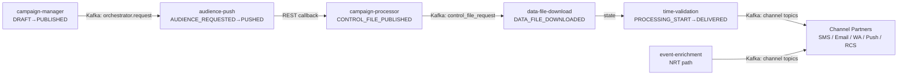
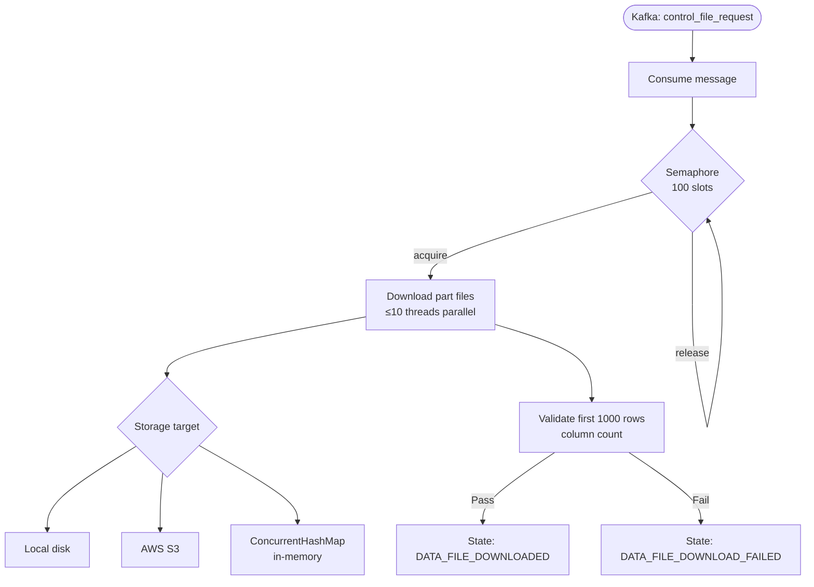
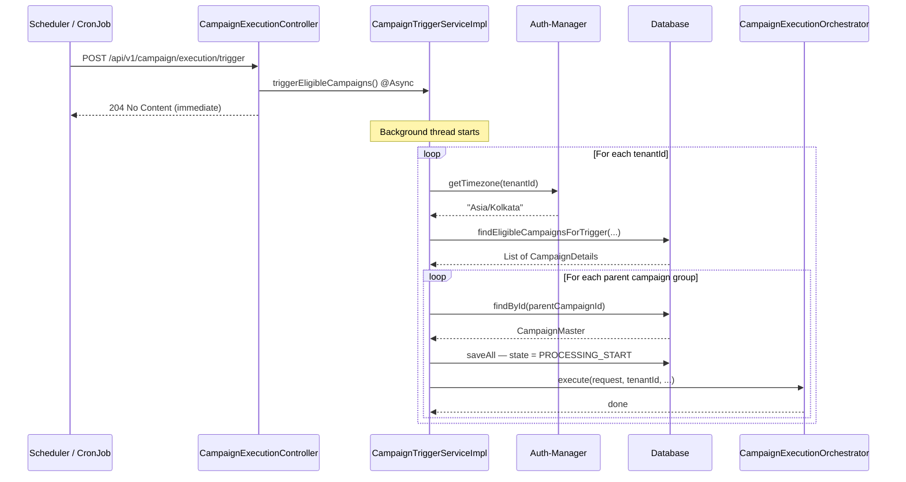
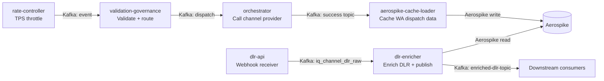
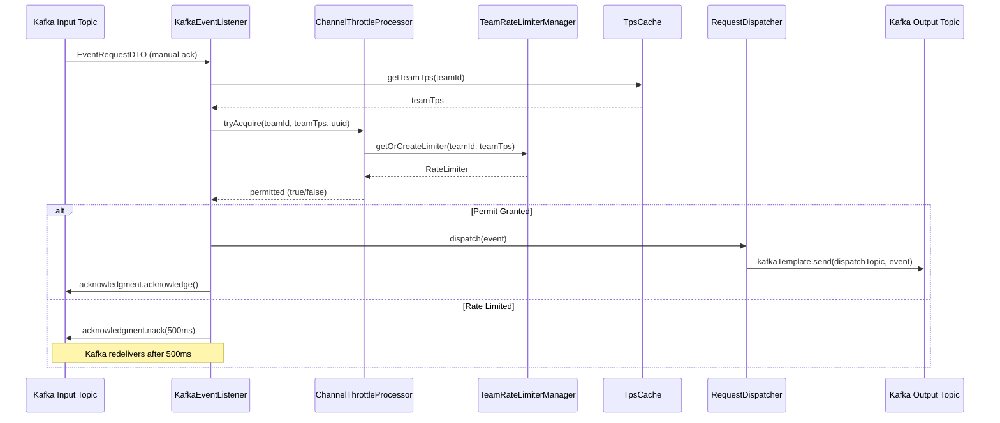
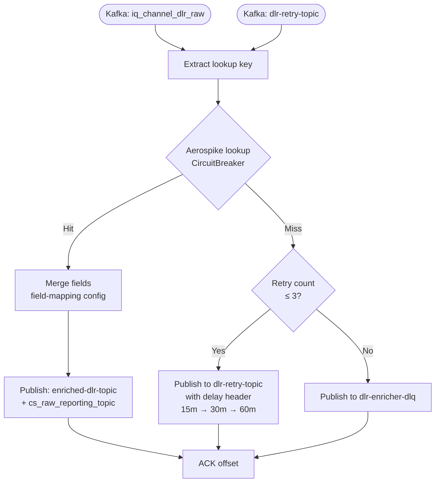

# UCLM — Service Details

> Last updated: 2026-05-14

This document is a single-page reference for every service in the UCLM (Unified Communications Lifecycle Management) platform. It is compiled from HLD/LLD design documents and service READMEs. All facts are sourced from those files; nothing is inferred.

---

## Table of Contents

### 👤 User Management
- [uclm-auth-manager](#uclm-auth-manager)
- [uclm-contentmgmt](#uclm-contentmgmt)

### 📣 Comms
- [uclm-campaign-manager](#uclm-campaign-manager)
- [uclm-campaign-audience-push](#uclm-campaign-audience-push)
- [uclm-campaign-processor](#uclm-campaign-processor)
- [uclm-campaign-data-file-download](#uclm-campaign-data-file-download)
- [uclm-campaign-manager-event-enrichment](#uclm-campaign-manager-event-enrichment)
- [uclm-campaign-time-validation](#uclm-campaign-time-validation)
- [uclm-campaign-cg-exclusion](#uclm-campaign-cg-exclusion)
- [uclm-campaign-exclusion-scan](#uclm-campaign-exclusion-scan)
- [uclm-test-campaign](#uclm-test-campaign)
- [uclm-analytics-reporting-service](#uclm-analytics-reporting-service)

### 🐝 Bummlebee
- [uclm-rate-controller-service](#uclm-rate-controller-service)
- [uclm-validation-governance-service](#uclm-validation-governance-service)
- [uclm-orchestrator-service](#uclm-orchestrator-service)
- [uclm-dlr-api-service](#uclm-dlr-api-service)
- [uclm-dlr-aerospike-cache-loader](#uclm-dlr-aerospike-cache-loader)
- [uclm-dlr-enricher](#uclm-dlr-enricher)

---

## 👤 User Management

---

### uclm-auth-manager

#### Purpose

Centrally authenticates users across the UCLM platform. Handles SAML 2.0 SSO (Identity-Provider-initiated and SP-initiated flows), issues short-lived JWT tokens, manages the organisational hierarchy (tenant → workspace → user), and enforces role-based access control for all downstream services.

#### How it works

1. A user hits the SAML SSO endpoint; the service validates the assertion with the IdP.
2. On success, `JwtUtility` mints a HS256 JWT containing `x-user-id`, `x-tenant-id`, `x-workspace-id`, `x-user-hierarchy`, and `session_id`.
3. The JWT (TTL 300 s) is written to Aerospike and returned to the caller as a cookie / bearer token.
4. Every subsequent API call passes through `AppFilter`, which validates the JWT signature, checks Aerospike for session validity, and injects the claim headers before forwarding the request.
5. The `/org` endpoints allow admins to manage tenants, workspaces, users, and role assignments stored in Oracle.

#### Key components

| Class / Bean | Responsibility |
|---|---|
| `AppFilter` | Servlet filter — validates JWT on every inbound request, populates security context |
| `JwtUtility` | Mints and verifies HS256 JWTs; reads secret from config |
| `SAMLSSOServiceHelper` | Parses SAML assertions, maps attributes to internal user records |
| `SessionRepository` | Reads/writes session records in Aerospike with a 300 s TTL |
| `OrgHierarchyService` | CRUD for tenant → workspace → user hierarchy stored in Oracle |

#### Data stores

| Store | Purpose |
|---|---|
| Oracle DB | Persistent user, tenant, workspace, and role records |
| Aerospike | Short-lived JWT session cache (TTL 300 s); O(1) session lookup |

#### Kafka

None — this service does not use Kafka.

#### APIs

Base path: `/auth-manager/api/v1`

| Method | Path | Auth | Description |
|---|---|---|---|
| `POST` | `/auth/saml/sso` | None | IdP-initiated SAML SSO; returns JWT |
| `POST` | `/auth/login` | None | Username/password login; returns JWT |
| `POST` | `/auth/logout` | JWT | Invalidates session in Aerospike |
| `POST` | `/auth/refresh` | JWT | Refreshes a valid JWT session |
| `GET` | `/org/tenants` | JWT + Admin | List all tenants |
| `POST` | `/org/tenants` | JWT + Admin | Create a tenant |
| `GET` | `/org/tenants/{id}/workspaces` | JWT | List workspaces for a tenant |
| `POST` | `/org/users` | JWT + Admin | Create a user |
| `PUT` | `/org/users/{id}/roles` | JWT + Admin | Assign roles to a user |

#### Deployment notes

| Item | Value |
|---|---|
| Language / Framework | Java 17, Spring Boot 3.x |
| Auth protocol | SAML 2.0 (SP-initiated + IdP-initiated), JWT HS256 |
| Key config properties | `jwt.secret`, `aerospike.hosts`, `saml.idp.metadata-url`, `spring.datasource.*` |
| Kafka auth | N/A |
| Containerisation | Docker, Kubernetes |

---

### uclm-contentmgmt

#### Purpose

Stores and manages all reusable communication assets — templates, media files, and content bundles — for every channel (SMS, Email, WhatsApp, RCS, Push, Voice). Provides a multi-stage approval workflow so that content is reviewed before it can be attached to campaigns.

#### How it works

1. Creators upload templates or media via REST; content is stored in MongoDB with channel-specific metadata.
2. Large media files are offloaded to GCS or AWS S3; MongoDB holds only the reference URI.
3. A multi-stage approval flow (Draft → Under Review → Approved / Rejected) is enforced; approved content is the only content eligible for campaign attachment.
4. On approval/rejection events the service publishes to Kafka so downstream systems (e.g., analytics) are notified.
5. Content bundles combine a template with one or more media assets into a versioned, immutable object that a campaign references.

#### Key components

| Component | Responsibility |
|---|---|
| `TemplateController` | CRUD + approval-lifecycle endpoints for templates |
| `MediaController` | Upload, retrieve, and version media assets |
| `BundleController` | Combine template + media into an immutable bundle |
| `ApprovalWorkflowService` | Drives multi-stage approval state machine |
| `StorageService` | Abstracts GCS vs S3 for binary media writes |
| `KafkaPublisher` | Publishes template-analytics and media-change events |

#### Data stores

| Store | Purpose |
|---|---|
| MongoDB | Template definitions, media metadata, bundle records, approval state |
| GCS / AWS S3 | Binary media file storage (images, audio, documents) |

#### Kafka

| Direction | Topic | Purpose |
|---|---|---|
| Produce | `template-analytics` | Fires on template approval / usage events for analytics |
| Produce | `media-change` | Fires when a media asset is uploaded, updated, or deleted |

Security: `SASL_PLAINTEXT` with Kerberos GSSAPI.

#### APIs

Base path: `/content-manager/api/v1`

| Method | Path | Auth | Description |
|---|---|---|---|
| `POST` | `/templates` | JWT | Create a new template |
| `GET` | `/templates` | JWT | List templates (paginated, filter by channel/status) |
| `GET` | `/templates/{id}` | JWT | Get a single template |
| `PUT` | `/templates/{id}` | JWT | Update a draft template |
| `POST` | `/templates/{id}/submit` | JWT | Submit template for approval |
| `POST` | `/templates/{id}/approve` | JWT + Approver | Approve a template |
| `POST` | `/templates/{id}/reject` | JWT + Approver | Reject a template with reason |
| `POST` | `/media` | JWT | Upload a media file |
| `GET` | `/media/{id}` | JWT | Retrieve media metadata |
| `POST` | `/bundles` | JWT | Create a content bundle |
| `GET` | `/bundles/{id}` | JWT | Retrieve a bundle |

#### Deployment notes

| Item | Value |
|---|---|
| Language / Framework | Java 17, Spring Boot 3.x |
| Key config properties | `spring.data.mongodb.uri`, `storage.type` (GCS/S3), `kafka.bootstrap.servers`, Kerberos keytab path |
| Kafka auth | SASL_PLAINTEXT, GSSAPI (Kerberos) |
| Containerisation | Docker, Kubernetes |

---

## 📣 Comms

The ten Comms services together form the campaign execution pipeline. Campaigns progress through a shared state machine across multiple services:

```
DRAFT → APPROVAL_PENDING → APPROVED → PUBLISHED
      → AUDIENCE_REQUESTED → AUDIENCE_PUSHED
      → CONTROL_FILE_PUBLISHED → DATA_FILE_DOWNLOADED
      → PROCESSING_START → DELIVERED_TO_CHANNEL_PARTNER → COMPLETED
                         ↘ FAILED_TO_DELIVER
```



---

### uclm-campaign-manager

#### Purpose

The central campaign management service. It owns the campaign lifecycle from creation through to publication and provides all CRUD operations on campaigns, goals, sub-goals, frequency-capping rules, and exclusion lists. It is the authority on campaign state and coordinates downstream workflow steps.

#### How it works

1. Users create campaigns (DRAFT) via REST, configuring channels, schedule, audience CG/TG, and content bundles.
2. Campaigns are submitted for approval (APPROVAL_PENDING); approvers accept or reject.
3. On approval, the campaign moves to APPROVED; the user publishes it (PUBLISHED), which triggers the audience-push pipeline via a Kafka message.
4. Campaign state transitions (e.g., PAUSED → RESUMED, KILLED) can also be driven by an external Airflow DAG via the state-transition endpoint.
5. A Resilience4j circuit breaker guards all calls to the Content Management Service (CMS) for quota checks.

#### Key components

| Class | Responsibility |
|---|---|
| `CampaignController` | REST handler for all campaign CRUD and lifecycle operations |
| `CampaignPublishServiceImpl` | Validates and publishes campaigns; produces Kafka messages |
| `CampaignGovernanceServiceImpl` | Enforces approval workflow and role checks |
| `FrequencyCappingService` | Manages per-user / per-channel frequency caps |
| `ExclusionService` | Manages CG-level exclusion lists |
| `CmsCircuitBreaker` | Resilience4j CB wrapping CMS HTTP calls |

#### Data stores

| Store | Purpose |
|---|---|
| Oracle DB | Campaign master, campaign details, goals, sub-goals, frequency-capping rules, exclusion lists |

#### Kafka

| Direction | Topic | Purpose |
|---|---|---|
| Produce | `uclm_analytics` | Campaign lifecycle analytics events |
| Produce | `orchestrator.request` | Approval-notification / publish trigger to audience-push |

#### APIs

Base path: `/campaign-manager/api/v1`

| Method | Path | Auth | Description |
|---|---|---|---|
| `POST` | `/campaigns` | JWT | Create a campaign |
| `GET` | `/campaigns` | JWT | List campaigns (paginated) |
| `GET` | `/campaigns/{id}` | JWT | Get campaign details |
| `PUT` | `/campaigns/{id}` | JWT | Update a draft campaign |
| `DELETE` | `/campaigns/{id}` | JWT | Delete a draft campaign |
| `POST` | `/campaigns/{id}/publish` | JWT | Publish an approved campaign |
| `POST` | `/campaigns/{id}/submit` | JWT | Submit for approval |
| `POST` | `/campaigns/{id}/approve` | JWT + Approver | Approve a campaign |
| `POST` | `/campaigns/{id}/reject` | JWT + Approver | Reject a campaign |
| `POST` | `/campaigns/{id}/pause` | JWT | Pause an in-progress campaign |
| `POST` | `/campaigns/{id}/resume` | JWT | Resume a paused campaign |
| `POST` | `/campaigns/{id}/kill` | JWT | Kill a campaign |
| `POST` | `/campaigns/{id}/state-transition` | Internal (Airflow) | Airflow DAG–driven state transition |
| `POST` | `/campaigns/{id}/goals` | JWT | Add a goal to a campaign |
| `PUT` | `/campaigns/{id}/goals/{gid}` | JWT | Update a goal |
| `POST` | `/campaigns/{id}/subgoals` | JWT | Add a sub-goal |
| `POST` | `/campaigns/{id}/freq-capping` | JWT | Set frequency-capping rule |
| `POST` | `/campaigns/{id}/exclusions` | JWT | Add exclusion entry |
| `GET` | `/campaigns/{id}/cg` | JWT | Get control group configuration |
| `PUT` | `/campaigns/{id}/cg` | JWT | Update control group configuration |

#### Deployment notes

| Item | Value |
|---|---|
| Language / Framework | Java 17, Spring Boot |
| Port | 80 (container) |
| Database | Oracle (primary); MySQL profile also available |
| Kafka auth | Supports NONE / KERBEROS / SCRAM / PLAIN (configured via `kafka.auth.type`) |
| Key config properties | `spring.datasource.*`, `app.kafka.topics.approval-notification`, `campaign.analytics.kafka.topic`, `cms.*` (circuit-breaker target) |
| Resilience4j | Circuit breaker on CMS calls |
| Containerisation | Docker, Kubernetes |

---

### uclm-campaign-audience-push

#### Purpose

Triggers audience-file creation at the external Audience Manager service when a campaign transitions to PUBLISHED state. It polls for completion and advances the campaign state to AUDIENCE_PUSHED (or rolls back on failure).

#### How it works

1. Receives a trigger (REST call or event from campaign-manager) for a newly published campaign.
2. Calls the Audience Manager API to initiate audience-file generation (state → AUDIENCE_REQUESTED).
3. Polls or waits for a callback confirming the file is ready (state → AUDIENCE_PUSHED).
4. On any failure, rolls the campaign state back to PUBLISHED so it can be retried.
5. Resilience4j provides retry and circuit-breaker protection on Audience Manager calls.

#### Key components

| Component | Responsibility |
|---|---|
| `AudiencePushController` | Exposes the `/push` and `/trigger` endpoints |
| `AudiencePushServiceImpl` | Orchestrates state changes and Audience Manager API calls |
| `AudienceManagerClient` | RestTemplate-based HTTP client with Resilience4j CB |
| `CampaignStateRepository` | JPA repository for reading/writing campaign state |

#### Data stores

| Store | Purpose |
|---|---|
| Oracle / MySQL | Campaign state table (reads PUBLISHED, writes AUDIENCE_REQUESTED / AUDIENCE_PUSHED) |

#### Kafka

None — this service does not use Kafka.

#### APIs

Base path: `/campaign-manager/api/v1`

| Method | Path | Auth | Description |
|---|---|---|---|
| `POST` | `/audience/push` | Internal | Push audience for a campaign (full push) |
| `POST` | `/audience/trigger` | Internal | Trigger audience-file creation at Audience Manager |

#### Deployment notes

| Item | Value |
|---|---|
| Language / Framework | Java 17, Spring Boot 3.5.6 |
| Port | 8095 |
| Database | Oracle / MySQL (Spring Data JPA) |
| Resilience4j | Retry + circuit breaker on Audience Manager REST calls |
| Key config properties | `audience-manager.base-url`, `spring.datasource.*` |
| Containerisation | Docker, Kubernetes |

---

### uclm-campaign-processor

#### Purpose

Receives the callback from Audience Manager when an audience (`.ctrl.gz`) file is ready. It runs a 10-step validation and processing pipeline and publishes a control-file request to Kafka so the data-file-download service can fetch the actual data files.

#### How it works

The single POST callback endpoint runs a sequential 10-step pipeline:

```
1. Validate callback payload
2. Extract audienceId from payload
3. Look up campaign record in DB
4. Filter: check campaign is in AUDIENCE_PUSHED state
5. Update state → CONTROL_FILE_PUBLISHED
6. Download .ctrl.gz file header
7. Decompress: multi-layer GZIP (supports nested compression)
8. Parse control file: extract part-file URLs
9. Produce Kafka message → control_file_request
10. Update campaign state on success / failure
```

Multi-layer GZIP decompression handles files compressed multiple times; a 500 MB cap prevents OOM. Each part-file URL extracted from the control file is forwarded to the data-file-download service via Kafka.

#### Key components

| Component | Responsibility |
|---|---|
| `CallbackController` | Receives Audience Manager callback POST |
| `CampaignProcessorOrchestrator` | Runs the 10-step pipeline |
| `ControlFileParser` | GZIP decompression + part-file URL extraction |
| `KafkaPublisher` | Produces `control_file_request` messages |
| `CampaignStateRepository` | JPA repository for state reads/writes |

#### Data stores

| Store | Purpose |
|---|---|
| Oracle / MySQL | Campaign and campaign-details state table |

#### Kafka

| Direction | Topic | Purpose |
|---|---|---|
| Produce | `control_file_request` | One message per control file, containing part-file download URLs |

#### APIs

| Method | Path | Auth | Description |
|---|---|---|---|
| `POST` | `/campaign-processor/api/v1/callback` | Internal | Audience Manager notifies that the ctrl.gz file is ready |

#### Deployment notes

| Item | Value |
|---|---|
| Language / Framework | Java 17, Spring Boot |
| Port | 8080 |
| Database | Oracle / MySQL |
| GZIP limit | 500 MB decompressed cap |
| Containerisation | Docker, Kubernetes |

---

### uclm-campaign-data-file-download

#### Purpose

Consumes `control_file_request` Kafka messages and downloads the actual audience data (part) files in parallel. Files can be written to local disk, AWS S3, or held in-memory. Validates the first 1 000 rows for column-count integrity before marking the campaign ready for processing.

#### How it works

1. Consumes `control_file_request` from Kafka; each message contains the list of part-file URLs.
2. Downloads files in parallel — up to 10 threads per control-file message.
3. Global backpressure is enforced with a `Semaphore(100)` across all concurrent downloads.
4. The first 1 000 rows of each file are validated for column-count consistency.
5. On success: state → DATA_FILE_DOWNLOADED; on failure: DATA_FILE_DOWNLOAD_FAILED.
6. Resilience4j retry and circuit-breaker protect the HTTP download calls.



#### Key components

| Component | Responsibility |
|---|---|
| `ControlFileKafkaConsumer` | Consumes `control_file_request` with manual offset commit |
| `PartFileDownloadService` | Parallel download orchestrator (10-thread pool) |
| `ColumnCountValidator` | Reads first 1 000 rows and checks column consistency |
| `StorageService` | Abstraction over local disk / S3 / in-memory |
| `SemaphoreBackpressure` | Global `Semaphore(100)` to prevent system overload |

#### Data stores

| Store | Purpose |
|---|---|
| Oracle / MySQL | Campaign state (reads CONTROL_FILE_PUBLISHED, writes DATA_FILE_DOWNLOADED or DATA_FILE_DOWNLOAD_FAILED) |
| Local disk / AWS S3 / ConcurrentHashMap | Downloaded audience part files |

#### Kafka

| Direction | Topic | Purpose |
|---|---|---|
| Consume | `control_file_request` | Control-file messages produced by campaign-processor |

#### APIs

| Method | Path | Auth | Description |
|---|---|---|---|
| `GET` | `/filedownloder/api/status/health` | None | Service liveness check |
| `GET` | `/actuator/health` | None | Spring Actuator health endpoint |

#### Deployment notes

| Item | Value |
|---|---|
| Language / Framework | Java 17, Spring Boot |
| Port | 8070 |
| Database | Oracle / MySQL |
| Concurrency | 10 parallel download threads per message; global Semaphore(100) |
| Resilience4j | Retry + circuit breaker on HTTP download |
| Key config properties | `storage.type` (LOCAL/S3/MEMORY), `download.thread-pool-size`, `semaphore.max-permits` |
| Containerisation | Docker, Kubernetes |

---

### uclm-campaign-manager-event-enrichment

#### Purpose

The near-real-time (NRT) campaign delivery path. Consumes enrichment-request events, enriches them with subscriber data from Audience Manager, applies exclusion and control-group rules, normalises LOB values, and publishes ready-to-send records directly to per-channel Kafka topics — bypassing the file-based pipeline.

#### How it works

1. Consumes `event_enrichment_prod` from Kafka.
2. Calls Audience Manager to fetch subscriber attributes for the MSISDN.
3. Normalises the LOB field: `PREPAID`, `POSTPAID`, `APB` all map to `mobility`.
4. Looks up TGCG (Test Group / Control Group) rules from Caffeine cache (24 h TTL); applies exclusions.
5. Routes the enriched record to the appropriate channel topic (one of five channel topics).
6. Publishes a reporting record to `cs_raw_reporting_topic`.

#### Key components

| Component | Responsibility |
|---|---|
| `EventEnrichmentConsumer` | Kafka listener on `event_enrichment_prod` |
| `AudienceEnrichmentService` | HTTP call to Audience Manager for subscriber data |
| `LobNormalisationService` | Maps raw LOB strings to canonical `mobility` / other values |
| `TgcgRuleEngine` | SpEL/rule-based TGCG and exclusion evaluation |
| `CaffeineCache` | 24 h TTL in-memory cache for TGCG rules |
| `ChannelRouter` | Selects the correct Kafka output topic per channel |

#### Data stores

| Store | Purpose |
|---|---|
| Oracle | Campaign metadata, TGCG rule definitions |
| Caffeine (in-memory) | TGCG rule cache (TTL 24 h) |

#### Kafka

| Direction | Topic | Purpose |
|---|---|---|
| Consume | `event_enrichment_prod` | Incoming NRT enrichment requests |
| Produce | `channel_partner_sms_nrt_svc_endpoint` | Enriched SMS records |
| Produce | `channel_partner_eml_nrt_svc_endpoint` | Enriched Email records |
| Produce | `channel_partner_wa_nrt_svc_endpoint` | Enriched WhatsApp records |
| Produce | `channel_partner_push_nrt_svc_endpoint` | Enriched Push records |
| Produce | `channel_partner_rcs_nrt_svc_endpoint` | Enriched RCS records |
| Produce | `cs_raw_reporting_topic` | Reporting / analytics events |

#### APIs

| Method | Path | Auth | Description |
|---|---|---|---|
| `GET` | `/event-enrichment/api/v1/health` | None | Liveness check |
| `GET` | `/event-enrichment/api/v1/cache/refresh` | Internal | Force-refresh the TGCG rule Caffeine cache |

#### Deployment notes

| Item | Value |
|---|---|
| Language / Framework | Java 17, Spring Boot |
| Port | 8095 |
| Database | Oracle |
| Cache | Caffeine (24 h TTL) for TGCG rules |
| Kafka auth | SASL_PLAINTEXT, GSSAPI |
| Key config properties | `audience-manager.base-url`, `kafka.topic.event-enrichment`, channel output topics, cache TTL |
| Containerisation | Docker, Kubernetes |

---

### uclm-campaign-time-validation

#### Purpose

The batch campaign delivery engine. Reads downloaded CSV audience files, validates the current time against the campaign schedule window, and streams per-record messages to channel Kafka topics. Supports ONETIME and RECURRING campaigns; uses virtual threads for high-throughput CSV streaming.

#### How it works

Two entry points exist: a scheduler-triggered `/trigger` and a direct-start `/start` endpoint.

**`/trigger` flow:**
1. Returns `204 No Content` immediately; all work is `@Async`.
2. For each tenant, fetches the timezone from Auth-Manager.
3. Computes the time window: `[midnight today → min(now, 23:30)]` in the tenant timezone.
4. Queries for campaigns in state `DATA_FILE_DOWNLOADED` whose `actualScheduleTs` falls in the window.
5. Groups campaigns by parent and processes each group sequentially.

**Per-campaign 7-stage pipeline:**
```
1. Validate campaign is eligible
2. State → PROCESSING_START
3. Open CSV stream (batch size 2000, Semaphore(100) backpressure)
4. Per-record: TGCG exclusion + frequency-capping check
5. Per-record: DLT scrubbing (SMS) / channel validation
6. Produce to channel Kafka topic
7. State → DELIVERED_TO_CHANNEL_PARTNER or FAILED_TO_DELIVER
```



#### Key components

| Component | Responsibility |
|---|---|
| `CampaignExecutionController` | Exposes `/trigger` and `/start`; returns 204 immediately |
| `CampaignTriggerServiceImpl` | Async tenant loop + time-window computation |
| `CampaignExecutionOrchestrator` | Runs the 7-stage per-campaign pipeline |
| `CsvStreamProcessor` | Streams CSV rows in batches of 2 000 using virtual threads |
| `TimeWindowCalculator` | `[midnight → min(now, 23:30)]` in tenant timezone |
| `ExclusionAndFreqCapFilter` | Per-record TGCG / freq-capping check |
| `ChannelKafkaProducer` | Routes records to the correct channel topic |

#### Data stores

| Store | Purpose |
|---|---|
| Oracle | Campaign master and details, schedule, state |

#### Kafka

| Direction | Topic | Purpose |
|---|---|---|
| Produce | `channel_partner_sms_batch_svc_endpoint` | Batch SMS records |
| Produce | `channel_partner_eml_batch_svc_endpoint` | Batch Email records |
| Produce | `channel_partner_wa_batch_svc_endpoint` | Batch WhatsApp records |
| Produce | `channel_partner_push_batch_svc_endpoint` | Batch Push records |
| Produce | `channel_partner_rcs_batch_svc_endpoint` | Batch RCS records |
| Produce | `cs_raw_reporting_topic` | Per-record reporting events |
| Produce | `comms_analytics_logs` | Campaign-level analytics |

#### APIs

| Method | Path | Auth | Description |
|---|---|---|---|
| `POST` | `/api/v1/campaign/execution/trigger` | Internal (CronJob) | Find and fire all due campaigns asynchronously |
| `POST` | `/api/v1/campaign/execution/start` | Internal | Directly start execution for a specific campaign |

#### Deployment notes

| Item | Value |
|---|---|
| Language / Framework | Java 17, Spring Boot |
| Port | 8091 |
| Database | Oracle |
| CSV streaming | Batch size 2 000, virtual threads, Semaphore(100) backpressure |
| Time window | `[midnight today → min(now, 23:30)]` in tenant timezone; capped to prevent late-night sends |
| Trigger config | `campaign.trigger.eligible-schedule-types` (default: ONETIME, RECURRING), `campaign.trigger.eligible-states` (default: DATA_FILE_DOWNLOADED) |
| Kafka auth | SASL_PLAINTEXT, GSSAPI |
| Containerisation | Docker, Kubernetes |

---

### uclm-campaign-cg-exclusion

#### Purpose

Evaluates Spring Expression Language (SpEL) rules to determine whether a subscriber belongs to a control group (CG) or target group (TG) that should be excluded from a campaign. Acts as a rule engine called inline by time-validation and event-enrichment services.

#### How it works

1. Rules are created via REST and stored in Oracle as SpEL expressions.
2. At exclusion-check time, the caller POSTs the subscriber payload to `/api/v1/internal/excludecg`.
3. The service evaluates each applicable SpEL rule against the payload.
4. Returns a boolean indicating whether the subscriber should be excluded.

#### Key components

| Component | Responsibility |
|---|---|
| `RuleController` | REST endpoints for rule CRUD and exclusion check |
| `SpelRuleEngine` | Compiles and evaluates SpEL expressions against subscriber context |
| `RuleRepository` | JPA repository for persisting/loading rules from Oracle |

#### Data stores

| Store | Purpose |
|---|---|
| Oracle | SpEL exclusion rules |

#### Kafka

None — this service does not use Kafka.

#### APIs

| Method | Path | Auth | Description |
|---|---|---|---|
| `POST` | `/create/rule` | Internal | Create a new SpEL exclusion rule |
| `POST` | `/api/v1/internal/excludecg` | Internal | Evaluate exclusion rules for a subscriber record |

#### Deployment notes

| Item | Value |
|---|---|
| Language / Framework | Java 17, Spring Boot |
| Port | 8080 |
| Database | Oracle |
| Rule engine | Spring Expression Language (SpEL) |
| K8s resources | CPU 500m req / 1000m limit; Memory 512Mi req / 1Gi limit |
| Containerisation | Docker, Kubernetes |

---

### uclm-campaign-exclusion-scan

#### Purpose

Performs fast O(1) lookups to identify subscribers on any of three suppression lists: employees, VIP accounts, and retailers. Lists are loaded from CSV files at startup and reloaded daily, with no database dependency.

#### How it works

1. At startup, CSV files for each list type are read from a mounted volume and indexed into `ConcurrentHashMap` instances.
2. A `@Scheduled` job at 00:30 AM reloads all files to pick up daily updates.
3. Callers POST a mobile number; the service checks each map with a short-circuit on the first match.
4. Mobile numbers are validated against the regex `^[6-9]\\d{9}$` before lookup.
5. Returns match result with the list type that matched (EMPLOYEE, VIP, or RETAILER).

#### Key components

| Component | Responsibility |
|---|---|
| `ExclusionScanController` | Exposes the `/exclusionscan` POST endpoint |
| `ExclusionListLoader` | Reads CSV files at startup and on @Scheduled reload |
| `ExclusionLookupService` | Short-circuit lookup across three ConcurrentHashMaps |
| `MobileValidator` | Validates MSISDN format (`^[6-9]\\d{9}$`) |

#### Data stores

None — data is loaded from CSV files into memory only.

#### Kafka

None — this service does not use Kafka.

#### APIs

| Method | Path | Auth | Description |
|---|---|---|---|
| `POST` | `/api/v1/internal/exclusionscan` | Internal | Check if a mobile number appears on any suppression list |

#### Deployment notes

| Item | Value |
|---|---|
| Language / Framework | Java 17, Spring Boot |
| Port | 8080 |
| Database | None |
| Data source | CSV files mounted into the container (employee, VIP, retailer lists) |
| Reload schedule | Daily at 00:30 AM via `@Scheduled` |
| Lookup time | O(1) via ConcurrentHashMap |
| Containerisation | Docker, Kubernetes; CSV volume mount required |

---

### uclm-test-campaign

#### Purpose

A pre-production mirror of the time-validation delivery pipeline that processes DRAFT and APPROVED campaigns (never PUBLISHED/LIVE ones). Used by campaign managers to validate content, personalisation, and audience targeting before go-live. Accepts an explicit list of `communicationId` values so only named test recipients receive messages.

#### How it works

1. A POST to `/test-campaign/api/v1/campaigns/{id}/test` initiates execution for a specific campaign.
2. The service validates that the campaign is in DRAFT or APPROVED state (rejects others).
3. Processes only the `communicationId` values supplied in the request body — no bulk CSV streaming.
4. Applies the same per-record pipeline as time-validation (exclusion, freq-cap, DLT scrubbing).
5. AB testing: if configured, assigns recipients to A/B buckets using a range-based hash so test results are deterministic.
6. Produces to the same five channel Kafka topics as time-validation.

#### Key components

| Component | Responsibility |
|---|---|
| `TestCampaignController` | Exposes the test-execution endpoint |
| `TestCampaignOrchestrator` | Validates campaign state; runs the per-record pipeline |
| `AbTestAssigner` | Range-based hash assignment for A/B bucket selection |
| `ChannelKafkaProducer` | Produces to channel topics (same as time-validation) |

#### Data stores

| Store | Purpose |
|---|---|
| Oracle | Campaign master, details, state |

#### Kafka

| Direction | Topic | Purpose |
|---|---|---|
| Produce | `channel_partner_sms_batch_svc_endpoint` | Test SMS records |
| Produce | `channel_partner_eml_batch_svc_endpoint` | Test Email records |
| Produce | `channel_partner_wa_batch_svc_endpoint` | Test WhatsApp records |
| Produce | `channel_partner_push_batch_svc_endpoint` | Test Push records |
| Produce | `channel_partner_rcs_batch_svc_endpoint` | Test RCS records |
| Produce | `cs_raw_reporting_topic` | Reporting events |

#### APIs

| Method | Path | Auth | Description |
|---|---|---|---|
| `POST` | `/test-campaign/api/v1/campaigns/{id}/test` | JWT | Execute a test run for the specified campaign with supplied recipient IDs |

#### Deployment notes

| Item | Value |
|---|---|
| Language / Framework | Java 17, Spring Boot |
| Port | 8091 |
| Database | Oracle |
| Campaign states accepted | DRAFT, APPROVED only |
| AB test | Range-based hash; deterministic bucket assignment |
| Containerisation | Docker, Kubernetes |

---

### uclm-analytics-reporting-service

#### Purpose

Aggregates campaign delivery and performance data for reporting. Uses Apache Druid as the query engine, Hazelcast for caching dimension metadata, and Apache POI for Excel report generation. Consumes Kafka analytics events to keep campaign status up to date.

#### How it works

1. Consumes `uclm_analytics` from Kafka; persists/updates campaign-status records in Oracle/MySQL.
2. Dimension metadata (audience segmentation labels, channel names, etc.) is loaded from Oracle and cached in a Hazelcast `IMap` (`analytics-metadata-cluster`).
3. Report queries are translated to Druid native queries against the per-tenant datasource `a{tenantId}`.
4. Large reports are exported as `.xlsx` files using Apache POI; smaller ones are returned as JSON.
5. Dimension refresh events are produced on `dimension_refresh_topic` to notify other nodes to invalidate their Hazelcast cache.

#### Key components

| Component | Responsibility |
|---|---|
| `AnalyticsController` | REST report query endpoints |
| `DruidQueryService` | Builds and executes Druid native queries |
| `DimensionMetadataService` | Reads dimension tables from Oracle; caches in Hazelcast |
| `HazelcastCacheManager` | Manages `analytics-metadata-cluster` IMap |
| `ExcelReportGenerator` | Apache POI–based `.xlsx` file builder |
| `KafkaStatusConsumer` | Consumes `uclm_analytics` and updates campaign-status in DB |

#### Data stores

| Store | Purpose |
|---|---|
| Oracle / MySQL | Campaign status, dimension metadata tables |
| Apache Druid | Time-series event store; datasource per tenant (`a{tenantId}`) |
| Hazelcast IMap | In-memory dimension-metadata cache (`analytics-metadata-cluster`) |

#### Kafka

Two separate Kafka broker connections:

| Direction | Topic | Broker | Purpose |
|---|---|---|---|
| Consume | `uclm_analytics` | Primary (SASL/Kerberos) | Campaign analytics events |
| Produce | `dimension_refresh_topic` | Primary (SASL/Kerberos) | Cache-invalidation signal |
| Produce | `uclm_campaign_status` | Campaign-status (PLAINTEXT) | Campaign status update events |

#### APIs

Base path: `/analytics-reporting/api/v1`

| Method | Path | Auth | Description |
|---|---|---|---|
| `GET` | `/reports/campaign-summary` | JWT | Campaign-level delivery summary |
| `GET` | `/reports/channel-breakdown` | JWT | Breakdown by channel |
| `GET` | `/reports/goal-performance` | JWT | Goal and sub-goal attainment |
| `GET` | `/reports/frequency-distribution` | JWT | Frequency distribution across segments |
| `POST` | `/reports/export` | JWT | Export report as `.xlsx` |
| `GET` | `/dimensions` | JWT | List available dimension tables |
| `POST` | `/dimensions/refresh` | Internal | Force Hazelcast cache refresh |
| `GET` | `/campaign-status/{id}` | JWT | Current status for a campaign |
| `GET` | `/health` | None | Liveness check |

#### Deployment notes

| Item | Value |
|---|---|
| Language / Framework | Java 17, Spring Boot |
| Port | 8080 |
| Database | Oracle / MySQL + Apache Druid |
| Cache | Hazelcast embedded (`analytics-metadata-cluster`) |
| Report export | Apache POI |
| Druid datasource | `a{tenantId}` — one per tenant |
| Kafka auth (primary) | SASL_PLAINTEXT, GSSAPI (Kerberos) |
| Kafka auth (campaign-status) | PLAINTEXT |
| Key config properties | `druid.broker.url`, `hazelcast.cluster-name`, `kafka.bootstrap.servers`, `campaign-status.kafka.bootstrap.servers` |
| Containerisation | Docker, Kubernetes |

---

## 🐝 Bummlebee

The six Bummlebee services form the real-time channel-partner dispatch and DLR (Delivery Receipt) pipeline.



---

### uclm-rate-controller-service

#### Purpose

Enforces per-team, per-channel TPS (transactions per second) throttling on incoming Kafka events before forwarding them to the validation-governance service. Each deployment instance is scoped to a single team on a single channel (e.g., `team_1` on `WHATSAPP`).

#### How it works

1. Consumes events from the input Kafka topic (`channel_partner_rate_controller_input`).
2. `ChannelThrottleProcessor` calls `TeamRateLimiterManager.tryAcquire(teamId, tps)` backed by a Resilience4j `RateLimiter`.
3. **Permitted**: event is forwarded to the downstream Kafka topic (`channel_partner_val_gov_svc_input`) and the offset is committed.
4. **Rate-limited**: `acknowledgment.nack(500ms)` — Kafka redelivers after 500 ms.
5. Three schedulers run every 10 seconds: `RefreshTpsScheduler` (syncs TPS from PostgreSQL), `CapacityIncreaseScheduler` (applies approved capacity requests), and `KafkaConsumptionController` (pauses/resumes the consumer based on downstream lag).



#### Key components

| Component | Responsibility |
|---|---|
| `KafkaEventListener` | Consumes input topic with manual acknowledgement |
| `ChannelThrottleProcessor` | Calls `tryAcquire` on the Resilience4j RateLimiter |
| `TeamRateLimiterManager` | Creates/updates per-team RateLimiter instances |
| `TpsCache` | In-memory `ConcurrentHashMap` holding current TPS values |
| `RequestDispatcher` | Forwards permitted events to downstream Kafka topic |
| `KafkaConsumptionController` | Pauses/resumes Kafka consumer based on downstream lag (every 10 s) |
| `KafkaConsumerLagMonitor` | Polls ValGov and Orchestrator consumer-group offsets via AdminClient |
| `RefreshTpsScheduler` | Syncs TPS values from PostgreSQL every 10 s |
| `CapacityIncreaseScheduler` | Applies approved capacity-increase requests every 10 s |

#### Data stores

| Store | Purpose |
|---|---|
| PostgreSQL | `team_onboarding` (team TPS allocation, status), `tenant_onboarding` (tenant-level TPS caps) |
| In-memory TpsCache | Current effective TPS values; updated by RefreshTpsScheduler |

#### Kafka

| Direction | Topic | Purpose |
|---|---|---|
| Consume | `channel_partner_rate_controller_input` (configurable as `comms-input`) | Incoming events from upstream |
| Produce | `channel_partner_val_gov_svc_input` (configurable as `event`) | Permitted events forwarded to validation-governance |

#### APIs

None — this service does not expose HTTP endpoints (operations are Kafka-driven; Kubernetes health probes use Spring Actuator).

#### Deployment notes

| Item | Value |
|---|---|
| Language / Framework | Java 17, Spring Boot 3.2.4 |
| Port | 8081 |
| Database | PostgreSQL (Spring Data JPA) |
| Rate limiting | Resilience4j 2.2.0 RateLimiter |
| Schedulers | Every 10 s: RefreshTps, CapacityIncrease, KafkaConsumptionController |
| Kafka auth | Kerberos GSSAPI / SASL_PLAINTEXT |
| Key config properties | `kafka.topic`, `kafka.dispatch.topic`, `channel`, `channel.global.tps`, `tenant.channel.tps`, `team.id`, `downstream.max.allowed.lag` |
| K8s resources | CPU 500m / 512 Mi; 5 Gi PVC for logs |
| Containerisation | Docker (eclipse-temurin:21-jre), Kubernetes |

---

### uclm-validation-governance-service

#### Purpose

Validates and governs all outbound communication events. For each event it checks MOC (Mobile Operator Code), category, event type, runs DLT (Distributed Ledger Technology) scrubbing for SMS, checks CMS quota, and constructs the final endpoint request for the downstream orchestrator. Supports SMS, Email, WhatsApp, Push, RCS, D2C, and FS channels.

#### How it works

1. Consumes events from the `event` Kafka topic.
2. Validates channel-specific fields using lookup files loaded from mounted directories (`lookups/raw/`, `lookups/schema/`, `lookups/normalized/`).
3. For SMS: calls the DLT scrubbing API to verify regulatory compliance.
4. For all channels: calls the CMS API to verify quota has not been exceeded.
5. Constructs the channel endpoint request payload.
6. Publishes to `dispatch`, or routes to `exceptions` / `cs_raw_reporting_topic` on failure.
7. Publish mode is configurable: `FULL_ONLY`, `APB_ONLY`, or `BOTH`.

#### Key components

| Component | Responsibility |
|---|---|
| `ValidationGovernanceConsumer` | Kafka listener on `event` topic |
| `ChannelValidationService` | Routes validation to channel-specific validators |
| `DltScrubService` | HTTP call to DLT API for SMS regulatory check |
| `CmsQuotaService` | HTTP call to CMS to check/decrement quota |
| `LookupFileLoader` | Loads raw/schema/normalized lookup files at startup |
| `EndpointRequestBuilder` | Constructs the final channel-specific dispatch payload |
| `PublishModeRouter` | Routes to FULL / APB / both output topics based on config |

#### Data stores

| Store | Purpose |
|---|---|
| Lookup files (mounted volume) | `lookups/raw/`, `lookups/schema/`, `lookups/normalized/` — channel rules and normalisation tables |
| Aerospike | Bounce, unsubscribe, and kill-campaign suppression data |

#### Kafka

| Direction | Topic | Purpose |
|---|---|---|
| Consume | `event` | Validated events from rate-controller |
| Produce | `dispatch` | Valid events ready for orchestration |
| Produce | `cs_raw_reporting_topic` | Analytics/reporting records |
| Produce | `exceptions` | Failed-validation events |

#### APIs

None — this service does not expose business HTTP endpoints (Spring Actuator health probes only).

#### Deployment notes

| Item | Value |
|---|---|
| Language / Framework | Java 21, Spring Boot 3.2.4 |
| Port | 7777 |
| Database | None (lookup files + Aerospike) |
| Lookup mounts | `lookup.raw.folder`, `lookup.schema.folder`, `lookup.normalized.folder` |
| Publish mode | `kafka.publish.mode` — FULL_ONLY / APB_ONLY / BOTH |
| Kafka auth | SASL_PLAINTEXT, GSSAPI (Kerberos) |
| Key config properties | `dlt.url`, `dlt.username`, `cms.url`, `cms.access.token`, `aerospike.hostName`, `kafka.publish.mode`, lookup folder paths |
| Containerisation | Docker (podman build), OpenShift / Kubernetes |

---

### uclm-orchestrator-service

#### Purpose

The final dispatch step: calls the actual channel-provider API (SMS IQ, Netcore Email, WhatsApp IQ, FCM Push, SMS Lobby, RCS IQ) for each outbound event. Applies time-window validation, decrements CMS quota on failure, and publishes success/error/analytics outcomes to Kafka.

#### How it works

1. Consumes events from the `dispatch` Kafka topic.
2. Validates `expireTimestamp`: if the event has expired, it is published to the error topic without calling the provider.
3. Routes to the appropriate channel handler based on the `channel` field.
4. Calls the channel provider via a Feign client (or RestTemplate).
5. On success: publishes to the success topic and to `cs_raw_reporting_topic`.
6. On failure: publishes to the error topic; calls CMS to decrement quota (undoes the increment done at governance).
7. Resilience4j retry (3×, exponential backoff 1 s → 10 s) and circuit breaker protect provider calls.
8. Configurable publish modes: `FULL_ONLY`, `APB_ONLY`, `BOTH`.

Channel-provider mapping:

| Channel | Provider |
|---|---|
| SMS | IQ SMS (`/api/v1/send-sms`) |
| Email | Netcore (`/v5.1/mail/send`) or SMTP |
| WhatsApp | IQ WhatsApp (`/gateway/airtel-xchange/…/template/send`) |
| Push | APB FCM (`/channels/apb/v1/send/push`) |
| SMS (fallback) | SMS Lobby |
| RCS | IQ Conversation (`/gateway/airtel-xchange/…/rcs/message/send`) |

#### Key components

| Component | Responsibility |
|---|---|
| `DispatchConsumer` | Kafka listener on `dispatch` topic |
| `TimeValidator` | Checks `expireTimestamp` before dispatch |
| `ChannelDispatcher` | Routes to per-channel handler |
| `SmsIqClient` | Feign/RestTemplate client for SMS IQ |
| `NetcoreEmailClient` | Feign client for Netcore email |
| `WhatsAppIqClient` | Feign client for WhatsApp IQ |
| `PushApbClient` | Feign client for APB Push |
| `RcsIqClient` | Feign client for RCS IQ |
| `CmsDecrementService` | Calls CMS decrement endpoint on delivery failure |
| `KafkaResultPublisher` | Publishes success/error/analytics messages |

#### Data stores

None — this service is stateless; all state lives in Kafka and the channel providers.

#### Kafka

| Direction | Topic | Purpose |
|---|---|---|
| Consume | `dispatch` | Validated events from validation-governance |
| Produce | `channel_partner_*_svc_succ` | Success events per channel |
| Produce | `channel_partner_*_svc_err` | Error events per channel |
| Produce | `cs_raw_reporting_topic` | Analytics reporting events |
| Produce | `orchestrator-exceptions` | Unhandled exception events |

#### APIs

None — this service does not expose HTTP endpoints (Kafka-driven; Spring Actuator for health probes).

#### Deployment notes

| Item | Value |
|---|---|
| Language / Framework | Java 21, Spring Boot 3.3.4 |
| Database | None |
| Kafka auth | SASL_PLAINTEXT, GSSAPI (Kerberos) |
| Resilience4j | Retry: 3×, 1 s initial delay, 2.0× multiplier, 10 s max; Circuit breaker: 10-window, 50% threshold, 30 s open |
| Publish mode | `FULL_ONLY` / `APB_ONLY` / `BOTH` |
| Key config properties | `app.channels.*-enabled`, `app.channels.*.url`, `app.channels.*.endpoint`, `app.cms.api.*`, `kafka.topic.*`, `app.time.validation.enabled` |
| Containerisation | Docker (podman), OpenShift / Kubernetes |

---

### uclm-dlr-api-service

#### Purpose

A stateless webhook receiver that accepts Delivery Receipt (DLR) callbacks from channel gateway providers (e.g., Twilio, Vonage, IQ) and publishes them to a raw Kafka topic for downstream enrichment. Designed for high availability behind a load balancer with multiple replicas.

#### How it works

1. Gateway providers POST a JSON DLR payload to the configured endpoint (default `/wa/dlr/status`).
2. `DlrController` validates that the payload is valid JSON.
3. `KafkaPublisherService` publishes the raw payload to `iq_channel_dlr_raw` synchronously.
4. Kafka producer is configured with `acks=all`, `retries=10`, and `enable.idempotence=true` to guarantee exactly-once delivery.
5. HTTP response codes drive gateway retry behaviour: 200 = delivered, 400 = bad payload (don't retry), 500 = publish failure (retry).

```
SMS Gateway → POST /wa/dlr/status → DlrController
                                         │
                              KafkaPublisherService
                                         │
                            Topic: iq_channel_dlr_raw (acks=all, idempotent)
                                         │
                               DLR Enricher (downstream)
```

#### Key components

| Component | Responsibility |
|---|---|
| `DlrController` | Validates JSON payload; delegates to `KafkaPublisherService` |
| `KafkaPublisherService` | Synchronous Kafka send with `acks=all`, `idempotent=true` |
| `KafkaProducerConfig` | Configures producer with reliability and Kerberos settings |
| `GlobalExceptionHandler` | Maps exceptions to 400/500 HTTP responses |
| `HealthController` | Simple `/health` endpoint + Actuator liveness/readiness probes |

#### Data stores

None — this service is fully stateless.

#### Kafka

| Direction | Topic | Purpose |
|---|---|---|
| Produce | `iq_channel_dlr_raw` (configurable via `topics.raw-dlr`) | Raw DLR payloads from gateways |

#### APIs

| Method | Path | Auth | Description |
|---|---|---|---|
| `POST` | `/wa/dlr/status` (configurable via `app.api.endpoint.dlr-status`) | None | Receive DLR webhook from channel provider |
| `GET` | `/health` | None | Simple liveness check (returns `UP`) |
| `GET` | `/actuator/health` | None | Detailed health including Kafka status |
| `GET` | `/actuator/health/liveness` | None | Kubernetes liveness probe |
| `GET` | `/actuator/health/readiness` | None | Kubernetes readiness probe |

#### Deployment notes

| Item | Value |
|---|---|
| Language / Framework | Java 17, Spring Boot 3.2.0 |
| Port | 8082 (default) |
| Database | None |
| Kafka producer | `acks=all`, `retries=10`, `enable.idempotence=true` |
| Kafka auth | SASL_PLAINTEXT (UAT), SASL_SSL (Prod), GSSAPI |
| Key config properties | `topics.raw-dlr`, `app.api.endpoint.dlr-status`, `KAFKA_BOOTSTRAP_SERVERS` |
| Spring profiles | `dev` (no auth), `uat` (SASL_PLAINTEXT), `prod` (SASL_SSL) |
| Containerisation | Docker, Kubernetes (Helm); liveness/readiness probes configured |

---

### uclm-dlr-aerospike-cache-loader

#### Purpose

Persists the original dispatch request data (sent by the orchestrator to the channel) in Aerospike so that the DLR enricher can later look it up when a DLR arrives. Acts as the write side of the DLR enrichment cache.

#### How it works

1. Consumes the channel partner success topic (`channel_partner_wa_nrt_svc_succ` — configurable as `topics.main-service`).
2. Parses the JSON message and validates required fields (including `endpoint_request_id`).
3. Writes the record to Aerospike (namespace `arch`, set `generic_dml`) using `endpoint_request_id` as the primary key, with a TTL of 2 days (172 800 s).
4. If Aerospike is **down**: does not ACK the Kafka offset — Kafka will redeliver when it recovers.
5. If Aerospike is **up but write fails** after 3 retries (exponential backoff 1 s × 2): sends to DLQ (`wa_main_service_dlq`) and ACKs.
6. Validation or parse errors are immediately sent to DLQ and ACKed.

```
Kafka: wa_main_service
        │
        ▼
  Parse & Validate
        │
  ┌─────┴─────┐
  │           │
 Valid     Invalid
  │           │
Write to  Send to DLQ → ACK
Aerospike
  │     │
 OK   FAIL (retry 3×)
  │         │
 ACK    DLQ → ACK
```

#### Key components

| Component | Responsibility |
|---|---|
| `KafkaConsumerService` | Manual-ack consumer; orchestrates validate → write → ack |
| `AerospikeWriterService` | `@Retryable` (3×, 1 s × 2 backoff) Aerospike write |
| `DataValidator` | Checks required fields (`endpoint_request_id`, `uuid`, `src_sys_nm`) |
| `DlqPublisher` | Produces failed records to `wa_main_service_dlq` |

#### Data stores

| Store | Purpose |
|---|---|
| Aerospike | Channel dispatch records (namespace `arch`, set `generic_dml`, TTL 2 days) |

#### Kafka

| Direction | Topic | Purpose |
|---|---|---|
| Consume | `channel_partner_wa_nrt_svc_succ` (configurable) | Successful dispatch records to cache |
| Produce | `wa_main_service_dlq` (configurable) | Failed records for DLQ |

#### APIs

None — this service does not expose HTTP business endpoints (Spring Actuator health probes only).

#### Deployment notes

| Item | Value |
|---|---|
| Language / Framework | Java 17, Spring Boot 3.2.0 |
| Database | Aerospike (namespace: `arch`, set: `uclm_channel_partner_<Channel>_cache`) |
| Aerospike TTL | 172 800 s (2 days) |
| Retry | `@Retryable` 3×, 1 s initial delay, × 2 multiplier |
| No-ACK policy | When Aerospike is down — forces Kafka redeliver |
| Kafka auth | SASL_PLAINTEXT (UAT), SASL_SSL (Prod), GSSAPI |
| Key config properties | `aerospike.hosts`, `aerospike.namespace`, `aerospike.set`, `aerospike.ttl-seconds`, `aerospike.primarykey`, `topics.main-service`, `topics.dead-letter-queue` |
| Containerisation | Docker, Kubernetes (Helm); Kerberos keytab mount required |

---

### uclm-dlr-enricher

#### Purpose

Enriches raw DLR messages with the original dispatch data stored in Aerospike, then publishes the enriched record downstream. Implements an exponential-backoff retry loop (15 min → 30 min → 60 min) for Aerospike cache misses, to handle DLRs that arrive before the cache-loader has written the record.

#### How it works

1. Consumes from `iq_channel_dlr_raw` (new DLRs) and `dlr-retry-topic` (retried DLRs).
2. Extracts the lookup key from the DLR payload.
3. Queries Aerospike (protected by a Resilience4j `CircuitBreaker`).
4. **Cache hit**: merges configurable field mappings (ALWAYS overwrite or ONLY_IF_NULL) and publishes to `enriched-dlr-topic` + `cs_raw_reporting_topic`; ACKs offset.
5. **Cache miss**: schedules a retry via `dlr-retry-topic` with a Kafka header recording retry count and next-attempt delay; ACKs offset.
6. **Retry schedule**: attempt 1 after 15 min, attempt 2 after 30 min, attempt 3 after 60 min. After 3 misses → DLQ.
7. **Aerospike down**: Resilience4j CB opens; messages flow to `dlr-retry-topic` rather than blocking.



#### Key components

| Component | Responsibility |
|---|---|
| `DlrRawConsumer` | Consumes `iq_channel_dlr_raw` with manual offset management |
| `DlrRetryConsumer` | Consumes `dlr-retry-topic`; respects delay headers before processing |
| `AerospikeEnrichmentService` | Looks up dispatch data; protected by Resilience4j CircuitBreaker |
| `FieldMerger` | Applies configurable ALWAYS / ONLY_IF_NULL field-mapping strategies |
| `RetryScheduler` | Publishes to retry topic with exponential backoff headers |
| `DlqPublisher` | Sends permanently failed records to DLQ |
| `EnrichedDlrPublisher` | Produces enriched records to `enriched-dlr-topic` + `cs_raw_reporting_topic` |

#### Data stores

| Store | Purpose |
|---|---|
| Aerospike | Read-only DLR enrichment cache (written by aerospike-cache-loader) |

#### Kafka

| Direction | Topic | Purpose |
|---|---|---|
| Consume | `iq_channel_dlr_raw` | Raw DLRs from dlr-api-service |
| Consume | `dlr-retry-topic` | Retry queue for cache-miss DLRs |
| Produce | `enriched-dlr-topic` | Fully enriched DLR records |
| Produce | `dlr-retry-topic` | Scheduled retries (15 m / 30 m / 60 m) |
| Produce | `dlr-enricher-dlq` | Permanently failed records |
| Produce | `cs_raw_reporting_topic` | Reporting and analytics events |

#### APIs

None — this service does not expose HTTP business endpoints (Spring Actuator health probes only).

#### Deployment notes

| Item | Value |
|---|---|
| Language / Framework | Java 17, Spring Boot 3.2.0 |
| Database | Aerospike (read-only) |
| Retry backoff | 15 min → 30 min → 60 min (3 max attempts), then DLQ |
| Resilience4j | CircuitBreaker on Aerospike lookup |
| Field mapping | Configurable per-field ALWAYS / ONLY_IF_NULL overwrite strategy |
| Kafka auth | SASL_PLAINTEXT (UAT), SASL_SSL (Prod), GSSAPI |
| Key config properties | `aerospike.hosts`, `aerospike.namespace`, `topics.raw-dlr`, `topics.retry-topic`, `topics.enriched-dlr`, `topics.dlq`, retry delay values |
| Containerisation | Docker, Kubernetes (Helm); Kerberos keytab mount required |
