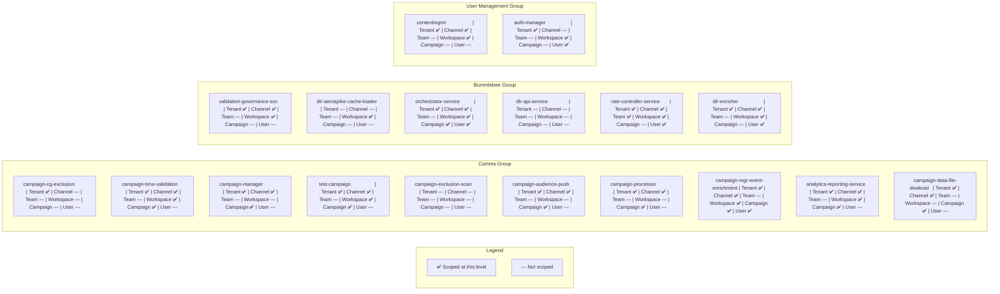
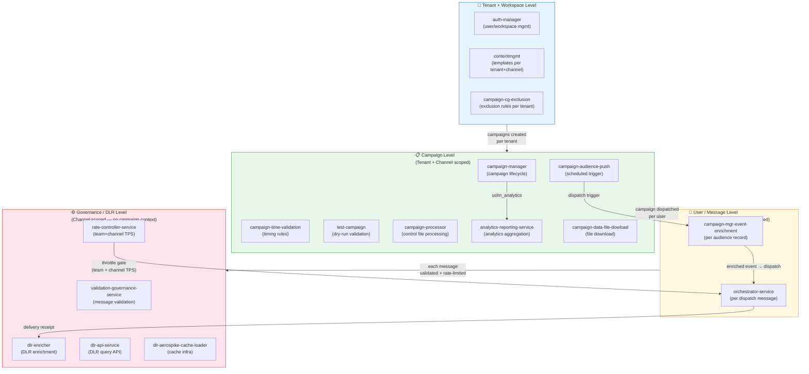

# UCLM — Service Processing Levels

> Documents at what level each service scopes its work:  
> **Tenant · Channel · Team · Workspace · Campaign · User/Message**  
> Evidence sourced from source code, Spring configs, Kafka payloads, and Helm env vars.  
> Last updated: 2026-05-12

---

## Table of Contents

- [Level Legend](#level-legend)
- [Quick Reference Matrix](#quick-reference-matrix)
- [Comms Group — Detail](#comms-group--detail)
- [Bummlebee Group — Detail](#bummlebee-group--detail)
- [User Management Group — Detail](#user-management-group--detail)
- [Mermaid Diagrams](#mermaid-diagrams)
  - [Processing Level Heatmap](#1-processing-level-heatmap)
  - [Data Flow by Level](#2-data-flow-by-level)

---

## Level Legend

| Level | Meaning | Typical Evidence |
|-------|---------|-----------------|
| **Tenant** | Service filters/queries by `tenantId` — only processes records belonging to a specific tenant | `WHERE tenant_id = ?`, `x-tenant-id` header, `tenant.id` config |
| **Channel** | Service is aware of and may filter by channel (SMS / Email / Push / RCS / WhatsApp) | `channel` field in entity, channel-specific logic/routing |
| **Team** | Service scopes by `teamId` — usually a sub-group within a tenant | `teamId` param in rate-limiting, `tryAcquire(teamId, tps)` |
| **Workspace** | Service uses `workspaceId` as an additional scope within a tenant | `x-workspace-id` header, `workspaceId` in context/DTO |
| **Campaign** | Each unit of work is a campaign entity | `campaignId` in queries/Kafka events |
| **User/Message** | Processes individual user records, MSISDNs, or single dispatch events | `msisdn`, `uuid`, audience records, per-message Kafka events |

---

## Quick Reference Matrix

| Service | Tenant | Channel | Team | Workspace | Campaign | User/Msg | Unit of Work |
|---------|:------:|:-------:|:----:|:---------:|:--------:|:--------:|-------------|
| **uclm-campaign-cg-exclusion** | ✅ | — | — | — | — | — | Exclusion rule per tenant |
| **uclm-campaign-time-validation** | ✅ | ✅ | — | ✅ | ✅ | — | Campaign timing validation |
| **uclm-campaign-manager** | ✅ | ✅ | — | — | ✅ | — | Campaign lifecycle entity |
| **uclm-test-campaign** | ✅ | ✅ | — | ✅ | ✅ | — | Test campaign validation |
| **uclm-campaign-exclusion-scan** | — | — | — | — | — | — | CSV file batch load |
| **uclm-campaign-audience-push** | ✅ | ✅ | — | — | ✅ | — | Campaign trigger (scheduled) |
| **uclm-campaign-processor** | ✅ | ✅ | — | — | ✅ | — | Audience control file / campaign |
| **uclm-campaign-manager-event-enrichment** | ✅ | ✅ | — | ✅ | ✅ | ✅ | Individual audience record |
| **uclm-analytics-reporting-service** | ✅ | ✅ | — | ✅ | ✅ | — | Campaign analytics aggregate |
| **uclm-campaign-data-file-dowload** | ✅ | ✅ | — | — | ✅ | — | Campaign audience file |
| **uclm-validation-governance-service** | ✅ | ✅ | — | ✅ | — | — | Message governance event |
| **uclm-dlr-aerospike-cache-loader** | — | — | — | ✅ | — | — | Cache entry (infrastructure) |
| **uclm-orchestrator-service** | ✅ | ✅ | — | ✅ | ✅ | ✅ | Individual dispatch message |
| **uclm-dlr-api-service** | — | — | — | — | — | — | Query-only REST API |
| **uclm-rate-controller-service** | ✅ | ✅ | ✅ | ✅ | — | ✅ | Team + channel TPS token |
| **uclm-dlr-enricher** | ✅ | ✅ | — | ✅ | — | ✅ | DLR record per message |
| **uclm-contentmgmt** | ✅ | ✅ | — | ✅ | — | — | Content template per channel |
| **uclm-auth-manager** | ✅ | — | — | ✅ | — | ✅ | User / workspace / org entity |

> **✅** = explicitly found in source code / config  
> **—** = no evidence found (left blank, not assumed)

---

## Comms Group — Detail

---

### uclm-campaign-cg-exclusion

| Level | Scoped? | Evidence |
|-------|:-------:|---------|
| Tenant | ✅ | `ExclusionRule` entity has `tenant_id` column; all queries filter by tenant |
| Channel | — | No channel field or filtering found |
| Team | — | — |
| Workspace | — | — |
| Campaign | — | Works at rule level, not campaign level |
| User/Message | — | — |

**Unit of Work:** Exclusion rule record per tenant.

**Key Fields:** `tenantId`, `tenant_id`

**Notes:** Simple REST API — manages customer group (CG) exclusion rules. Tenant is the only scope. No channel or workspace dimension.

---

### uclm-campaign-time-validation

| Level | Scoped? | Evidence |
|-------|:-------:|---------|
| Tenant | ✅ | `TenantContext` populated from `x-tenant-id` request header; all DB queries include `tenantId` |
| Channel | ✅ | 144 channel references; validates timing constraints per channel |
| Team | — | — |
| Workspace | ✅ | `TenantContext` includes `workspaceId` from `x-workspace-id` header |
| Campaign | ✅ | Validates timing rules for a campaign entity |
| User/Message | — | — |

**Unit of Work:** Campaign timing validation per tenant + workspace + channel.

**Key Fields:** `tenantId`, `workspaceId`, `userId`, `channelId`

**Context Injection:**
```
Headers read: x-tenant-id  →  TenantContext.tenantId
              x-workspace-id  →  TenantContext.workspaceId
              x-user-id  →  TenantContext.userId
```

---

### uclm-campaign-manager

| Level | Scoped? | Evidence |
|-------|:-------:|---------|
| Tenant | ✅ | All repository queries filter by `tenantId`; DB unique constraint on `(NAME, TENANT_ID)` |
| Channel | ✅ | `CampaignMaster` entity has `CHANNEL` column; filter specs include channel |
| Team | — | — |
| Workspace | — | — |
| Campaign | ✅ | Core entity: `CampaignMaster` (id, name, channel, state, tenantId, goalId, subgoalId) |
| User/Message | — | — |

**Unit of Work:** Campaign entity lifecycle (create → approve → schedule → complete) per tenant + channel.

**Key Fields:** `tenantId`, `channel`, `campaignId`, `deptId`, `goalId`, `subgoalId`

**Notes:**
- `CAMPAIGN_ALLOWED_CHANNELS = sms, email, push, whatsapp, rcs` in single deployment.
- All 5 channels handled by one pod; channel filtering is done at query/business logic level.

---

### uclm-test-campaign

| Level | Scoped? | Evidence |
|-------|:-------:|---------|
| Tenant | ✅ | `TenantContextFilter` extracts `x-tenant-id` header; queries include `tenantId` |
| Channel | ✅ | 157 channel references; validators check per channel |
| Team | — | — |
| Workspace | ✅ | `TenantContext.workspaceId` from `x-workspace-id` header |
| Campaign | ✅ | Validates `CampaignMaster` / `CampaignDetails` structures |
| User/Message | — | — |

**Unit of Work:** Test/dry-run campaign validation per tenant + workspace + channel.

**Key Fields:** `tenantId`, `workspaceId`, `userId`, `channelId`, `campaignId`

**Notes:** Architecture mirrors `campaign-time-validation` — same header-based context injection pattern.

---

### uclm-campaign-exclusion-scan

| Level | Scoped? | Evidence |
|-------|:-------:|---------|
| Tenant | — | No tenant references found |
| Channel | — | — |
| Team | — | — |
| Workspace | — | — |
| Campaign | — | — |
| User/Message | — | — |

**Unit of Work:** CSV exclusion file batch load — utility service with no business-level scoping.

**Key Fields:** *(none found)*

**Notes:** `ExclusionScheduler` + `CsvExclusionLoader` pattern. Fully infrastructure-level; scope is determined by the files placed in `INGEST_BASE_FOLDER`.

---

### uclm-campaign-audience-push

| Level | Scoped? | Evidence |
|-------|:-------:|---------|
| Tenant | ✅ | Scheduler explicitly loops `tenantProperties.getIds()` — processes each configured tenant ID |
| Channel | ✅ | `CampaignMasterEntity` has `channel` field; filters campaigns by channel |
| Team | — | — |
| Workspace | — | — |
| Campaign | ✅ | Triggers eligible `CampaignRequest` per tenant on schedule |
| User/Message | — | — |

**Unit of Work:** Eligible campaign trigger per tenant (scheduled batch — all configured tenant IDs iterated).

**Key Fields:** `tenantId`, `channel`, `campaignId`, `scheduleType`, `state`, `timezone`

**Tenant Config Pattern:**
```yaml
# tenantProperties.getIds() read from config — list of tenant IDs to iterate
```

---

### uclm-campaign-processor

| Level | Scoped? | Evidence |
|-------|:-------:|---------|
| Tenant | ✅ | `CampaignMaster` entity has `TENANT_ID` column |
| Channel | ✅ | `CampaignMaster` entity has `CHANNEL` column |
| Team | — | — |
| Workspace | — | — |
| Campaign | ✅ | Downloads audience control files per `campaignId` / `audienceId` |
| User/Message | — | — |

**Unit of Work:** Audience control file (S3) processed per campaign + tenant.

**Key Fields:** `tenantId`, `campaignId`, `parentCampaignId`, `audienceId`, `channel`

**Notes:** Publishes to `control_file_request` Kafka topic after file processing.

---

### uclm-campaign-manager-event-enrichment

| Level | Scoped? | Evidence |
|-------|:-------:|---------|
| Tenant | ✅ | Extracts `tenantId` from inbound Kafka event; logs `campaignId={} tenantId={} workspaceId={}` |
| Channel | ✅ | 154 channel references; enriches per channel |
| Team | — | — |
| Workspace | ✅ | `workspaceId` extracted from event and logged |
| Campaign | ✅ | Looks up `CampaignMaster` / `CampaignDetails` by `campaignId` |
| User/Message | ✅ | Processes individual `AudienceRecord` / `AudienceData` objects |

**Unit of Work:** Individual audience record enriched with campaign metadata per tenant + workspace + channel.

**Key Fields:** `tenantId`, `workspaceId`, `campaignId`, `channel`, `msisdn`/`userId`, `audienceRecord`

**Notes:** Only Comms service that processes down to individual user/MSISDN level.

---

### uclm-analytics-reporting-service

| Level | Scoped? | Evidence |
|-------|:-------:|---------|
| Tenant | ✅ | 126 references; queries filtered by `tenantId` and `deptId`; logs `tenantId={}` |
| Channel | ✅ | 86 references; analytics aggregated per channel |
| Team | — | — |
| Workspace | ✅ | 9 references; logs `tenantId={} | workspaceId={} | timezone={}` |
| Campaign | ✅ | Aggregates metrics per `campaignId` |
| User/Message | — | Aggregated metrics only — no per-user detail |

**Unit of Work:** Campaign analytics aggregate per tenant + workspace + channel.

**Key Fields:** `tenantId`, `workspaceId`, `campaignId`, `deptId`, `channel`, `timezone`

---

### uclm-campaign-data-file-dowload

| Level | Scoped? | Evidence |
|-------|:-------:|---------|
| Tenant | ✅ | 15 references; `SELECT … FROM CAMPAIGN_MASTER WHERE tenant_id = ?` |
| Channel | ✅ | 1 reference |
| Team | — | — |
| Workspace | — | — |
| Campaign | ✅ | Downloads audience data files per campaign |
| User/Message | — | — |

**Unit of Work:** Audience file download per campaign + tenant.

**Key Fields:** `tenantId`, `campaignId`, `audienceId`, `timezone`

---

## Bummlebee Group — Detail

---

### uclm-validation-governance-service

| Level | Scoped? | Evidence |
|-------|:-------:|---------|
| Tenant | ✅ | 6 references; sets `tenant_id` in outbound headers/DTOs |
| Channel | ✅ | 59 references; validates per channel (SMS, RCS, Push, WhatsApp); deployed as one pod per channel |
| Team | — | — |
| Workspace | ✅ | 3 references; sets `workspace_id` in outbound DTO |
| Campaign | — | Validates governance rules across all campaigns |
| User/Message | — | Validates at message/event level (not aggregated per user) |

**Unit of Work:** Single incoming message/event validated against governance rules per channel + tenant.

**Key Fields:** `tenantId`, `tenant_id`, `channel`, `workspace_id`

**Config evidence:**
```properties
# dev profile (hardcoded)
tenant.id=1
```

---

### uclm-dlr-aerospike-cache-loader

| Level | Scoped? | Evidence |
|-------|:-------:|---------|
| Tenant | — | No tenant scoping found |
| Channel | — | No channel filtering in code (channel set via Spring profile at deploy time) |
| Team | — | — |
| Workspace | ✅ | 1 reference: `workspace_id` present in cache data structure |
| Campaign | — | — |
| User/Message | — | — |

**Unit of Work:** Infrastructure cache entry — loads sender/recipient enrichment data into Aerospike.

**Key Fields:** `workspace_id`

**Notes:** Channel awareness is baked in at deploy time via `SPRING_PROFILES_ACTIVE=sms-uat` etc. — not runtime scoping.

---

### uclm-orchestrator-service

| Level | Scoped? | Evidence |
|-------|:-------:|---------|
| Tenant | ✅ | Extracts `tenantId` from Kafka event; `app.cms.tenant-id=1` hardcoded in dev/local |
| Channel | ✅ | 138 channel references; routes message to channel-specific provider handler |
| Team | — | — |
| Workspace | ✅ | 3 references; constructs `workspace_id` in dispatch DTO |
| Campaign | ✅ | Each Kafka message carries `campaignId` |
| User/Message | ✅ | Processes one message (one user/MSISDN) per Kafka event |

**Unit of Work:** Single dispatch message routed to channel provider per tenant + channel.

**Key Fields:** `tenantId`, `workspaceId`, `channel`, `channelId`

**Config evidence:**
```properties
# dev/local (hardcoded defaults)
app.cms.tenant-id=1
# prod/uat — injected via env var
```

---

### uclm-dlr-api-service

| Level | Scoped? | Evidence |
|-------|:-------:|---------|
| Tenant | — | No tenant scoping found |
| Channel | — | No channel filtering at runtime |
| Team | — | — |
| Workspace | — | — |
| Campaign | — | — |
| User/Message | — | — |

**Unit of Work:** Query-only REST API for DLR records — no business scoping.

**Key Fields:** *(none found — only `DlrController` and `HealthController`)*

**Notes:** Channel selection is via `SPRING_PROFILES_ACTIVE` at deploy time only, not runtime logic.

---

### uclm-rate-controller-service

| Level | Scoped? | Evidence |
|-------|:-------:|---------|
| Tenant | ✅ | 54 references; updates TPS per tenant; `tenant.id=1` in dev |
| Channel | ✅ | 68 references; throttles per channel; `channel.name=WHATSAPP` in dev |
| Team | ✅ | **79 references** — core logic `tryAcquire(teamId, teamTps)`; rate limits stored per `teamId` |
| Workspace | ✅ | 13 references; `workspace_id` used in rate-limit key construction |
| Campaign | — | Applies across all campaigns |
| User/Message | ✅ | Throttles individual message UUIDs |

**Unit of Work:** TPS token acquisition per **team + channel + tenant** — the only service with team-level scoping.

**Key Fields:** `teamId`, `tenantId`, `channel`, `teamTps`, `channelTps`, `uuid`, `workspace_id`

**Config evidence:**
```properties
# dev profile
tenant.id=1
channel.name=WHATSAPP
channel.global.tps=2000
tenant.channel.tps=5
```

> ⭐ **Only service with team-level scoping** — `teamId` is a first-class key in rate-limit logic.

---

### uclm-dlr-enricher

| Level | Scoped? | Evidence |
|-------|:-------:|---------|
| Tenant | ✅ | 3 references; `tenantID` included in enriched Kafka event |
| Channel | ✅ | 4 references; enriches per channel |
| Team | — | — |
| Workspace | ✅ | 1 reference; `workspace_id` in enriched event payload |
| Campaign | — | — |
| User/Message | ✅ | Enriches per DLR record (one record = one message = one user) |

**Unit of Work:** Single DLR record enriched with sender/recipient metadata from Aerospike per tenant + channel.

**Key Fields:** `tenantID`, `workspace_id`, `channel`, `msisdn`

**Kafka flow:**
```
{channel}_dlr_raw  →  [enrich via Aerospike]  →  {channel}_dlr_enriched
```

---

## User Management Group — Detail

---

### uclm-contentmgmt

| Level | Scoped? | Evidence |
|-------|:-------:|---------|
| Tenant | ✅ | 20 references; `findByTenantIdAndDeptIdAndChannel()` repository method |
| Channel | ✅ | **270 references — highest of all services**; `Channel` enum: SMS, RCS, WHATSAPP, PUSH |
| Team | — | — |
| Workspace | ✅ | 9 references; `workspaceId` in request context |
| Campaign | — | Content/template management, not campaign execution |
| User/Message | — | — |

**Unit of Work:** Content template or media asset per tenant + workspace + channel.

**Key Fields:** `tenantId`, `workspaceId`, `channel` (enum), `deptId`

**Notes:**
- `ChannelConfigService` fetches config for `(tenantId, deptId, Channel)` tuple.
- Highest channel reference count of all 18 services — channel is a core dimension of all content.

---

### uclm-auth-manager

| Level | Scoped? | Evidence |
|-------|:-------:|---------|
| Tenant | ✅ | 130 references; validates workspace/org belong to tenant; `TenantConfigController` exists |
| Channel | — | No channel scoping |
| Team | — | — |
| Workspace | ✅ | 29 references; `WorkspaceSwitchController`; validates workspace membership |
| Campaign | — | — |
| User/Message | ✅ | `UserController`; manages individual user accounts and org hierarchy |

**Unit of Work:** User / workspace / org entity per tenant.

**Key Fields:** `tenantId`, `workspaceId`, `userId`, `orgId`, `roleId`

**Config evidence:**
```properties
# hardcoded test defaults
notification.api.x-tenant-id=1
notification.api.x-workspace-id=8
```

---

## Mermaid Diagrams

### 1. Processing Level Heatmap

> Each service row shows which levels it operates at.



---

### 2. Data Flow by Level

> How data narrows from Tenant → Campaign → User as it moves through the pipeline.


