# Bummlebee Platform — Services Overview

> 6 microservices that together manage multi-channel message delivery and DLR tracking.

---

## At a Glance

```mermaid
flowchart LR
    RC["1⃣ Rate Controller\n(TPS Throttle)"]
    VG["2⃣ Validation Governance\n(DLT + CMS + Payload Build)"]
    ORCH["3⃣ Orchestrator\n(Channel Routing)"]
    DLRAPI["4⃣ DLR API Service\n(Webhook Receiver)"]
    CACHE["5⃣ Aerospike Cache Loader\n(Kafka  Aerospike)"]
    ENR["6⃣ DLR Enricher\n(Correlation + Enrichment)"]

    RC -->|event| VG -->|dispatch| ORCH
    ORCH -->|DLR webhook| DLRAPI -->|raw-dlr| ENR
    ORCH -->|wa_main_service| CACHE
    ENR -->|Aerospike lookup| CACHE
    classDef svc fill:#2980b9,color:#fff,stroke:#1f618d
    classDef db fill:#27ae60,color:#fff,stroke:#1e8449
    classDef ext fill:#8e44ad,color:#fff,stroke:#6c3483
    classDef channel fill:#d35400,color:#fff,stroke:#a04000
    class ORCH channel
    class CACHE db
    class DLRAPI,VG ext
    class ENR,RC svc
```

---

## 1. uclm-rate-controller-service
**Port:** `8081` | **DB:** PostgreSQL | **Kafka:** Consumer + Producer

The **traffic throttle gate** for the entire delivery pipeline. Consumes messages from the upstream `comms-input` Kafka topic, applies **per-team, per-channel TPS rate limits** using Resilience4j RateLimiter, and dispatches approved messages to the `event` topic for downstream processing.

Monitors downstream consumer lag (valgov and orchestrator groups) and backs off consumption when lag exceeds a configurable threshold. Tenant and team TPS configurations are stored in PostgreSQL and reloaded periodically.

---

## 2. uclm-validation-governance-service
**Port:** `7777` | **DB:** None (lookup files) | **Kafka:** Consumer + Producer

The **multi-channel validator and governance engine**. Consumes the `event` topic and runs a comprehensive validation pipeline for all channels: **SMS, EMAIL, WHATSAPP, PUSH, RCS, D2C, FS**.

Key checks:
- Field-level schema validation (lookup files: raw / schema / normalized)
- DLT (Distributed Ledger Technology) scrubbing for SMS compliance
- CMS quota governance check
- Language code normalization and category validation
- Constructs channel-specific endpoint payloads

Publishes validated payloads to the `dispatch` topic and analytics events to `cs_raw_reporting_topic`.

---

## 3. uclm-orchestrator-service
**Port:** N/A (Kafka-only, no REST) | **Kafka:** Consumer + Producer

The **channel routing and dispatch engine**. Consumes the `dispatch` topic (or `channel_partner_*_endpoint` per channel in DEV/Prod), validates message expiry, and routes to the appropriate channel provider via **Spring Cloud OpenFeign** clients.

Supported providers:
- **SMS** → Airtel SMS IQ
- **Email** → Netcore Email API (with SMTP fallback)
- **WhatsApp** → Airtel IQ WhatsApp
- **RCS** → Airtel IQ Conversation
- **Push** → Firebase Cloud Messaging (FCM)

Decrements **CMS quota** on success or failure. Publishes response and audit logs to Kafka.

---

## 4. uclm-dlr-api-service
**Port:** `8080` | **DB:** None | **Kafka:** Producer only

A **webhook receiver** for SMS Delivery Reports (DLRs) from SMS gateway providers (e.g. Airtel SMS IQ). Receives HTTP POST callbacks at `/channel/dlr/status`, validates the JSON payload, and publishes raw DLR events to the `iq_channel_dlr_raw` Kafka topic with production-grade reliability settings (`acks=all`, idempotent producer, retries).

Supports Kerberos authentication for secure Kafka clusters (UAT/Prod) and is horizontally scalable behind an ALB or K8s Ingress.

---

## 5. uclm-dlr-aerospike-cache-loader
**Port:** N/A | **DB:** Aerospike 7.1.0 | **Kafka:** Consumer + DLQ Producer

A **Kafka-to-Aerospike data pipeline**. Consumes dispatch records from `wa_main_service` (and configurable other topics), validates required fields, and writes them into Aerospike NoSQL for sub-millisecond lookups by the DLR Enricher.

Error handling:
- Validation/parse error → send to DLQ (`wa_main_service_dlq`) → ACK Kafka
- Aerospike DOWN → don't ACK → Kafka retries automatically
- Aerospike write fails → retry 3× with exponential backoff → DLQ → ACK

---

## 6. uclm-dlr-enricher
**Port:** N/A | **DB:** Aerospike (reader) | **Kafka:** Consumer + Producer + DLQ

A **Kafka-to-Kafka DLR enrichment pipeline**. Consumes raw DLR events from `raw-dlr-topic`, looks up the correlated original dispatch record from Aerospike, merges fields, and publishes the enriched DLR to the output topic.

Retry strategy: **exponential backoff** with configurable delays (15 min → 30 min → 60 min). Uses Resilience4j circuit breaker to protect Aerospike. Permanently failed messages go to a Dead Letter Queue (DLQ) topic. Uses manual Kafka offset management for zero data loss.

---

## Summary Table

| # | Service | One-line role | Port | Kafka | DB |
|---|---------|---------------|------|-------|-----|
| 1 | Rate Controller | Per-team TPS throttle gate | `8081` | Consumer + Producer | PostgreSQL |
| 2 | Validation Governance | Multi-channel validation + DLT/CMS + payload build | `7777` | Consumer + Producer | Lookup files |
| 3 | Orchestrator | Routes dispatches to channel providers | N/A | Consumer + Producer | None |
| 4 | DLR API Service | Webhook receiver for SMS DLRs | `8080` | Producer | None |
| 5 | Aerospike Cache Loader | Stores dispatch records in Aerospike for DLR lookup | N/A | Consumer + DLQ | Aerospike |
| 6 | DLR Enricher | Enriches raw DLRs with Aerospike dispatch data | N/A | Consumer + Producer | Aerospike (read) |
