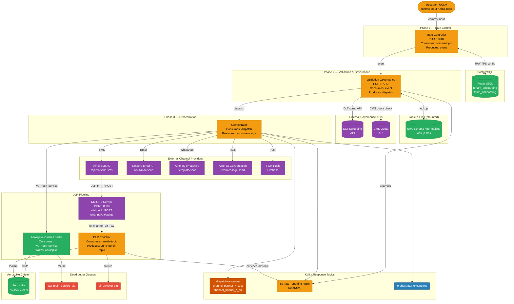

# End-to-End Integration Flow

This diagram shows every service, how data flows between them, and which external systems are involved.

---

## Full System Flowchart

---

## Phase Descriptions

### Phase 1 — Rate Control (uclm-rate-controller-service)

1. Upstream UCLM platform publishes dispatch-ready events to **`comms-input`** Kafka topic.
2. Rate Controller consumes events and checks per-team TPS limit (from PostgreSQL).
3. If within TPS → forward to **`event`** topic → `acknowledgment.acknowledge()`.
4. If over TPS limit → `acknowledgment.nack(500ms)` → Kafka retries after delay.
5. Consumer lag monitor checks downstream groups (`valgov`, `orch`) and pauses if lag > threshold.

### Phase 2 — Validation & Governance (uclm-validation-governance-service)

1. Consumes **`event`** topic with `EventRequestDTO`.
2. Validates channel type (SMS, EMAIL, WHATSAPP, PUSH, RCS, D2C, FS, PUSH_BANK, PUSH_THANKS).
3. Runs DLT scrubbing for SMS (regulatory compliance).
4. Runs CMS quota governance check.
5. Normalizes language codes and categories using lookup files.
6. Constructs channel-specific endpoint payload.
7. Publishes to **`dispatch`** topic for orchestrator and **`cs_raw_reporting_topic`** for analytics.
8. On failure → publishes to **`exceptions`** or **`apb-exceptions`** topic.

### Phase 3 — Orchestration (uclm-orchestrator-service)

1. Consumes **`dispatch`** topic (or `channel_partner_*_endpoint` per channel in DEV/Prod).
2. Validates message expiry timestamp.
3. Routes to appropriate channel service:
   - **SMS** → `SmsService` → Airtel SMS IQ
   - **Email** → `EmailService` → Netcore API (or SMTP fallback)
   - **WhatsApp** → `WhatsappService` → Airtel IQ WhatsApp
   - **RCS** → `RcsService` → Airtel IQ Conversation
   - **Push** → `PushService` → FCM
4. On success → publishes to `dispatch-response` (or `channel_partner_*_succ`).
5. On failure → decrements CMS quota, publishes to error topic.
6. Publishes audit log to `cs_raw_reporting_topic`.
7. Publishes dispatch records to **`wa_main_service`** for Aerospike cache loading.

### DLR Pipeline — Delivery Receipt Tracking

#### DLR API Service (uclm-dlr-api-service)
1. SMS gateway sends HTTP POST to `/channel/dlr/status`.
2. Service validates JSON payload (required fields check).
3. Publishes raw DLR to **`iq_channel_dlr_raw`** Kafka topic with `acks=all`.
4. Returns HTTP 200 to gateway.

#### Aerospike Cache Loader (uclm-dlr-aerospike-cache-loader)
1. Consumes dispatch records from **`wa_main_service`** topic.
2. Validates required fields.
3. Writes to Aerospike with dynamic primary key (e.g. message UUID or request ID).
4. On error → retries 3× → sends to **`wa_main_service_dlq`** → ACKs Kafka.

#### DLR Enricher (uclm-dlr-enricher)
1. Consumes raw DLR from **`iq_channel_dlr_raw`** (or `raw-dlr-topic`).
2. Extracts lookup key from DLR (e.g. request ID / UUID).
3. Queries Aerospike for original dispatch record.
4. **Cache HIT** → merges fields → publishes enriched DLR → ACK.
5. **Cache MISS** → schedules retry (15 min → 30 min → 60 min) → ACK.
6. **Max retries exhausted** → sends to **`dlr-enricher-dlq`** → ACK.
