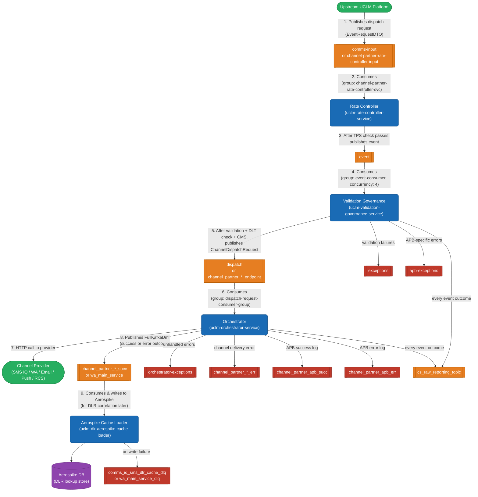
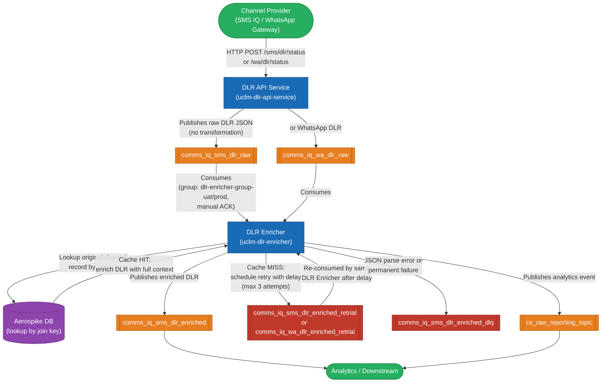

# Kafka Message Flows

How all 6 services talk to each other via Kafka — topics, consumer groups, data flows, and error handling.

---

## System Overview

There are **two independent Kafka pipelines** in this system:

| Pipeline | Purpose |
|----------|---------|
| **Dispatch Pipeline** | Sending outbound messages (SMS / Email / WA / Push / RCS) to end users |
| **DLR Pipeline** | Receiving delivery receipts from channel providers and enriching them |

Kafka acts as the backbone: every service communicates exclusively via Kafka topics — no direct service-to-service HTTP calls in the main flow.

---

## Pipeline 1 — Dispatch Flow (Outbound Messaging)

This is the **main flow** for sending a message to a user. The request enters from an upstream UCLM platform and passes through 4 services before hitting the channel provider.

```
Step 1: Upstream → [comms-input] → Rate Controller
Step 2: Rate Controller → [event] → Validation Governance
Step 3: Validation Governance → [dispatch / channel_partner_*_endpoint] → Orchestrator
Step 4: Orchestrator → (HTTP) → Channel Provider (SMS IQ / WA / Email / Push / RCS)
Step 5: Orchestrator → [channel_partner_*_succ] → Aerospike Cache Loader → Aerospike
```



### Step-by-step: What happens at each hop

| Step | From | Kafka Topic | To | What the consumer does |
|------|------|-------------|-----|------------------------|
| 1 | Upstream UCLM | `comms-input` (local) / `channel-partner-rate-controller-input` (dev) | Rate Controller | Receives `EventRequestDTO` |
| 2 | Rate Controller | `event` | Validation Governance | Applies per-team/channel TPS throttle. If limit exceeded → `nack` with 500ms delay (Kafka redelivers). On pass → publishes `EventRequestDTO` to `event` |
| 3 | Validation Governance | `dispatch` (local) / `channel_partner_*_endpoint` (dev/prod) | Orchestrator | Runs validations (field checks, DLT scrubbing, CMS quota), builds `ChannelDispatchRequest`, publishes to dispatch topic. Also sends analytics + exception events |
| 4 | Orchestrator | `channel_partner_*_succ` / `wa_main_service` | Aerospike Cache Loader | Routes to channel provider via HTTP. After provider responds, publishes `FullKafkaDml` to success/error topic. Cache Loader stores this in Aerospike using `uuid`/`endpoint_request_id` as key |

---

## Pipeline 2 — DLR Flow (Delivery Receipt)

When a channel provider (e.g. SMS IQ) delivers the message, it sends a **Delivery Report (DLR)** back. This pipeline enriches the raw DLR with the original request details (stored in Aerospike by the Cache Loader above).

```
Step 1: Channel Provider → HTTP POST → DLR API Service
Step 2: DLR API Service → [comms_iq_sms_dlr_raw / comms_iq_wa_dlr_raw] → DLR Enricher
Step 3: DLR Enricher → Aerospike lookup (using join key from DLR)
Step 4a: Cache HIT → [comms_iq_sms_dlr_enriched] → Analytics / Downstream
Step 4b: Cache MISS → [comms_iq_sms_dlr_enriched_retrial] → DLR Enricher (retry after delay)
Step 4c: Permanent failure → [comms_iq_sms_dlr_enriched_dlq]
```



### Step-by-step: What DLR Enricher does with each message

| Scenario | Action | Kafka topic |
|----------|--------|-------------|
| JSON parse error | Can't read the DLR at all | → `comms_iq_sms_dlr_enriched_dlq` (ACK to avoid infinite loop) |
| Join key missing / null | Can't look up Aerospike | → `comms_iq_sms_dlr_enriched_dlq` |
| Aerospike cache MISS | Original dispatch not found yet | → `comms_iq_sms_dlr_enriched_retrial` (retry after ~15 min delay) |
| Aerospike cache HIT | Found original record | Enriches DLR + → `comms_iq_sms_dlr_enriched` + `cs_raw_reporting_topic` |
| Retry exhausted (3 attempts) | Still no match | → `comms_iq_sms_dlr_enriched_dlq` |

---

## How Aerospike Connects the Two Pipelines

The Aerospike cache is the **bridge** between the dispatch pipeline and the DLR pipeline:

```
Dispatch Pipeline:
  Orchestrator ──publishes──► [channel_partner_*_succ] ──► Cache Loader ──writes──► Aerospike
                                                                                      key = uuid / endpoint_request_id

DLR Pipeline:
  DLR Enricher ──lookups──► Aerospike (by join key from raw DLR)
               ──on HIT──► merges DLR with original dispatch record ──► [enriched topic]
```

Without Aerospike, the DLR Enricher would not know which campaign/tenant/mobile the raw DLR belongs to.

---

## D2C / External Kafka (Special Case)

For **D2C and FS channels**, Validation Governance sends to a **separate external Kafka cluster** instead of the internal dispatch topic:

- External broker (DEV): `10.248.244.115:9092, 10.248.244.116:9092, 10.248.244.117:9092`
- External topic: `d2c-clm-sit`
- This is handled by `ExternalKafkaProducer` (only active on non-local profiles)
- Uses a separate `KafkaTemplate` bean (`externalKafkaTemplate`) with its own bootstrap config

---

## All Kafka Topics — Reference

### Dispatch Pipeline Topics

| Topic | Producer | Consumer | What flows through it |
|-------|----------|----------|-----------------------|
| `comms-input` (local) / `channel-partner-rate-controller-input` (dev) | Upstream UCLM | Rate Controller | Raw `EventRequestDTO` from the upstream platform |
| `event` | Rate Controller | Validation Governance | Same `EventRequestDTO` after TPS check passed |
| `dispatch` (local) / `channel_partner_*_endpoint` (dev) | Validation Governance | Orchestrator | `ChannelDispatchRequest` — validated, DLT-checked, CMS-counted payload ready to send |
| `channel_partner_*_succ` / `wa_main_service` | Orchestrator | Aerospike Cache Loader | `FullKafkaDml` — full dispatch record (success) stored in Aerospike for DLR join |
| `channel_partner_*_err` | Orchestrator | Monitoring / Alerting | `FullKafkaDml` — dispatch attempt that failed at the provider |
| `channel_partner_apb_succ` | Orchestrator | APB platform | APB-format success contract |
| `channel_partner_apb_err` | Orchestrator | APB platform | APB-format error contract |
| `cs_raw_reporting_topic` | Validation Governance, Orchestrator, DLR Enricher | Analytics | `AnalyticsEventDTO` — every event outcome across all stages |
| `exceptions` | Validation Governance | Monitoring | `ExceptionEvent` — validation / governance failures |
| `apb-exceptions` | Validation Governance | APB Monitoring | APB-specific exception events |
| `orchestrator-exceptions` | Orchestrator | Monitoring | Unhandled Orchestrator errors |
| `d2c-clm-sit` (external Kafka) | Validation Governance | D2C downstream | D2C / FS channel dispatch events |

### Cache Loader DLQ Topics

| Topic | Producer | Consumer | What flows through it |
|-------|----------|----------|-----------------------|
| `comms_iq_sms_dlr_cache_dlq` (SMS) / `wa_main_service_dlq` (WA/prod) | Cache Loader | Manual recovery | Failed Aerospike writes (JSON error, validation error, processing error when Aerospike is up) |

### DLR Pipeline Topics

| Topic | Producer | Consumer | What flows through it |
|-------|----------|----------|-----------------------|
| `comms_iq_sms_dlr_raw` | DLR API Service | DLR Enricher | Raw SMS delivery receipt from gateway (verbatim JSON from HTTP POST) |
| `comms_iq_wa_dlr_raw` | DLR API Service | DLR Enricher | Raw WhatsApp DLR |
| `comms_iq_sms_dlr_enriched` | DLR Enricher | Analytics / Downstream | Enriched DLR — raw DLR merged with original dispatch record |
| `comms_iq_sms_dlr_enriched_retrial` / `comms_iq_wa_dlr_enriched_retrial` | DLR Enricher | DLR Enricher (self) | Retry envelope — Aerospike cache miss, rescheduled for re-processing |
| `comms_iq_sms_dlr_enriched_dlq` | DLR Enricher | Manual recovery | Permanently failed DLRs (parse errors, missing join key, retry exhausted) |

---

## Consumer Groups

| Service | Consumer Group ID | Topics Consumed | Concurrency |
|---------|-------------------|-----------------|-------------|
| Rate Controller | `channel-partner-rate-controller-svc` (dev) / `channel-tenant-throttle-listener` (local) | `comms-input` / `channel-partner-rate-controller-input` | 1 (default) |
| Validation Governance | `event-consumer` (dev) / `default` (local) | `event` | 4 |
| Orchestrator | `dispatch-request-consumer-group` | `dispatch` / `channel_partner_*_endpoint` | 4 |
| Aerospike Cache Loader | `iq-sms-cache-loader-group-uat` (sms-dev) / `cache-loader-group` (local) | `channel_partner_sms_nrt_svc_succ` / `wa_main_service` | 1 (default) |
| DLR Enricher | `dlr-enricher-group-uat` (dev) / `dlr-enricher-group-prod` (prod) | `comms_iq_sms_dlr_raw` / `comms_iq_wa_dlr_raw` / retry topics | 1 (manual ACK) |

---

## Kafka Security

| Environment | Protocol | Auth Mechanism |
|-------------|----------|----------------|
| Local / DEV | `PLAINTEXT` | None |
| UAT | `SASL_PLAINTEXT` | Kerberos (GSSAPI) |
| PROD | `SASL_SSL` | Kerberos (GSSAPI) + TLS |

UAT/Prod Kerberos config (used by all services):
```
security.protocol=SASL_PLAINTEXT
sasl.mechanism=GSSAPI
sasl.jaas.config=com.sun.security.auth.module.Krb5LoginModule required
  useKeyTab=true storeKey=true
  keyTab="/tmp/keytabs/<service>.keytab"
  principal="<user>@INDIA.AIRTEL.ITM"
  serviceName="kafka";
```

---

## Key Message Types

### EventRequestDTO
Flows: `comms-input` → `event` → `dispatch`

```json
{
  "uuid": "string",
  "moc": "SMS | EMAIL | WHATSAPP | PUSH | RCS | D2C | FS",
  "campaignGroup": "string",
  "campaignName": "string",
  "expireTimestamp": "2024-01-01 12:00:00.000000",
  "mobile": "9999999999",
  "emailId": "user@example.com",
  "whatsappNumber": "91xxxxxxxxxx",
  "deviceToken": "FCM_token",
  "message": "string",
  "templateId": "string",
  "tenantId": "string",
  "teamId": "string",
  "cmsRequired": true
}
```

### ChannelDispatchRequest
Flows: `dispatch` / `channel_partner_*_endpoint`

Wraps the validated `EventRequestDTO` plus channel-specific request fields (DLT entity ID, sender ID, etc.) built by `RequestBuilderFactory` per channel.

### FullKafkaDml
Flows: `channel_partner_*_succ` / `channel_partner_*_err` / `wa_main_service`

The full outcome record published by Orchestrator after provider call. Used by Cache Loader to populate Aerospike and by APB/Analytics for reporting.

```json
{
  "uuid": "string",
  "endpoint_request_id": "string",
  "status": "SUCCESS | FAILED",
  "moc": "SMS",
  "error_code": "string",
  "error_message": "string",
  "src_sys_nm": "string"
}
```

### Raw DLR
Flows: `comms_iq_sms_dlr_raw` / `comms_iq_wa_dlr_raw`

Verbatim JSON from the channel provider HTTP POST — no transformation by DLR API.

```json
{
  "requestId": "string",
  "mobile": "9999999999",
  "status": "DELIVERED | FAILED | PENDING",
  "deliveredAt": "2024-01-01T12:00:00Z",
  "errorCode": "string",
  "providerRef": "string"
}
```

### AnalyticsEventDTO
Flows: `cs_raw_reporting_topic`

Published by Validation Governance, Orchestrator, and DLR Enricher at every significant processing step.

---

## Error Handling Summary

| Service | Error Condition | What happens |
|---------|----------------|--------------|
| Rate Controller | TPS exceeded | `nack` with 500 ms delay — Kafka redelivers the same message |
| Rate Controller | Processing exception | Exception thrown — Kafka retries via container error handler |
| Validation Governance | Validation / DLT failure | Publishes to `exceptions` / `apb-exceptions` then drops |
| Orchestrator | Provider HTTP failure | Resilience4j retry → if exhausted, publishes error to `channel_partner_*_err` |
| Orchestrator | Unhandled exception | Publishes to `orchestrator-exceptions` |
| Cache Loader | Aerospike is DOWN | Does **not** ACK — Kafka will redeliver (Aerospike outage protection) |
| Cache Loader | JSON parse / validation error | Publishes to DLQ then ACKs |
| DLR Enricher | JSON parse error | Publishes to `comms_iq_sms_dlr_enriched_dlq` then ACKs |
| DLR Enricher | Aerospike MISS | Publishes to retry topic with delay metadata |
| DLR Enricher | Retry exhausted (3 attempts) | Publishes to `comms_iq_sms_dlr_enriched_dlq` |
