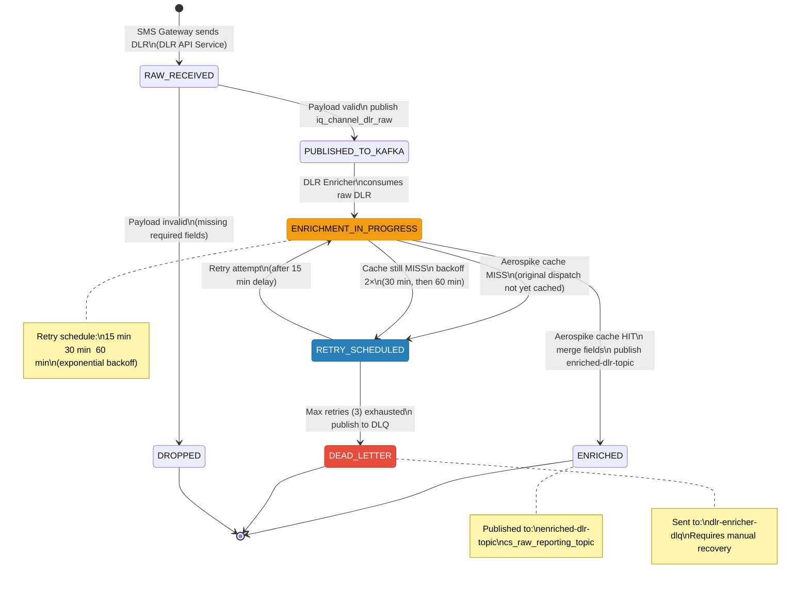
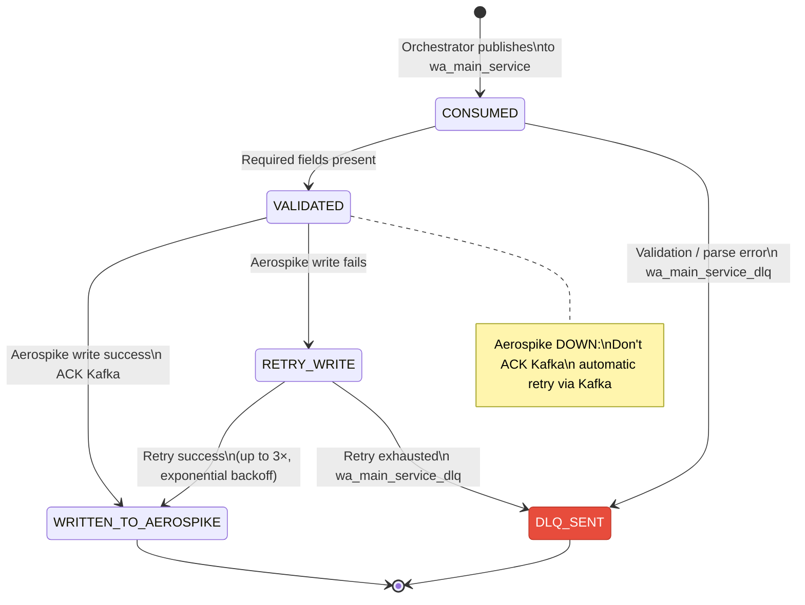
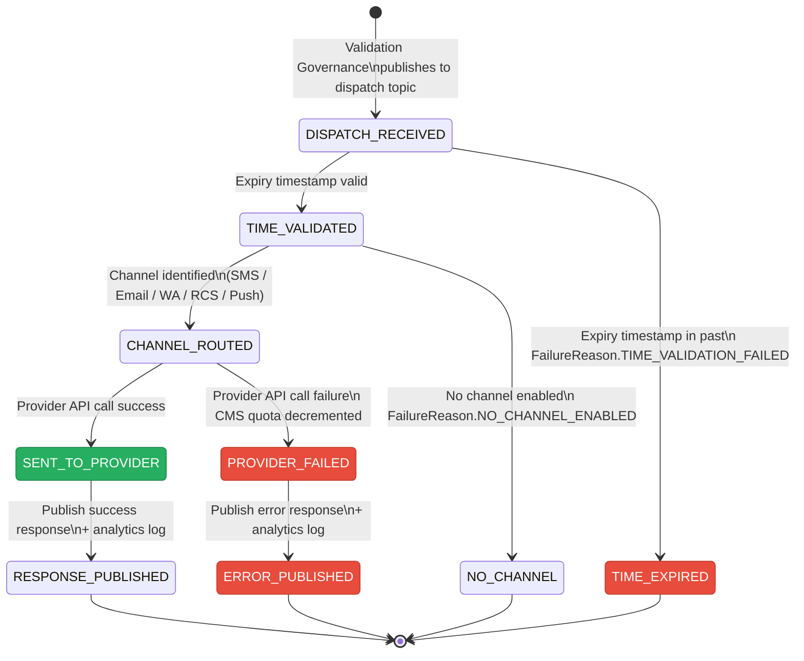

# DLR State Machine

State transitions for a Delivery Report (DLR) as it moves through the DLR pipeline.

---

## DLR Enrichment State Diagram

---

## DLR State Transition Ownership Table

| From State | To State | Service Responsible | Mechanism |
|------------|----------|--------------------|-----------| 
| *(gateway)* | `RAW_RECEIVED` | DLR API Service | HTTP POST webhook |
| `RAW_RECEIVED` | `PUBLISHED_TO_KAFKA` | DLR API Service | Kafka producer (`acks=all`) |
| `RAW_RECEIVED` | `DROPPED` | DLR API Service | Validation rejection (no retry) |
| `PUBLISHED_TO_KAFKA` | `ENRICHMENT_IN_PROGRESS` | DLR Enricher | Kafka consumer |
| `ENRICHMENT_IN_PROGRESS` | `ENRICHED` | DLR Enricher | Aerospike cache HIT |
| `ENRICHMENT_IN_PROGRESS` | `RETRY_SCHEDULED` | DLR Enricher | Aerospike cache MISS |
| `RETRY_SCHEDULED` | `ENRICHMENT_IN_PROGRESS` | DLR Enricher | Scheduled retry after delay |
| `RETRY_SCHEDULED` | `DEAD_LETTER` | DLR Enricher | Max retries exhausted |

---

## Dispatch Record State (Aerospike Cache Loader)

---

## Orchestrator Message Lifecycle State

