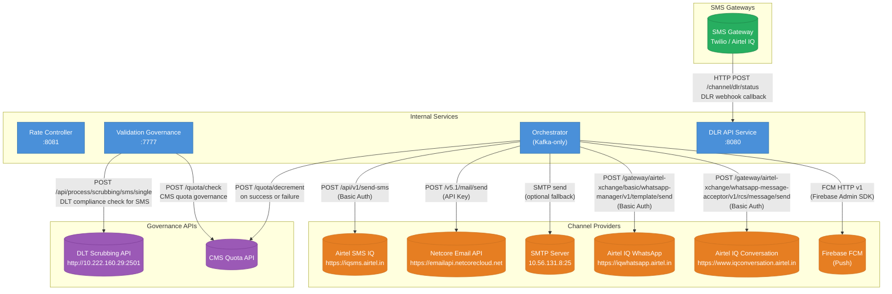

# REST API Call Graph

All synchronous HTTP calls between services and to external systems.

---

## Full REST Call Graph



---

## REST Endpoint Details

### Validation Governance → DLT (SMS only)

```
POST http://10.222.160.29:2501/api/process/scrubbing/sms/single
Content-Type: application/json
Authorization: Basic <dlt.username>:<dlt.password>

{
  "mobile": "9999999999",
  "templateId": "...",
  "entityId": "DLT_PEID_TEST",
  "tmid": "DLT_TMID_TEST"
}
```

### Orchestrator → Airtel SMS IQ

```
POST https://iqsms.airtel.in/api/v1/send-sms
Authorization: Basic <base64(username:password)>
Content-Type: application/json

{ "mobile": "...", "message": "...", ... }
```

### Orchestrator → Netcore Email API

```
POST https://emailapi.netcorecloud.net/v5.1/mail/send
api_key: <API_KEY>
Content-Type: application/json

{ "from": { "email": "..." }, "to": [...], "subject": "...", "content": [...] }
```

### Orchestrator → Airtel IQ WhatsApp

```
POST https://iqwhatsapp.airtel.in/gateway/airtel-xchange/basic/whatsapp-manager/v1/template/send
Authorization: Basic <base64(username:password)>
from: 918045003912
Content-Type: application/json
```

### Orchestrator → Airtel IQ Conversation (RCS)

```
POST https://www.iqconversation.airtel.in/gateway/airtel-xchange/whatsapp-message-acceptor/v1/rcs/message/send
Authorization: Basic <base64(username:password)>
customer-id: InternalDemo_Aishwarya
sub-account-id: <uuid>
agent-id: wynk_p9disahh_agent@rbm.goog
```

### DLR API Service — Incoming Webhook

```
POST /channel/dlr/status
Content-Type: application/json

{
  "requestId": "...",
  "mobile": "9999999999",
  "status": "DELIVERED",
  "deliveredAt": "...",
  "errorCode": null
}
Response: HTTP 200 OK (sync Kafka publish confirmed)
Response: HTTP 500 (Kafka publish failed)
```

### Health Check Endpoints (DLR API Service)

```
GET /actuator/health/liveness   → liveness probe
GET /actuator/health/readiness  → readiness probe
GET /actuator/health            → full health status
```

---

## No REST between Internal Services

The Rate Controller, Validation Governance, and Orchestrator communicate **exclusively via Kafka** — there are no synchronous REST calls between them.

The DLR Enricher and Aerospike Cache Loader also communicate only via Kafka and Aerospike — no REST.
