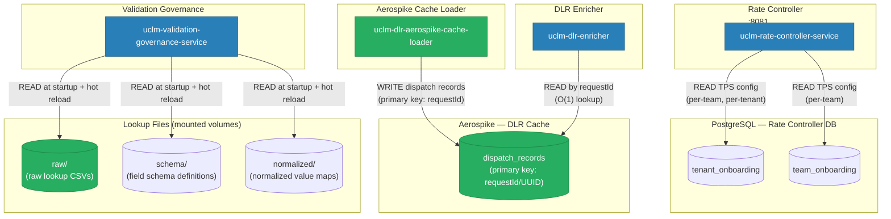

# Database & Cache Interaction Map

All databases, caches, and storage systems: their owner and which services read or write them.

---

## Data Store Ownership & Access

---

## PostgreSQL Schema (Rate Controller)

### `tenant_onboarding`

| Column | Type | Description |
|--------|------|-------------|
| `id` | BIGINT PK | Auto-generated ID |
| `tenant_id` | VARCHAR | Unique tenant identifier |
| `channel` | VARCHAR | Channel type (SMS, WA, EMAIL, PUSH, RCS) |
| `tps` | INT | Max TPS for this tenant+channel |
| `created_at` | TIMESTAMP | Record creation time |
| `updated_at` | TIMESTAMP | Last update time |

### `team_onboarding`

| Column | Type | Description |
|--------|------|-------------|
| `id` | BIGINT PK | Auto-generated ID |
| `team_id` | VARCHAR | Unique team identifier |
| `tenant_id` | VARCHAR | Parent tenant |
| `channel` | VARCHAR | Channel type |
| `tps` | INT | Max TPS for this team+channel |
| `created_at` | TIMESTAMP | Record creation time |

---

## Aerospike Schema (DLR Cache)

### Namespace / Set: `dispatch_records`

| Bin Name | Type | Description |
|----------|------|-------------|
| `requestId` | STRING (PK) | Primary key — message UUID from dispatch |
| `channel` | STRING | Channel type sent on |
| `mobile` | STRING | Target mobile number |
| `campaignId` | STRING | Campaign identifier |
| `templateId` | STRING | Template identifier |
| `sentAt` | LONG | Epoch timestamp of dispatch |
| `tenantId` | STRING | Tenant identifier |
| `teamId` | STRING | Team identifier |
| *(all other fields)* | ANY | All fields from the dispatch record are preserved including null/blank |

**Key characteristics:**
- Dynamic schema — all dispatch record fields stored as-is
- TTL configured per namespace (records expire after a configurable period)
- O(1) read by primary key (requestId)

---

## Lookup Files (Validation Governance)

| Folder | Content | Usage |
|--------|---------|-------|
| `lookups/raw/` | Raw provider-specific lookup CSVs | Input normalization per MOC/channel |
| `lookups/schema/` | Field schema definitions per channel | Validates required fields, types, lengths |
| `lookups/normalized/` | Normalized output value maps | Maps raw values to canonical form |

Files are loaded into memory at startup and the service **does not require a restart** to reload — hot reload is supported via configuration.

---

## Storage Summary Table

| Service | Data Store | Access Mode | What is stored |
|---------|-----------|-------------|----------------|
| Rate Controller | PostgreSQL | R (TPS config) | Tenant + team TPS limits per channel |
| Validation Governance | File System (lookup) | R at startup | Validation schemas, lookup tables |
| Orchestrator | None | — | Stateless, all config from properties |
| DLR API Service | None | — | Stateless, no persistence |
| Aerospike Cache Loader | Aerospike | W | Full dispatch records keyed by requestId |
| DLR Enricher | Aerospike | R | Lookup dispatch records for DLR correlation |
