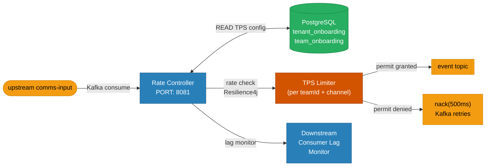
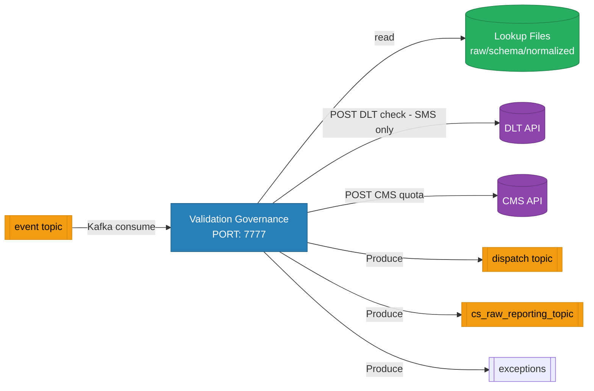
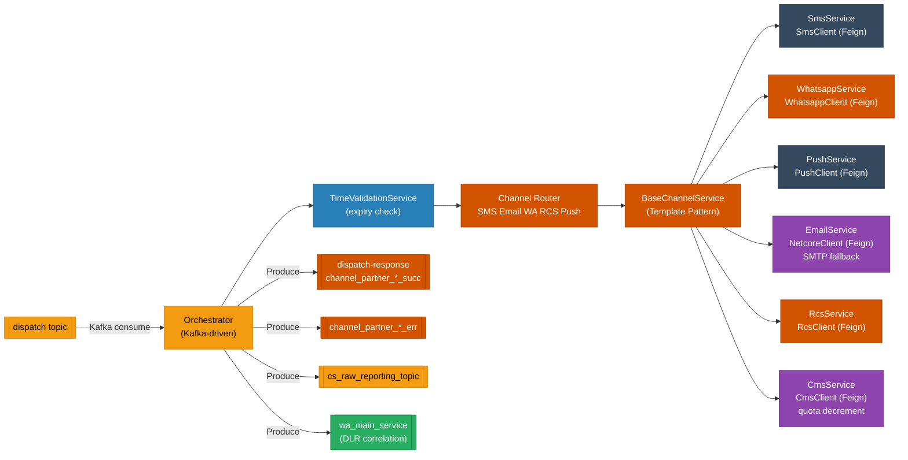
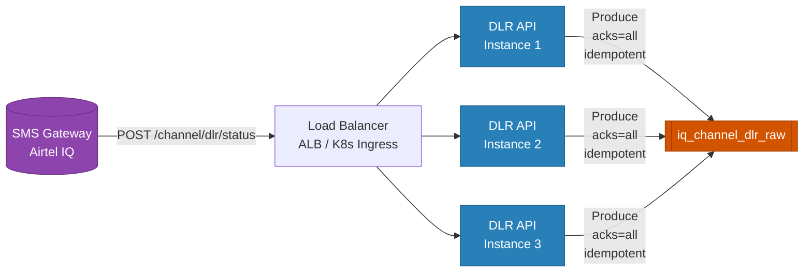
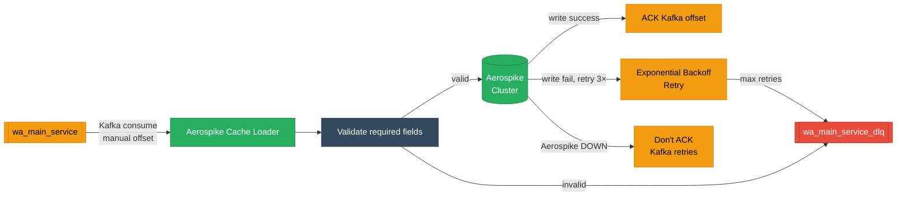
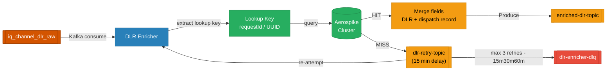

# Service Details — Per-Service Deep Dive

---

## 1. uclm-rate-controller-service

> **Role:** Per-team, per-channel TPS throttle gate. Bridges upstream UCLM output with the validation pipeline.

| Attribute | Value |
|-----------|-------|
| Port | `8081` |
| Framework | Spring Boot · Spring Kafka · Resilience4j RateLimiter · Spring Data JPA |
| Language | Java 17 |
| DB | PostgreSQL — owns `tenant_onboarding`, `team_onboarding` |
| Kafka | Consumes `comms-input` → Produces `event` |
| Global TPS | `channel.global.tps=2000` (configurable) |
| Team TPS | `tenant.channel.tps=5` (per team, loaded from DB) |
| Lag Threshold | `downstream.max.allowed.lag=10000` |
| Downstream Groups | `valgov-consumer-group`, `orch-consumer-group` |

**Key components:**
- `KafkaEventListener` — consumes events, calls throttle processor
- `ChannelThrottleProcessor` — acquires Resilience4j RateLimiter permit
- `TeamRateLimiterManager` — creates/caches per-team rate limiters
- `TpsCache` — in-memory cache of team TPS values (reloaded periodically)
- `KafkaConsumerLagMonitor` — pauses consumer if downstream lag is too high
- `CapacityIncreaseScheduler` — schedules periodic TPS increases for capacity candidates
- `RefreshTpsScheduler` — refreshes TPS config from DB at intervals

---

## 2. uclm-validation-governance-service

> **Role:** Multi-channel validation, DLT compliance, CMS governance, and payload construction.

| Attribute | Value |
|-----------|-------|
| Port | `7777` |
| Framework | Spring Boot 3.2.4 · Spring Kafka 4.x |
| Language | Java 21 |
| DB | None (lookup files from mounted volumes) |
| Kafka | Consumes `event` → Produces `dispatch`, `cs_raw_reporting_topic`, `exceptions`, `apb-exceptions` |
| Consumer Group | `event-consumer` |
| Publish Mode | `FULL_ONLY` (configurable) |
| Supported Channels | `SMS, EMAIL, WHATSAPP, PUSH_BANK, PUSH_THANKS, D2C, FS, RCS, PUSH` |
| Concurrency | `kafka.consumer.concurrency=4` |

**Key components:**
- Schema validation using lookup files (raw/schema/normalized folders)
- DLT scrubbing for all SMS messages (regulatory compliance)
- CMS quota check before constructing payload
- Language code normalization (supports 13 languages: ENG, HIN, MAR, TEL, GUJ, BEN, KAN, TAM, PUN, ODI, MAL, ASS, URD)
- Category validation: PROMOTIONAL, SERVICE_IMPLICIT, TRANSACTIONAL, SERVICE_EXPLICIT, SERVICE, PROMOTION
- Event type validation: NRT, SCHEDULE, ONETIME, EVENT, RECURRING

---

## 3. uclm-orchestrator-service

> **Role:** Multi-channel dispatch engine. Routes payloads to SMS, Email, WhatsApp, RCS, and Push providers.

| Attribute | Value |
|-----------|-------|
| Port | N/A (no REST controllers) |
| Framework | Spring Boot 3.3.4 · Spring Cloud OpenFeign · Spring Kafka 4.x |
| Language | Java 21 |
| DB | None |
| Kafka | Consumes `dispatch` → Produces response, error, analytics, and `wa_main_service` topics |
| Consumer Group | `dispatch-request-consumer-group` |
| Design Pattern | Template Method (BaseChannelService) |
| Provider Priority | SMS → Email → WhatsApp → RCS → Push |

**Failure Reasons (enum):**
| Code | Description |
|------|-------------|
| `TIME_VALIDATION_FAILED` | Message expiry timestamp in the past |
| `PROVIDER_FAILED` | Channel provider API returned error |
| `NO_CHANNEL_ENABLED` | No channel enabled in configuration |
| `INVALID_PAYLOAD` | Payload structure invalid |
| `CMS_DECREMENT_FAILED` | CMS quota decrement failed |
| `PARSE_ERROR` | Message could not be parsed |

---

## 4. uclm-dlr-api-service

> **Role:** Stateless webhook receiver for SMS Delivery Reports. Validates and publishes to Kafka.

| Attribute | Value |
|-----------|-------|
| Port | `8080` |
| Framework | Spring Boot 3.2.0 · Spring Kafka · Jackson |
| Language | Java 17 |
| DB | None |
| Kafka | Produces → `iq_channel_dlr_raw` |
| Reliability | `acks=all`, `enable.idempotence=true`, retries configured |
| Auth | Kerberos GSSAPI (UAT/Prod), plaintext (DEV) |

**Endpoints:**

| Method | Path | Description |
|--------|------|-------------|
| `POST` | `/channel/dlr/status` | Receive DLR webhook from SMS gateway |
| `GET` | `/actuator/health/liveness` | Kubernetes liveness probe |
| `GET` | `/actuator/health/readiness` | Kubernetes readiness probe |
| `GET` | `/actuator/health` | Full health status |

---

## 5. uclm-dlr-aerospike-cache-loader

> **Role:** Stores dispatched message records in Aerospike so DLR Enricher can correlate DLRs.

| Attribute | Value |
|-----------|-------|
| Port | N/A |
| Framework | Spring Boot 3.2.0 · Spring Kafka · Aerospike Client 7.1.0 · Spring Retry |
| Language | Java 17 |
| DB | Aerospike (write) |
| Kafka | Consumes `wa_main_service` → DLQ Producer `wa_main_service_dlq` |
| Retry | 3 attempts with exponential backoff |
| Auth | Kerberos GSSAPI (UAT/Prod) |
| Primary Key | Configurable (`dynamic.primary.key` property) |

---

## 6. uclm-dlr-enricher

> **Role:** Correlates raw DLRs with original dispatch records from Aerospike cache, produces enriched DLRs.

| Attribute | Value |
|-----------|-------|
| Port | N/A |
| Framework | Spring Boot 3.2.0 · Spring Kafka · Aerospike Client 7.1.0 · Resilience4j |
| Language | Java 17 |
| DB | Aerospike (read) |
| Kafka | Consumes `iq_channel_dlr_raw`, `dlr-retry-topic` → Produces `enriched-dlr-topic`, DLQ |
| Retry Schedule | 15 min → 30 min → 60 min (exponential backoff, max 3 attempts) |
| Resilience | Circuit Breaker on Aerospike, manual Kafka offset management |
| Auth | Kerberos GSSAPI (UAT/Prod) |

**Field Mapping Strategy:**
- All fields from the original dispatch record are merged into the DLR event
- Configurable overwrite strategy (DLR fields can overwrite or preserve dispatch fields)
- Null/blank fields in Aerospike record are preserved as-is
