# Bumblebee + Analytics Reporting — Full Services Architecture Diagram

> This diagram shows every service, every Kafka topic, and every produce/consume relationship across the **Bumblebee** pipeline and its connection to **`uclm-analytics-reporting-service`** (comms). Arrows always flow in the direction of data. Topic nodes sit between producer and consumer to make the relationship visually unambiguous.

---

## Full Services & Topic Flow

```mermaid
flowchart TD

    %% 
    %%  COMMS UPSTREAM — feeds Bumblebee
    %% 
    subgraph COMMS_UP["comms — Upstream Services"]
        TIME_VAL[" uclm-campaign-time-validation\n\nCampaignExecutionController\nPublishes validated campaign batches\nper channel to bumblebee input\nAlso publishes analytics events"]
        CM[" uclm-campaign-manager\n\nCampaignAnalyticsServiceImpl\nPublishes dimension metadata events"]
    end

    %% 
    %%  KAFKA TOPICS — BUMBLEBEE INPUT
    %% 
    T_COMMS[[" channel_partner_{channel}_nrt_svc_valgov\n aka  comms-input\n(rate-controller input — one topic per channel)"]]

    %% 
    %%  BUMBLEBEE — RATE CONTROLLER
    %% 
    subgraph RC_SVC[" uclm-rate-controller-service  :8081"]
        RC[" KafkaEventListener\n\nChannelThrottleProcessor\nTeamRateLimiterManager   Resilience4j\nKafkaConsumerLagMonitor\nRefreshTpsScheduler\nCapacityIncreaseScheduler"]
    end

    T_EVENT[[" event\n(val-gov input)"]]

    %% 
    %%  BUMBLEBEE — VALIDATION GOVERNANCE
    %% 
    subgraph VG_SVC[" uclm-validation-governance-service  :8080"]
        VG[" KafkaEventListener\n\nCommonValidationServiceImpl\nMocValidationFactory\nActionProcessor\n   DltActionService\n   CmsActionService  (increment)\n   AeroSpikeAdapter  (bounce / unsub / kill)\nRequestBuilderFactory\nDispatchMessageService"]
    end

    T_DISPATCH[[" dispatch\n(orchestrator input)"]]

    %% 
    %%  BUMBLEBEE — ORCHESTRATOR
    %% 
    subgraph ORCH_SVC[" uclm-orchestrator-service  :8080"]
        ORCH[" KafkaConsumer\n\nTimeValidationService\nCmsService  (decrement)\nSmsService      Airtel IQ SMS\nEmailService    Netcore / SMTP\nWhatsAppService Airtel IQ WA\nPushService     APB\nRcsService      Airtel IQ RCS\nResponseKafkaPublisher\nAnalyticsEventPublisher"]
    end

    T_WA_MAIN[[" wa_main_service\n(cache-loader input)"]]

    %% 
    %%  BUMBLEBEE — DLR API SERVICE
    %% 
    subgraph DLRAPI_SVC[" uclm-dlr-api-service  :8080"]
        DLRAPI[" DlrController\n\nPOST /wa/dlr/status\nKafkaPublisherService\nacks=all · idempotent"]
    end

    T_DLR_RAW[[" iq_channel_dlr_raw\n(enricher input)"]]

    %% 
    %%  BUMBLEBEE — AEROSPIKE CACHE LOADER
    %% 
    subgraph CACHE_SVC[" uclm-dlr-aerospike-cache-loader  :8080"]
        CACHE[" GenericDmlConsumer\n\nGenericDmlValidator\nAerospikeCacheService  (write, TTL 48h)\nDeadLetterQueueProducer"]
    end

    %% 
    %%  BUMBLEBEE — DLR ENRICHER
    %% 
    subgraph ENR_SVC[" uclm-dlr-enricher  :8080"]
        ENR[" GenericRawDlrConsumer\n\nAerospikeLookupService  (Aerospike join)\nGenericEnrichmentService\nGenericRetryScheduler\nAnalyticsEventPublisher\nKafkaPublisherService"]
    end

    %% 
    %%  KAFKA — ANALYTICS + RESPONSES
    %% 
    T_ANALYTICS[[" cs_raw_reporting_topic\n(produced by: Val-Gov · Orchestrator\n DLR Enricher · Time-Validation)"]]
    T_UCLM_ANA[[" uclm_analytics\n(dimension metadata events)"]]
    T_DIM_REFRESH[[" dimension_refresh_topic\n(produced by: Analytics Reporting)"]]
    T_CAMP_STATUS[[" uclm_campaign_status\n(produced by: Analytics Reporting)"]]
    T_SUCC[[" channel_partner_*_succ"]]
    T_ERR[[" channel_partner_*_err"]]
    T_EXC[[" exceptions"]]

    %% 
    %%  KAFKA — DLR PIPELINE TOPICS
    %% 
    T_DLR_ENR[[" comms_iq_sms_dlr_enriched\n(enricher output)"]]
    T_DLR_RETRY[[" comms_iq_sms_dlr_enriched_retrial\n(self-retry loop)"]]
    T_DLR_DLQ[[" comms_iq_sms_dlr_enriched_dlq"]]
    T_CACHE_DLQ[[" wa_main_service_dlq"]]

    %% 
    %%  COMMS — ANALYTICS REPORTING SERVICE
    %% 
    subgraph ANA_SVC[" uclm-analytics-reporting-service  :8080  [comms]"]
        ANA[" MetadataKafkaConsumer\n\nDimensionIngestionServiceImpl\nAnalyticsExecutionEngine   Druid SQL\nMetadataEnrichmentServiceImpl\nMetadataCacheServiceImpl  (Hazelcast)\nCacheWarmUp\nKafkaProducerServiceImpl\nFileServiceImpl  (Excel export)\nREST: /campaignOverview · /channelOverview\n      /metadata · /dimensions/{dim}"]
    end

    %% 
    %%  DATA STORES
    %% 
    subgraph STORES["Data Stores"]
        PG[(" PostgreSQL\ntenant_onboarding\nteam_onboarding")]
        AS_DB[(" Aerospike\narch/generic_dml · arch_prod/whatsapp_main\nbounce_data · unsubs_data · kill_campaign_data")]
        DRUID[(" Apache Druid\ntime-series metrics\ndatasource: a{tenantId}")]
        ORA_DB[(" Oracle / MySQL\ncampaign_master · dim_* tables\nHazelcast warm-up source")]
        HZ[(" Hazelcast\nanalytics-metadata-cluster\nID  name dim maps")]
    end

    %% 
    %%  EXTERNAL APIs
    %% 
    subgraph EXT["External APIs"]
        PROVIDERS[" Channel Providers\nAirtel IQ SMS · Netcore Email\nAirtel IQ WA · APB Push · IQ RCS"]
        DLT_API[" DLT Scrubbing API"]
        CMS_API[" CMS API\n/counter/increment · /counter/decrement"]
        AUTH_MGR[" Auth Manager\nGET /tenant/config/{tenantId}\n(timezone lookup)"]
        UI[" UI / Dashboard\n(calls analytics REST API)"]
    end

    %% 
    %%  FLOW A — OUTBOUND MESSAGE PIPELINE
    %% 
    TIME_VAL            -->|"produce (per channel)"| T_COMMS
    TIME_VAL            -->|"produce analytics event"| T_ANALYTICS
    T_COMMS             -->|"consume"| RC
    RC                  <-->|"R/W TPS config"| PG
    RC                  -->|"produce"| T_EVENT
    T_EVENT             -->|"consume"| VG
    VG                  -->|"DLT check (SMS)"| DLT_API
    VG                  -->|"CMS increment"| CMS_API
    VG                  <-->|"bounce/unsub/kill check"| AS_DB
    VG                  -->|"produce"| T_DISPATCH
    VG                  -->|"produce"| T_ANALYTICS
    VG                  -->|"produce on error"| T_EXC
    T_DISPATCH          -->|"consume"| ORCH
    ORCH                -->|"CMS decrement"| CMS_API
    ORCH                -->|"send message"| PROVIDERS
    ORCH                -->|"produce"| T_SUCC
    ORCH                -->|"produce"| T_ERR
    ORCH                -->|"produce"| T_ANALYTICS
    ORCH                -->|"produce (outbound record for DLR join)"| T_WA_MAIN

    %% 
    %%  FLOW B — AEROSPIKE CACHE POPULATION
    %% 
    T_WA_MAIN           -->|"consume"| CACHE
    CACHE               -->|"write record (TTL 48h)"| AS_DB
    CACHE               -->|"produce on error"| T_CACHE_DLQ

    %% 
    %%  FLOW C — DLR / CALLBACK PIPELINE
    %% 
    PROVIDERS           -->|"DLR webhook POST /wa/dlr/status"| DLRAPI
    DLRAPI              -->|"produce"| T_DLR_RAW
    T_DLR_RAW           -->|"consume"| ENR
    ENR                 -->|"Aerospike join (by endpoint_request_id)"| AS_DB
    ENR                 -->|"produce — cache HIT"| T_DLR_ENR
    ENR                 -->|"produce — cache MISS"| T_DLR_RETRY
    T_DLR_RETRY         -->|"consume (retry after delay)"| ENR
    ENR                 -->|"produce — non-retriable error"| T_DLR_DLQ
    ENR                 -->|"produce"| T_ANALYTICS

    %% 
    %%  FLOW D — ANALYTICS REPORTING (COMMS  BUMBLEBEE LINK)
    %% 
    T_ANALYTICS         -->|"consume (Druid ingestion pipeline)"| DRUID
    T_DLR_ENR           -->|"consume (downstream analytics)"| DRUID

    CM                  -->|"produce dimension metadata"| T_UCLM_ANA
    T_UCLM_ANA          -->|"consume"| ANA
    ANA                 -->|"upsert dim tables + refresh Hazelcast"| ORA_DB
    ANA                 -->|"warm-up + refresh"| HZ
    ANA                 -->|"SQL query POST /druid/v2/sql"| DRUID
    ANA                 -->|"produce (after dim upsert)"| T_DIM_REFRESH
    ANA                 -->|"produce (campaign status change)"| T_CAMP_STATUS
    ANA                 -->|"GET /tenant/config/{tenantId}"| AUTH_MGR
    UI                  -->|"POST /campaignOverview\nPOST /channelOverview/*\nPOST /metadata"| ANA

    %% 
    %%  STYLES
    %% 
    classDef bumblebee  fill:#1a6ba0,color:#fff,stroke:#0d4e7a
    classDef comms_svc  fill:#6c3483,color:#fff,stroke:#4a235a
    classDef comms_up   fill:#5d6d7e,color:#fff,stroke:#34495e
    classDef topic      fill:#e67e00,color:#fff,stroke:#b35e00
    classDef dlq        fill:#c0392b,color:#fff,stroke:#922b21
    classDef db         fill:#1e8449,color:#fff,stroke:#145a32
    classDef ext        fill:#7f8c8d,color:#fff,stroke:#566573
    classDef ui         fill:#2980b9,color:#fff,stroke:#1a5276

    class RC,VG,ORCH,DLRAPI,CACHE,ENR bumblebee
    class ANA comms_svc
    class TIME_VAL,CM comms_up
    class T_COMMS,T_EVENT,T_DISPATCH,T_WA_MAIN,T_DLR_RAW,T_DLR_ENR,T_DLR_RETRY topic
    class T_ANALYTICS,T_UCLM_ANA,T_DIM_REFRESH,T_CAMP_STATUS,T_SUCC,T_ERR,T_EXC topic
    class T_DLR_DLQ,T_CACHE_DLQ dlq
    class PG,AS_DB,DRUID,ORA_DB,HZ db
    class PROVIDERS,DLT_API,CMS_API,AUTH_MGR ext
    class UI ui
    classDef kafka fill:#f39c12,color:#000,stroke:#d68910
    classDef svc fill:#2980b9,color:#fff,stroke:#1f618d
    classDef af fill:#1abc9c,color:#000,stroke:#148f77
    classDef channel fill:#d35400,color:#fff,stroke:#a04000
    classDef user fill:#34495e,color:#fff,stroke:#2c3e50
    classDef stop fill:#e74c3c,color:#fff,stroke:#c0392b
```

---

## Colour Legend

| Colour | Meaning |
|--------|---------|
| 🔵 Dark blue | Bumblebee microservices |
| 🟣 Purple | comms — Analytics Reporting Service |
| ⬛ Grey | comms — Upstream services (feed into Bumblebee) |
| 🟠 Orange | Kafka topics (normal flow) |
| 🔴 Red | Kafka DLQ topics (error / dead-letter) |
| 🟢 Green | Data stores (Aerospike, PostgreSQL, Druid, Oracle/MySQL, Hazelcast) |

---

## Produce / Consume Quick Reference

| Topic | Producer(s) | Consumer(s) | Purpose |
|-------|------------|-------------|---------|
| `channel_partner_{ch}_nrt_svc_valgov` | uclm-campaign-time-validation | Rate Controller | Per-channel validated campaign batch |
| `event` | Rate Controller | Validation Governance | Rate-limited events ready for validation |
| `dispatch` | Validation Governance | Orchestrator | Validated + governed payloads |
| `wa_main_service` | Orchestrator | Aerospike Cache Loader | Outbound record cached for DLR correlation |
| `iq_channel_dlr_raw` | DLR API Service | DLR Enricher | Raw DLR webhook from channel provider |
| `comms_iq_sms_dlr_enriched` | DLR Enricher | Analytics Downstream / Druid | Fully enriched DLR record |
| `comms_iq_sms_dlr_enriched_retrial` | DLR Enricher | DLR Enricher *(self)* | Retry after Aerospike cache miss |
| `cs_raw_reporting_topic` | Val-Gov · Orchestrator · DLR Enricher · Time-Validation | **Druid ingestion pipeline** | All runtime analytics events → Druid |
| `uclm_analytics` | uclm-campaign-manager | **Analytics Reporting Service** | Dimension metadata (campaign, channel, template…) |
| `dimension_refresh_topic` | Analytics Reporting Service | Campaign Manager / downstream | Signals that a dimension table was updated |
| `uclm_campaign_status` | Analytics Reporting Service | Campaign Manager / downstream | Campaign status change notification |
| `channel_partner_*_succ` | Orchestrator | Upstream / Reporting | Provider delivery success ack |
| `channel_partner_*_err` | Orchestrator | Monitoring / Alerting | Provider delivery failure |
| `exceptions` | Validation Governance | Monitoring | Validation / governance errors |
| `wa_main_service_dlq` | Aerospike Cache Loader | Manual Recovery | Failed Aerospike writes |
| `comms_iq_sms_dlr_enriched_dlq` | DLR Enricher | Manual Recovery | Permanently failed DLR enrichments |

---

## Cross-System Link: Bumblebee ↔ Analytics Reporting

| What | How |
|------|-----|
| **Runtime events → Druid** | Val-Gov, Orchestrator, DLR Enricher, Time-Validation all publish to `cs_raw_reporting_topic` → Druid ingestion pipeline → Apache Druid |
| **Analytics queries** | `uclm-analytics-reporting-service` queries Apache Druid via REST (`POST /druid/v2/sql`) to serve `campaignOverview`, `channelOverview`, `campaignDetailView` API responses to the UI |
| **Dimension metadata** | `uclm-campaign-manager` publishes dimension change events to `uclm_analytics` → consumed by Analytics Reporting → upserted into Oracle/MySQL dim tables + refreshed in Hazelcast |
| **Status propagation** | Analytics Reporting publishes `uclm_campaign_status` and `dimension_refresh_topic` after processing dimension events |

---

## Service Dependency Summary

| Service | Repo | Consumes | Produces | External Calls |
|---------|------|----------|----------|----------------|
| **Rate Controller** | bumblebee | `comms-input` | `event` | PostgreSQL |
| **Validation Governance** | bumblebee | `event` | `dispatch` · `cs_raw_reporting_topic` · `exceptions` | DLT API · CMS (++) · Aerospike |
| **Orchestrator** | bumblebee | `dispatch` | `wa_main_service` · `*_succ/err` · `cs_raw_reporting_topic` | SMS/Email/WA/Push/RCS · CMS (--) |
| **DLR API Service** | bumblebee | *(HTTP inbound)* | `iq_channel_dlr_raw` | Channel provider webhooks |
| **Aerospike Cache Loader** | bumblebee | `wa_main_service` | `wa_main_service_dlq` | Aerospike (write) |
| **DLR Enricher** | bumblebee | `iq_channel_dlr_raw` · `retrial` | `enriched` · `retrial` · `dlq` · `cs_raw_reporting_topic` | Aerospike (read) |
| **Analytics Reporting** | comms | `uclm_analytics` | `dimension_refresh_topic` · `uclm_campaign_status` | Druid · Oracle/MySQL · Hazelcast · Auth Manager |
