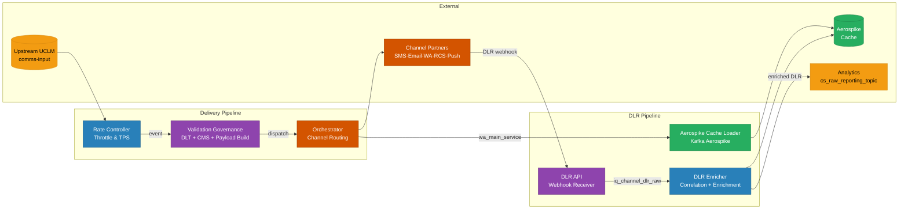

# Bummlebee Platform — High-Level Design (HLD)

> Generated from full source-code analysis of all 6 microservices  
> Stack: Java 17/21 · Spring Boot 3.x · Kafka · PostgreSQL · Aerospike · Kubernetes

---

## Files in This Folder

### System-Level HLD
| File | Description |
|------|-------------|
| `00-services-overview.md` | All 6 services at a glance with roles and tech |
| `01-end-to-end-flow.md` | Full integration flow — delivery pipeline + DLR pipeline |
| `02-kafka-flows.md` | Kafka topic producers, consumers, and message flows |
| `03-state-machine.md` | DLR enrichment state machine |
| `04-rest-api-calls.md` | Synchronous HTTP/REST call graph |
| `05-database-map.md` | DB / cache ownership and access per service |
| `06-service-details.md` | Per-service summary (ports, env vars, endpoints) |
| `07-deployment-guide.md` | Docker, Kubernetes, and Helm deployment guide |

### Per-Service Detailed HLD
| File | Service |
|------|---------|
| `hld-01-rate-controller.md` | uclm-rate-controller-service — TPS throttle, lag monitor, capacity guard |
| `hld-02-validation-governance.md` | uclm-validation-governance-service — validation pipeline, DLT, CMS, payload build |
| `hld-03-orchestrator.md` | uclm-orchestrator-service — channel routing, Feign clients, CMS quota, analytics |
| `hld-04-dlr-api-service.md` | uclm-dlr-api-service — webhook receiver, Kafka producer, error handling |
| `hld-05-aerospike-cache-loader.md` | uclm-dlr-aerospike-cache-loader — Kafka→Aerospike, retry, DLQ |
| `hld-06-dlr-enricher.md` | uclm-dlr-enricher — DLR correlation, enrichment, retry scheduler, circuit breaker |

---

## System Overview

The **Bummlebee** platform is the **multi-channel message delivery and DLR tracking layer** of the UCLM ecosystem. It receives enriched, validated events from the upstream UCLM comms pipeline, applies **rate limiting**, runs **validation & governance** checks, dispatches messages to **external channel providers** (SMS · Email · WhatsApp · RCS · Push), and tracks **Delivery Reports (DLRs)** back.

### 6 Services at a Glance

---

## Tech Stack

| Layer | Technology |
|-------|-----------|
| Language | Java 17 (DLR services) · Java 21 (Orchestrator, Validation) |
| Frameworks | Spring Boot 3.2.x / 3.3.x |
| Messaging | Apache Kafka (Kerberos/SASL_PLAINTEXT in UAT/Prod) |
| Database | PostgreSQL (Rate Controller) · Aerospike 7.1.0 (DLR cache) |
| ORM | Spring Data JPA |
| HTTP Clients | Spring Cloud OpenFeign · RestTemplate |
| Resilience | Resilience4j (Circuit Breaker · Retry · Rate Limiter) |
| Container | Docker · Kubernetes (OCP) · Helm |
| Security | Kerberos GSSAPI for Kafka in UAT/Prod |
