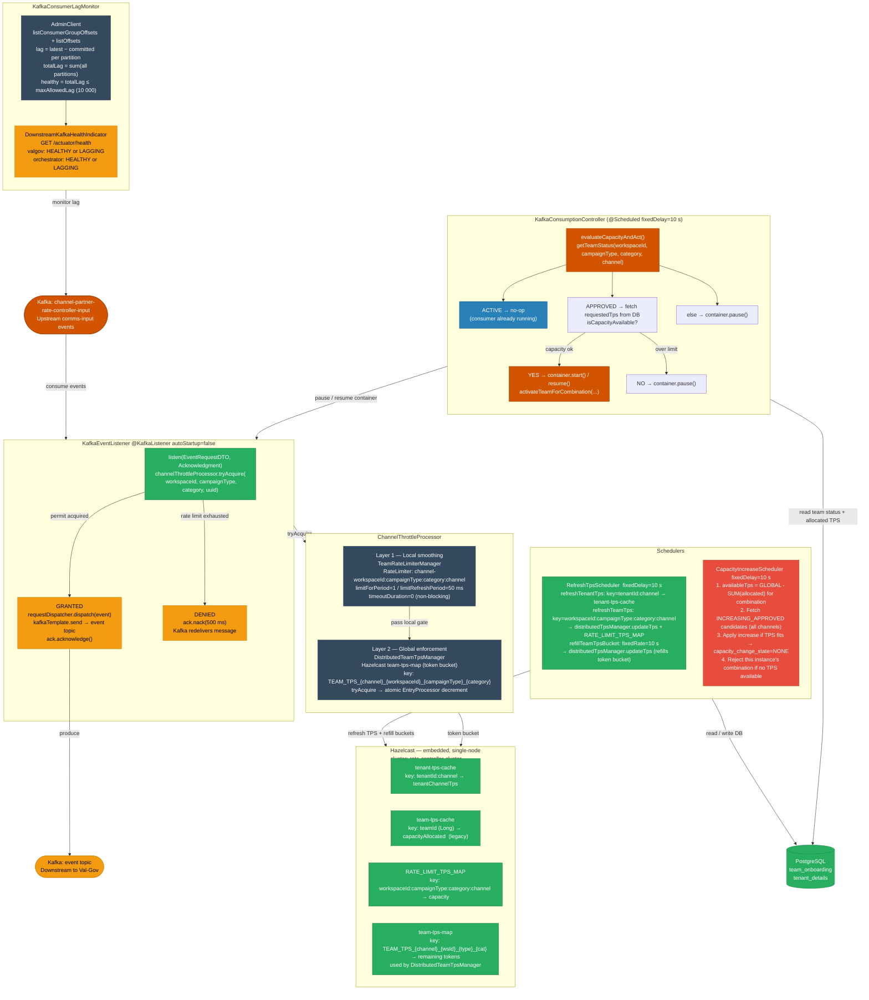
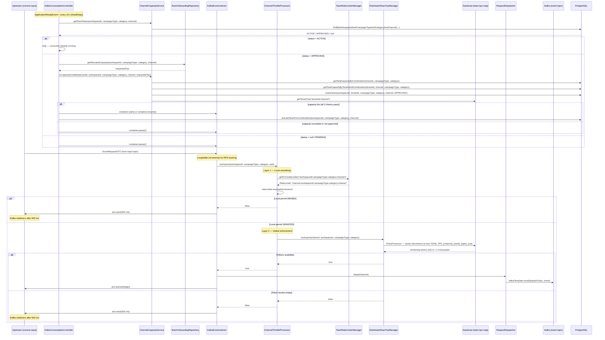

# HLD — uclm-rate-controller-service

**Role:** Per-team, per-channel, per-campaign-type, per-category TPS throttle gate between upstream UCLM output and the validation pipeline.

---

## 1. Purpose & Responsibilities

| Responsibility | Detail |
|---------------|--------|
| **Two-Layer Rate Limiting** | Enforces TPS per `(workspaceId, campaignType, category, channel)` combination using: (1) a local Resilience4j RateLimiter as a smoothing gate (1 permit per 50 ms), and (2) a distributed Hazelcast token-bucket (`DistributedTeamTpsManager`) as the global TPS enforcer |
| **Capacity Guard** | On startup (`ApplicationReadyEvent`) and every 10 s, checks the team/combination status in DB; only starts/resumes the Kafka consumer if the combination is `APPROVED` and the requested TPS fits within the global channel budget and the tenant's budget |
| **Backpressure** | `checkDownstreamHealthAndControlConsumption()` can pause Kafka if downstream lag exceeds threshold; **currently commented out** of `periodicCheck()` — available for manual re-activation |
| **TPS Auto-Scaling** | Every 10 s, `CapacityIncreaseScheduler` applies approved TPS increase requests sequentially from DB for the configured `(channel, campaignType, category)` combination |
| **TPS Refresh** | Every 10 s (`fixedDelay`), `RefreshTpsScheduler` syncs tenant and team TPS from PostgreSQL into Hazelcast; also **refills distributed token buckets** every 10 s (`fixedRate`) |
| **Incoming RPS Logging** | Every 1 s, `KafkaEventListener` logs incoming message rate; `DistributedTeamTpsManager` logs allowed/rejected counts |
| **Health Exposure** | `DownstreamKafkaHealthIndicator` exposes downstream lag status via Spring Boot Actuator `/actuator/health` |

---

## 2. High-Level Architecture



---

## 3. Detailed Processing Flow



---

## 4. Capacity Guard Logic

`evaluateCapacityAndAct()` runs on startup (`ApplicationReadyEvent`) and every 10 s (`fixedDelay`).
The Kafka listener container is always looked up by the hardcoded ID `"channel-tenant-throttle-listener"`.

```
getTeamStatus(workspaceId, campaignType, category, channel)
│
├── ACTIVE  → no-op (consumer already running)
│
├── APPROVED
│    │
│    ├── requestedTps = getAllocatedCapacity(workspaceId, campaignType, category, channel)
│    │
│    └── isCapacityAvailable(tenantId, workspaceId, campaignType, category, channel, requestedTps)?
│               │
│               ├── Check 1: SUM(capacity_allocated) for (channel, campaignType, category) where status=ACTIVE
│               │            + requestedTps  ≤  channel.global.tps
│               │
│               ├── Check 2: SUM(capacity_allocated) for (tenantId, channel, campaignType, category) where status=ACTIVE
│               │            + requestedTps  ≤  getTenantTps("tenantId:channel")  [from Hazelcast]
│               │
│               ├── Check 3: existsTeam(workspaceId, tenantId, campaignType, category, channel, APPROVED) == true
│               │
│               ├── ALL PASS → container.start() or container.resume()
│               │              activateTeamForCombination(workspaceId, campaignType, category, channel)
│               │              [sets status → ACTIVE]
│               └── ANY FAIL → container.pause()
│
└── else (null / PENDING) → container.pause()
```

---

## 5. TPS Refresh & Token Bucket Refill

`RefreshTpsSchedulerImpl` has **two separate scheduled methods** for the single configured `team.id` / `tenant.id` / `campaign.type` / `category` of this instance.

### 5a. `refreshTps()` — `fixedDelay = 10 s`

```
refreshTenantTps():
  SELECT tenant_id, tenant_channel_tps
  FROM tenant_details
  WHERE tenant_id=? AND channel=? AND status='ACTIVE'

  key = tenantId + ":" + channel
  if cachedTps != dbTps:
    cacheService.updateTenantTps(key, dbTps)   → tenant-tps-cache


refreshTeamTps():
  SELECT workspace_id, campaign_type, category, channel, capacity_allocated
  FROM team_onboarding
  WHERE workspace_id=? AND tenant_id=? AND status='ACTIVE'
  -- returns List<RateLimitConfigView> (one row per active combination)

  for each config:
    key = workspaceId + ":" + campaignType + ":" + category + ":" + channel
    if cachedTps != dbTps:
      distributedTpsManager.updateTps(channel, workspaceId, campaignType, category, dbTps)
        → puts dbTps into team-tps-map (resets distributed token bucket)
      cacheService.updateTeamRateLimitTps(key, dbTps)
        → puts dbTps into RATE_LIMIT_TPS_MAP (stores current capacity value)
```

### 5b. `refillTeamTpsBucket()` — `fixedRate = 10 s`

```
  Same query as refreshTeamTps (getActiveRateLimitConfigs)

  for each config:
    key = workspaceId:campaignType:category:channel
    capacity = cacheService.getTeamRateLimitTps(key)   ← from RATE_LIMIT_TPS_MAP
    if capacity <= 0: skip (warn and continue)
    distributedTpsManager.updateTps(channel, workspaceId, campaignType, category, capacity)
      → resets token bucket to full capacity every 10 s
```

> **Important:** `RATE_LIMIT_TPS_MAP` stores the *maximum capacity* (from DB) while `team-tps-map` stores the *remaining token count* that is atomically decremented on each message.

---

## 6. Capacity Increase Scheduler (every 10 s)

`CapacityIncreaseSchedulerImpl.processApprovedCapacityIncreases()`:

```
1. globalAllocated = SUM(capacity_allocated)
                     FROM team_onboarding
                     WHERE channel=? AND campaign_type=? AND category=? AND status='ACTIVE'
   availableTps = channel.global.tps − globalAllocated

2. if availableTps <= 0:
     rejectCapacityIncreaseRequest(teamId, campaignType, category, channel)
       → capacity_change_state = 'REJECTED'
     return

3. candidates = SELECT workspace_id AS teamId, capacity_allocated, requested_capacity
                FROM team_onboarding
                WHERE status='ACTIVE'
                  AND requested_capacity > 0
                  AND capacity_change_state IN ('INCREASING_APPROVED', 'REJECTED')
                  AND channel=?
                ORDER BY updated_at ASC
                FOR UPDATE

4. for each candidate (sequential, order matters):
     if candidate.requestedCapacity <= availableTps:
       UPDATE team_onboarding
       SET capacity_allocated = capacity_allocated + requested_capacity,
           requested_capacity = 0,
           capacity_change_state = 'NONE'
       WHERE workspace_id = candidate.teamId
         AND capacity_change_state IN ('INCREASING_APPROVED', 'REJECTED')
       availableTps -= candidate.requestedCapacity
     else:
       rejectCapacityIncreaseRequest(thisInstance.teamId, campaignType, category, channel)
       break
```

---

## 7. Downstream Lag Monitoring

```
KafkaConsumerLagMonitor.fetchLag(groupId):
  1. AdminClient.listConsumerGroupOffsets(groupId)  → committed offsets per partition
  2. AdminClient.listOffsets(OffsetSpec.latest())   → latest offset per partition
  3. lag(partition) = max(latest − committed, 0)
  4. totalLag = sum(all partitions)
  5. healthy = totalLag <= maxAllowedLag  [${downstream.max.allowed.lag}, default 10 000]

Groups monitored:
  - ${downstream.valgov.consumer-group}   (Validation Governance)
  - ${downstream.orch.consumer-group}     (Orchestrator)

Exposed via Actuator:
  GET /actuator/health →
    UP:   { "valgov": "HEALTHY", "orchestrator": "HEALTHY" }
    DOWN: { "valgov": "LAGGING", "orchestrator": "HEALTHY" }  (example)

Note: checkDownstreamHealthAndControlConsumption() (pause/resume based on lag)
      is implemented in KafkaConsumptionController but is currently commented
      out of periodicCheck(). Re-enable by uncommenting one line there.
```

---

## 8. Data Models

### EventRequestDTO (consumed from input topic)

| Field | Type | Description |
|-------|------|-------------|
| `uuid` | String | Unique message ID |
| `moc` | String | Mode of Communication: SMS / EMAIL / WHATSAPP / PUSH / RCS |
| `si_id` | String | Subscriber identity (mobile number) |
| `email_id` | String | Email address (for EMAIL channel) |
| `campaign_group` | String | Campaign group identifier |
| `campaign_name` | String | Campaign name |
| `campaign_type` | String | Campaign type — **used as throttle key dimension** |
| `category` | String | Message category (e.g. SERVICE, PROMOTIONAL) — **used as throttle key dimension** |
| `event_type` | String | NRT / SCHEDULE / ONETIME / EVENT / RECURRING |
| `tenant_id` | String | Tenant identifier |
| `workspace_id` | String | Team (workspace) identifier — **used as throttle key dimension** |
| `script_body` | String | Message content |
| `script_sub` | String | Message subject (for email) |
| `dlt_id` | String | DLT template ID (SMS compliance) |
| `expire_timestamp` | String | Message expiry |
| `start_timestamp` | String | Scheduled start time |
| `source_timestamp` | String | When the event was created upstream |
| `dynmc_prm` | List | Dynamic parameters for template personalisation |
| `dynmc_prm_sub` | List | Dynamic parameters for subject line |
| `additional_fields` | List | Extra key-value pairs |
| `mediaAttachment` | List | Media attachments (mediaUrl, mimeType, uploadedFileName, extension) |
| `cmsRequired` | boolean | Whether CMS quota decrement is needed |
| `frequency_capping` | String | Frequency capping config |
| `lob` | String | Line of business |
| `circle_id` | String | Telecom circle identifier |
| `src_sys_nm` | String | Source system name |
| `msg_typ_cd` | String | Message type code |
| `msg_lng_cd` | String | Message language code |
| `sender_id` | String | Sender ID |
| `reply_to` | String | Reply-to address |
| `customer_type` | String | Customer type / sub-goal |
| `cohort` | String | Cohort identifier |
| `use_bundleid` | String | Bundle ID flag |
| `remove_unsubs_link` | String | Unsubscribe link removal flag |
| `doc_type` | String | Document type |
| `media_id` | String | Media ID |
| `suffix` | List\<String\> | Suffix list |
| `timestamps_for_dashboard` | String | Dashboard timestamp payload |
| `payload` | Object | Generic payload object |
| `lobbyUrl` | String | Lobby URL |
| `template_notification_sticky` | String | Sticky notification flag |
| `template_expire_after` | String | Template expiry config |
| `template_remove_after` | String | Template removal config |

### team_onboarding (PostgreSQL)

> **Schema change:** `workspace_id` is no longer the primary key. There is a surrogate auto-generated `id` column. The unique constraint is now on `(workspace_id, campaign_type, category, channel)`.

| Column | Type | Description |
|--------|------|-------------|
| `id` | BIGINT PK (auto) | Surrogate primary key |
| `workspace_id` | BIGINT | Team identifier (used as `workspaceId` throughout) |
| `tenant_id` | BIGINT FK | Parent tenant → `tenant_details.id` |
| `team_name` | VARCHAR | Human-readable team name |
| `campaign_type` | VARCHAR | Campaign type dimension (e.g. NRT, SCHEDULED) — **part of unique key** |
| `category` | VARCHAR | Category dimension (e.g. SERVICE, PROMOTIONAL) — **part of unique key** |
| `channel` | VARCHAR | WHATSAPP / SMS / RCS / EMAIL / PUSH — **part of unique key** |
| `capacity_allocated` | INT | Currently allocated TPS for this combination |
| `requested_capacity` | INT | TPS increase requested (pending approval) |
| `capacity_change_state` | VARCHAR | `NONE` / `INCREASING_APPROVED` / `REJECTED` |
| `status` | VARCHAR | `ACTIVE` / `APPROVED` / `PENDING` |
| `environment` | VARCHAR | PROD / UAT |
| `priority` | INT | Allocation priority for capacity increase ordering |
| `provider` | VARCHAR | Channel provider name |
| `input_kafka_topic` | VARCHAR | Kafka input topic for this combination |
| `activated_at` | VARCHAR | Timestamp when status was last set to ACTIVE |
| `created_at` / `updated_at` | TIMESTAMP | Audit timestamps |
| `created_by` / `updated_by` | VARCHAR | Audit user fields |

### tenant_details (PostgreSQL)

> **Schema change:** `tenant_id` is no longer the primary key. There is a surrogate `id` column. A `channel` column has been added, enabling per-tenant, per-channel TPS limits.

| Column | Type | Description |
|--------|------|-------------|
| `id` | BIGINT PK (auto) | Surrogate primary key |
| `tenant_id` | BIGINT | Tenant business identifier |
| `channel` | VARCHAR | Channel this row applies to (e.g. WHATSAPP, SMS) |
| `tenant_name` | VARCHAR | Tenant name |
| `status` | VARCHAR | `ACTIVE` / `SUSPENDED` |
| `tenant_channel_tps` | BIGINT | Max total TPS allowed for this tenant on this channel |
| `created_at` / `updated_at` | TIMESTAMP | Audit timestamps |

---

## 9. Component Map

| Class | Responsibility |
|-------|---------------|
| `KafkaEventListener` | Kafka consumer entry point (`autoStartup=false`); calls two-layer throttle processor; acks or nacks; logs incoming RPS every 1 s |
| `ChannelThrottleProcessor` | Orchestrates two-layer throttle: (1) local Resilience4j RateLimiter, (2) distributed Hazelcast token bucket |
| `TeamRateLimiterManager` | Creates/caches Resilience4j RateLimiter per combination key (`{channel}-{workspaceId}:{campaignType}:{category}:{channel}`); `limitForPeriod=1`, `limitRefreshPeriod=50 ms` — acts as local traffic smoother only |
| `DistributedTeamTpsManager` | Hazelcast `team-tps-map` token-bucket enforcer; `tryAcquire` does atomic `EntryProcessor` decrement; `updateTps` resets bucket; logs allowed/rejected RPS every 1 s |
| `TpsCacheImpl` | Hazelcast `IMap` wrapper for three maps: `tenant-tps-cache` (tenant capacity), `team-tps-cache` (legacy team capacity), `RATE_LIMIT_TPS_MAP` (current allocated capacity per combination) |
| `HazelCastConfig` | Configures embedded Hazelcast cluster (`rate-controller-cluster`); multicast, TCP-IP, and auto-detection all disabled (single-node) |
| `KafkaConsumptionController` | Startup + periodic (10 s) capacity evaluation; pauses/resumes consumer container `"channel-tenant-throttle-listener"` |
| `ChannelCapacityServiceImpl` | Three-condition capacity check (global TPS, tenant TPS, team approval) against PostgreSQL + Hazelcast |
| `KafkaConsumerLagMonitor` | Reads consumer group lag via Kafka `AdminClient`; fail-safe returns false (unhealthy) on exception |
| `DownstreamKafkaHealthIndicator` | Spring Boot Actuator `HealthIndicator`; returns `Health.down()` with lag details when either downstream is unhealthy |
| `RequestDispatcherImpl` | Publishes `EventRequestDTO` to `${kafka.dispatch.topic}` via `KafkaTemplate` |
| `RefreshTpsSchedulerImpl` | Every 10 s: syncs tenant + team TPS from DB into Hazelcast caches and resets distributed token buckets |
| `CapacityIncreaseSchedulerImpl` | Every 10 s: applies approved TPS increase requests from DB for configured combination |
| `TeamOnboardingRepository` | All queries against `team_onboarding` table (combination-scoped) |
| `TenantOnboardingRepository` | Queries against `tenant_details` table (tenant + channel scoped) |
| `RateLimiterConfig` | Registers Resilience4j `RateLimiterRegistry` |
| `KafkaConsumerConfiguration` | Kafka consumer factory, deserialiser, listener container factory |
| `KafkaProducerConfiguration` | Kafka producer factory and `KafkaTemplate` |
| `KafkaSecurityConfig` | Kerberos JAAS configuration for UAT/Prod |
| `EventRequestDTODeserializer` | Custom Kafka deserialiser for `EventRequestDTO` |

---

## 10. Configuration Reference

| Property | Local value | Dev value | Description |
|----------|-------------|-----------|-------------|
| `server.port` | `8081` | `8081` | HTTP port |
| `input.kafka.topic` | `comms-input` | `channel-partner-rate-controller-input` | Input topic (used by `@KafkaListener`) |
| `kafka.dispatch.topic` | `event` | `event` | Output topic (→ Validation Governance) |
| `kafka.consumer.group-id` | `channel-tenant-throttle-listener` | `channel-partner-rate-controller-svc` | Kafka consumer group ID; **note:** listener container is always looked up by the hardcoded ID `"channel-tenant-throttle-listener"` in `KafkaConsumptionController` |
| `kafka.topic.exception` | `exceptions` | `exceptions` | Exception topic |
| `channel.name` | `SMS` | `WHATSAPP` | Channel this instance handles |
| `campaign.type` | `NRT` | `NRT` | Campaign type this instance handles |
| `category` | `SERVICE` | `SERVICE` | Message category this instance handles |
| `channel.global.tps` | `20000` | `2000` | Global max TPS for the channel/combination |
| `tenant.id` | `1001` | `1` | Tenant ID this instance is configured for |
| `team.id` | `2001` | `1` | Team (workspace) ID this instance is configured for |
| `downstream.valgov.consumer-group` | `valgov-consumer-group` | `valgov-consumer-group` | Lag-check group for Validation Governance |
| `downstream.orch.consumer-group` | `orch-consumer-group` | `orch-consumer-group` | Lag-check group for Orchestrator |
| `downstream.max.allowed.lag` | `10000` | `10000` | Max consumer lag before downstream is marked unhealthy |
| `spring.kafka.bootstrap-servers` | `localhost:9092` | `10.92.36.44:9092,...` | Kafka brokers |

---

## 11. Throttle Key Design

Every throttling decision is scoped to a **4-dimensional combination key**:

```
workspaceId : campaignType : category : channel
```

This key is used consistently across:
- `ChannelThrottleProcessor` (Resilience4j limiter name + distributed token bucket key)
- `DistributedTeamTpsManager` (`TEAM_TPS_{channel}_{workspaceId}_{campaignType}_{category}`)
- `TpsCacheImpl.RATE_LIMIT_TPS_MAP` (`workspaceId:campaignType:category:channel`)
- `RefreshTpsSchedulerImpl` cache keys
- `KafkaConsumptionController` status checks
- `team_onboarding` unique constraint

One service instance is responsible for **exactly one combination** (configured via `team.id`, `tenant.id`, `campaign.type`, `category`). Multiple instances handle different combinations/channels.
