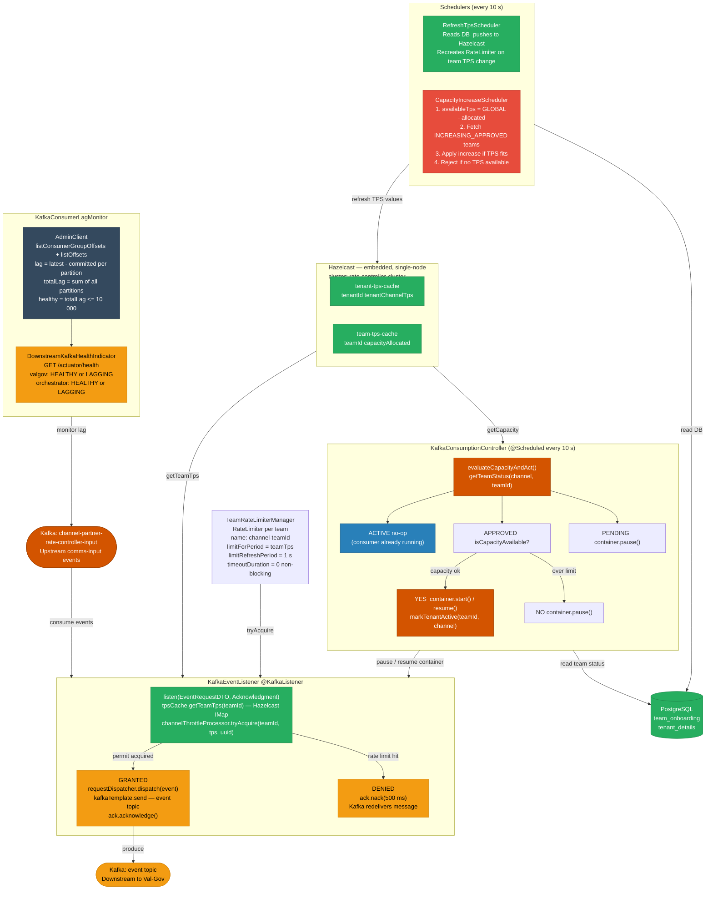
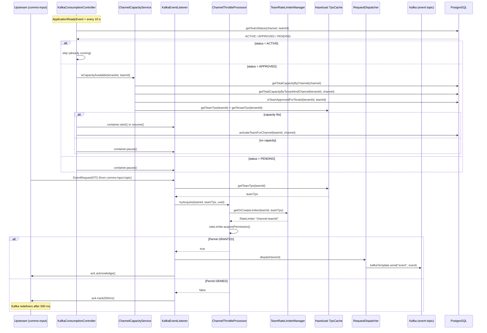

# HLD — uclm-rate-controller-service

**Role:** Per-team, per-channel TPS throttle gate between upstream UCLM output and the validation pipeline.

---

## 1. Purpose & Responsibilities

| Responsibility | Detail |
|---------------|--------|
| **Rate Limiting** | Enforces per-team, per-channel TPS (Transactions Per Second) using Resilience4j RateLimiter |
| **Capacity Guard** | On startup and every 10 s, checks team status in DB; only starts/resumes consuming if team is `APPROVED` and TPS fits within global + tenant budget |
| **Backpressure** | `checkDownstreamHealthAndControlConsumption()` can pause Kafka if downstream lag exceeds threshold (wired but currently not called in the periodic check — available for manual activation) |
| **TPS Auto-Scaling** | Every 10 s, `CapacityIncreaseScheduler` applies approved TPS increase requests sequentially from DB |
| **TPS Refresh** | Every 10 s, `RefreshTpsScheduler` syncs team and tenant TPS from PostgreSQL into Hazelcast cache |
| **Health Exposure** | `DownstreamKafkaHealthIndicator` exposes downstream lag status via Spring Boot Actuator `/actuator/health` |

---

## 2. High-Level Architecture



---

## 3. Detailed Processing Flow



---

## 4. Capacity Guard Logic

`evaluateCapacityAndAct()` runs on startup (`ApplicationReadyEvent`) and every 10 s:

```
getTeamStatus(channel, teamId)
│
├── ACTIVE  → no-op (consumer already running)
│
├── APPROVED → isCapacityAvailable(tenantId, teamId)?
│               │
│               ├── Check 1: SUM(capacity_allocated) for channel (all ACTIVE teams)
│               │            + this team's TPS  <=  CHANNEL_GLOBAL_TPS
│               │
│               ├── Check 2: SUM(capacity_allocated) for tenant+channel (ACTIVE teams)
│               │            + this team's TPS  <=  tenant_channel_tps (from tenant_details)
│               │
│               ├── Check 3: isTeamApprovedForTenant(tenantId, teamId) == true
│               │
│               ├── ALL PASS → container.start() or resume()
│               │              activateTeamForChannel(teamId, channel)  [status → ACTIVE]
│               └── ANY FAIL → container.pause()
│
└── PENDING → container.pause()
```

---

## 5. TPS Refresh (every 10 s)

`RefreshTpsSchedulerImpl` syncs from PostgreSQL into Hazelcast. Runs for the single configured `team.id` / `tenant.id` of this instance:

```
refreshTenantTps():
  SELECT tenant_id, tenant_channel_tps FROM tenant_details WHERE tenant_id=? AND status='ACTIVE'
  if DB value differs from Hazelcast → hazelcast.updateTenantTps(tenantId, newTps)

refreshTeamTps():
  SELECT workspace_id, capacity_allocated FROM team_onboarding WHERE workspace_id=? AND tenant_id=? AND status='ACTIVE'
  if DB value differs from Hazelcast →
    recreate RateLimiter via TeamRateLimiterManager (new limitForPeriod)
    hazelcast.updateTeamTps(teamId, newTps)
```

---

## 6. Capacity Increase Scheduler (every 10 s)

`CapacityIncreaseSchedulerImpl.processApprovedCapacityIncreases()`:

```
1. globalAllocated = SUM(capacity_allocated) WHERE channel=? AND status='ACTIVE'
   availableTps = CHANNEL_GLOBAL_TPS − globalAllocated

2. if availableTps <= 0:
     rejectCapacityIncreaseRequest(teamId, channel)  [capacity_change_state → REJECTED]
     return

3. candidates = SELECT workspace_id, capacity_allocated, requested_capacity
                FROM team_onboarding
                WHERE status='ACTIVE'
                  AND requested_capacity > 0
                  AND capacity_change_state IN ('INCREASING_APPROVED', 'REJECTED')
                  AND channel=?
                ORDER BY updated_at ASC
                FOR UPDATE

4. for each candidate (sequential, order matters):
     if candidate.requestedCapacity <= availableTps:
       capacity_allocated += requested_capacity
       requested_capacity = 0
       capacity_change_state = 'NONE'
       availableTps -= requested_capacity
     else:
       rejectCapacityIncreaseRequest(teamId, channel)
       break
```

---

## 7. Downstream Lag Monitoring

```
KafkaConsumerLagMonitor.fetchLag(groupId):
  1. AdminClient.listConsumerGroupOffsets(groupId)  → committed offsets per partition
  2. AdminClient.listOffsets(OffsetSpec.latest())   → latest offset per partition
  3. lag(partition) = max(latest − committed, 0)
  4. totalLag = sum(all partitions)
  5. healthy = totalLag <= maxAllowedLag (10 000)

Groups monitored:
  - valgov-consumer-group   (Validation Governance)
  - orch-consumer-group     (Orchestrator)

Exposed via Actuator:
  GET /actuator/health →
    { "valgov": "HEALTHY|LAGGING", "orchestrator": "HEALTHY|LAGGING" }

Note: checkDownstreamHealthAndControlConsumption() (pause/resume based on lag)
      exists but is currently commented out of periodicCheck(). It can be
      re-enabled by uncommenting one line in KafkaConsumptionController.
```

---

## 8. Data Models

### EventRequestDTO (consumed from input topic)

| Field | Type | Description |
|-------|------|-------------|
| `uuid` | String | Unique message ID |
| `moc` | String | Mode of Communication: SMS / EMAIL / WHATSAPP / PUSH / RCS |
| `si_id` | String | Subscriber identity (mobile number) |
| `email_id` | String | Email address (for EMAIL channel) |
| `campaign_group` | String | Campaign group identifier |
| `campaign_name` | String | Campaign name |
| `campaign_type` | String | Campaign type |
| `category` | String | PROMOTIONAL / TRANSACTIONAL / SERVICE_IMPLICIT / SERVICE_EXPLICIT etc. |
| `event_type` | String | NRT / SCHEDULE / ONETIME / EVENT / RECURRING |
| `tenant_id` | String | Tenant identifier |
| `workspace_id` | String | Team (workspace) identifier |
| `script_body` | String | Message content |
| `script_sub` | String | Message subject (for email) |
| `dlt_id` | String | DLT template ID (SMS compliance) |
| `expire_timestamp` | String | Message expiry (format: `yyyy-MM-dd HH:mm:ss.SSSSSS`) |
| `source_timestamp` | String | When the event was created upstream |
| `dynmc_prm` | List | Dynamic parameters for template personalisation |
| `dynmc_prm_sub` | List | Dynamic parameters for subject line |
| `additional_fields` | List | Extra key-value pairs |
| `mediaAttachment` | List | Media attachments (URL, MIME type, file name) |
| `cmsRequired` | boolean | Whether CMS quota decrement is needed |
| `frequency_capping` | String | Frequency capping config |
| `lob` | String | Line of business |
| `circle_id` | String | Telecom circle identifier |

### team_onboarding (PostgreSQL)

| Column | Type | Description |
|--------|------|-------------|
| `workspace_id` | BIGINT PK | Team identifier (used as `teamId` throughout) |
| `tenant_id` | BIGINT FK | Parent tenant → `tenant_details.tenant_id` |
| `team_name` | VARCHAR | Human-readable team name |
| `channel` | VARCHAR | WHATSAPP / SMS / RCS / EMAIL / PUSH |
| `capacity_allocated` | INT | Currently allocated TPS for this team |
| `requested_capacity` | INT | TPS increase requested (pending approval) |
| `capacity_change_state` | VARCHAR | `NONE` / `INCREASING_APPROVED` / `REJECTED` |
| `status` | VARCHAR | `ACTIVE` / `APPROVED` / `PENDING` |
| `environment` | VARCHAR | PROD / UAT |
| `priority` | INT | Allocation priority for capacity increase ordering |
| `provider` | VARCHAR | Channel provider name |
| `created_at` / `updated_at` | TIMESTAMP | Audit timestamps |

### tenant_details (PostgreSQL)

| Column | Type | Description |
|--------|------|-------------|
| `tenant_id` | BIGINT PK | Tenant identifier |
| `tenant_name` | VARCHAR | Tenant name |
| `status` | VARCHAR | `ACTIVE` / `SUSPENDED` |
| `tenant_channel_tps` | BIGINT | Max total TPS allowed for this tenant across all teams on the channel |

---

## 9. Component Map

| Class | Responsibility |
|-------|---------------|
| `KafkaEventListener` | Kafka consumer entry point; calls throttle processor; acks or nacks |
| `ChannelThrottleProcessor` | Acquires Resilience4j RateLimiter permit for the team |
| `TeamRateLimiterManager` | Creates/updates per-team RateLimiter (`{channel}-{teamId}`) |
| `TpsCacheImpl` | Hazelcast `IMap` wrapper — `tenant-tps-cache` and `team-tps-cache` |
| `HazelCastConfig` | Configures embedded Hazelcast cluster (`rate-controller-cluster`), clustering disabled |
| `KafkaConsumptionController` | Startup + periodic (10 s) capacity evaluation; pauses/resumes consumer |
| `ChannelCapacityServiceImpl` | Three-condition capacity check against PostgreSQL + Hazelcast |
| `KafkaConsumerLagMonitor` | Reads consumer group lag via Kafka `AdminClient` |
| `DownstreamKafkaHealthIndicator` | Spring Boot Actuator `HealthIndicator` for downstream lag |
| `RequestDispatcherImpl` | Publishes `EventRequestDTO` to `event` topic via `KafkaTemplate` |
| `RefreshTpsSchedulerImpl` | Every 10 s: syncs tenant + team TPS from DB into Hazelcast |
| `CapacityIncreaseSchedulerImpl` | Every 10 s: applies approved TPS increase requests from DB |
| `TeamOnboardingRepository` | All queries against `team_onboarding` table |
| `TenantOnboardingRepository` | Queries against `tenant_details` table |
| `RateLimiterConfig` | Registers Resilience4j `RateLimiterRegistry` |
| `KafkaConsumerConfiguration` | Kafka consumer factory, deserialiser, listener container factory |
| `KafkaProducerConfiguration` | Kafka producer factory and `KafkaTemplate` |
| `KafkaSecurityConfig` | Kerberos JAAS configuration for UAT/Prod |
| `EventRequestDTODeserializer` | Custom Kafka deserialiser for `EventRequestDTO` |

---

## 10. Configuration Reference

| Property | Default (local) | Dev value | Description |
|----------|----------------|-----------|-------------|
| `server.port` | `8081` | `8081` | HTTP port |
| `kafka.topic` | `comms-input` | `channel-partner-rate-controller-input` | Input topic |
| `kafka.dispatch.topic` | `event` | `event` | Output topic (→ Validation Governance) |
| `kafka.consumer.group-id` | `channel-tenant-throttle-listener` | `channel-partner-rate-controller-svc` | Kafka consumer group ID (also used as listener ID) |
| `kafka.topic.exception` | `exceptions` | `exceptions` | Exception topic |
| `channel.name` | `WHATSAPP` | `WHATSAPP` | Channel this instance handles |
| `channel.global.tps` | `20000` | `2000` | Global max TPS for the channel |
| `tenant.id` | — | — | Tenant ID this instance is configured for |
| `team.id` | — | — | Team (workspace) ID this instance is configured for |
| `downstream.valgov.consumer-group` | `valgov-consumer-group` | `valgov-consumer-group` | Lag-check group for Validation Governance |
| `downstream.orch.consumer-group` | `orch-consumer-group` | `orch-consumer-group` | Lag-check group for Orchestrator |
| `downstream.max.allowed.lag` | `10000` | `10000` | Max consumer lag before pausing |
| `spring.kafka.bootstrap-servers` | `localhost:9092` | `10.92.36.44:9092,...` | Kafka brokers |
