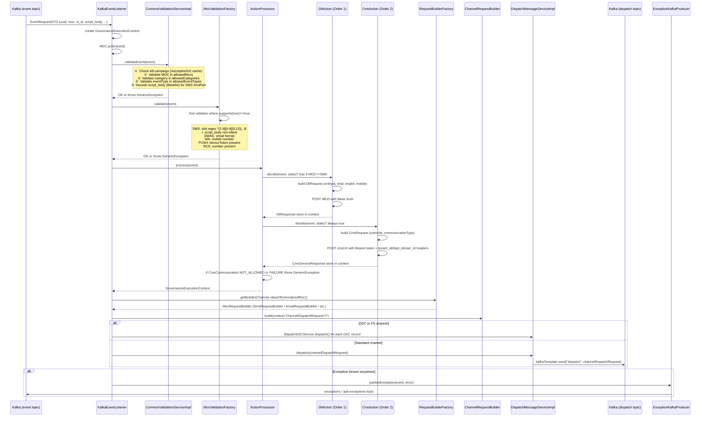
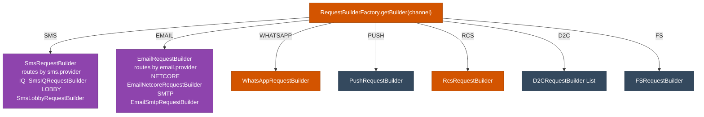

# HLD — uclm-validation-governance-service

**Role:** Multi-channel validation, DLT regulatory compliance, CMS quota governance, and channel-specific payload construction.

---

## 1. Purpose & Responsibilities

| Responsibility | Detail |
|---------------|--------|
| **Common Validation** | MOC validation, category, event type, language code, kill-campaign check |
| **MOC-Specific Validation** | Per-channel field validation (SMS: siId regex + script; Email: email format; WA: mobile; RCS: number; Push: device token) |
| **DLT Scrubbing** | SMS-only regulatory scrubbing via external DLT API (Order 1 Action) |
| **CMS Governance** | Quota check/reserve via CMS API — blocks `NOT_ALLOWED` or `FAILURE` responses (Order 2 Action) |
| **Request Building** | Constructs channel-specific dispatch payloads via factory pattern |
| **Dispatch** | Publishes validated payloads to `dispatch` Kafka topic |

---

## 2. High-Level Architecture

```
┌──────────────────────────────────────────────────────────────────────────────────────┐
│               VALIDATION GOVERNANCE SERVICE  (port: 7777)                            │
│                                                                                      │
│  KafkaEventListener (concurrency=4)                                                  │
│  @KafkaListener(topic=event, group=event-consumer)                                   │
│  ┌────────────────────────────────────────────────────────────────────┐              │
│  │                                                                    │              │
│  │  1. Create GovernanceExecutionContext                              │              │
│  │  2. CommonValidationServiceImpl.validateEvent(event)              │              │
│  │  3. MocValidationFactory.validate(event)                          │              │
│  │       └── routes to channel-specific MocValidationService         │              │
│  │  4. ActionProcessor.process(event)                                │              │
│  │       ├── DltAction.invoke()  [Order 1 — SMS only]               │              │
│  │       └── CmsAction.invoke()  [Order 2]                           │              │
│  │  5. RequestBuilderFactory.getBuilder(channel)                     │              │
│  │  6. requestBuilder.build(context) → ChannelDispatchRequest        │              │
│  │  7. dispatchMessageService.dispatch(channelDispatchRequest)       │              │
│  └─────────────────────────────┬──────────────────────────────────┬─┘              │
│                                │                                  │                 │
│  Exception path:               │                                  │                 │
│  ExceptionKafkaProducer        │                                  │                 │
│  → exceptions / apb-exceptions ▼                                  ▼                 │
│                          ┌──────────┐                     ┌──────────────┐          │
│                          │ dispatch │                     │ cs_raw_      │          │
│                          │  topic   │                     │ reporting_   │          │
│                          └──────────┘                     │ topic        │          │
└──────────────────────────────────────────────────────────────────────────────────────┘
         │                                │
         │ External calls                 │
         ▼                                ▼
  ┌─────────────────┐           ┌──────────────────┐
  │  DLT API        │           │  CMS API         │
  │  (SMS only)     │           │  (quota check)   │
  └─────────────────┘           └──────────────────┘
```

---

## 3. Detailed Processing Flow



---

## 4. Validation Pipeline Detail

### Stage 1 — Common Validation (`CommonValidationServiceImpl`)

| Check | Logic | Error Code |
|-------|-------|------------|
| Kill Campaign | Check Aerospike/HZ cache for `campaign_name` + today's date | `CAMPAIGN_IS_KILLED` |
| MOC | Must be in `allowed.mocs` list | `INVALID_MODE_OF_COMMUNICATION` |
| Category | Must be in `allowed.categories` (skip for PUSH_* MOCs) | `INVALID_CATEGORY` |
| Event Type | Must be in `allowed.event.types` | — |
| Language Code | Decoded from language codes map (001=ENG, 002=HIN, ...) | — |
| SMS Decode | Decodes Base64 script_body → smsPart | — |

### Stage 2 — MOC-Specific Validation (`MocValidationFactory`)

| Channel | Validator | Key Checks |
|---------|-----------|-----------|
| SMS | `SmsValidationService` | `si_id` regex `^[1-9][0-9]{9,12}\|[1-9][0-9]{14}$` + non-blank decoded script_body |
| EMAIL | `EmailValidationService` | Email format validation, unsubscribe/bounce list check |
| WHATSAPP | `WhatsAppValidationsService` | WhatsApp number present |
| PUSH, PUSH_BANK, PUSH_THANKS | `PushValidationsService` | Device token, push category validation |
| RCS | `RcsValidationService` | Mobile number present |
| D2C, FS | `D2CValidationService` | D2C-specific field validation |

### Stage 3 — DLT Action (Order 1, SMS only)

```
POST {dlt.url}
Authorization: Basic <base64(username:password)>
Content-Type: application/json

{
  "accountId":  "DLT_ACID_TEST",
  "entityId":   "DLT_PEID_TEST",
  "tmid":       "DLT_TMID_TEST",
  "templateId": event.templateId,
  "mobile":     event.si_id,
  "message":    event.script_body
}

Response: DltResponse { status, errorCode, ... }
```

### Stage 4 — CMS Action (Order 2, all channels)

```
POST {cms.url}
Authorization: Bearer {cms.access.token}
Headers: tenant_id={tenantId}, dept_id={event.workspace_id}, user_id={userId}
Content-Type: application/json

CmsRequest { cohortId, communicationType, campaignId, ... }

Response: CmsServiceResponse<CmsAppResponse> {
  data: { communication: ALLOWED|NOT_ALLOWED, status: SUCCESS|FAILURE }
}

If communication == NOT_ALLOWED OR status == FAILURE:
  → throw GenericException(COMMUNICATION_NOT_ALLOWED)
```

---

## 5. Request Builder Factory



---

## 6. Publish Strategy

`kafka.publish.mode` controls how Kafka DML records are published:

| Mode | Behaviour |
|------|-----------|
| `FULL_ONLY` | Publishes `FullKafkaDml` only (full payload) |
| `APB_ONLY` | Publishes `ApbKafkaContract` only (compact format) |
| `BOTH` | Publishes both full and APB formats |

`FullDmlKafkaPublisher` → publishes complete dispatch record to `dispatch` topic.  
`ApbKafkaPublisher` → publishes compact APB contract to `dispatch` topic.

---

## 7. GovernanceExecutionContext Fields

| Field | Set By | Description |
|-------|--------|-------------|
| `eventRequestDTO` | KafkaEventListener | The raw incoming event |
| `processedStartTime` | KafkaEventListener | ISO timestamp when processing began |
| `dltRequestTime` | DltAction | ISO timestamp of DLT API call |
| `dltRequest` | DltAction | The DLT request sent |
| `dltResponse` | DltAction | Response from DLT API |
| `cmsRequestTime` | CmsAction | ISO timestamp of CMS API call |
| `cmsRequest` | CmsAction | The CMS request sent |
| `cmsResponseTime` | CmsAction | ISO timestamp of CMS response |
| `cmsResponse` | CmsAction | Response from CMS API |

---

## 8. Lookup Files (mounted volumes)

| Folder | Purpose |
|--------|---------|
| `lookups/raw/` | Raw input CSV/JSON lookup tables per channel/MOC |
| `lookups/schema/` | Field-level schema definitions (required fields, types, lengths) |
| `lookups/normalized/` | Maps raw values to canonical/normalized values |

Loaded by `FileBasedLookupLoader` at startup into `InMemoryLookupService`. Used during MOC-specific validation and request building.

---

## 9. Error Codes

| Code | Description |
|------|-------------|
| `INVALID_MODE_OF_COMMUNICATION` | MOC not in allowed list |
| `INVALID_CATEGORY` | Category not in allowed list |
| `INVALID_SI_ID` | SMS si_id doesn't match regex |
| `EMPTY_SCRIPT` | SMS script_body is blank after decode |
| `CAMPAIGN_IS_KILLED` | Campaign found in kill-campaign list for today |
| `COMMUNICATION_NOT_ALLOWED` | CMS returned NOT_ALLOWED or FAILURE |
| `UNSUPPORTED_SMS_PROVIDER` | Configured sms.provider not in registered builders |

---

## 10. Component Map

| Class | Responsibility |
|-------|---------------|
| `KafkaEventListener` | Kafka consumer; orchestrates entire pipeline |
| `CommonValidationServiceImpl` | Common field validations |
| `MocValidationFactory` | Routes to channel-specific validator |
| `SmsValidationService` | SMS-specific validation |
| `EmailValidationService` | Email-specific validation |
| `WhatsAppValidationsService` | WA-specific validation |
| `PushValidationsService` | Push-specific validation |
| `RcsValidationService` | RCS-specific validation |
| `D2CValidationService` | D2C-specific validation |
| `ActionProcessor` | Runs ordered Actions (DLT → CMS) |
| `DltAction` | Calls DLT scrubbing API (Order 1) |
| `CmsAction` | Calls CMS quota API (Order 2) |
| `RequestBuilderFactory` | Returns correct builder by channel |
| `SmsRequestBuilder` | Routes to IQ or Lobby SMS builder |
| `SmsIQRequestBuilder` | Builds Airtel IQ SMS payload |
| `EmailNetcoreRequestBuilder` | Builds Netcore email payload |
| `WhatsAppRequestBuilder` | Builds WA payload |
| `PushRequestBuilder` | Builds FCM push payload |
| `RcsRequestBuilder` | Builds RCS payload |
| `DispatchMessageServiceImpl` | Publishes to `dispatch` Kafka topic |
| `FullDmlKafkaPublisher` | Publishes full DML record |
| `ApbKafkaPublisher` | Publishes compact APB contract |
| `ExceptionKafkaProducer` | Publishes exceptions to error topics |
| `InMemoryLookupService` | Caches lookup file data in memory |
| `FileBasedLookupLoader` | Loads lookup files at startup |
| `AerospikeAdapter` | Adapter for Aerospike read (kill campaign, etc.) |
| `KillCampaignRepository` | Checks kill-campaign list |
| `BounceEmailRepository` | Email bounce list |
| `UnsubscribeEmailRepository` | Email unsubscribe list |

---

## 11. Configuration Reference

| Property | Default | Description |
|----------|---------|-------------|
| `server.port` | `7777` | HTTP port |
| `input.kafka.topic` | `event` | Input topic |
| `kafka.dispatch.topic` | `dispatch` | Output topic |
| `kafka.consumer.group-id` | `event-consumer` | Consumer group |
| `kafka.consumer.concurrency` | `4` | Parallel consumer threads |
| `kafka.publish.mode` | `FULL_ONLY` | FULL_ONLY / APB_ONLY / BOTH |
| `analytics.kafka.topic` | `cs_raw_reporting_topic` | Analytics topic |
| `exception.kafka.topic` | `exceptions` | Exception topic |
| `allowed.mocs` | `SMS,EMAIL,WHATSAPP,PUSH_BANK,...` | Allowed channels |
| `allowed.categories` | `PROMOTIONAL,TRANSACTIONAL,...` | Allowed categories |
| `dlt.url` | `http://10.222.160.29:2501/...` | DLT scrubbing endpoint |
| `cms.url` | — | CMS quota endpoint |
| `sms.provider` | — | IQ / LOBBY |
| `lookup.raw.folder` | `./lookups/raw` | Raw lookup file path |
