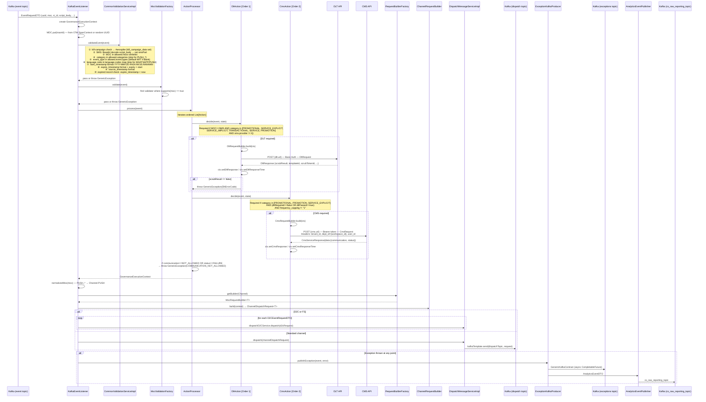
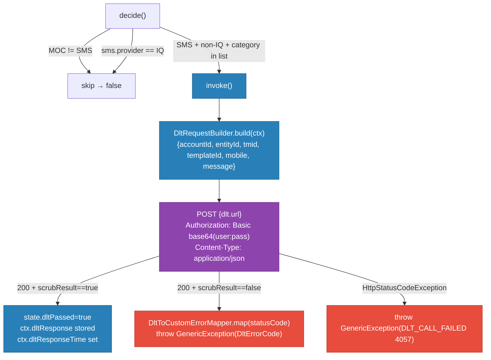
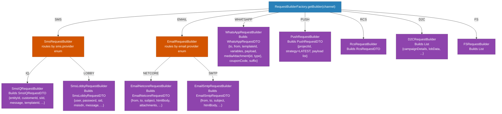
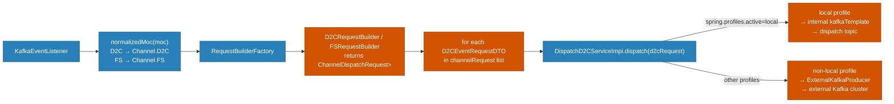
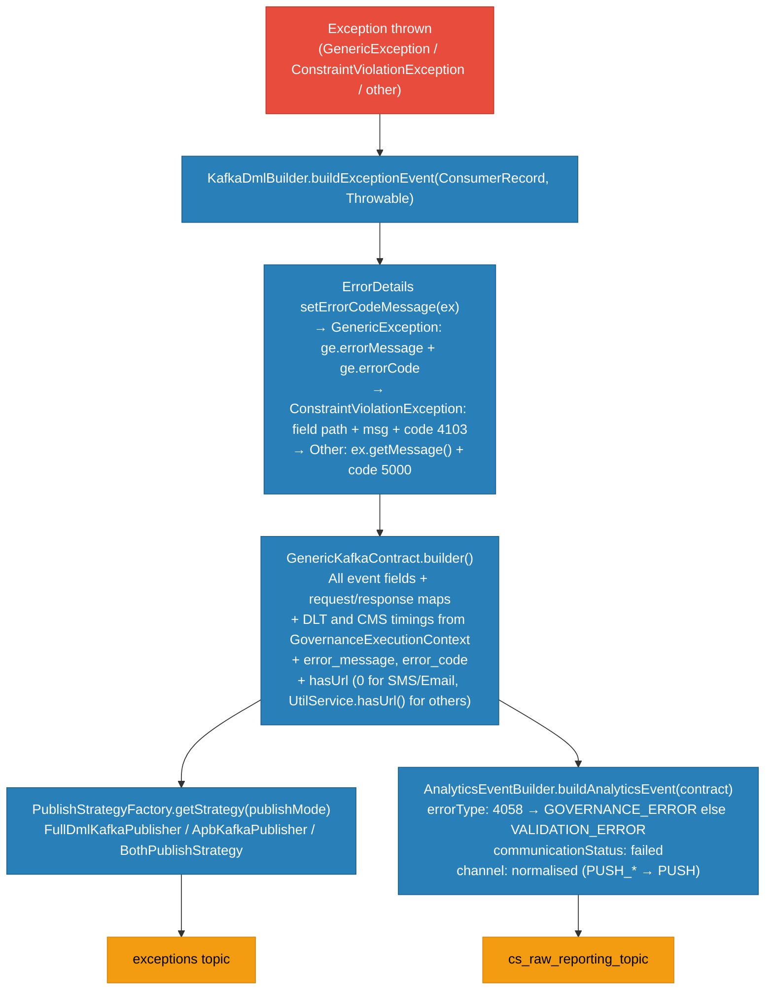

# HLD — uclm-validation-governance-service

> **Module:** Bummlebee — Delivery Engine  
> **Port:** `7777`  
> **Stack:** Java 17 · Spring Boot 3.2.4 · Kafka · Aerospike · Hazelcast (embedded) · OpenTelemetry  
> **Position in pipeline:** Rate Controller → **Validation Governance** → Orchestrator  
> Last updated: 2026-06-02

---

## Table of Contents

1. [Purpose & Responsibilities](#1-purpose--responsibilities)
2. [Position in Bummlebee Pipeline](#2-position-in-bummlebee-pipeline)
3. [High-Level Architecture](#3-high-level-architecture)
4. [End-to-End Processing Flow](#4-end-to-end-processing-flow)
5. [Stage 1 — Common Validation](#5-stage-1--common-validation)
6. [Stage 2 — MOC-Specific Validation](#6-stage-2--moc-specific-validation)
7. [Stage 3 — Action Framework (DLT + CMS)](#7-stage-3--action-framework-dlt--cms)
8. [Stage 4 — Request Builder Factory](#8-stage-4--request-builder-factory)
9. [Stage 5 — Dispatch & Publish Strategy](#9-stage-5--dispatch--publish-strategy)
10. [Lookup System](#10-lookup-system)
11. [Data Stores](#11-data-stores)
12. [Kafka Topics](#12-kafka-topics)
13. [GovernanceExecutionContext](#13-governanceexecutioncontext)
14. [D2C / FS Special Path](#14-d2c--fs-special-path)
15. [Error Handling & Analytics](#15-error-handling--analytics)
16. [Error Codes](#16-error-codes)
17. [Component Map](#17-component-map)
18. [Configuration Reference](#18-configuration-reference)

---

## 1. Purpose & Responsibilities

| Responsibility | Detail |
|---------------|--------|
| **Common Validation** | MOC whitelist check, category, event type, language code, timestamp validation, kill-campaign check via Aerospike |
| **MOC-Specific Validation** | Per-channel field checks — SMS (`si_id` regex + Base64 script), Email (unsubscribe/bounce/bad-domain), WhatsApp (mobile regex), Push (category + action types), RCS (number present), D2C/FS (required `additional_fields`) |
| **DLT Scrubbing** | SMS-only regulatory compliance via external DLT API (`Order 1`) — mandatory for promotional, transactional, and service categories; skipped for `IQ` SMS provider |
| **CMS Quota Governance** | Communicates with CMS API to check + decrement campaign quota (`Order 2`) — blocks events when response is `NOT_ALLOWED` or `FAILURE` |
| **Payload Construction** | Builds channel-specific `ChannelDispatchRequest<T>` via a factory pattern, delegating to provider-level builders (IQ vs Lobby for SMS, Netcore vs SMTP for Email) |
| **Dispatch** | Publishes constructed payloads to the `dispatch` Kafka topic for the Orchestrator, or to external Kafka for D2C/FS in non-local environments |
| **Observability** | Publishes `GenericKafkaContract` (failure details + timings) to exceptions topic and `AnalyticsEventDTO` to `cs_raw_reporting_topic` on any validation/governance failure |

---

## 2. Position in Bummlebee Pipeline

```
  ┌──────────────────┐       Kafka (channel-specific topic)       ┌───────────────────────┐
  │  uclm-campaign-  │  ─────────────────────────────────────►   │  uclm-rate-controller  │
  │  time-validation │       *_nrt_svc_valgov topics              │  (TPS throttle gate)   │
  └──────────────────┘                                            └───────────┬───────────┘
                                                                              │ Kafka: event topic
                                                                              ▼
                                                                  ┌───────────────────────┐
                                                                  │  uclm-validation-      │
                                                                  │  governance-service    │  ◄── THIS SERVICE
                                                                  │  (port 7777)           │
                                                                  └───────────┬───────────┘
                                                                              │ Kafka: dispatch topic
                                                                              ▼
                                                                  ┌───────────────────────┐
                                                                  │  uclm-orchestrator-    │
                                                                  │  service               │
                                                                  └───────────────────────┘
```

---

## 3. High-Level Architecture

```mermaid
flowchart TB
    KIN([Kafka: event topic\nfrom Rate Controller])
    KOUT([Kafka: dispatch topic\nto Orchestrator])
    KEXC([Kafka: exceptions / apb-exceptions\nmonitoring])
    KANA([Kafka: cs_raw_reporting_topic\nanalytics])
    KEXT([External Kafka\nD2C / FS — non-local only])

    DLT_API["DLT Scrubbing API\nhttp://10.x.x.x:2501/api/process/scrubbing/sms/single\nSMS only — Basic Auth"]
    CMS_API["CMS Quota API\nhttps://cms-dev.airtel.com/counter/increment\nBearer token + tenant/dept/user headers"]

    subgraph VGS["VALIDATION GOVERNANCE SERVICE  (port 7777)"]
        direction TB
        EL["KafkaEventListener\n@KafkaListener(concurrency=4)\ncreates GovernanceExecutionContext\nsets MDC traceId (OTel or UUID)"]

        CV["CommonValidationServiceImpl\nkill-campaign · MOC · category\nevent_type · language_code\ntimestamp validation · SMS smsPart decode"]

        MF["MocValidationFactory\nroutes to channel validator\nby supports(moc)"]

        subgraph VALIDATORS["MOC Validators"]
            SV["SmsValidationService\nsi_id regex + non-blank script"]
            EV["EmailValidationService\nbounce · unsubscribe · bad-domain · global-exclusion"]
            WV["WhatsAppValidationsService\nmobile number regex"]
            PV["PushValidationsService\ncategory + action types + rich content"]
            RV["RcsValidationService\nnumber present"]
            DV["D2CValidationService\nrequired additional_fields: storeId, customerName, etc."]
        end

        AP["ActionProcessor\nruns ordered Action list\n─────────────────\nOrder 1: DltAction\nOrder 2: CmsAction"]

        RBF["RequestBuilderFactory\ngetBuilder(Channel)"]

        subgraph BUILDERS["Request Builders"]
            SRB["SmsRequestBuilder\nroutes by sms.provider:\n  IQ → SmsIQRequestBuilder\n  LOBBY → SmsLobbyRequestBuilder"]
            ERB["EmailRequestBuilder\nroutes by email.provider:\n  NETCORE → EmailNetcoreRequestBuilder\n  SMTP → EmailSmtpRequestBuilder"]
            WRB["WhatsAppRequestBuilder\nvariables + payload + mediaAttachment + couponCode"]
            PRB["PushRequestBuilder\nFCM payload construction"]
            RRB["RcsRequestBuilder\nRCS payload"]
            DRB["D2CRequestBuilder / FSRequestBuilder\nList<D2CEventRequestDTO>"]
        end

        DS["DispatchMessageServiceImpl\nkafkaTemplate.send(dispatchTopic, request)"]
        D2CD["DispatchD2CServiceImpl\nlocal → internal kafka\nnon-local → ExternalKafkaProducer"]

        EXC["ExceptionKafkaProducer\nasync CompletableFuture send\n→ exceptions / apb-exceptions"]
        ANA["AnalyticsEventPublisher\n→ cs_raw_reporting_topic"]

        HZ["Hazelcast (embedded)\nlookup-hz-instance · single-node\nno multicast / TCP clustering\nstores: lookup-{domain} IMaps"]

        subgraph LOOKUP["FileBasedLookupLoader"]
            direction LR
            RAW["./lookups/raw\nCSV/JSON per domain"]
            SCHEMA["./lookups/schema\nYAML field schemas"]
            NORM["./lookups/normalized\nnormalized values"]
            SCHED["@Scheduled(cron)\nperiodic hot-reload"]
            WATCH["WatchService (optional)\nlookup.watch.enabled=false"]
        end

        AS_R["AerospikeAdapter\nexists() · getRecord()\nbounce_data · unsubs_data · kill_campaign_data"]
    end

    KIN --> EL
    EL --> CV
    CV --> MF
    MF --> SV & EV & WV & PV & RV & DV
    EV -->|bounce/unsubscribe lookup| AS_R
    CV -->|kill-campaign lookup| AS_R
    EV -->|global exclusion lookup| HZ
    EL --> AP
    AP --> DLT_API
    AP --> CMS_API
    AP --> RBF
    RBF --> SRB & ERB & WRB & PRB & RRB & DRB
    SRB --> DS
    ERB --> DS
    WRB --> DS
    PRB --> DS
    RRB --> DS
    DRB --> D2CD
    DS --> KOUT
    D2CD --> KOUT
    D2CD -.->|non-local| KEXT
    EL -.->|exception path| EXC
    EXC --> KEXC
    EXC --> ANA
    ANA --> KANA
    LOOKUP --> HZ

    classDef kafka fill:#f39c12,color:#000,stroke:#d68910
    classDef svc fill:#2980b9,color:#fff,stroke:#1f618d
    classDef external fill:#8e44ad,color:#fff,stroke:#6c3483
    classDef db fill:#27ae60,color:#fff,stroke:#1e8449
    classDef channel fill:#d35400,color:#fff,stroke:#a04000
    classDef user fill:#34495e,color:#fff,stroke:#2c3e50

    class KIN,KOUT,KEXC,KANA,KEXT kafka
    class EL,CV,MF,AP,RBF,DS,D2CD,EXC,ANA svc
    class DLT_API,CMS_API external
    class AS_R,HZ db
    class SRB,ERB,WRB,PRB,RRB,DRB,SV,EV,WV,PV,RV,DV channel
    class RAW,SCHEMA,NORM,SCHED,WATCH user
```



---

## 4. End-to-End Processing Flow



---

## 5. Stage 1 — Common Validation

**Class:** `CommonValidationServiceImpl`  
**Called by:** `KafkaEventListener` immediately after context creation

| # | Check | Logic | Error Code |
|---|-------|-------|------------|
| 1 | **Kill Campaign** | `KillCampaignRepository.exists(campaign_name)` → Aerospike set `kill_campaign_data`. If found, compare stored date with `LocalDate.now()`; reject only if dates match | `CAMPAIGN_IS_KILLED` (4095) |
| 2 | **SMS smsPart decode** | If `moc == SMS`, Base64-decode `script_body` and call `UtilService.split()` to compute `smsPart` | — |
| 3 | **MOC whitelist** | `moc.trim().toUpperCase()` must be in `allowed.mocs` property (`SMS,EMAIL,WHATSAPP,PUSH_BANK,PUSH_THANKS,D2C,FS,RCS,PUSH`) | `INVALID_MODE_OF_COMMUNICATION` (4006) |
| 4 | **Category** | Must be in `allowed.categories` — skipped for `PUSH_*` prefix MOCs | `INVALID_CATEGORY` (4001) |
| 5 | **Event Type** | If non-blank, must be in `allowed.event.types` (`NRT,SCHEDULE,ONETIME,EVENT,RECURRING`); defaults to `NRT` if blank | `INVALID_EVENT_TYPE` (4008) |
| 6 | **Language Code** | `msg_lng_cd` must be a key in the `language.codes` map — skipped for `WHATSAPP` and `PUSH_*` | `INVALID_MESSAGE_LANGUAGE` (4007) |
| 7 | **start_timestamp** | Auto-set via `UtilService.getStartTimeStamp()` if blank. If non-blank, must match `yyyy-MM-dd HH24:MI:SS.NNNNNN` pattern | `INVALID_START_TIME` (4004) |
| 8 | **expire_timestamp** | Auto-derived from `start_timestamp` if blank. Must be valid format AND `expire > start` | `INVALID_EXPIRE_TIME` (4005) |
| 9 | **source_timestamp** | Must match timestamp pattern — no default | `INVALID_SOURCE_TIME` (4003) |
| 10 | **Expired record** | If `expire_timestamp < now` → reject | `EXPIRED_RECORD` (4047) |

**Language Code Map** (configured via `language.codes` property):

| Code | Language |
|------|----------|
| 001 | ENG |
| 002 | HIN |
| 003 | MAR |
| 004 | TEL |
| 005 | GUJ |
| 006 | BEN |
| 007 | KAN |
| 008 | TAM |
| 009 | PUN |
| 010 | ODI |
| 011 | MAL |
| 012 | ASS |
| 013 | URD |

---

## 6. Stage 2 — MOC-Specific Validation

**Class:** `MocValidationFactory`  
Routes to exactly one `MocValidationService` where `supports(moc) == true`. Throws `INVALID_MODE_OF_COMMUNICATION` if no validator matches.

### SMS — `SmsValidationService`

| Check | Logic | Error Code |
|-------|-------|------------|
| `si_id` format | Must match regex `^[1-9][0-9]{9,12}\|[1-9][0-9]{14}$` | `INVALID_SI_ID` (4046) |
| `script_body` | Base64-decoded content must not be blank | `EMPTY_SCRIPT` (4050) |

### EMAIL — `EmailValidationService`

| Check | Logic | Error Code |
|-------|-------|------------|
| `script_body` | Decoded content must not be blank | `EMPTY_SCRIPT` (4050) |
| `script_sub` | Decoded subject must not be blank | `EMPTY_EMAIL_SUBJECT` (4051) |
| Global exclusion | Lookup `global_exclusion` domain in Hazelcast by `email_id`; check `bad_domain` and `fraud_accnt` JSON flags | `BAD_DOMAIN` (4011), `FRAUD_EMAIL_ID` (4010) |
| Unsubscribe | If `remove_unsubs_link == Y` AND category in `[SERVICE_EXPLICIT, PROMOTIONAL, PROMOTION]` → check Aerospike `unsubs_data` set | `EMAIL_ID_IS_UNSUBSCRIBED` (4093) |
| Bounce | Same conditions as unsubscribe → check Aerospike `bounce_data` set | `EMAIL_ALREADY_BOUNCED` (4094) |
| Content enrichment | If `email.provider == SMTP` → call `EmailTrackingPixelEnricher.enrich()` and inject into `script_body`; else Base64-decode in place | — |

### WHATSAPP — `WhatsAppValidationsService`

| Check | Logic | Error Code |
|-------|-------|------------|
| `si_id` format | Must match regex `^[1-9][0-9]{9}\|[1-9][0-9]{12}$` | `INVALID_SI_ID` (4046) |

### PUSH / PUSH_BANK / PUSH_THANKS — `PushValidationsService`

`supports()` returns `true` for any MOC starting with `PUSH` prefix.

| Check | Logic | Error Code |
|-------|-------|------------|
| `si_id` format | Must match `^[1-9][0-9]{9}\|[1-9][0-9]{12}$` | `INVALID_SI_ID` (4046) |
| `category` | Must be in `push.allowed.categories` (`PROMOTIONAL,PROMOTION,MARKETING,ACTIVITY,OTHER,SERVICE,TRANSACTIONAL`) | `INVALID_CATEGORY` (4001) |
| Default action type (Android) | If `payload[0].defaultAction.type` is present: must not be blank, must be a valid `PushAction` enum value | `EMPTY_DEFAULT_ACTION_TYPE` (4030), `INVALID_DEFAULT_ACTION_TYPE` (4035) |
| Default action type (iOS) | Same checks for `defaultActionIos.type` | `EMPTY_DEFAULT_ACTION_IOS_TYPE` (4031), `INVALID_DEFAULT_IOS_ACTION_TYPE` (4036) |
| Additional actions (Android) | For each entry in `additionalActions`: type must not be blank and must be valid `PushAction` | `EMPTY_ADDITIONAL_ACTION_ANDROID_TYPE` (4033), `INVALID_ADDITIONAL_ACTION_ANDROID_TYPE` (4037) |
| Additional actions (iOS) | Same for `additionalActionsIos` | `EMPTY_ADDITIONAL_ACTION_IOS_TYPE` (4034), `INVALID_ADDITIONAL_ACTION_IOS_TYPE` (4038) |
| Rich content type | For each entry in `richContent`: type must not be blank, must be valid `PushRichContent` enum | `EMPTY_RICH_CONTENT_TYPE` (4032), `INVALID_RICH_CONTENT_TYPE` (4039) |

### RCS — `RcsValidationService`

Basic presence checks only; field-level validation delegated to `@Valid` / `@ValidMobileNumber` annotations.

### D2C / FS — `D2CValidationService`

`supports()` returns `true` for MOC `D2C` or `FS`.

| Check | Logic | Error Code |
|-------|-------|------------|
| `additional_fields` present | List must not be null or empty | `MISSING_ADDITIONAL_FIELDS` (4096) |
| Required keys | All of `storeId`, `customerName`, `Remarks`, `ProductType`, `reasonOfCall` must be present in `additional_fields` | `MISSING_ADDITIONAL_FIELDS` (4096) |
| `storeId` non-blank | `storeId` value must not be blank | `MISSING_STORE_ID` (4101) |

---

## 7. Stage 3 — Action Framework (DLT + CMS)

**Class:** `ActionProcessor`  
Iterates over Spring-injected `List<Action>` ordered by `@Order`. Each `Action` has two methods:
- `decide(EventRequestDTO, ActionExecutionState): boolean` — determines if this action must run
- `invoke(GovernanceExecutionContext, ActionExecutionState)` — executes the action

### DltAction — Order 1



**DLT Categories that trigger scrubbing:**

| CommunicationType | DLT Required |
|------------------|:---:|
| `PROMOTIONAL` | ✅ |
| `PROMOTION` | ✅ |
| `SERVICE_EXPLICIT` | ✅ |
| `SERVICE_IMPLICIT` | ✅ |
| `TRANSACTIONAL` | ✅ |
| `SERVICE` | ✅ |
| All others | ❌ |

> **Note:** DLT is skipped entirely when `sms.provider=IQ` regardless of category.

### CmsAction — Order 2

```mermaid
flowchart TD
    D["decide()"]
    D -->|category NOT in [PROMOTIONAL, PROMOTION, SERVICE_EXPLICIT]| SKIP["skip → false"]
    D -->|dltRequired==true AND dltPassed==false| SKIP
    D -->|frequency_capping == '1'| SKIP
    D --> RUN["invoke()"]

    RUN --> BUILD["CmsRequestBuilder.build(ctx)\n{cohortId=event.cohort or default.cms.cohort=3,\ncommunicationType, campaignId, ...}"]
    BUILD --> CALL["POST {cms.url}\nAuthorization: Bearer {cms.access.token}\nHeaders: tenant_id, dept_id={workspace_id}, user_id"]
    CALL --> RESP["CmsServiceResponse<CmsAppResponse>"]
    RESP --> CHECK["ctx.cmsResponse stored\nctx.cmsResponseTime set"]
    CHECK -->|communication==NOT_ALLOWED OR status==FAILURE| BLOCK["throw GenericException\n(COMMUNICATION_NOT_ALLOWED 4059)"]
    CHECK -->|ALLOWED + SUCCESS| PASS["state.cmsPassed=true\ncontinue to builder"]

    classDef ext fill:#8e44ad,color:#fff,stroke:#6c3483
    classDef svc fill:#2980b9,color:#fff,stroke:#1f618d
    classDef stop fill:#e74c3c,color:#fff,stroke:#c0392b
    class CALL ext
    class BUILD,RUN,CHECK,PASS svc
    class BLOCK stop
```

> **Note:** CMS failure check happens *after* `ActionProcessor.process()` returns, inside `ActionProcessor` itself — not inside `CmsAction.invoke()`. This ensures the context is fully populated before the check.

---

## 8. Stage 4 — Request Builder Factory

**Class:** `RequestBuilderFactory`  
Auto-discovers all `MocRequestBuilder<?>` beans and maps them by `supportedMoc()` at startup.



All builders return a `ChannelDispatchRequest<T>` that wraps:
- `eventRequest` — the original `EventRequestDTO`
- `channelRequest` — channel-specific payload (`T`)
- `cmsRequest` / `cmsResponse` — CMS context for downstream tracking

---

## 9. Stage 5 — Dispatch & Publish Strategy

### Standard Channel Dispatch

`DispatchMessageServiceImpl.dispatch(ChannelDispatchRequest<T>)`:  
→ `kafkaTemplate.send(dispatchTopic, request)`  
→ Topic: `kafka.dispatch.topic` (default: `dispatch`)

### D2C / FS Dispatch

`DispatchD2CServiceImpl.dispatch(D2CEventRequestDTO)`:

| Profile | Behaviour |
|---------|-----------|
| `local` | Sends to internal `dispatch` Kafka topic |
| All others | Sends to `ExternalKafkaProducer` — separate Kafka cluster (SASL_PLAINTEXT + GSSAPI, configured via `ExternalKafkaProducerConfiguration`) |

### Publish Mode Strategy (`kafka.publish.mode`)

Controlled via `PublishStrategyFactory` → `PublishModeStrategy` implementations:

| Mode | Publisher | Description |
|------|-----------|-------------|
| `FULL_ONLY` | `FullDmlKafkaPublisher` | Publishes full `GenericKafkaContract` — all fields, timing maps, CMS/DLT payloads |
| `APB_ONLY` | `ApbKafkaPublisher` | Publishes compact `ApbKafkaContract` format |
| `BOTH` | `BothPublishStrategy` | Publishes both full and APB in sequence |

> Default mode: `FULL_ONLY`

---

## 10. Lookup System

**Entry point:** `FileBasedLookupLoader` (`@PostConstruct` + `@Scheduled`)  
**Storage:** `InMemoryLookupService` backed by **Hazelcast embedded** (`lookup-hz-instance`, single-node, clustering disabled)

### Folder Structure

| Folder | Property | Format | Purpose |
|--------|----------|--------|---------|
| `./lookups/raw/` | `lookup.raw.folder` | CSV / JSON | Raw domain data (e.g. `global_exclusion`, `dlt_config`, `lobby_creds`) |
| `./lookups/schema/` | `lookup.schema.folder` | YAML | Field-level schema definitions (required fields, types, max-length, regex) |
| `./lookups/normalized/` | `lookup.normalized.folder` | — | Canonical/normalized value maps |

### Loading Behaviour

```
@PostConstruct init():
  1. ensureFolders()  — creates directories if missing
  2. loadSchemas()    — reads all *.yaml files from schema folder → ConcurrentHashMap
  3. reloadAllDomains()  — for each raw file, parse + validate against schema → Hazelcast IMap
  4. handleDeletedDomains()  — removes domains no longer on disk from Hazelcast

@Scheduled(cron = "${lookup.reload.cron}"):
  Same as above, only reloads files where lastModified changed

WatchService (optional, lookup.watch.enabled=false):
  File-system events trigger immediate reload of changed domain
  Waits for file stability: STABLE_MS=500ms × STABLE_ROUNDS=3 rounds
```

### Known Domains

| Domain | Used By | Checks |
|--------|---------|--------|
| `global_exclusion` | `EmailValidationService` | `bad_domain`, `fraud_accnt` flags per email |
| `dlt_config` | `DltAction` | DLT static configuration |
| `lobby_creds` | `SmsLobbyRequestBuilder` | SMS Lobby credentials per account |
| `kill_campaign_data` | `CommonValidationServiceImpl` | Campaign kill list (backed by Aerospike, not file) |

### Hazelcast IMap Layout

```
hazelcastInstance.getMap("lookup-{domain}")
  key   → String  (e.g. email address, account name)
  value → JsonNode (parsed from CSV/JSON row)
```

---

## 11. Data Stores

| Store | Type | Aerospike Namespace | Aerospike Set | Used For |
|-------|------|--------------------|----|---------|
| **Aerospike** | In-memory NoSQL | `${aerospike.nameSpace}` | `bounce_data` | Email bounce list — `exists(email_id)` |
| **Aerospike** | In-memory NoSQL | `${aerospike.nameSpace}` | `unsubs_data` | Email unsubscribe list — `exists(email_id)` |
| **Aerospike** | In-memory NoSQL | `${aerospike.nameSpace}` | `kill_campaign_data` | Campaign kill list — `exists(campaign_name)`, value = date string |
| **Hazelcast** | Embedded in-process | — | `lookup-{domain}` IMap | File-based lookup tables (global exclusions, DLT config, lobby creds) |

**AerospikeAdapter** wraps the native `AerospikeClient` with two methods:
- `exists(Key key): boolean`
- `getRecord(Key key): Record`

Keys are constructed as: `new Key(namespace, setName, id)`

---

## 12. Kafka Topics

| Topic | Direction | Config Property | Description |
|-------|-----------|-----------------|-------------|
| `event` | **In** | `input.kafka.topic` | Receives validated, rate-limited events from Rate Controller; concurrency=4 |
| `dispatch` | **Out** | `kafka.dispatch.topic` | Sends constructed `ChannelDispatchRequest` to Orchestrator |
| `exceptions` | **Out** | `exception.kafka.topic` | Failure events as `GenericKafkaContract` — full detail including CMS/DLT payloads + timings |
| `apb-exceptions` | **Out** | `apb.kafka.topic.exception` | Compact APB-format failure events |
| `cs_raw_reporting_topic` | **Out** | `analytics.kafka.topic` | `AnalyticsEventDTO` for analytics pipeline on every failure |

**Kafka Security:**

| Environment | Protocol | Auth Mechanism |
|-------------|----------|----------------|
| Local | PLAINTEXT | None |
| DEV/UAT | SASL_PLAINTEXT | GSSAPI (Kerberos) — `b0331033@INDIA.AIRTEL.ITM` principal |
| PROD | SASL_SSL | GSSAPI + TLS |

Dual Kafka clusters:
- **Internal** — `KafkaConsumerConfiguration` + `KafkaProducerConfiguration` + `KafkaSecurityConfig`
- **External** (D2C) — `ExternalKafkaProducerConfiguration` + `ExternalKafkaSecurityConfig`

---

## 13. GovernanceExecutionContext

The `GovernanceExecutionContext` is the single mutable state object passed through the entire pipeline. It is attached to the `EventRequestDTO` itself (via `event.setGovernanceContext(context)`) so that the Kafka error handler (`KafkaDmlBuilder`) can access it during exception serialisation.

| Field | Set By | Type | Description |
|-------|--------|------|-------------|
| `eventRequestDTO` | `KafkaEventListener` | `EventRequestDTO` | The raw inbound event |
| `processedStartTime` | `KafkaEventListener` | `String` | ISO timestamp when listener received the event |
| `dltRequestTime` | `DltAction.invoke()` | `String` | ISO timestamp just before DLT HTTP call |
| `dltRequest` | `DltAction.invoke()` | `DltRequest` | The exact payload sent to DLT API |
| `dltResponse` | `DltAction.invoke()` | `DltResponse` | Full response from DLT API |
| `dltResponseTime` | `DltAction.invoke()` | `String` | ISO timestamp after DLT response received |
| `cmsRequestTime` | `CmsAction.invoke()` | `String` | ISO timestamp just before CMS HTTP call |
| `cmsRequest` | `CmsAction.invoke()` | `CmsRequest` | The exact payload sent to CMS API |
| `cmsResponse` | `CmsAction.invoke()` | `CmsServiceResponse<CmsAppResponse>` | Full response from CMS API |
| `cmsResponseTime` | `CmsAction.invoke()` | `String` | ISO timestamp after CMS response received |
| `processedEndTime` | Exception handler | `String` | Set to `Instant.now()` in `KafkaDmlBuilder` on failure |

---

## 14. D2C / FS Special Path

Direct-to-Consumer (`D2C`) and Field-Sales (`FS`) channels have a separate dispatch path:



`D2CEventRequestDTO` contains:
- `campaignDetails` — campaign metadata (`CampaignDetails`)
- `lobData` — line-of-business data (`LobData`)

---

## 15. Error Handling & Analytics

On any exception during processing, the Kafka error handler invokes `KafkaDmlBuilder.buildExceptionEvent()`:



**AnalyticsEventDTO structure:**

| Field | Value |
|-------|-------|
| `source_name` | `CHANNEL_MANAGER` |
| `source_id` | `"2"` |
| `event_type` | `ANALYTICS_EVENT` |
| `version` | `"1"` |
| `payload.communicationStatus` | `"failed"` |
| `payload.errorType` | `GOVERNANCE_ERROR` (code 4058) or `VALIDATION_ERROR` (all others) |
| `payload.errorReason` | Error message string |
| `payload.smsPart` | Only for SMS: `UtilService.split(script)` |
| `payload.hasURL` | `0` for SMS/Email; `UtilService.hasUrl()` for others |

---

## 16. Error Codes

| Code | Enum | Description |
|------|------|-------------|
| 4001 | `INVALID_CATEGORY` | Category not in allowed list |
| 4002 | `DLT_CONFIG_NOT_FOUND` | DLT configuration missing from lookup |
| 4003 | `INVALID_SOURCE_TIME` | source_timestamp format invalid |
| 4004 | `INVALID_START_TIME` | start_timestamp format invalid |
| 4005 | `INVALID_EXPIRE_TIME` | expire_timestamp invalid or before start |
| 4006 | `INVALID_MODE_OF_COMMUNICATION` | MOC not in allowed list |
| 4007 | `INVALID_MESSAGE_LANGUAGE` | msg_lng_cd not in language codes map |
| 4008 | `INVALID_EVENT_TYPE` | event_type not in allowed list |
| 4009 | `LOBBY_CONFIG_NOT_FOUND` | SMS Lobby configuration missing |
| 4010 | `FRAUD_EMAIL_ID` | Email flagged as fraud in global exclusion list |
| 4011 | `BAD_DOMAIN` | Email domain flagged in global exclusion list |
| 4030 | `EMPTY_DEFAULT_ACTION_TYPE` | Push: defaultAction.type is blank |
| 4031 | `EMPTY_DEFAULT_ACTION_IOS_TYPE` | Push: defaultActionIos.type is blank |
| 4032 | `EMPTY_RICH_CONTENT_TYPE` | Push: richContent[i].type is blank |
| 4033 | `EMPTY_ADDITIONAL_ACTION_ANDROID_TYPE` | Push: additionalActions[i].type is blank |
| 4034 | `EMPTY_ADDITIONAL_ACTION_IOS_TYPE` | Push: additionalActionsIos[i].type is blank |
| 4035 | `INVALID_DEFAULT_ACTION_TYPE` | Push: defaultAction.type not a valid PushAction |
| 4036 | `INVALID_DEFAULT_IOS_ACTION_TYPE` | Push: defaultActionIos.type invalid |
| 4037 | `INVALID_ADDITIONAL_ACTION_ANDROID_TYPE` | Push: additionalActions[i].type invalid |
| 4038 | `INVALID_ADDITIONAL_ACTION_IOS_TYPE` | Push: additionalActionsIos[i].type invalid |
| 4039 | `INVALID_RICH_CONTENT_TYPE` | Push: richContent[i].type not a valid PushRichContent |
| 4046 | `INVALID_SI_ID` | si_id doesn't match channel regex |
| 4047 | `EXPIRED_RECORD` | expire_timestamp is in the past |
| 4048 | `INVALID_REPLY_TO_FORMAT` | Email reply_to format invalid (currently commented out) |
| 4049 | `INVALID_EMAIL_SENDER_ID` | Email sender_id format invalid (currently commented out) |
| 4050 | `EMPTY_SCRIPT` | SMS/Email script_body is blank after decode |
| 4051 | `EMPTY_EMAIL_SUBJECT` | Email script_sub is blank after decode |
| 4054 | `DOC_TYPE_MISSING` | WhatsApp mediaId present but doc_type missing (commented out) |
| 4055 | `MEDIA_ID_MISSING` | WhatsApp doc_type present but mediaId missing (commented out) |
| 4057 | `DLT_CALL_FAILED` | HTTP error calling DLT API |
| 4058 | `CMS_CALL_FAILED` | Exception calling CMS API |
| 4059 | `COMMUNICATION_NOT_ALLOWED` | CMS returned NOT_ALLOWED or FAILURE |
| 4060 | `UNSUPPORTED_SMS_PROVIDER` | `sms.provider` value has no matching builder |
| 4093 | `EMAIL_ID_IS_UNSUBSCRIBED` | Email address is on the unsubscribe list |
| 4094 | `EMAIL_ALREADY_BOUNCED` | Email address is on the bounce list |
| 4095 | `CAMPAIGN_IS_KILLED` | Campaign is on the kill list for today |
| 4096 | `MISSING_ADDITIONAL_FIELDS` | D2C/FS: required additional_fields missing |
| 4097 | `INVALID_CUSTOMER_NAME` | D2C: customerName invalid |
| 4098 | `INVALID_REMARKS` | D2C: Remarks invalid |
| 4099 | `INVALID_PRODUCT_TYPE` | D2C: ProductType invalid |
| 4100 | `INVALID_REASON_OF_CALL` | D2C: reasonOfCall invalid |
| 4101 | `MISSING_STORE_ID` | D2C/FS: storeId blank |
| 4103 | `EMAIL_PROVIDER_NOT_SUPPORTED` | email.provider not recognized |

Error messages are resolved from `messages/message.properties` via `ResourceBundle` keyed by numeric code.

---

## 17. Component Map

| Class | Package | Responsibility |
|-------|---------|---------------|
| `ValidationComputationApplication` | root | Spring Boot entry point |
| `KafkaEventListener` | service.impl | Kafka consumer; orchestrates entire pipeline; sets MDC traceId |
| `CommonValidationServiceImpl` | service.impl | 10-stage common field validation |
| `MocValidationFactory` | service.impl | Routes to channel-specific `MocValidationService` by `supports(moc)` |
| `SmsValidationService` | service.impl | SMS si_id regex + non-blank script |
| `EmailValidationService` | service.impl | Email bounce/unsubscribe/bad-domain + content enrichment |
| `WhatsAppValidationsService` | service.impl | WhatsApp mobile number regex |
| `PushValidationsService` | service.impl | Push category + action type + rich content validation |
| `RcsValidationService` | service.impl | RCS basic validation |
| `D2CValidationService` | service.impl | D2C/FS required additional_fields validation |
| `ActionProcessor` | service.impl | Iterates `List<Action>` in `@Order`; post-checks CMS result |
| `DltAction` | service.impl | Calls DLT scrubbing API (`@Order(1)`) |
| `CmsAction` | service.impl | Calls CMS quota API (`@Order(2)`) |
| `DltRequestBuilder` | service.impl | Builds `DltRequest` from context |
| `CmsRequestBuilder` | service.impl | Builds `CmsRequest` from context |
| `DltToCustomErrorMapper` | service.impl | Maps DLT HTTP status code → `DltErrorCodes` enum |
| `RequestBuilderFactory` | service.impl | Spring-discovered map of `MocRequestBuilder` by channel |
| `SmsRequestBuilder` | service.impl | Routes SMS to IQ or Lobby provider builder |
| `SmsIQRequestBuilder` | service.impl | Builds Airtel IQ SMS payload |
| `SmsLobbyRequestBuilder` | service.impl | Builds SMS Lobby payload; reads creds from lookup |
| `EmailRequestBuilder` | service.impl | Routes Email to Netcore or SMTP builder |
| `EmailNetcoreRequestBuilder` | service.impl | Builds Netcore email payload |
| `EmailSmtpRequestBuilder` | service.impl | Builds SMTP email payload |
| `EmailTrackingPixelEnricher` | service.impl | Injects tracking pixel into HTML body for SMTP |
| `WhatsAppRequestBuilder` | service.impl | Builds WA payload with variables, media, couponCode, suffix |
| `PushRequestBuilder` | service.impl | Builds FCM push payload |
| `RcsRequestBuilder` | service.impl | Builds RCS payload |
| `D2CRequestBuilder` | service.impl | Builds `List<D2CEventRequestDTO>` for D2C |
| `FSRequestBuilder` | service.impl | Builds `List<D2CEventRequestDTO>` for FS |
| `DispatchMessageServiceImpl` | service.impl | Publishes `ChannelDispatchRequest` to `dispatch` topic |
| `DispatchD2CServiceImpl` | service.impl | Dispatches D2C events; switches between internal/external Kafka by profile |
| `ExternalKafkaProducer` | service.impl | Produces to external Kafka cluster for D2C non-local |
| `PublishStrategyFactory` | service.impl | Returns `PublishModeStrategy` by `kafka.publish.mode` |
| `FullDmlKafkaPublisher` | service.impl | Publishes `GenericKafkaContract` to exceptions topic |
| `ApbKafkaPublisher` | service.impl | Publishes `ApbKafkaContract` to apb-exceptions topic |
| `BothPublishStrategy` | service.impl | Delegates to both Full and APB publishers |
| `KafkaDmlBuilder` | service.impl | Builds `GenericKafkaContract` from exception + context |
| `AnalyticsEventBuilder` | service.impl | Builds `AnalyticsEventDTO` from failure contract |
| `AnalyticsEventPublisher` | service.impl | Publishes analytics events to `cs_raw_reporting_topic` |
| `ApbContractBuilder` | service.impl | Builds compact APB contract |
| `ApbKafkaPublisher` | service.impl | Publishes APB compact events |
| `ExceptionKafkaProducer` | service.impl | Async CompletableFuture send to exceptions topic |
| `InMemoryLookupService` | service.impl | Hazelcast IMap wrapper; `get`, `getAll`, `exists`, `load`, `removeDomain` |
| `FileBasedLookupLoader` | service.impl | `@PostConstruct` + `@Scheduled` reload; optional WatchService; YAML schema validation |
| `ScriptDecoderImpl` | service.impl | Decodes Base64-encoded `script_body` / `script_sub` |
| `AerospikeAdapter` | adapter | Thin wrapper: `exists(Key)`, `getRecord(Key)` |
| `KillCampaignRepositoryImpl` | repository.impl | `exists(campaignName)` + `get(campaignName)` via Aerospike |
| `BounceEmailRepositoryImpl` | repository.impl | `exists(emailId)` via Aerospike `bounce_data` set |
| `UnsubscribeEmailRepositoryImpl` | repository.impl | `exists(emailId)` via Aerospike `unsubs_data` set |
| `KafkaEventListener` | service.impl | Kafka consumer; orchestrates entire pipeline |
| `KafkaConsumerConfiguration` | config | Consumer factory, deserialiser, listener container |
| `KafkaProducerConfiguration` | config | Producer factory and `KafkaTemplate<String, Object>` |
| `KafkaSecurityConfig` | config | Internal Kafka GSSAPI JAAS config |
| `ExternalKafkaProducerConfiguration` | config | External Kafka producer factory (D2C) |
| `ExternalKafkaSecurityConfig` | config | External Kafka GSSAPI JAAS config |
| `AerospikeDBConfig` | config | `AerospikeClient` bean from `aerospike.hostName` |
| `HazelCastConfig` | config | Embedded single-node Hazelcast instance |
| `BeanConfiguration` | config | `RestTemplate`, `ObjectMapper` beans |
| `VaultReader` | config | Reads DB credentials from vault/env |
| `DBCredentialsReader` | config | Constructs `DBCredentials` from config |
| `EventRequestDTODeserializer` | config | Custom Kafka deserialiser for `EventRequestDTO` |
| `ConfigLookUp` | config | Singleton that provides `messages/message.properties` bundle path |

---

## 18. Configuration Reference

| Property | Default (local) | Description |
|----------|----------------|-------------|
| `server.port` | `7777` | HTTP port |
| `input.kafka.topic` | `event` | Input Kafka topic |
| `kafka.dispatch.topic` | `dispatch` | Output Kafka topic → Orchestrator |
| `kafka.consumer.group-id` | `default` | Kafka consumer group ID |
| `kafka.consumer.concurrency` | `4` | Parallel listener threads |
| `kafka.publish.mode` | `FULL_ONLY` | `FULL_ONLY` / `APB_ONLY` / `BOTH` |
| `exception.kafka.topic` | `exceptions` | Exception events topic |
| `apb.kafka.topic.exception` | — | APB-format exceptions topic |
| `analytics.kafka.topic` | `cs_raw_reporting_topic` | Analytics events topic |
| `allowed.mocs` | `SMS,EMAIL,WHATSAPP,PUSH_BANK,PUSH_THANKS,D2C,FS,RCS,PUSH` | Allowed MOCs whitelist |
| `validation.allowed.categories` | `PROMOTIONAL,SERVICE_IMPLICIT,TRANSACTIONAL,SERVICE_EXPLICIT,SERVICE,PROMOTION` | Allowed categories |
| `push.allowed.categories` | `PROMOTIONAL,PROMOTION,MARKETING,ACTIVITY,OTHER,SERVICE,TRANSACTIONAL` | Push-specific allowed categories |
| `validation.allowed.event.types` | `NRT,SCHEDULE,ONETIME,EVENT,RECURRING` | Allowed event types |
| `language.codes` | `{'001':'ENG', ...}` | Map of language code → name |
| `dlt.url` | `http://10.222.160.29:2501/api/process/scrubbing/sms/single` | DLT scrubbing endpoint |
| `dlt.username` / `dlt.password` | — | DLT Basic Auth credentials |
| `cms.url` | `https://cms-dev.airtel.com/counter/increment` | CMS quota endpoint |
| `cms.access.token` | — | CMS Bearer token |
| `tenant.id` | `1` | Tenant ID sent in CMS headers |
| `user.id` | `1` | User ID sent in CMS headers |
| `dept.id` | `1` | Default dept ID (overridden by `workspace_id` at runtime) |
| `default.cms.cohort` | `3` | Cohort ID used when event has no cohort |
| `sms.provider` | `IQ` | `IQ` or `LOBBY` — selects SMS request builder |
| `email.provider` | `NETCORE` | `NETCORE` or `SMTP` — selects Email request builder |
| `global.exclusion.lookup` | `global_exclusion` | Hazelcast domain name for email global exclusions |
| `aerospike.hostName` | `localhost:3000` | Aerospike connection string |
| `aerospike.nameSpace` | `test` | Aerospike namespace |
| `aerospike.bounce.setName` | `bounce_data` | Aerospike set for email bounces |
| `aerospike.unsubscribe.setName` | `unsubs_data` | Aerospike set for unsubscribes |
| `aerospike.kill.campaign.setName` | `kill_campaign_data` | Aerospike set for killed campaigns |
| `lookup.raw.folder` | `./lookups/raw` | Raw lookup files path |
| `lookup.schema.folder` | `./lookups/schema` | Schema YAML files path |
| `lookup.normalized.folder` | `./lookups/normalized` | Normalized lookup files path |
| `lookup.watch.enabled` | `false` | Enable WatchService for hot-reload on file change |
| `lookup.reload.enabled` | `true` | Enable scheduled reload |
| `lookup.reload.cron` | — | Cron expression for scheduled reload |
| `lookup.file.stable.ms` | `500` | File stability wait (ms) before WatchService reload |
| `lookup.file.stable.rounds` | `3` | Number of stable rounds before reload triggered |
| `push.notification.meta.project.id` | `apbbanksitdebug` | FCM project ID |
| `push.notification.meta.strategy` | `LATEST` | Push delivery strategy |
| `security.protocol` | `SASL_PLAINTEXT` | Kafka security protocol (UAT/Prod) |
| `sasl.mechanism` | `GSSAPI` | Kerberos SASL mechanism |
