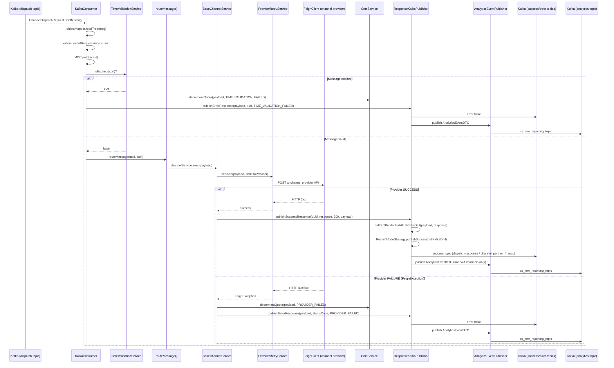
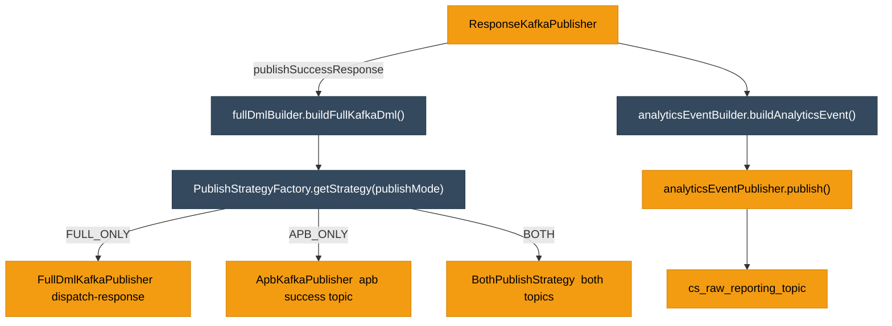

# HLD — uclm-orchestrator-service

**Role:** Multi-channel dispatch engine. Consumes validated payloads from Kafka, validates message expiry, routes to channel providers via Feign clients, manages CMS quota, and publishes response + analytics.

---

## 1. Purpose & Responsibilities

| Responsibility | Detail |
|---------------|--------|
| **Time Validation** | Rejects messages whose `expireTimestamp` is in the past |
| **Channel Routing** | Priority-based routing: SMS IQ → Email → WhatsApp → Push → SMS Lobby → RCS |
| **Provider Dispatch** | Calls external channel providers via Spring Cloud OpenFeign |
| **CMS Quota Decrement** | Decrements quota on failure; tracks successful sends |
| **Response Publishing** | Publishes success/error response to Kafka + analytics topic |
| **Analytics** | Builds `AnalyticsEventDTO` and publishes to `cs_raw_reporting_topic` |

---

## 2. High-Level Architecture

```
┌─────────────────────────────────────────────────────────────────────────────────┐
│                    ORCHESTRATOR SERVICE  (Kafka-driven, no REST)                │
│                                                                                 │
│  KafkaConsumer                                                                  │
│  @KafkaListener(topic=dispatch, concurrency=4)                                  │
│  ┌──────────────────────────────────────────────────────────────────────────┐   │
│  │                                                                          │   │
│  │  1. Parse JSON → JsonNode                                                │   │
│  │  2. Extract eventRequest node                                            │   │
│  │  3. timeValidationService.isExpired(json)?                              │   │
│  │       ├── YES → handleExpiredMessage() → CMS decrement + error topic   │   │
│  │       └── NO  → routeMessage()                                         │   │
│  │                                                                          │   │
│  │  routeMessage() — first enabled channel wins:                           │   │
│  │    smsEnabled?     → smsService.send(payload)                           │   │
│  │    emailEnabled?   → emailService.send(payload)                         │   │
│  │    waEnabled?      → whatsAppService.send(payload)                      │   │
│  │    pushEnabled?    → pushService.send(payload)                          │   │
│  │    smsLobbyEnabled?→ smsLobbyService.send(payload)                     │   │
│  │    rcsEnabled?     → rcsService.send(payload)                           │   │
│  │    none enabled    → publishError(NO_CHANNEL_ENABLED)                  │   │
│  └──────────────────────────────────────────────────────────────────────┬─┘   │
│                                                                          │     │
│  BaseChannelService (Template Pattern)                                   │     │
│  ┌───────────────────────────────────────────────────────────────────┐   │     │
│  │  send(payload)                                                    │   │     │
│  │    ├── providerRetryService.execute(payload, () → sendToProvider) │   │     │
│  │    │     └── FeignException → handleFailure()                    │   │     │
│  │    │           ├── cmsService.decrementQuota(payload, reason)    │   │     │
│  │    │           └── responseKafkaPublisher.publishErrorResponse() │   │     │
│  │    └── SUCCESS → responseKafkaPublisher.publishSuccessResponse() │   │     │
│  └───────────────────────────────────────────────────────────────────┘   │     │
└──────────────────────────────────────────────────────────────────────────┼─────┘
                                                                           │
            ┌──────────────────────────────────────────────┐               │
            │  ResponseKafkaPublisher                       │◄──────────────┘
            │  ├── publishSuccessResponse() → FullKafkaDml │
            │  │     + PublishModeStrategy                  │
            │  │     + AnalyticsEventPublisher              │
            │  └── publishErrorResponse()                   │
            └──────────────────┬───────────────────────────┘
                               │
               ┌───────────────┼───────────────────┐
               ▼               ▼                   ▼
      success topic    error topic       cs_raw_reporting_topic
```

---

## 3. Detailed Processing Flow



---

## 4. Channel Services

All channel services extend `BaseChannelService` (Template Pattern):

### 4.1 SmsService → Airtel SMS IQ

```
Provider: Airtel SMS IQ
Feign Client: SmsClient
URL: ${app.channels.sms.url}/api/v1/send-sms
Auth: Basic (username:password)
Payload transformation: Extracts SMS-specific fields from nested channelRequest node
```

### 4.2 EmailService → Netcore / SMTP

```
Primary provider: Netcore Email API
  Feign Client: NetcoreEmailClient
  URL: ${app.channels.email.url}/v5.1/mail/send
  Auth: api_key header

SMTP fallback (if netcore.enabled=false):
  Feign Client: MailConfig (Spring Mail JAVAMAIL)
  Host: ${spring.mail.host}:${spring.mail.port}
  No auth (smtp.auth=false by default)
```

### 4.3 WhatsAppService → Airtel IQ WhatsApp

```
Feign Client: WhatsAppClient
URL: ${app.channels.whatsapp.url}/gateway/airtel-xchange/basic/whatsapp-manager/v1/template/send
Auth: Basic (username:password)
From: ${app.channels.whatsapp.from} (918045003912)
```

### 4.4 RcsService → Airtel IQ Conversation

```
Feign Client: RcsClient
URL: ${app.channels.rcs.url}/gateway/.../rcs/message/send
Auth: Basic (username:password)
Headers: customer-id, sub-account-id, agent-id, app-id
```

### 4.5 PushService → FCM

```
Client: PushClient (Firebase Admin SDK)
Config: PushClientConfig (project-id, strategy=LATEST)
```

### 4.6 SmsLobbyService → SMS Lobby

```
Feign Client: SmsLobbyClient
Separate fallback route when main SMS IQ is not enabled
```

---

## 5. Time Validation Logic

```java
// TimeValidationService.isExpired(json)
String expireTimestamp = json.path("eventRequest").path("expireTimestamp").asText();
// Format: "2024-01-01 12:00:00.000000" (microseconds precision)
LocalDateTime expiry = LocalDateTime.parse(expireTimestamp, formatter);
return LocalDateTime.now().isAfter(expiry);
```

On expiry → `handleExpiredMessage()`:
1. Check `cmsRequired` field in payload
2. If true → `cmsService.decrementQuota(payload, TIME_VALIDATION_FAILED)`
3. Publish error response (HTTP status 410) to error topic

---

## 6. CMS Integration

```
CmsClient (Feign) → POST {cms.url}/decrement
Request: CmsDecrementRequest { campaignId, cohortId, communicationType, ... }

Response: CmsServiceResponse<CmsDecrementResponse> {
  data: { status: SUCCESS|FAILURE, reason: "...", communication: ALLOWED|NOT_ALLOWED }
}

Called on:
  - Time validation failure (if cmsRequired=true)
  - Provider failure (handleFailure)
```

---

## 7. Response Publishing Strategy



**Note:** Analytics events are NOT published for WA channel (WhatsApp handles its own analytics).

---

## 8. Feign Clients

| Client | Interface | Target URL |
|--------|-----------|-----------|
| `SmsClient` | `SmsClient` | `${app.channels.sms.url}` |
| `SmsLobbyClient` | `SmsLobbyClient` | Lobby SMS provider URL |
| `NetcoreEmailClient` | `NetcoreEmailClient` | `${app.channels.email.url}` |
| `WhatsAppClient` | `WhatsAppClient` | `${app.channels.whatsapp.url}` |
| `RcsClient` | `RcsClient` | `${app.channels.rcs.url}` |
| `PushClient` | `PushClient` | Firebase FCM |
| `CmsClient` | `CmsClient` | `${cms.url}` |

---

## 9. Data Models

### ChannelDispatchRequest (input from dispatch topic)

| Field | Type | Description |
|-------|------|-------------|
| `eventRequest` | EventRequest | Original enriched event |
| `channelRequest` | Object | Channel-specific payload built by VG service |
| `cmsRequest` | CmsDecrementRequest | CMS decrement request (pre-built) |
| `cmsRequired` | Boolean | Whether CMS tracking is required |

### FullKafkaDml (published to success/error topics)

| Field | Type | Description |
|-------|------|-------------|
| `uuid` | String | Message UUID |
| `channel` | String | SMS/EMAIL/WA/PUSH/RCS |
| `status` | String | SUCCESS / FAILURE |
| `providerResponse` | String | Raw provider response body |
| `statusCode` | Integer | HTTP status code |
| `timestamp` | String | ISO timestamp |
| `eventRequest` | Object | Original event |
| `cmsResponse` | String | CMS response JSON |

---

## 10. Error Types

| ErrorType | HTTP Status | FailureReason |
|-----------|-------------|---------------|
| `TIME_VALIDATION_FAILED` | 410 | `TIME_VALIDATION_FAILED` |
| `PROVIDER_FAILED` | provider status | `PROVIDER_FAILED` |
| `CHANNEL_DISABLED` | 503 | `NO_CHANNEL_ENABLED` |
| `REQUEST_PARSE_ERROR` | 400 | `PARSE_ERROR` |
| `EMPTY_REQUEST` | 409 | `INVALID_PAYLOAD` |
| `CMS_DECREMENT_FAILED` | — | `CMS_DECREMENT_FAILED` |

---

## 11. Component Map

| Class | Package | Responsibility |
|-------|---------|---------------|
| `KafkaConsumer` | kafka | Entry point; time validation + channel routing |
| `TimeValidationService` | service | Checks expireTimestamp |
| `BaseChannelService` | service.impl | Template: retry + success/failure handling |
| `SmsService` | service.impl | Transforms + sends via SmsClient |
| `EmailService` | service.impl | Netcore primary, SMTP fallback |
| `WhatsAppService` | service.impl | WA dispatch via WhatsAppClient |
| `PushService` | service.impl | FCM push dispatch |
| `RcsService` | service.impl | RCS dispatch via RcsClient |
| `SmsLobbyService` | service.impl | Alternative SMS route |
| `CmsService` | service.impl | CMS quota decrement |
| `ResponseKafkaPublisher` | kafka | Publishes success/error responses |
| `AnalyticsEventBuilder` | service.impl | Builds AnalyticsEventDTO |
| `AnalyticsEventPublisher` | service.impl | Publishes to analytics topic |
| `FullDmlBuilder` | service.impl | Builds FullKafkaDml from payload + response |
| `PublishStrategyFactory` | service.impl | Selects FULL_ONLY / APB_ONLY / BOTH |
| `ProviderRetryService` | resilience | Retry wrapper for provider calls |
| `ProviderRetryPredicate` | resilience | Determines which exceptions are retriable |
| `ExceptionKafkaProducer` | kafka | Publishes to orchestrator-exceptions |
| `AppConfig` | config | Channel enable/disable flags |

---

## 12. Configuration Reference

| Property | Default | Description |
|----------|---------|-------------|
| `app.kafka.topics.request` | `dispatch` | Input topic |
| `app.kafka.topics.success.response` | `dispatch-response` | Success output |
| `app.kafka.topics.error.response` | `channel_partner_*_err` | Error output |
| `analytics.kafka.topic` | `cs_raw_reporting_topic` | Analytics output |
| `kafka.consumer.group-id` | `dispatch-request-consumer-group` | Consumer group |
| `kafka.consumer.concurrency` | `4` | Parallel threads |
| `kafka.topic.exception` | `orchestrator-exceptions` | Exception topic |
| `app.channels.sms-enabled` | `false` | Enable SMS IQ routing |
| `app.channels.email-enabled` | `false` | Enable Email routing |
| `app.channels.whatsapp-enabled` | `true` | Enable WA routing |
| `app.channels.push-enabled` | `false` | Enable Push routing |
| `app.channels.rcs-enabled` | `false` | Enable RCS routing |
