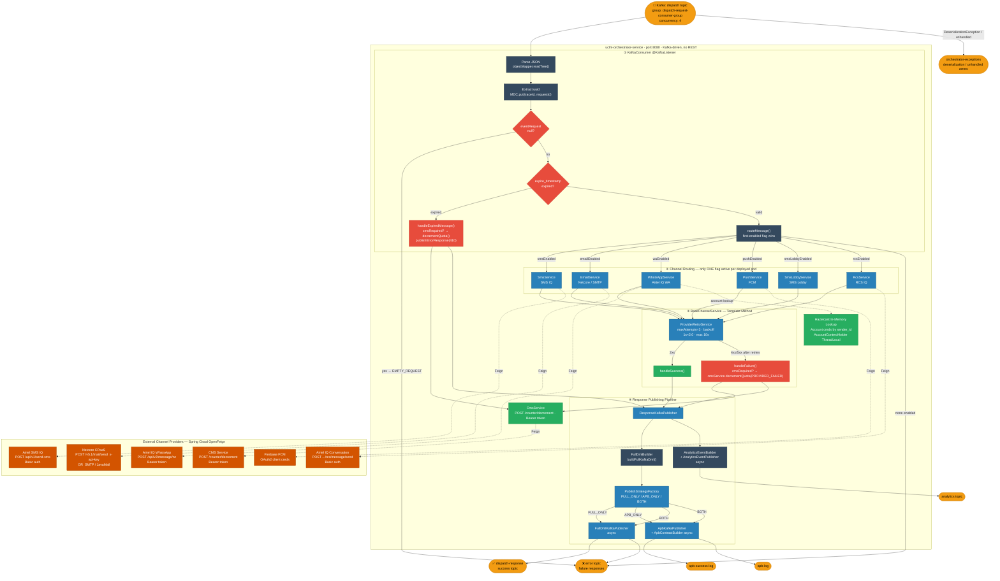
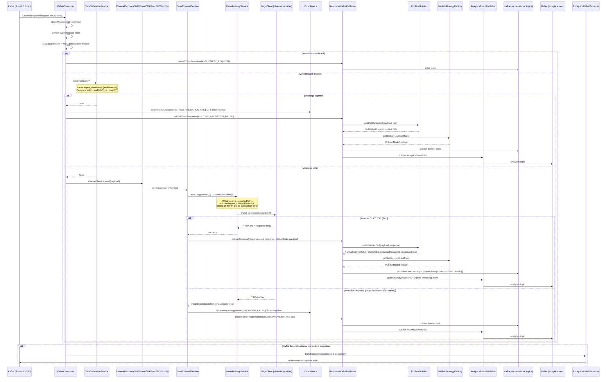
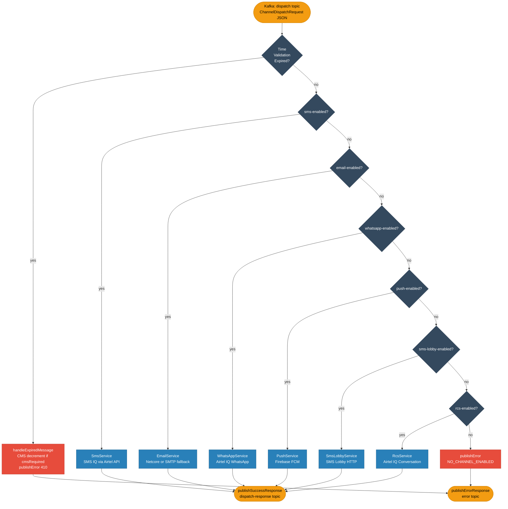
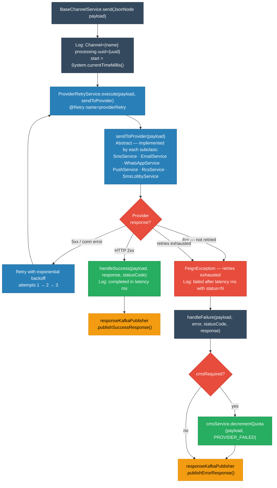
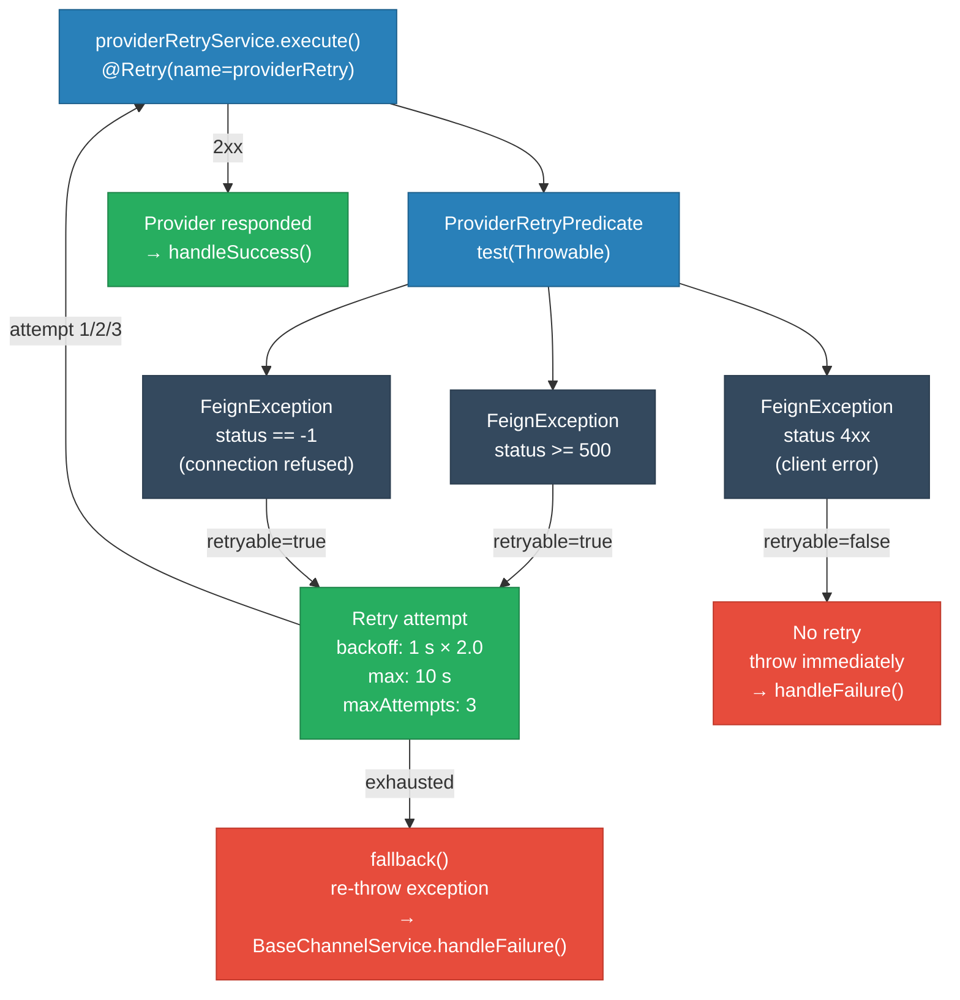
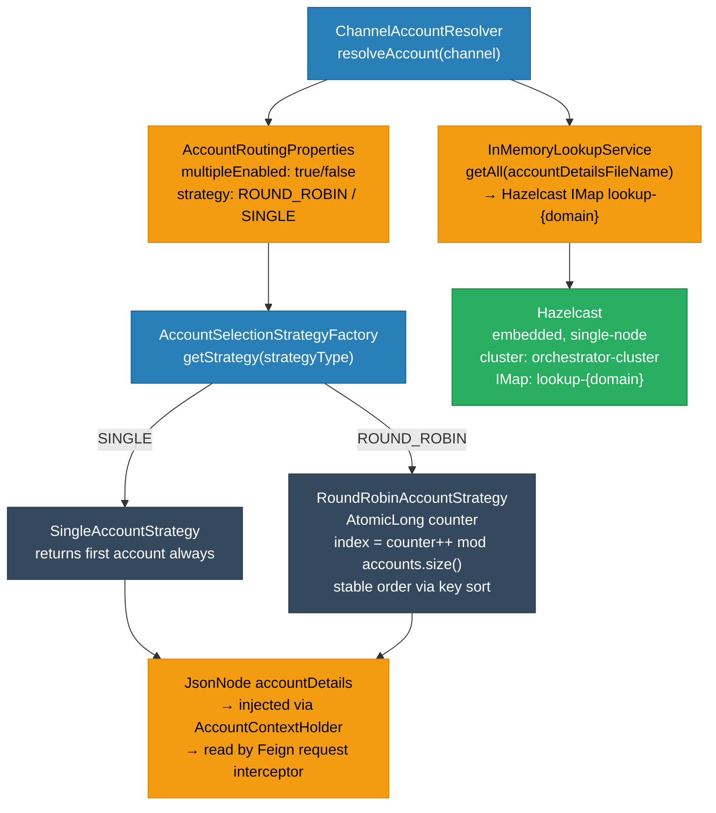
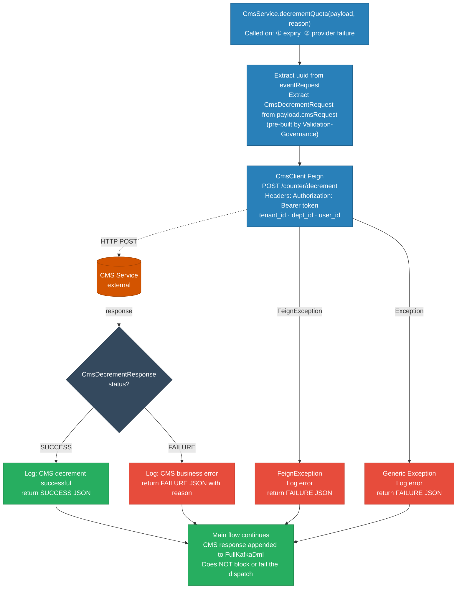
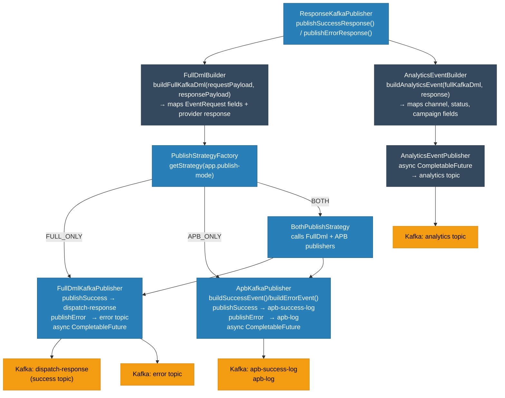
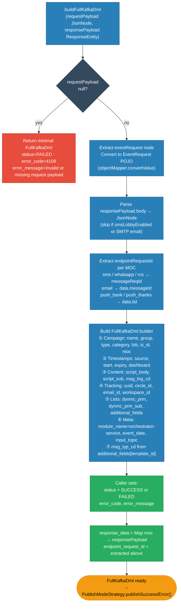

# HLD — uclm-orchestrator-service

**Role:** Multi-channel dispatch engine. Consumes validated payloads from Kafka, validates message expiry, routes to the first enabled channel provider via Feign clients, manages CMS quota decrements, and publishes structured success/error responses plus analytics events.

---

## 1. Purpose & Responsibilities

| Responsibility | Detail |
|---------------|--------|
| **Time Validation** | Rejects messages whose `expire_timestamp` is in the past (configurable timezone, multi-format support) |
| **Channel Routing** | Priority-based single-winner routing: SMS IQ → Email → WhatsApp → Push → SMS Lobby → RCS |
| **Provider Dispatch** | Calls external channel provider REST APIs via Spring Cloud OpenFeign clients |
| **Retry & Resilience** | Resilience4j `@Retry` wraps every provider call — retries only on HTTP 5xx / connection errors |
| **CMS Quota Decrement** | Decrements quota via CMS REST API on expiry or provider failure when `cmsRequired=true` |
| **Account Resolution** | Resolves sender account from Hazelcast-backed in-memory lookup; supports `SINGLE` and `ROUND_ROBIN` strategies |
| **Response Publishing** | Publishes `FullKafkaDml` to success/error topics using a configurable publish mode (`FULL_ONLY` / `APB_ONLY` / `BOTH`) |
| **APB Contract** | Builds and publishes `ApbKafkaContract` to APB success/error topics for campaign tracking |
| **Analytics** | Builds `AnalyticsEventDTO` and publishes asynchronously to the analytics Kafka topic |
| **Exception Forwarding** | On Kafka deserialization or unhandled exceptions, forwards `ExceptionEvent` to `orchestrator-exceptions` topic |

---

## 2. High-Level Architecture



---

## 3. Detailed Processing Flow



---

## 4. Channel Routing & Feature Flags



> **Important:** Only **one channel is active per deployed instance**. The flags are mutually exclusive at runtime — the first `true` flag wins. Different channel instances are deployed as separate pods in Kubernetes, each with exactly one flag enabled.

---

## 5. BaseChannelService — Template Method Pattern

All channel services extend `BaseChannelService` which provides the common lifecycle:



| Abstract Method | Description |
|----------------|-------------|
| `sendToProvider(JsonNode payload)` | Channel-specific API call logic — each subclass implements this |
| `getChannelName()` | Returns the channel enum name for logging |

---

## 6. Channel Service Implementations

### 6.1 SmsService → Airtel SMS IQ

```
Feign Client  : SmsClient
URL           : ${app.channels.sms.url}/api/v1/send-sms
Auth          : Basic (username:password)
Success code  : HTTP 200

Payload transformation (transformToSmsFormat):
  Reads from payload.channelRequest → extracts SMS API fields:
  customerId, destinationAddress, sourceAddress, messageType,
  entityId, message, dltTemplateId, urlShortenerParams, metaData
  (strips all non-SMS fields before forwarding)
```

### 6.2 EmailService → Netcore / SMTP (dual-provider)

```
Providers injected as List<EmailProvider> — Spring auto-discovers all beans

Provider 1 — NetcoreEmailProvider (when netcore.enabled=true):
  Feign Client  : NetcoreEmailClient
  URL           : ${app.channels.email.url}/v5.1/mail/send
  Auth          : x-api-key header
  Success code  : HTTP 202 (ACCEPTED)

Provider 2 — SmtpEmailProvider (when smtp.enabled=true):
  Framework     : Spring Boot Mail (JavaMail)
  Host          : ${spring.mail.host}:${spring.mail.port}
  Auth          : ${spring.mail.properties.mail.smtp.auth}
  Success code  : HTTP 202 (synthetic — SMTP has no HTTP response)

Fallback: Iterates providers in order; first to succeed wins.
```

### 6.3 WhatsAppService → Airtel IQ WhatsApp

```
Feign Client  : WhatsAppClient
URL           : ${app.channels.whatsapp.url}/api/v2/message/nc
Auth          : Bearer token (${app.channels.whatsapp.token})
Default from  : ${app.channels.whatsapp.from}

Account lookup (AccountContextHolder):
  1. Extract sender_id from eventRequest
  2. lookupService.get(wa.creds.file, sender_id) → Hazelcast IMap
  3. If not found → RuntimeException("No Account Details Found")
  4. AccountContextHolder.set(accountDetails) → picked up by WhatsAppClient interceptor
  5. Finally → AccountContextHolder.clear()

Payload: templateId, to, message, from, mediaAttachment (optional)
```

### 6.4 PushService → Firebase FCM

```
Feign Client  : PushClient
URL           : ${app.channels.push.provider-config.url}/${endpoint}
Auth          : OAuth2 (client_id + client_secret)
Success code  : responseBody.statusValue == 200

Response parsing:
  HTTP 2xx → check inner statusValue
    200 → handleSuccess()
    else → extract data.message → handleFailure()
```

### 6.5 RcsService → Airtel IQ Conversation

```
Feign Client  : RcsClient
URL           : ${app.channels.rcs.url}/gateway/.../rcs/message/send
Auth          : Basic (username:password)
Headers       : customer-id, sub-account-id, agent-id, app-id
Success code  : HTTP 200

Payload normalization:
  1. templateId present in channelRequest → use as-is (flattened structure)
  2. channelRequest.rcs nested → unwrap to rcs node (legacy)
  3. Fallback → use full payload
  4. Populate customerId + subAccountId if blank
  5. msisdn normalization: prefix "+91" if no country code
```

### 6.6 SmsLobbyService → SMS Lobby

```
Feign Client  : SmsLobbyClient
URL           : ${app.channels.sms-lobby.url}  (e.g. http://10.92.230.97:10200/cgi-bin/sendsms)
Auth          : None (internal network)
Alternate SMS dispatch route when main SMS IQ is not enabled
```

---

## 7. Retry & Resilience



| Property | Value | Description |
|----------|-------|-------------|
| `app.retry.max-attempts` | `3` | Total attempts (1 original + 2 retries) |
| `app.retry.delay-ms` | `1000` | Initial backoff delay |
| `app.retry.multiplier` | `2.0` | Exponential backoff multiplier |
| `app.retry.max-delay-ms` | `10000` | Cap on backoff delay |
| Retryable | `status == -1` or `status >= 500` | Connection errors and server errors |
| Non-retryable | `status 4xx` | Client errors — not retried |

---

## 8. Account Resolution (Hazelcast Lookup)



- Hazelcast is **embedded** (single-node, no clustering) — purely an in-memory data structure host.
- Lookup data is loaded via `InMemoryLookupService.load(domain, map)` at startup.
- `AccountContextHolder` uses a `ThreadLocal<JsonNode>` so account credentials are scoped per request thread.

---

## 9. CMS Integration



---

## 10. Response Publishing Strategy



> **Analytics exclusion:** `AnalyticsEventDTO` is **not** published for the WhatsApp channel — WA analytics are handled separately.

---

## 11. FullKafkaDml Construction

`FullDmlBuilder.buildFullKafkaDml()` maps request + provider response into a unified DML record:



| Field Group | Source | Fields |
|-------------|--------|--------|
| **Campaign metadata** | `eventRequest` | `campaign_group`, `campaign_name`, `campaign_type`, `category`, `lob`, `si_id`, `moc` |
| **Timestamps** | `eventRequest` | `source_timestamp`, `start_timestamp`, `expiry_timestamp`, `timestamps_for_dashboard` |
| **Message content** | `eventRequest` | `script_body`, `script_sub`, `msg_lng_cd`, `sender_id` |
| **Tracking** | `eventRequest` | `uuid`, `circle_id`, `email_id`, `cohort`, `event_type`, `workspace_id` |
| **Lists** | `eventRequest` | `dynmc_prm`, `dynmc_prm_sub`, `additional_fields` |
| **Status** | set by caller | `status` = `SUCCESS` / `FAILED` |
| **Provider response** | `responsePayload` | `endpointRequestId` extracted per MOC, `response_data` map |
| **Error** | set by caller | `error_code`, `error_message` |
| **Service meta** | constant | `module_name` = `orchestrator-service`, `input_topic`, `event_date` |

`endpointRequestId` extraction per MOC:

| MOC | JSON path in response |
|-----|----------------------|
| `sms`, `whatsapp`, `rcs` | `response.messageReqId` |
| `email` | `response.data.messageId` |
| `push_bank`, `push_thanks` | `response.data.tid` |

---

## 12. Analytics Event Construction

`AnalyticsEventBuilder.buildAnalyticsEvent()` normalizes fields for the analytics pipeline:

| Analytics Field | Source / Logic |
|----------------|----------------|
| `channel` | `eventRequest.moc.toUpperCase()` — PUSH_BANK / PUSH_THANKS → `PUSH` |
| `communicationStatus` | Provider response `status` field per MOC → normalized to `sent / read / delivered / initiated / failed` |
| `campaignContentType` | `category` → `promotion / service / transactional` |
| `campaignType` | `event_type` → `event / onetime / recurring` |
| `errorType` | Inferred from `error_message` content → `system / validation / governance / customer / scrubbing / template & media error` |
| `smsPart` | From `eventRequest.smsPart` (set by VG after Base64 decode) |
| `hasURL` | From `eventRequest.hasUrl` |
| `tenantID` | `${app.cms.tenant-id}` |
| `workspaceID` | `eventRequest.workspace_id` |

---

## 13. Time Validation Logic

```mermaid
flowchart TD
    START["TimeValidationService.isExpired(payload)"]
    CHK_EN{app.time.validation\n.enabled = true?}
    SKIP_EN["return false\nvalidation disabled — skip"]
    EXTRACT["Extract expire_timestamp\nfrom eventRequest node"]
    CHK_BLANK{timestamp\nblank or null?}
    SKIP_BLANK["return false\nno expiry configured"]
    TRY_DT["Try 8 datetime formats in order:\nyyyy-MM-dd HH:mm:ss.SSSSSS\nyyyy-MM-dd HH:mm:ss.SSS\nyyyy-MM-dd HH:mm:ss\nyyyy-MM-dd'T'HH:mm:ss.SSSSSS\nyyyy-MM-dd'T'HH:mm:ss.SSS\nyyyy-MM-dd'T'HH:mm:ss\nyyyy/MM/dd HH:mm:ss\ndd-MM-yyyy HH:mm:ss"]
    TRY_DO["Try date-only formats:\nyyyy-MM-dd · yyyy/MM/dd · dd-MM-yyyy\n→ treat as end-of-day 23:59:59"]
    CHK_PARSE{parse\nsucceeded?}
    WARN_LOG["Log WARN: unparseable timestamp\nreturn false — treat as not expired"]
    NOW["now = LocalDateTime.now\n(ZoneId: Asia/Kolkata)"]
    CHK_EXP{now.isAfter\n(expiry)?}
    EXPIRED["return true — EXPIRED\n→ handleExpiredMessage():\n  CMS decrement if cmsRequired\n  publishErrorResponse(410)"]
    VALID["return false — VALID\n→ routeMessage()"]

    START --> CHK_EN
    CHK_EN -->|false| SKIP_EN
    CHK_EN -->|true| EXTRACT
    EXTRACT --> CHK_BLANK
    CHK_BLANK -->|blank| SKIP_BLANK
    CHK_BLANK -->|present| TRY_DT
    TRY_DT --> TRY_DO --> CHK_PARSE
    CHK_PARSE -->|failed all formats| WARN_LOG
    CHK_PARSE -->|succeeded| NOW
    NOW --> CHK_EXP
    CHK_EXP -->|"yes — now > expiry"| EXPIRED
    CHK_EXP -->|"no — now ≤ expiry"| VALID

    classDef kafka fill:#f39c12,color:#000,stroke:#d68910
    classDef svc fill:#2980b9,color:#fff,stroke:#1f618d
    classDef db fill:#27ae60,color:#fff,stroke:#1e8449
    classDef user fill:#34495e,color:#fff,stroke:#2c3e50
    classDef stop fill:#e74c3c,color:#fff,stroke:#c0392b

    class EXPIRED stop
    class VALID,SKIP_EN,SKIP_BLANK db
    class START,EXTRACT,TRY_DT,TRY_DO,NOW svc
    class CHK_EN,CHK_BLANK,CHK_PARSE,CHK_EXP user
    class WARN_LOG kafka
```

On expiry:
1. Check `cmsRequired` flag in `eventRequest`
2. If `true` → `cmsService.decrementQuota(payload, TIME_VALIDATION_FAILED)`
3. `responseKafkaPublisher.publishErrorResponse(payload, null, 410, TIME_VALIDATION_FAILED, ...)`

---

## 14. Kafka Topic Map

| Topic | Direction | Description | Producer / Consumer |
|-------|-----------|-------------|---------------------|
| `dispatch` | IN | Validated channel dispatch requests from Val-Gov | KafkaConsumer (group: `dispatch-request-consumer-group`) |
| `dispatch-response` | OUT | `FullKafkaDml` success events | FullDmlKafkaPublisher |
| `${error topic}` | OUT | `FullKafkaDml` failure events | FullDmlKafkaPublisher |
| `apb-success-log` | OUT | `ApbKafkaContract` success events | ApbKafkaPublisher |
| `apb-log` | OUT | `ApbKafkaContract` error events | ApbKafkaPublisher |
| `analytics` | OUT | `AnalyticsEventDTO` communication events | AnalyticsEventPublisher |
| `orchestrator-exceptions` | OUT | `ExceptionEvent` for deserialization/unhandled errors | ExceptionKafkaProducer |

---

## 15. Feign Clients

| Client | Target | Endpoint | Auth |
|--------|--------|----------|------|
| `SmsClient` | Airtel SMS IQ | `POST /api/v1/send-sms` | Basic (user:pass) |
| `SmsLobbyClient` | SMS Lobby | `GET/POST /cgi-bin/sendsms` | None |
| `NetcoreEmailClient` | Netcore CPaaS | `POST /v5.1/mail/send` | `x-api-key` header |
| `WhatsAppClient` | Airtel IQ WA | `POST /api/v2/message/nc` | Bearer token |
| `PushClient` | Firebase FCM | `POST /{endpoint}` | OAuth2 client creds |
| `RcsClient` | Airtel IQ Conversation | `POST /gateway/.../rcs/message/send` | Basic (user:pass) |
| `CmsClient` | CMS Service | `POST /counter/decrement` | Bearer token |

---

## 16. Exception Handling

```
Kafka DefaultErrorHandler (FixedBackOff 0L interval, 0 retries):
  → no retry on Kafka-level errors
  → ConsumerRecordRecoverer → ExceptionKafkaProducer.sendExceptionEventAsync()

Non-retryable exceptions (go straight to recoverer):
  - GenericException
  - DeserializationException
  - ConstraintViolationException
  - MethodArgumentNotValidException
  - RecordDeserializationException

handler.setCommitRecovered(true) → offset is committed even on recovery
```

`ExceptionEvent` fields: `exceptionType`, `code`, `message`, `stackTrace`, `originalPayload`

---

## 17. Data Models

### Input: ChannelDispatchRequest (consumed from `dispatch` topic)

| Field | Type | Description |
|-------|------|-------------|
| `eventRequest` | `EventRequest` | Full enriched event from upstream pipeline |
| `channelRequest` | `Object` | Channel-specific payload built by Val-Gov |
| `cmsRequest` | `CmsDecrementRequest` | Pre-built CMS decrement payload (from Val-Gov) |

### EventRequest (inner object)

| Field | Type | Description |
|-------|------|-------------|
| `uuid` | String | Unique message identifier |
| `moc` | String | Mode of communication: `sms / email / whatsapp / push_bank / push_thanks / rcs` |
| `si_id` | String | Subscriber identity (mobile number) |
| `email_id` | String | Target email address |
| `campaign_name` | String | Campaign name |
| `campaign_type` | String | Campaign goal type |
| `category` | String | `PROMOTION / TRANSACTIONAL / SERVICE / SERVICE_EXPLICIT` |
| `event_type` | String | `event / onetime / recurring` |
| `expire_timestamp` | String | Message expiry (multi-format, validated by TimeValidationService) |
| `source_timestamp` | String | Event creation timestamp from upstream |
| `sender_id` | String | Sender ID (used for WA account lookup) |
| `cmsRequired` | boolean | Whether CMS quota decrement is needed |
| `workspace_id` | String | Workspace / tenant identifier |
| `dynmc_prm` | `List<DynamicParam>` | Template personalisation parameters |
| `additional_fields` | `List<AdditionalFields>` | Extra key-value pairs (includes `template_id`) |
| `mediaAttachment` | `List<MediaAttachments>` | Media attachments (URL, MIME type, extension) |

### FullKafkaDml (output to success/error topics)

| Field | Type | Description |
|-------|------|-------------|
| `uuid` | String | Message UUID |
| `moc` | String | Channel name |
| `status` | String | `SUCCESS` / `FAILED` |
| `error_code` | String | HTTP status code string on failure |
| `error_message` | String | Human-readable error description |
| `endpoint_request_id` | String | Provider-assigned message ID |
| `response_data` | `Map<String, Object>` | Raw provider response keyed by MOC |
| `module_name` | String | `orchestrator-service` |
| `event_date` | String | `yyyy-MM-dd` of processing |
| `input_topic` | String | `dispatch` |
| `input_received` | String | Raw JSON of the input payload |

### ApbKafkaContract (output to apb topics)

| Field | Type | Description |
|-------|------|-------------|
| `data.si` | String | Subscriber identity |
| `data.channel` | String | Channel/category |
| `data.name` | String | Campaign name |
| `data.status` | String | `SUCCESS` / `FAILED` |
| `data.templateId` | String | Template identifier |
| `data.type` | String | Campaign type |
| `errors` | `List<Errors>` | Error code + message (empty on success) |
| `meta.app` | String | `orchestrator-service` |
| `meta.requestId` | String | Provider endpoint request ID |
| `meta.traceId` | String | Message UUID |
| `meta.timestamp` | String | ISO-8601 instant |

---

## 18. Error Types & Failure Reasons

| ErrorType | HTTP Status | FailureReason | Trigger |
|-----------|-------------|---------------|---------|
| `TIME_VALIDATION_FAILED` | 410 | `TIME_VALIDATION_FAILED` | `expire_timestamp` is in the past |
| `NETWORK_ERROR` | provider status | `PROVIDER_FAILED` | Provider API fails after all retries |
| `CHANNEL_DISABLED` | 503 | `NO_CHANNEL_ENABLED` | All channel flags are `false` |
| `REQUEST_PARSE_ERROR` | 4109 | — | Kafka message JSON parse failure |
| `EMPTY_REQUEST` | 4109 | — | `eventRequest` node is null/missing |

---

## 19. Component Map

| Class | Package | Responsibility |
|-------|---------|----------------|
| `KafkaConsumer` | `kafka` | Entry point; time validation; channel routing dispatcher |
| `TimeValidationService` | `service.impl` | Multi-format `expire_timestamp` parsing and expiry check |
| `BaseChannelService` | `service.impl` | Template pattern: retry orchestration, success/failure lifecycle |
| `SmsService` | `service.impl` | Payload transformation + SMS IQ dispatch via `SmsClient` |
| `EmailService` | `service.impl` | Multi-provider iteration (Netcore → SMTP) |
| `NetcoreEmailProvider` | `service.impl` | Netcore API implementation of `EmailProvider` |
| `SmtpEmailProvider` | `service.impl` | JavaMail SMTP implementation of `EmailProvider` |
| `WhatsAppService` | `service.impl` | Account lookup + WA API dispatch via `WhatsAppClient` |
| `PushService` | `service.impl` | FCM push dispatch; inner-response status parsing |
| `RcsService` | `service.impl` | MSISDN normalization + RCS API dispatch via `RcsClient` |
| `SmsLobbyService` | `service.impl` | Alternative SMS route via `SmsLobbyClient` |
| `CmsService` | `service.impl` | CMS quota decrement via `CmsClient` |
| `ChannelAccountResolver` | `service.impl` | Resolves sender account from Hazelcast lookup |
| `AccountSelectionStrategyFactory` | `service.impl` | Strategy selector: `SINGLE` or `ROUND_ROBIN` |
| `RoundRobinAccountStrategy` | `service.impl` | Thread-safe round-robin via `AtomicLong` counter |
| `SingleAccountStrategy` | `service.impl` | Always returns the first account |
| `InMemoryLookupService` | `service.impl` | Hazelcast `IMap` wrapper for domain-keyed lookups |
| `AccountContextHolder` | `service.impl` | `ThreadLocal<JsonNode>` for per-request account scoping |
| `ProviderRetryService` | `resilience` | Resilience4j `@Retry` wrapper for provider calls |
| `ProviderRetryPredicate` | `resilience` | Retry predicate: retries on 5xx and connection failures |
| `ResponseKafkaPublisher` | `kafka` | Orchestrates `FullDmlBuilder` → `PublishStrategy` → `Analytics` |
| `FullDmlBuilder` | `service.impl` | Maps `EventRequest` + provider response into `FullKafkaDml` |
| `ApbContractBuilder` | `service.impl` | Builds `ApbKafkaContract` from `FullKafkaDml` |
| `AnalyticsEventBuilder` | `service.impl` | Builds `AnalyticsEventDTO` with normalized status/channel/type |
| `AnalyticsEventPublisher` | `service.impl` | Async Kafka publish to analytics topic |
| `FullDmlKafkaPublisher` | `kafka` | Async publish of `FullKafkaDml` to success/error topics |
| `ApbKafkaPublisher` | `kafka` | Async publish of `ApbKafkaContract` to APB topics |
| `PublishStrategyFactory` | `service.impl` | Returns `FULL_ONLY` / `APB_ONLY` / `BOTH` strategy |
| `BothPublishStrategy` | `service.impl` | Delegates to both `FullDmlKafkaPublisher` + `ApbKafkaPublisher` |
| `ExceptionKafkaProducer` | `kafka` | Async publish of `ExceptionEvent` to exceptions topic |
| `KafkaErrorHandler` | `exception` | Builds `ExceptionEvent` from `ConsumerRecord` + exception |
| `AppConfig` | `config` | All feature flags and configuration binding |
| `KafkaConsumerConfiguration` | `config` | Consumer factory, error handler, listener container factory |
| `KafkaProducerConfiguration` | `config` | Producer factory and `KafkaTemplate` |
| `KafkaSecurityConfig` | `config` | Kerberos JAAS config for UAT/Prod |
| `HazelCastConfig` | `config` | Embedded Hazelcast instance configuration |
| `AccountRoutingProperties` | `config` | `multipleEnabled` + `strategy` binding |

---

## 20. Configuration Reference

| Property | Default | Description |
|----------|---------|-------------|
| `server.port` | `8080` | HTTP port (Actuator only — no REST API) |
| `app.kafka.topics.request` | `dispatch` | Input topic from Val-Gov |
| `app.kafka.topics.success.response` | `dispatch-response` | Success output topic |
| `app.kafka.topics.error.response` | _(profile-specific)_ | Error output topic |
| `app.kafka.topics.apb.response` | `apb-log` | APB error topic |
| `app.kafka.topics.apb.success` | `apb-success-log` | APB success topic |
| `analytics.kafka.topic` | `analytics` | Analytics output topic |
| `kafka.topic.exception` | `orchestrator-exceptions` | Exception forwarding topic |
| `kafka.consumer.group-id` | `dispatch-request-consumer-group` | Kafka consumer group |
| `kafka.consumer.concurrency` | `4` | Number of parallel consumer threads |
| `app.channels.sms-enabled` | `false` | Enable SMS IQ channel routing |
| `app.channels.email-enabled` | `false` | Enable Email channel routing |
| `app.channels.whatsapp-enabled` | `false` | Enable WhatsApp channel routing |
| `app.channels.push-enabled` | `true` | Enable Push channel routing |
| `app.channels.rcs-enabled` | `false` | Enable RCS channel routing |
| `app.channels.sms-lobby-enabled` | `false` | Enable SMS Lobby routing |
| `app.channels.email.netcore.enabled` | `true` | Use Netcore as email provider |
| `app.channels.email.smtp.enabled` | `false` | Use SMTP as email provider |
| `app.publish-mode` | `BOTH` | `FULL_ONLY` / `APB_ONLY` / `BOTH` |
| `app.time.validation.enabled` | `true` | Enable expire_timestamp check |
| `app.time.validation.timezone` | `Asia/Kolkata` | Timezone for expiry comparison |
| `app.retry.max-attempts` | `3` | Max provider retry attempts |
| `app.retry.delay-ms` | `1000` | Initial retry delay (ms) |
| `app.retry.multiplier` | `2.0` | Exponential backoff multiplier |
| `app.retry.max-delay-ms` | `10000` | Max retry delay cap (ms) |
| `app.cms.api.base-url` | _(profile-specific)_ | CMS service base URL |
| `app.cms.api.auth-token` | _(profile-specific)_ | Bearer token for CMS API |
| `app.cms.tenant-id` | _(profile-specific)_ | Tenant ID for analytics events |
| `account.details.file.name` | _(profile-specific)_ | Hazelcast domain key for account lookup |
| `account.routing.multiple-enabled` | `false` | Enable multi-account round-robin |
| `account.routing.strategy` | `SINGLE` | Account selection: `SINGLE` / `ROUND_ROBIN` |
