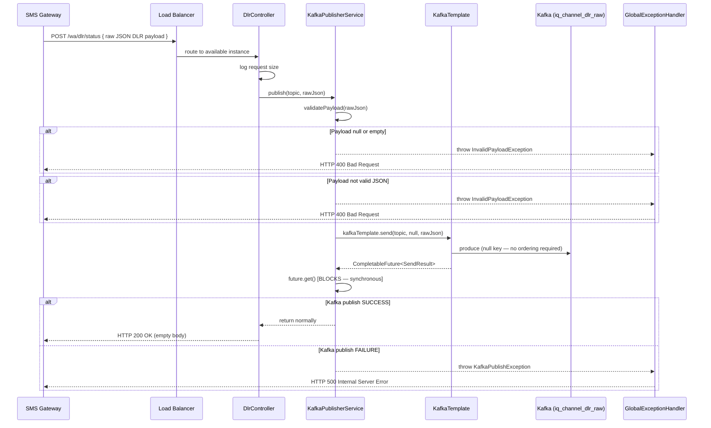

# HLD — uclm-dlr-api-service

**Role:** Stateless HTTP webhook receiver for SMS/WA Delivery Reports (DLRs) from channel providers. Validates JSON payload and synchronously publishes to Kafka with guaranteed delivery.

---

## 1. Purpose & Responsibilities

| Responsibility | Detail |
|---------------|--------|
| **Webhook Reception** | Accepts POST requests from SMS gateways (Airtel IQ, Twilio, etc.) |
| **Payload Validation** | Validates non-empty body and valid JSON format |
| **Kafka Publishing** | Synchronous publish with `acks=all`, idempotent producer |
| **Error Handling** | Returns appropriate HTTP status codes to gateway for retry logic |
| **Horizontal Scaling** | Stateless — multiple instances behind ALB / K8s Ingress |
| **Health Probes** | Liveness and readiness endpoints for Kubernetes |

---

## 2. High-Level Architecture

```
┌──────────────────────────────────────────────────────────────────────────────────┐
│  SMS Gateway Providers                                                           │
│  (Airtel IQ, Twilio, Vonage, etc.)                                               │
└──────────────────────────────────┬───────────────────────────────────────────────┘
                                   │ HTTP POST (Webhook)
                                   │ /wa/dlr/status  (or configured path)
                                   ▼
┌─────────────────────────────────────────────────────────────────────────────────┐
│  Load Balancer / K8s Ingress                                                    │
└──────────────────────┬────────────────────┬────────────────────┬───────────────┘
                       │                    │                    │
          ┌────────────▼─────────┐  ┌───────▼──────────┐  ┌────▼─────────────┐
          │ DLR API Instance 1   │  │ DLR API Instance 2│  │ DLR API Instance 3│
          │                      │  │                   │  │                  │
          │ DlrController        │  │ DlrController     │  │ DlrController    │
          │  → KafkaPublisher    │  │  → KafkaPublisher │  │  → KafkaPublisher│
          └──────────┬───────────┘  └──────┬────────────┘  └───────┬──────────┘
                     │                     │                        │
                     └─────────────────────┼────────────────────────┘
                                           │
                                           ▼
                     ┌─────────────────────────────────────────────┐
                     │  Apache Kafka Cluster                       │
                     │  Topic: iq_channel_dlr_raw                  │
                     │  acks=all · idempotent · retries configured  │
                     └─────────────────────────────────────────────┘
                                           │
                                           ▼
                                  DLR Enricher Service
```

---

## 3. Detailed Processing Flow



---

## 4. API Endpoints

| Method | Path | Description |
|--------|------|-------------|
| `POST` | `/wa/dlr/status` | Primary DLR webhook (configurable via `app.api.endpoint.dlr-status`) |
| `GET` | `/actuator/health/liveness` | Kubernetes liveness probe |
| `GET` | `/actuator/health/readiness` | Kubernetes readiness probe |
| `GET` | `/actuator/health` | Full Spring Boot health status |

**Default endpoint path:** `/wa/dlr/status`  
**Configurable via:** `app.api.endpoint.dlr-status` property

---

## 5. Kafka Producer Configuration

| Setting | Value | Purpose |
|---------|-------|---------|
| `acks` | `all` | Wait for all in-sync replica acknowledgment |
| `enable.idempotence` | `true` | Prevent duplicate messages on retry |
| `retries` | Configured | Number of automatic retries |
| `key.serializer` | `StringSerializer` | Message key (null — no ordering) |
| `value.serializer` | `StringSerializer` | Raw JSON string |
| `security.protocol` | `SASL_PLAINTEXT` (UAT/Prod) | Kerberos auth |
| `sasl.mechanism` | `GSSAPI` (UAT/Prod) | Kerberos mechanism |

---

## 6. Payload Validation Logic

```java
// KafkaPublisherService.validatePayload(payload)

// Step 1: Null / empty check
if (!StringUtils.hasText(payload)):
    throw InvalidPayloadException("Payload cannot be null or empty")

// Step 2: JSON format check
try:
    objectMapper.readTree(payload)  // Jackson parse attempt
catch:
    throw InvalidPayloadException("Payload must be valid JSON format: ...")
```

**The service accepts ANY valid JSON** — it does not enforce a specific schema.  
Schema validation is deferred to the downstream DLR Enricher.

---

## 7. Error Handling

### GlobalExceptionHandler

| Exception | HTTP Status | Response |
|-----------|-------------|---------|
| `InvalidPayloadException` | `400 Bad Request` | `{ "error": "...", "message": "..." }` |
| `KafkaPublishException` | `500 Internal Server Error` | `{ "error": "...", "message": "..." }` |
| Unhandled exceptions | `500 Internal Server Error` | Generic error |

### Gateway Retry Behaviour

| DLR API Response | Gateway Action |
|-----------------|---------------|
| `200 OK` | DLR delivered — no retry |
| `400 Bad Request` | Invalid payload — gateway should NOT retry (permanent error) |
| `500 Internal Server Error` | Kafka failure — gateway SHOULD retry |

---

## 8. Scalability

The service is fully **stateless** — no database, no in-memory state, no session.

```
Horizontal scaling via Kubernetes:
  - Multiple replicas behind K8s Ingress or AWS ALB
  - Each instance independently validates and publishes
  - Kafka partitioning handles ordering (if needed, use mobile number as key)

Current config: null key (round-robin partition assignment)
```

---

## 9. Raw DLR Message Format

The service publishes **raw JSON as-is** to Kafka. Common DLR fields:

| Field | Type | Description |
|-------|------|-------------|
| `requestId` | String | Original message request ID (correlates to dispatch) |
| `mobile` | String | Target mobile number |
| `status` | String | `DELIVERED`, `FAILED`, `PENDING`, `BUFFERED` |
| `deliveredAt` | String | Delivery timestamp |
| `errorCode` | String | Provider error code (on failure) |
| `providerRef` | String | Provider's reference ID |
| `gatewayRef` | String | Gateway internal reference |

---

## 10. Component Map

| Class | Package | Responsibility |
|-------|---------|---------------|
| `DlrController` | controller | REST endpoint — receives DLR POST, calls publisher |
| `KafkaPublisherService` | service | Validates payload, synchronously publishes to Kafka |
| `KafkaProducerConfig` | config | Configures KafkaTemplate with acks=all, idempotence |
| `GlobalExceptionHandler` | exception | Maps exceptions to HTTP responses |
| `InvalidPayloadException` | exception | Thrown when payload is empty or invalid JSON |
| `KafkaPublishException` | exception | Thrown when Kafka publish fails |
| `HealthController` | health | `/actuator/health` endpoints |

---

## 11. Configuration Reference

| Property | Default | Description |
|----------|---------|-------------|
| `server.port` | `8080` | HTTP port |
| `topics.raw-dlr` | `iq_channel_dlr_raw` | Kafka output topic |
| `app.api.endpoint.dlr-status` | `/wa/dlr/status` | DLR webhook path |
| `kafka.bootstrap.servers` | — | Kafka broker addresses |
| `kafka.principal.user` | — | Kerberos principal (UAT/Prod) |
| `key.tab.value` | — | Keytab file path (UAT/Prod) |
