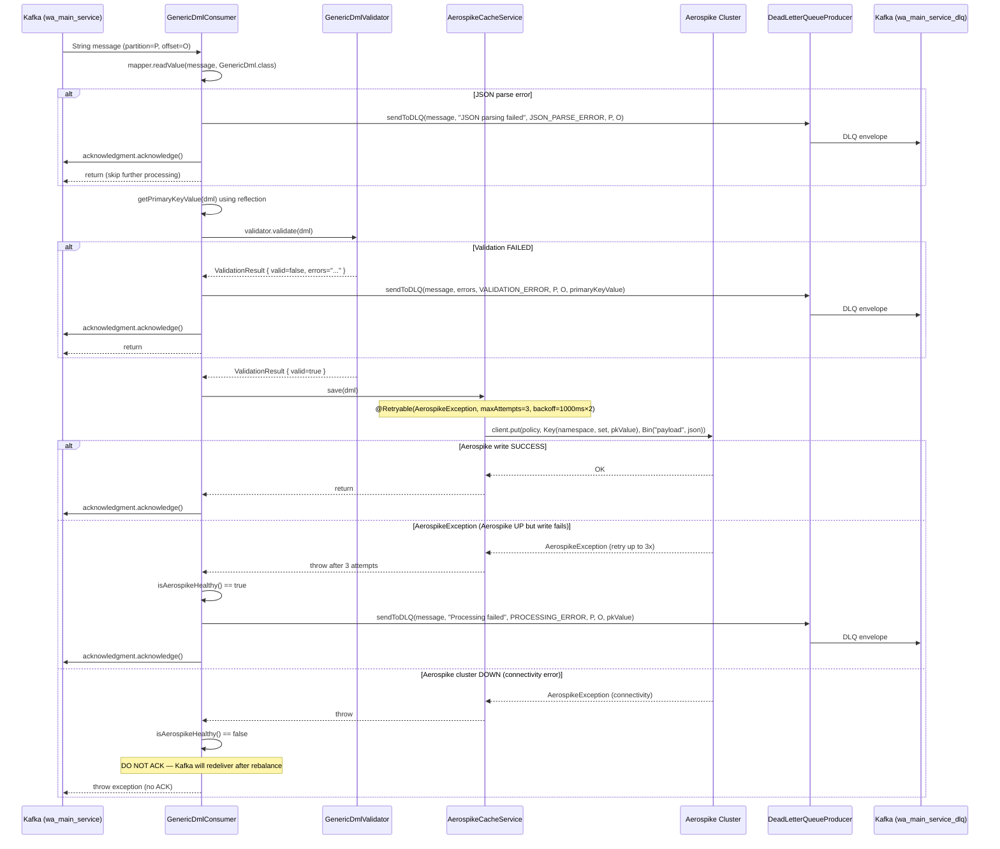

# HLD — uclm-dlr-aerospike-cache-loader

**Role:** Kafka-to-Aerospike pipeline. Consumes dispatch records, validates required fields, and writes them to Aerospike NoSQL so the DLR Enricher can correlate incoming DLRs with their original dispatch context.

---

## 1. Purpose & Responsibilities

| Responsibility | Detail |
|---------------|--------|
| **Cache Building** | Stores full dispatch records in Aerospike keyed by request ID / UUID |
| **Manual Offset Control** | ACKs Kafka only after successful write — prevents data loss |
| **Validation** | Validates required fields before attempting to write |
| **Retry on Aerospike Failure** | 3 attempts with exponential backoff (1s → 2s → 4s) |
| **DLQ Routing** | Permanently failed records go to DLQ topic |
| **Aerospike DOWN Guard** | Does NOT ACK when Aerospike is unreachable — Kafka auto-retries |
| **DLQ Recovery** | `DeadLetterQueueConsumer` for manual inspection and replay |

---

## 2. High-Level Architecture

```
┌──────────────────────────────────────────────────────────────────────────────────┐
│                AEROSPIKE CACHE LOADER SERVICE                                    │
│                                                                                  │
│  GenericDmlConsumer                                                              │
│  @KafkaListener(topic=wa_main_service)                                           │
│  ┌───────────────────────────────────────────────────────────────────────────┐   │
│  │                                                                           │   │
│  │  consume(message, partition, offset, Acknowledgment)                     │   │
│  │    ├── 1. mapper.readValue(message, GenericDml.class)                    │   │
│  │    │       └── JsonProcessingException → DLQ → ACK                      │   │
│  │    │                                                                     │   │
│  │    ├── 2. validator.validate(dml)                                        │   │
│  │    │       └── invalid → DLQ → ACK                                      │   │
│  │    │                                                                     │   │
│  │    ├── 3. cacheService.save(dml)   ← @Retryable(3x, 1s*2)               │   │
│  │    │       ├── SUCCESS → ACK                                             │   │
│  │    │       ├── AerospikeException (UP but write fails) → DLQ → ACK     │   │
│  │    │       └── Aerospike DOWN → throw → DO NOT ACK (Kafka retries)      │   │
│  │    └── 4. acknowledgment.acknowledge()                                  │   │
│  └───────────────────────────────────────────────────────────────────────────┘   │
│                                                                                  │
│  AerospikeCacheService                                                           │
│  ┌───────────────────────────────────────────────────────────────────────────┐   │
│  │  save(dml)                                                                │   │
│  │    key   = new Key(namespace, set, primaryKeyValue)                      │   │
│  │    bin   = new Bin("payload", json)    ← full object as JSON string      │   │
│  │    policy.expiration = ttlSeconds                                        │   │
│  │    client.put(policy, key, bin)                                          │   │
│  └───────────────────────────────────────────────────────────────────────────┘   │
└──────────────────────────────────────────────────────────────────────────────────┘
           │                            │
           ▼                            ▼
  ┌─────────────────┐         ┌──────────────────────────┐
  │  Aerospike      │         │  DLQ: wa_main_service_dlq│
  │  Cluster        │         │  (DLQ envelope with error │
  │  namespace/set  │         │   code + original message)│
  └─────────────────┘         └──────────────────────────┘
```

---

## 3. Detailed Processing Flow



---

## 4. Aerospike Write Details

```
Key construction:
  namespace  = ${aerospike.namespace}       e.g. "uclm"
  set        = ${aerospike.set}             e.g. "dispatch_cache"
  primaryKey = getPrimaryKeyValue(dml)      e.g. dml.getRequestId() via reflection

  getPrimaryKeyValue() uses reflection:
    getterName = "get" + capitalize(aerospike.primarykey)
    e.g. aerospike.primarykey=requestId → dml.getRequestId()

Record structure:
  Single Bin: "payload" → full GenericDml serialized as JSON string
  TTL: ${aerospike.ttl-seconds}  (records expire automatically)

Write Policy:
  policy.expiration = ttlSeconds
```

---

## 5. Retry Policy

`@Retryable` on `AerospikeCacheService.save()`:

```
retryFor     = AerospikeException.class
maxAttempts  = 3
backoff      = @Backoff(delay=1000, multiplier=2)

Timeline:
  Attempt 1  → immediate
  Attempt 2  → 1000ms delay
  Attempt 3  → 2000ms delay
  After 3 failures → recoverer sends to DLQ
```

---

## 6. Aerospike DOWN vs Aerospike Error

| Scenario | Detection | Action |
|----------|-----------|--------|
| Aerospike cluster unreachable | `AerospikeHealthIndicator.isHealthy() == false` | Throw exception, **NO ACK** — Kafka retries on rebalance |
| Aerospike UP but write fails | `AerospikeException` after 3 retries | Send to DLQ, **ACK** |
| JSON parse error | `JsonProcessingException` | Send to DLQ immediately, **ACK** |
| Validation failure | `ValidationResult.isValid() == false` | Send to DLQ immediately, **ACK** |

---

## 7. DLQ Envelope Structure

```json
{
  "originalPayload": { ... original GenericDml or raw string ... },
  "errorCode": "VALIDATION_ERROR | JSON_PARSE_ERROR | PROCESSING_ERROR",
  "errorMessage": "...",
  "partition": 2,
  "offset": 1234,
  "primaryKeyValue": "uuid-xxx",
  "timestamp": "2024-01-01T12:00:00Z",
  "serviceId": "aerospike-cache-loader"
}
```

---

## 8. Data Model — GenericDml

`GenericDml` is the main data carrier. It holds the full dispatch record:

| Field | Type | Description |
|-------|------|-------------|
| `requestId` | String | Primary key for Aerospike lookup by DLR Enricher |
| `uuid` | String | Message UUID |
| `channel` | String | SMS / WA / EMAIL / PUSH / RCS |
| `mobile` | String | Target mobile number |
| `campaignId` | String | Campaign identifier |
| `templateId` | String | Template used |
| `tenantId` | String | Tenant identifier |
| `teamId` | String | Team identifier |
| `sentAt` | Long | Epoch timestamp of dispatch |
| *(additional fields)* | ANY | All fields preserved including null/blank values |

---

## 9. Component Map

| Class | Package | Responsibility |
|-------|---------|---------------|
| `GenericDmlConsumer` | kafka | Main Kafka listener; orchestrates consume → validate → write → ACK |
| `AerospikeCacheService` | service | `@Retryable` Aerospike write with TTL |
| `GenericDmlValidator` | validation | Validates required fields on GenericDml |
| `DeadLetterQueueProducer` | kafka | Publishes DLQ envelopes to DLQ topic |
| `DeadLetterQueueConsumer` | kafka | Consumes DLQ for manual inspection / replay |
| `AerospikeHealthIndicator` | health | Reports Aerospike cluster health |
| `AerospikeConfig` | config | Configures AerospikeClient (host, port, namespace) |
| `KafkaConsumerConfig` | config | Manual ACK listener container factory |
| `RetryConfig` | config | Configures Spring Retry template |
| `VaultReader` | config | Reads secrets from Vault (Aerospike credentials) |
| `HealthController` | health | `/actuator/health` endpoints |

---

## 10. Configuration Reference

| Property | Description |
|----------|-------------|
| `topics.main-service` | Input Kafka topic (`wa_main_service`) |
| `topics.dlq` | DLQ topic (`wa_main_service_dlq`) |
| `aerospike.host` | Aerospike cluster host |
| `aerospike.port` | Aerospike cluster port (default 3000) |
| `aerospike.namespace` | Aerospike namespace |
| `aerospike.set` | Aerospike set name |
| `aerospike.ttl-seconds` | Record TTL in seconds |
| `aerospike.primarykey` | Field name used as Aerospike primary key (e.g. `requestId`) |
| `kafka.bootstrap.servers` | Kafka broker addresses |
| `kafka.consumer.group-id` | Consumer group ID |
