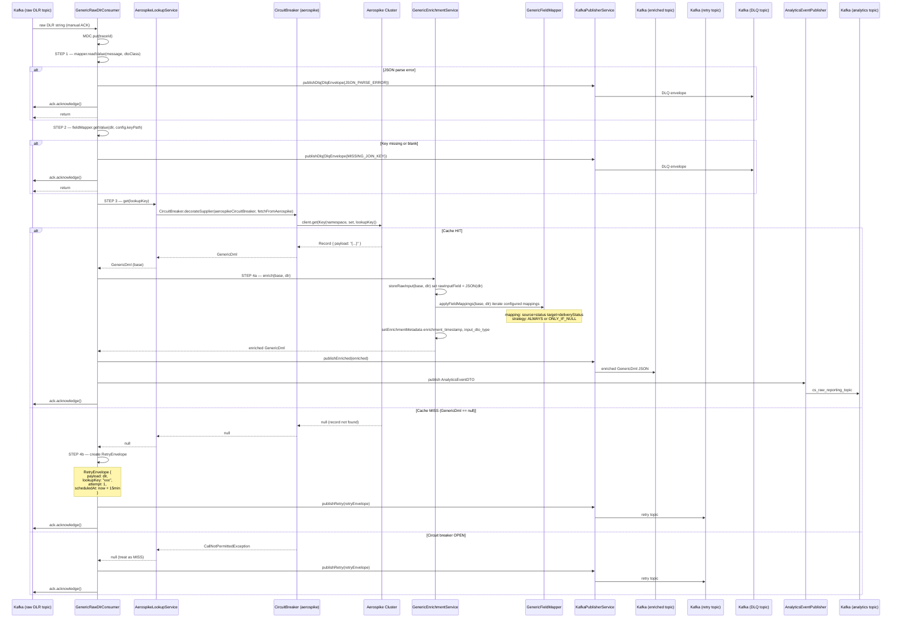
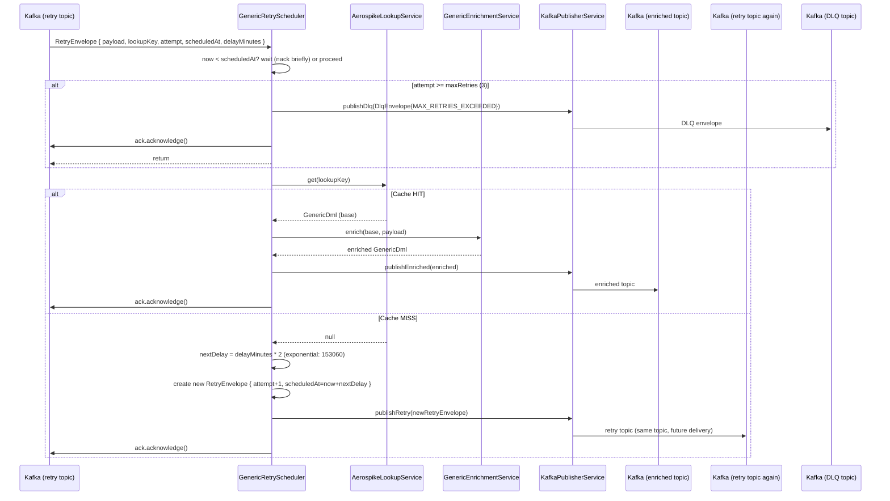

# HLD — uclm-dlr-enricher

**Role:** Kafka-to-Kafka DLR enrichment pipeline. Correlates raw DLRs with original dispatch records from Aerospike cache, enriches the DLR with full context, and publishes enriched records downstream. Handles cache misses via exponential-backoff retry scheduling.

---

## 1. Purpose & Responsibilities

| Responsibility | Detail |
|---------------|--------|
| **DLR Correlation** | Joins raw DLR (from gateway) with dispatch record (from Aerospike) using a configurable join key |
| **Field Enrichment** | Merges DLR fields into dispatch record using configurable field mapping + overwrite strategy |
| **Cache Miss Retry** | Schedules retries with exponential backoff (15 → 30 → 60 min) when Aerospike record not yet loaded |
| **Circuit Breaker** | Protects Aerospike from cascading failures via Resilience4j CircuitBreaker |
| **Manual Offset ACK** | Commits Kafka offset only after successful publish — zero data loss |
| **DLQ Routing** | Routes non-retriable errors (parse, missing key, max retries) to DLQ |
| **Analytics** | Publishes `AnalyticsEventDTO` to reporting topic on successful enrichment |
| **Generic Design** | Fully configurable DTO class, key path, field mappings via `application.yml` |

---

## 2. High-Level Architecture

```
┌────────────────────────────────────────────────────────────────────────────────────┐
│                         DLR ENRICHER SERVICE                                       │
│                                                                                    │
│  ┌─────────────────────────────────────────────────────────────────────────────┐   │
│  │  GenericRawDlrConsumer                                                      │   │
│  │  @KafkaListener(topic=${topics.raw})                                        │   │
│  │                                                                             │   │
│  │  consumeRaw(message, Acknowledgment ack)                                   │   │
│  │    ├── STEP 1: Parse JSON → DTO (dtoClass from config)                     │   │
│  │    │     └── JsonProcessingException → DLQ → ACK                          │   │
│  │    ├── STEP 2: Extract lookup key from configured key path                  │   │
│  │    │     └── Missing / blank key → DLQ → ACK                              │   │
│  │    ├── STEP 3: AerospikeLookupService.get(lookupKey)                       │   │
│  │    │     └── CircuitBreaker protected                                      │   │
│  │    ├── STEP 4a: Cache HIT → GenericEnrichmentService.enrich(base, dlr)    │   │
│  │    │              → publisher.publishEnriched(enriched)                   │   │
│  │    │              → analyticsEventPublisher.publish()                     │   │
│  │    │              → ack.acknowledge()                                     │   │
│  │    └── STEP 4b: Cache MISS → publisher.publishRetry(RetryEnvelope)        │   │
│  │                               → ack.acknowledge()                         │   │
│  └─────────────────────────────────────────────────────────────────────────────┘   │
│                                                                                    │
│  ┌─────────────────────────────────────────────────────────────────────────────┐   │
│  │  GenericRetryScheduler                                                      │   │
│  │  @KafkaListener(topic=${topics.retry})                                      │   │
│  │                                                                             │   │
│  │  consumeRetry(message, Acknowledgment ack)                                 │   │
│  │    ├── Deserialize RetryEnvelope { payload, lookupKey, attempt, scheduledAt}│   │
│  │    ├── Wait until scheduledAt (if not yet reached → nack + brief wait)    │   │
│  │    ├── attempt >= maxRetries → DLQ → ACK                                  │   │
│  │    ├── AerospikeLookupService.get(lookupKey)                               │   │
│  │    ├── Cache HIT → enrich + publish + ACK                                 │   │
│  │    └── Cache MISS → publish new RetryEnvelope with increased delay → ACK  │   │
│  └─────────────────────────────────────────────────────────────────────────────┘   │
└────────────────────────────────────────────────────────────────────────────────────┘
           │                    │                    │
           ▼                    ▼                    ▼
  ┌──────────────┐    ┌──────────────────┐    ┌──────────────────────┐
  │  Aerospike   │    │  enriched-dlr    │    │  cs_raw_reporting    │
  │  Cluster     │    │  topic           │    │  topic (analytics)   │
  └──────────────┘    └──────────────────┘    └──────────────────────┘
```

---

## 3. Detailed Processing Flow — Raw Consumer



---

## 4. Retry Flow — GenericRetryScheduler



**Retry Schedule:**

| Attempt | Delay | Cumulative Wait |
|---------|-------|----------------|
| 1 (initial) | 15 min | 15 min |
| 2 | 30 min | 45 min |
| 3 | 60 min | 105 min (~1.75 hrs) |
| After 3 | → DLQ | — |

---

## 5. Enrichment Details — GenericEnrichmentService

### Field Mapping (configurable in yml)

```yaml
generic-message:
  dto-class-name: com.generic.dlrenricher.dto.WhatsAppMessageDto
  key-path: requestId
  raw-input-field: raw_dlr_json

  field-mappings:
    - source: status
      target: deliveryStatus
      overwrite: ALWAYS
    - source: deliveredAt
      target: deliveryTime
      overwrite: ONLY_IF_NULL
    - source: errorCode
      target: failureCode
      overwrite: ALWAYS
```

### Overwrite Strategies

| Strategy | Behaviour |
|----------|-----------|
| `ALWAYS` | Overwrites target field regardless of existing value |
| `ONLY_IF_NULL` | Only sets target if existing value is null/blank/empty |

### Enrichment Metadata (always set)

| Field | Value |
|-------|-------|
| `enrichment_timestamp` | ISO-8601 UTC timestamp of enrichment |
| `input_dto_type` | Simple class name of input DLR DTO |
| `raw_dlr_json` | Full JSON string of original DLR (if `raw-input-field` configured) |

### Nested Path Support

```
source: "metadata.requestId"  → dlr.getMetadata().getRequestId()
source: "status"              → dlr.getStatus()
```

---

## 6. Aerospike Lookup — AerospikeLookupService

```
Read Operation:
  Key key = new Key(namespace, set, lookupKey)
  Record record = client.get(null, key)
  
  if record == null:
    return null  (legitimate MISS — not an error)
  
  String json = record.getString("payload")
  return objectMapper.readValue(json, GenericDml.class)

Circuit Breaker (Resilience4j):
  Opens on: AerospikeConnectivityException (network-level failures)
  Does NOT open on: AerospikeOperationException (legitimate operation errors)
  On OPEN: returns null (treated as MISS → retry scheduled)
```

---

## 7. DLQ Error Codes

| Code | Cause | Retriable |
|------|-------|----------|
| `JSON_PARSE_ERROR` | Raw message is not valid JSON / wrong DTO structure | No |
| `MISSING_JOIN_KEY` | Lookup key field is null or blank | No |
| `MAX_RETRIES_EXCEEDED` | Cache MISS after 3 retry attempts | No — needs investigation |
| `PUBLISH_FAILURE` | Failed to publish enriched record to Kafka | Yes — depends on failure type |

---

## 8. DLQ Envelope Structure

```json
{
  "payload": { ... original DLR or GenericDml ... },
  "errorCode": "MAX_RETRIES_EXCEEDED",
  "errorMessage": "Cache MISS after 3 attempts for key: REQ-123",
  "lookupKey": "REQ-123",
  "attempt": 3,
  "timestamp": "2024-01-01T12:00:00Z",
  "sourceConsumer": "retry-consumer"
}
```

---

## 9. Supported DLR DTOs (configurable)

| DTO Class | Channel | Key fields |
|-----------|---------|-----------|
| `WhatsAppMessageDto` | WhatsApp | `requestId`, `status`, `timestamp` |
| `ApiDlrRequestDto` | Generic HTTP DLR | `requestId`, `mobile`, `status`, `deliveredAt` |
| `RcsDlrWebhookDto` | RCS | `agentId`, `requestId`, `status` |
| *(configurable)* | any | Any DTO by FQCN in config |

---

## 10. Component Map

| Class | Package | Responsibility |
|-------|---------|---------------|
| `GenericRawDlrConsumer` | consumer | Raw DLR Kafka consumer; steps 1–4 |
| `GenericRetryScheduler` | consumer | Retry topic consumer; exponential backoff |
| `GenericEnrichmentService` | service | Orchestrates enrichment: raw store + field mapping + metadata |
| `GenericFieldMapper` | service | Reflection-based get/set for source/target field paths |
| `AerospikeLookupService` | service | Circuit-breaker-protected Aerospike reads |
| `KafkaPublisherService` | service | Publishes enriched / retry / DLQ messages |
| `AnalyticsEventBuilder` | service | Builds `AnalyticsEventDTO` from enriched DLR |
| `AnalyticsEventPublisher` | service | Publishes to analytics Kafka topic |
| `GenericMessageConfig` | config | Holds DTO class, key path, field mappings |
| `FieldMappingProperties` | config | Source → target + overwrite strategy |
| `ResilienceConfig` | config | Resilience4j CircuitBreaker for Aerospike |
| `AerospikeConfig` | config | AerospikeClient initialization |
| `FailureHandlingConfig` | config | DLQ topic and retry behaviour |
| `AerospikeHealthIndicator` | health | Aerospike cluster health check |
| `KafkaHealthIndicator` | health | Kafka connectivity check |

---

## 11. Configuration Reference

| Property | Default | Description |
|----------|---------|-------------|
| `topics.raw` | `iq_channel_dlr_raw` | Input raw DLR topic |
| `topics.retry` | `dlr-retry-topic` | Internal retry scheduling topic |
| `topics.enriched` | `enriched-dlr-topic` | Enriched DLR output topic |
| `topics.dlq` | `dlr-enricher-dlq` | Dead letter queue topic |
| `topics.analytics` | `cs_raw_reporting_topic` | Analytics output topic |
| `dlr.retry.initial-delay-minutes` | `15` | Initial cache miss retry delay |
| `generic-message.dto-class-name` | — | Fully qualified DLR DTO class |
| `generic-message.key-path` | — | Dot-notation path to lookup key in DLR |
| `generic-message.raw-input-field` | — | Field on GenericDml to store raw DLR JSON |
| `generic-message.field-mappings` | — | List of source→target field mappings |
| `aerospike.host` | — | Aerospike host |
| `aerospike.namespace` | — | Aerospike namespace |
| `aerospike.set` | — | Aerospike set name |
| `kafka.bootstrap.servers` | — | Kafka broker addresses |
