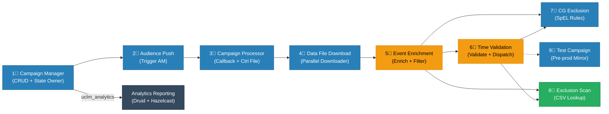

# UCLM Platform — Services Overview

> 10 microservices that together manage the full lifecycle of multi-channel marketing campaigns.

---

## At a Glance

---

## 1. uclm-campaign-manager
**Port:** `80` | **DB:** Oracle/MySQL (owner)

The **central source of truth** for all campaign data. Provides full CRUD APIs for campaigns, goals, subgoals, control groups, whitelists, frequency capping, governance rules, and exclusion configs. Every other service reads campaign state from here. Owns all state transitions.

---

## 2. uclm-campaign-audience-push
**Port:** `8095` | **DB:** Oracle/MySQL (reader/updater)

Triggers audience file creation at the external **Audience Manager (AM)**. Runs on a scheduler (per-tenant, timezone-aware) or can be triggered manually. Transitions campaign state from `PUBLISHED → AUDIENCE_REQUESTED → AUDIENCE_PUSHED`. If AM fails, reverts state back to `PUBLISHED` for retry.

---

## 3. uclm-campaign-processor
**Port:** `8080` | **DB:** Oracle/MySQL (reader/updater) | **Kafka:** Producer

Receives an **async callback from Audience Manager** when the audience control file (`.ctrl.gz`) is ready. Downloads and decompresses the control file, extracts part-file URLs, delimiters, and attribute list, updates campaign state in DB, then publishes a message to the `control_file_request` Kafka topic to hand off to the next stage.

---

## 4. uclm-campaign-data-file-download
**Port:** `8070` | **DB:** Oracle/MySQL (updater) | **Kafka:** Consumer | **Storage:** Local FS / S3 / In-memory

Consumes the `control_file_request` Kafka message and **downloads all audience part files in parallel** (up to 10 threads) from Audience Manager URLs. Stores files to local disk, AWS S3, or in-memory. Validates first 1000 rows per file for column integrity. Updates campaign state to `DATA_FILE_DOWNLOADED` on completion.

---

## 5. uclm-campaign-manager-event-enrichment
**Port:** `8091` | **DB:** Oracle/MySQL (reader) | **Kafka:** Consumer + Producer

Consumes events from the `event-enrichment` Kafka topic and **enriches each event** by:
- Fetching audience attributes from Audience Manager
- Resolving dynamic template parameters (`{{1}}`, `{{2}}`, `{{3}}`)
- Loading campaign metadata, goals, CG/TG rules from DB
- Running CG exclusion check (SpEL rules via CG Exclusion service)
- Running mobile number exclusion check (CSV via Exclusion Scan service)

Publishes enriched events to the `enriched-events` topic.

---

## 6. uclm-campaign-time-validation
**Port:** `8091` | **DB:** Oracle/MySQL (reader) | **Kafka:** Consumer + Producer (6 topics)

Consumes `enriched-events` and runs a **7-stage validation pipeline** before dispatching to channel partners:

| Stage | What it does |
|-------|-------------|
| 1. VALIDATION | Field-level schema validation |
| 2. TGCG | Control/target group assignment |
| 3. EXCLUSION | Filter excluded numbers |
| 4. GOVERNANCE | Compliance rule check |
| 5. TEMPLATE | Final message template render |
| 6. PAYLOAD | Build channel-specific payload |
| 7. KAFKA | Dispatch to SMS / Email / WhatsApp / RCS / Push topics |

---

## 7. uclm-campaign-cg-exclusion
**Port:** `8080` | **DB:** Oracle (cg_rules table)

A **SpEL-based rule evaluation engine** for Control Group / Target Group logic. Called by Event Enrichment and Time Validation. Loads rules from the `cg_rules` DB table, evaluates Spring Expression Language (SpEL) expressions against the event's KPI values, and returns `{ exclude: true/false }`.

Example rule: `kpi.value > 500 and kpi.name == 'revenue'`

---

## 8. uclm-campaign-exclusion-scan
**Port:** `8080` | **Storage:** CSV files in-memory

A **fast in-memory mobile number exclusion checker**. Loads employee, VIP, and retailer exclusion lists from CSV files at startup into a `ConcurrentHashMap` (O(1) lookup). Called by Event Enrichment and Time Validation with a mobile number + exclusion type, returns `{ eligible: true/false }`. Reloads CSV files daily at 00:30 AM without a restart.

---

## 9. uclm-test-campaign
**Port:** varies | **Kafka:** Consumer + Producer (test topics)

An **identical mirror of `uclm-campaign-time-validation`** deployed as a separate instance for pre-production validation and A/B testing. Uses different Kafka topics and K8s deployment profiles (`oracle` / `prepod`) so new features can be validated safely without impacting production traffic.

---

## 10. uclm-analytics-reporting-service
**Port:** `8080` | **DB:** Oracle/MySQL (reader) | **Kafka:** Consumer + Producer | **Cache:** Hazelcast | **Druid:** Apache Druid

The **analytics and reporting layer** of the UCLM platform. Provides two distinct capabilities:

1. **Analytics Query Engine** — UI queries arrive with date range, dimension groups (campaign, channel, template…), and metric names. The service builds SQL for Apache Druid (datasource `a{tenantId}`), fetches raw time-series rows, enriches IDs with human-readable names from Hazelcast, and returns paginated results. Supports `.xlsx` Excel download.

2. **Dimension Metadata Pipeline** — consumes `uclm_analytics` Kafka events published by Campaign Manager when any reference data changes (channel added, campaign type updated, etc.). Upserts the relevant dimension table, refreshes Hazelcast, and republishes a `dimension_refresh_topic` event.

**Kafka consumed:** `uclm_analytics`  
**Kafka produced:** `dimension_refresh_topic`, `uclm_campaign_status`

---

## Summary Table

| # | Service | One-line role | Port | Kafka |
|---|---------|---------------|------|-------|
| 1 | Campaign Manager | CRUD API + state owner for all campaign data | `80` | Producer |
| 2 | Audience Push | Triggers audience file creation at AM | `8095` | None |
| 3 | Campaign Processor | Receives AM callback, parses ctrl file, publishes to Kafka | `8080` | Producer |
| 4 | Data File Download | Downloads audience part files in parallel, stores to disk/S3 | `8070` | Consumer |
| 5 | Event Enrichment | Enriches events with audience attrs, resolves templates, checks exclusions | `8091` | Consumer + Producer |
| 6 | Time Validation | 7-stage validate → build payload → dispatch to channel topics | `8091` | Consumer + Producer |
| 7 | CG Exclusion | SpEL rule evaluation for control/target group logic | `8080` | None |
| 8 | Exclusion Scan | In-memory CSV lookup for employee/VIP/retailer exclusions | `8080` | None |
| 9 | Test Campaign | Pre-prod mirror of Time Validation for safe feature rollout | varies | Consumer + Producer |
| 10 | Analytics Reporting | Druid query engine + dimension metadata pipeline; serves UI analytics | `8080` | Consumer + Producer |
