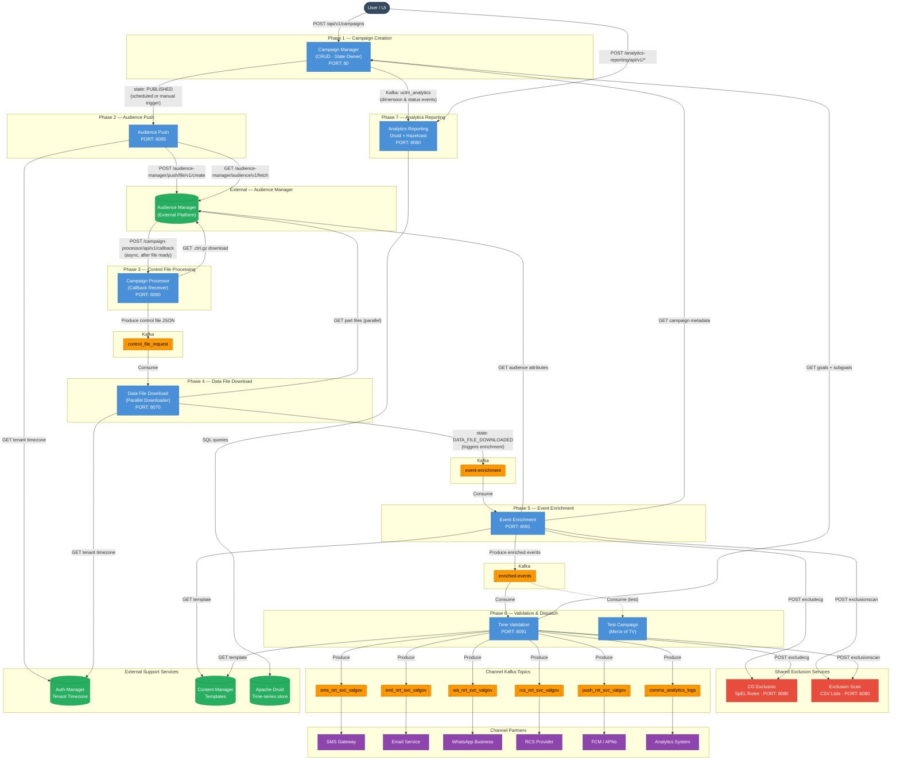
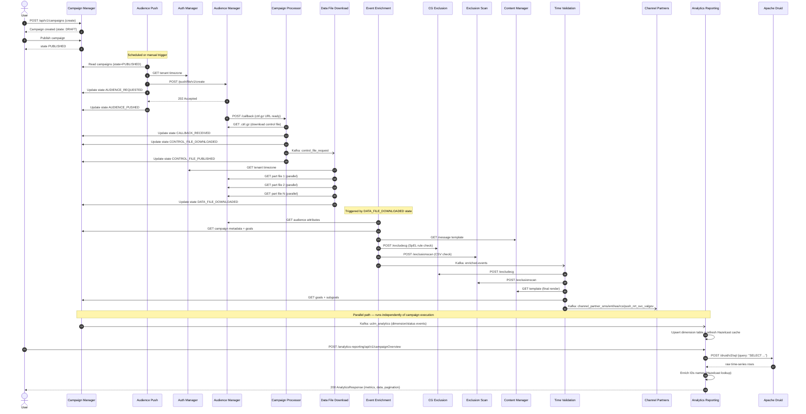

# End-to-End Integration Flow

This diagram shows every service, how data flows between them, and which external systems are involved.

---

## Full System Flowchart

---

## Sequence Diagram — Happy Path

