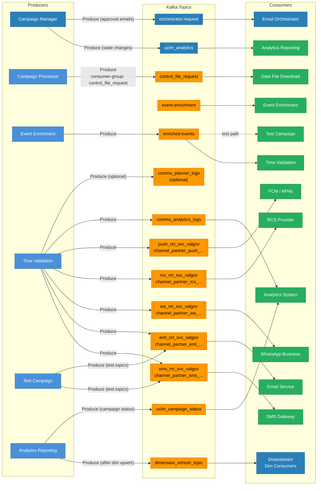
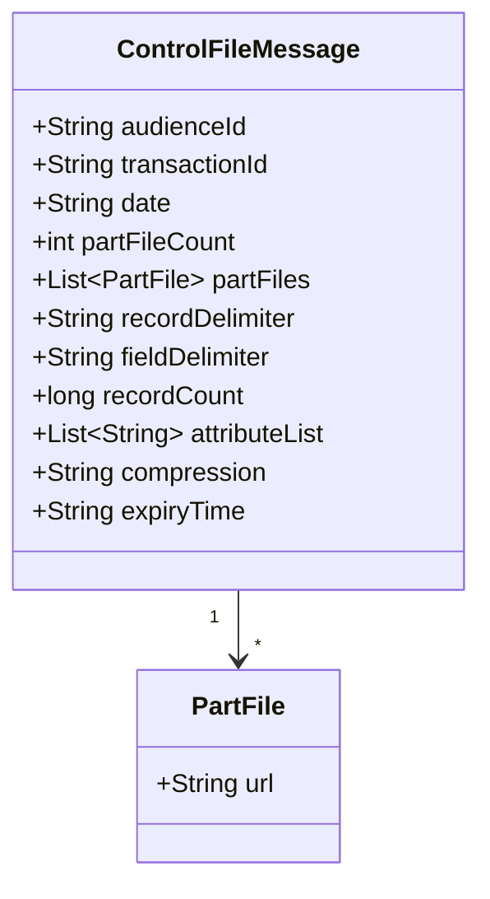
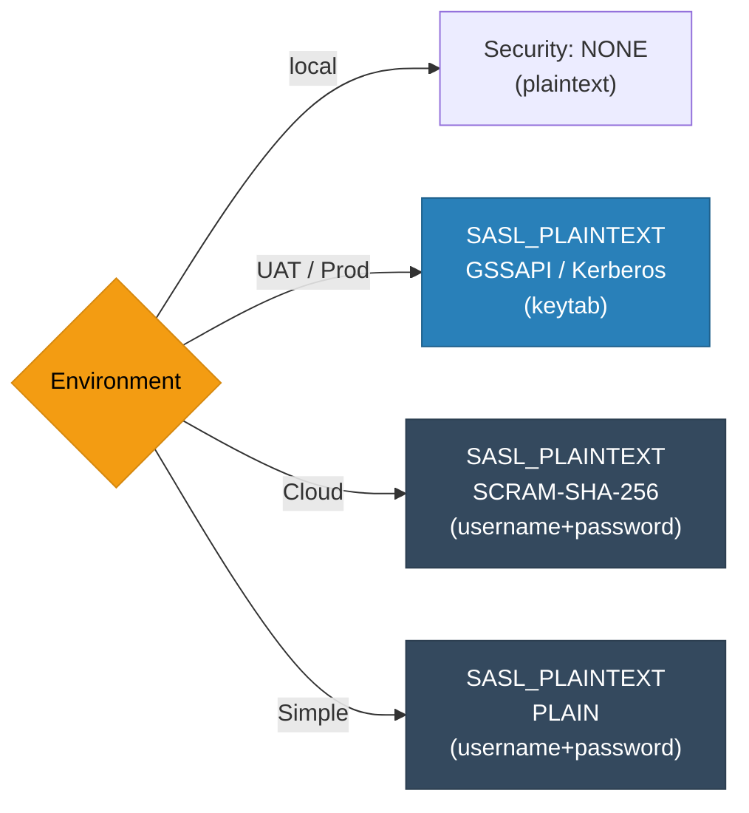

# Kafka Message Flows

All Kafka topic producers, consumers, message formats, and consumer groups.

---

## Topic Flow Diagram



---

## Kafka Topic Registry

| Topic | Producer | Consumer | Consumer Group | Ack Mode |
|-------|----------|----------|----------------|----------|
| `uclm_analytics` | **Campaign Manager** | **Analytics Reporting** | `analytics-metadata-service` | earliest |
| `orchestrator.request` | **Campaign Manager** | Email Orchestrator | — | — |
| `control_file_request` | Campaign Processor | Data File Download | `control_file_request` | Manual |
| `event-enrichment` | Upstream trigger | Event Enrichment | `event-enrichment-group` | Manual |
| `enriched-events` | Event Enrichment | Time Validation | `validation-service-group` | Manual |
| `channel_partner_sms_nrt_svc_valgov` | Time Validation | SMS Gateway | — | `acks=all` |
| `channel_partner_eml_nrt_svc_valgov` | Time Validation | Email Service | — | `acks=all` |
| `channel_partner_wa_nrt_svc_valgov` | Time Validation | WhatsApp Business | — | `acks=all` |
| `channel_partner_rcs_nrt_svc_valgov` | Time Validation | RCS Provider | — | `acks=all` |
| `channel_partner_push_nrt_svc_valgov` | Time Validation | FCM / APNs | — | `acks=all` |
| `comms_analytics_logs` | Time Validation | Analytics System (external) | — | — |
| `comms_planner_logs` | Time Validation | Logging System | — | optional |
| `dimension_refresh_topic` | **Analytics Reporting** | Downstream dim consumers | — | — |
| `uclm_campaign_status` | **Analytics Reporting** | Analytics System (external) | — | — |

---

## control_file_request — Message Schema



**Example:**
```json
{
  "audienceId": "AUD_12345",
  "transactionId": "txn-abc-123",
  "date": "2025-01-15",
  "partFileCount": 3,
  "partFiles": [
    { "url": "https://am-host/files/AUD_12345_part1.csv.gz" },
    { "url": "https://am-host/files/AUD_12345_part2.csv.gz" },
    { "url": "https://am-host/files/AUD_12345_part3.csv.gz" }
  ],
  "recordDelimiter": "\\u000a",
  "fieldDelimiter": "\\u0001",
  "recordCount": 500000,
  "attributeList": ["msisdn", "circle", "segment"],
  "compression": "gzip",
  "expiryTime": "2025-01-16T00:00:00Z"
}
```

---

## Kafka Security Modes (all services)


