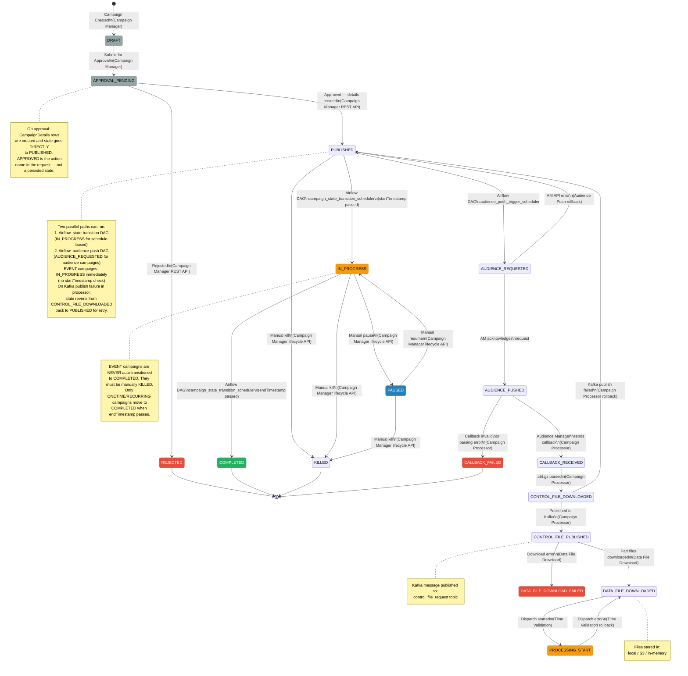
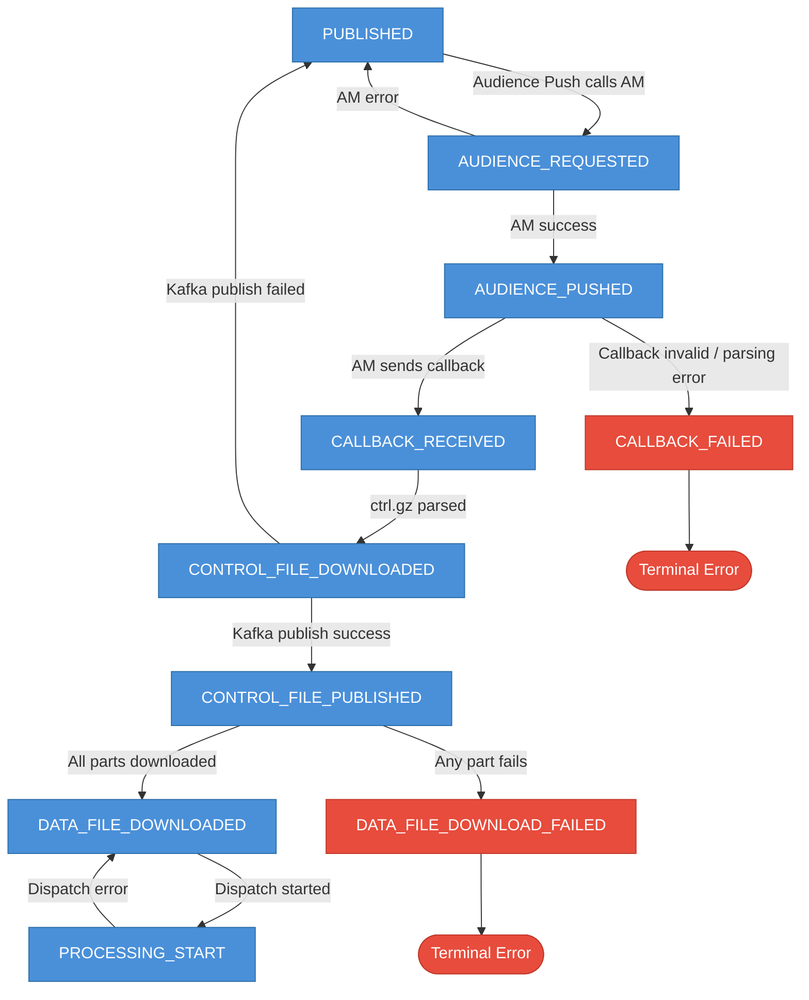

# Campaign State Machine

All state transitions across the campaign lifecycle, which service drives each transition, and failure paths.

---

## State Diagram

---

## State Transition Ownership Table

| From State | To State | Service Responsible | Mechanism |
|------------|----------|--------------------|-----------| 
| *(new)* | `DRAFT` | Campaign Manager | REST API call |
| `DRAFT` | `APPROVAL_PENDING` | Campaign Manager | REST API |
| `APPROVAL_PENDING` | `PUBLISHED` | Campaign Manager | REST API — APPROVED action creates CampaignDetails rows, goes directly to PUBLISHED |
| `APPROVAL_PENDING` | `REJECTED` | Campaign Manager | REST API |
| `PUBLISHED` | `IN_PROGRESS` | **Campaign Manager** | Airflow DAG `campaign_state_transition_scheduler` (every 15 min) — startTimestamp passed |
| `PUBLISHED` | `IN_PROGRESS` | **Campaign Manager** | EVENT campaigns: immediate on next DAG cycle (no startTimestamp) |
| `IN_PROGRESS` | `COMPLETED` | **Campaign Manager** | Airflow DAG `campaign_state_transition_scheduler` (every 15 min) — endTimestamp passed |
| `IN_PROGRESS` | `PAUSED` | Campaign Manager | Lifecycle REST API |
| `PAUSED` | `IN_PROGRESS` | Campaign Manager | Lifecycle REST API (resume) |
| `PUBLISHED` / `IN_PROGRESS` / `PAUSED` | `KILLED` | Campaign Manager | Lifecycle REST API |
| `PUBLISHED` | `AUDIENCE_REQUESTED` | **Audience Push** | Airflow DAG `audience_push_trigger_scheduler` (every 15 min) |
| `AUDIENCE_REQUESTED` | `AUDIENCE_PUSHED` | **Audience Push** | AM API response |
| `AUDIENCE_REQUESTED` | `PUBLISHED` (rollback) | **Audience Push** | AM API error — direct rollback, no intermediate state |
| `AUDIENCE_PUSHED` | `CALLBACK_RECEIVED` | **Campaign Processor** | AM callback POST |
| `AUDIENCE_PUSHED` | `CALLBACK_FAILED` | **Campaign Processor** | Callback invalid / parsing error (terminal) |
| `CALLBACK_RECEIVED` | `CONTROL_FILE_DOWNLOADED` | **Campaign Processor** | .ctrl.gz parsed |
| `CONTROL_FILE_DOWNLOADED` | `CONTROL_FILE_PUBLISHED` | **Campaign Processor** | Kafka produce success |
| `CONTROL_FILE_DOWNLOADED` | `PUBLISHED` (rollback) | **Campaign Processor** | Kafka publish failed — reverts for retry |
| `CONTROL_FILE_PUBLISHED` | `DATA_FILE_DOWNLOADED` | **Data File Download** | All parts downloaded |
| `CONTROL_FILE_PUBLISHED` | `DATA_FILE_DOWNLOAD_FAILED` | **Data File Download** | Download error |
| `DATA_FILE_DOWNLOADED` | `PROCESSING_START` | **Time Validation** | Airflow DAG `campaign_execution_trigger_scheduler` — dispatch started |
| `PROCESSING_START` | `DATA_FILE_DOWNLOADED` (rollback) | **Time Validation** | Dispatch error — reverts for retry |

---

## Failure & Compensation Flow

