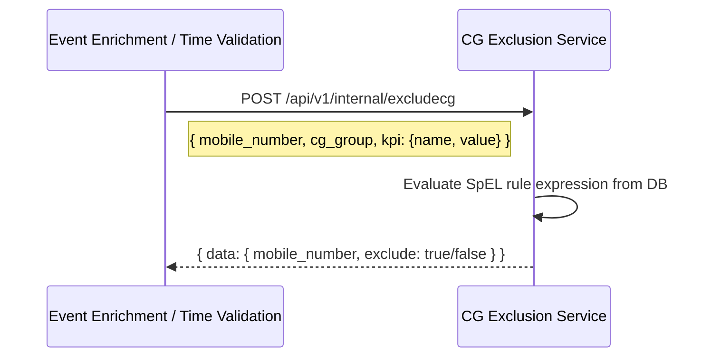
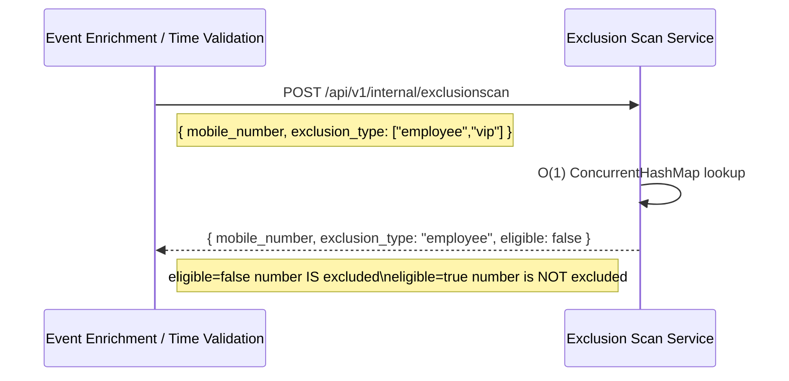
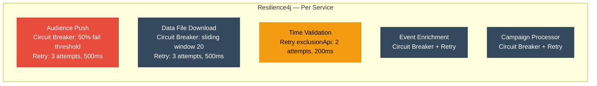

# REST API Call Graph

All synchronous HTTP calls between services, including external systems.

---

## Full REST Call Graph

```mermaid
flowchart TD
    subgraph Internal[" Internal Services"]
        AP["Audience Push\n:8095"]
        PROC["Campaign Processor\n:8080"]
        DFD["Data File Download\n:8070"]
        EE["Event Enrichment\n:8091"]
        TV["Time Validation\n:8091"]
        CM["Campaign Manager\n:80"]
        CGX["CG Exclusion\n:8080"]
        ESC["Exclusion Scan\n:8080"]
    end

    subgraph ExtSvc[" External / Support Services"]
        AM[("Audience Manager")]
        AUTH[("Auth Manager")]
        CONT[("Content Manager")]
    end

    %% Audience Push calls
    AP -->|"GET /auth-manager/api/v1/tenant/config/{tenantId}\n tenant timezone"| AUTH
    AP -->|"POST /audience-manager/push/file/v1/create\n trigger file creation"| AM
    AP -->|"GET /audience-manager/audience/v1/fetch\n audience delivery attributes"| AM

    %% Campaign Processor calls
    PROC -->|"GET <ctrl.gz URL>\n download control file\n(timeout: 300s, max 500MB)"| AM

    %% Data File Download calls
    DFD -->|"GET <part file URL> × N\n parallel download\n(up to 10 threads, WebClient)"| AM
    DFD -->|"GET /auth-manager/api/v1/tenant/config/{tenantId}\n tenant timezone for storage path"| AUTH

    %% Event Enrichment calls
    EE -->|"GET /audience-manager/audience/{audienceId}\n audience delivery attributes"| AM
    EE -->|"GET /api/v1/campaigns/{campaignId}\n campaign metadata"| CM
    EE -->|"GET /content-manager/api/v1/template/{templateId}\n message template\n(timeout: 3s)"| CONT
    EE -->|"POST /api/v1/internal/excludecg\n SpEL CG/TG rule check"| CGX
    EE -->|"POST /api/v1/internal/exclusionscan\n CSV mobile number check"| ESC

    %% Time Validation calls
    TV -->|"POST /api/v1/internal/excludecg\n SpEL CG/TG rule check"| CGX
    TV -->|"POST /api/v1/internal/exclusionscan\n CSV mobile number check\n(retry: 2 attempts, 200ms)"| ESC
    TV -->|"GET /content-manager/api/v1/template/{templateId}\n final template render\n(timeout: 3s)"| CONT
    TV -->|"GET /api/v1/campaigns/goals\nGET /api/v1/internal/subgoal\n campaign goals"| CM

    classDef internal fill:#4a90d9,color:#fff,stroke:#2c6ea8
    classDef external fill:#27ae60,color:#fff,stroke:#1e8449
    classDef exclusion fill:#e74c3c,color:#fff,stroke:#c0392b

    class AP,PROC,DFD,EE,TV,CM internal
    class AM,AUTH,CONT external
    class CGX,ESC exclusion
    classDef kafka fill:#f39c12,color:#000,stroke:#d68910
    classDef svc fill:#2980b9,color:#fff,stroke:#1f618d
    classDef ext fill:#8e44ad,color:#fff,stroke:#6c3483
```

---

## Exclusion Service API Contracts

### CG Exclusion  — `POST /api/v1/internal/excludecg`

### Exclusion Scan — `POST /api/v1/internal/exclusionscan`

---

## Kubernetes Internal Service URLs

| Service | K8s Internal URL |
|---------|-----------------|
| Auth Manager | `http://authmanager-deployment.nextgenclm-api-develop.svc.cluster.local:7002` |
| Content Manager | `http://contentmanager-deployment.nextgenclm-api-develop.svc.cluster.local:7002` |
| CG Exclusion | `http://cg-exclusion-service.nextgenclm-api-develop.svc.cluster.local:8080` |
| Exclusion Scan | `http://exclusion-scan-service.nextgenclm-api-develop.svc.cluster.local:8080` |
| Campaign Manager | `http://campaign-manager-uclm-campaign-manager.nextgenclm-api-develop.svc.cluster.local:80` |
| Audience Manager | `https://uclm-audience-manager.apps...` *(external)* |

---

## Resilience Configuration Summary

