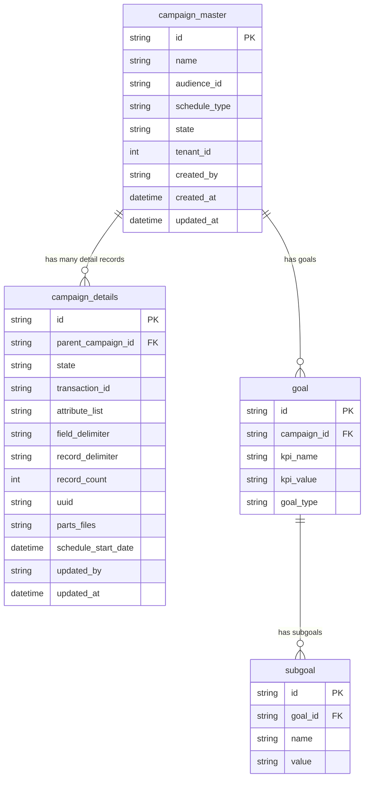

# Database Interaction Map

All database tables, their owner, and which services read or write them.

---

## Table Ownership & Access

```mermaid
flowchart TD
    subgraph DB[" Oracle / MySQL — Shared Schema"]
        CM_T[("campaign_master")]
        CD_T[("campaign_details")]
        GOAL_T[("goal")]
        SUB_T[("subgoal")]
        CG_T[("cg")]
        WL_T[("whitelist")]
        FC_T[("frequency_capping")]
        GOV_T[("governance")]
        EXC_T[("exclusion")]
        CGR_T[("cg_rules\n(CG Exclusion DB)")]
    end

    subgraph Owner[" Owner: Campaign Manager"]
        CM["Campaign Manager\n:80"]
    end

    subgraph Readers[" Readers / Updaters"]
        AP["Audience Push\n:8095"]
        PROC["Campaign Processor\n:8080"]
        DFD["Data File Download\n:8070"]
        EE["Event Enrichment\n:8091"]
        TV["Time Validation\n:8091"]
    end

    subgraph ExclusionDB[" Owner: CG Exclusion Service"]
        CGX["CG Exclusion\n:8080"]
    end

    subgraph InMemory[" In-Memory: Exclusion Scan"]
        ESC["Exclusion Scan\n(CSV  ConcurrentHashMap)"]
    end

    %% Campaign Manager owns all
    CM -->|"CREATE / READ / UPDATE / DELETE"| CM_T
    CM -->|"CREATE / READ / UPDATE / DELETE"| CD_T
    CM -->|"CREATE / READ / UPDATE / DELETE"| GOAL_T
    CM -->|"CREATE / READ / UPDATE / DELETE"| SUB_T
    CM -->|"CREATE / READ / UPDATE / DELETE"| CG_T
    CM -->|"CREATE / READ / UPDATE / DELETE"| WL_T
    CM -->|"CREATE / READ / UPDATE / DELETE"| FC_T
    CM -->|"CREATE / READ / UPDATE / DELETE"| GOV_T
    CM -->|"CREATE / READ / UPDATE / DELETE"| EXC_T

    %% Audience Push
    AP -->|"READ (state=PUBLISHED)"| CM_T
    AP -->|"READ + UPDATE state"| CD_T

    %% Campaign Processor
    PROC -->|"READ (by audience_id)"| CM_T
    PROC -->|"READ + UPDATE state, transaction_id,\nattribute_list, delimiters"| CD_T

    %% Data File Download
    DFD -->|"READ (tenant_id)"| CM_T
    DFD -->|"READ + UPDATE state, uuid, parts_files"| CD_T

    %% Event Enrichment
    EE -->|"READ"| CM_T
    EE -->|"READ"| CD_T
    EE -->|"READ"| GOAL_T
    EE -->|"READ"| SUB_T
    EE -->|"READ"| CG_T
    EE -->|"READ"| WL_T

    %% Time Validation
    TV -->|"READ"| CM_T
    TV -->|"READ"| CD_T
    TV -->|"READ"| GOAL_T
    TV -->|"READ"| SUB_T
    TV -->|"READ"| WL_T

    %% CG Exclusion owns its own rules table
    CGX -->|"READ / WRITE"| CGR_T

    %% Exclusion Scan — no DB
    ESC -->|"Loads at startup\nReloads at 00:30 daily"| CSV[(" CSV Files\n/data/exclusion/\n*.csv")]

    classDef owner fill:#e67e22,color:#fff,stroke:#d35400
    classDef reader fill:#4a90d9,color:#fff,stroke:#2c6ea8
    classDef table fill:#95a5a6,color:#000,stroke:#7f8c8d
    classDef excl fill:#e74c3c,color:#fff,stroke:#c0392b

    class CM owner
    class AP,PROC,DFD,EE,TV reader
    class CM_T,CD_T,GOAL_T,SUB_T,CG_T,WL_T,FC_T,GOV_T,EXC_T,CGR_T table
    class CGX,ESC excl
    classDef kafka fill:#f39c12,color:#000,stroke:#d68910
    classDef svc fill:#2980b9,color:#fff,stroke:#1f618d
    classDef db fill:#27ae60,color:#fff,stroke:#1e8449
```

---

## Key Tables — Column Reference

---

## Service DB Access Summary

| Service | Tables | Access Type |
|---------|--------|-------------|
| **Campaign Manager** | ALL | Full CRUD (owner) |
| **Audience Push** | `campaign_master`, `campaign_details` | READ + UPDATE state |
| **Campaign Processor** | `campaign_master`, `campaign_details` | READ + UPDATE state, metadata |
| **Data File Download** | `campaign_master`, `campaign_details` | READ + UPDATE state, parts |
| **Event Enrichment** | `campaign_master`, `campaign_details`, `goal`, `subgoal`, `cg`, `whitelist` | READ only |
| **Time Validation** | `campaign_master`, `campaign_details`, `goal`, `subgoal`, `whitelist` | READ only |
| **CG Exclusion** | `cg_rules` (own schema) | READ rules + evaluate |
| **Exclusion Scan** | CSV files only | In-memory load at startup |
