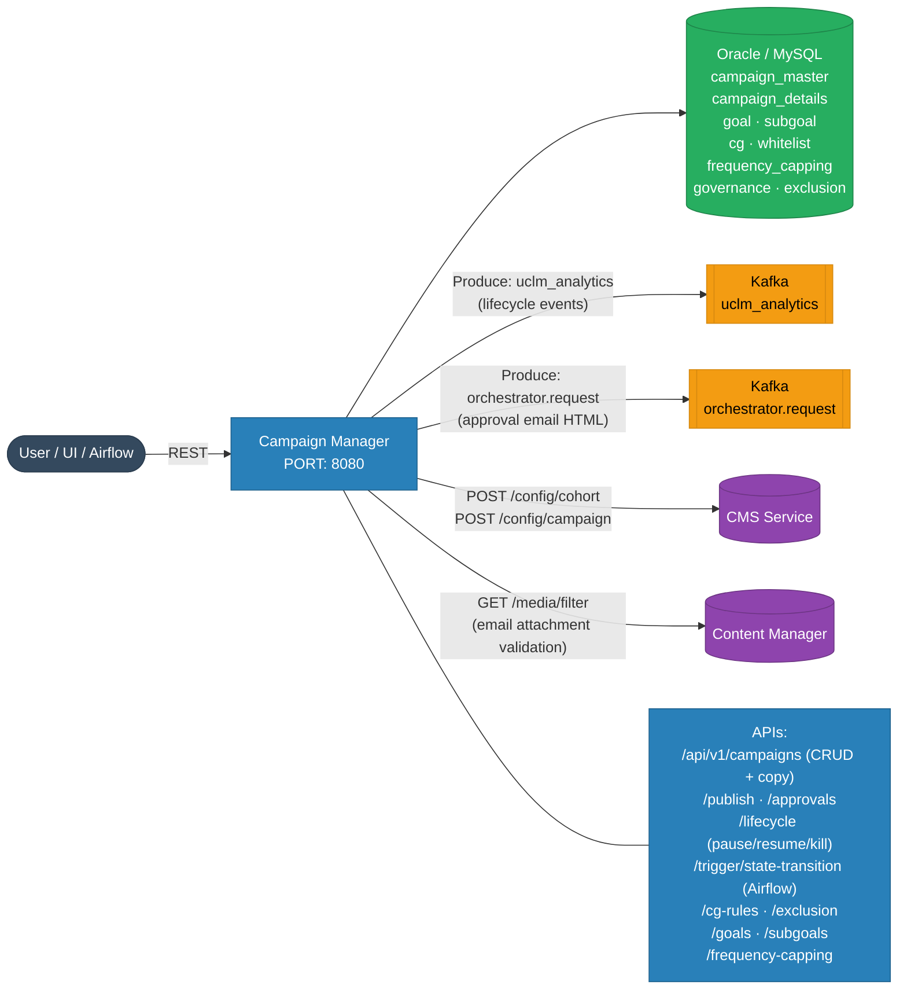
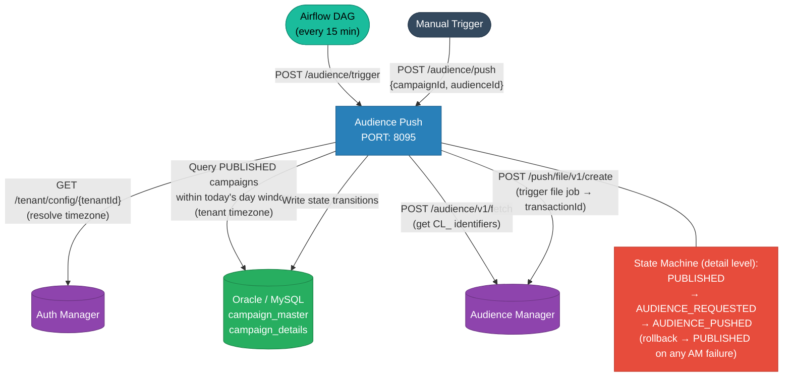
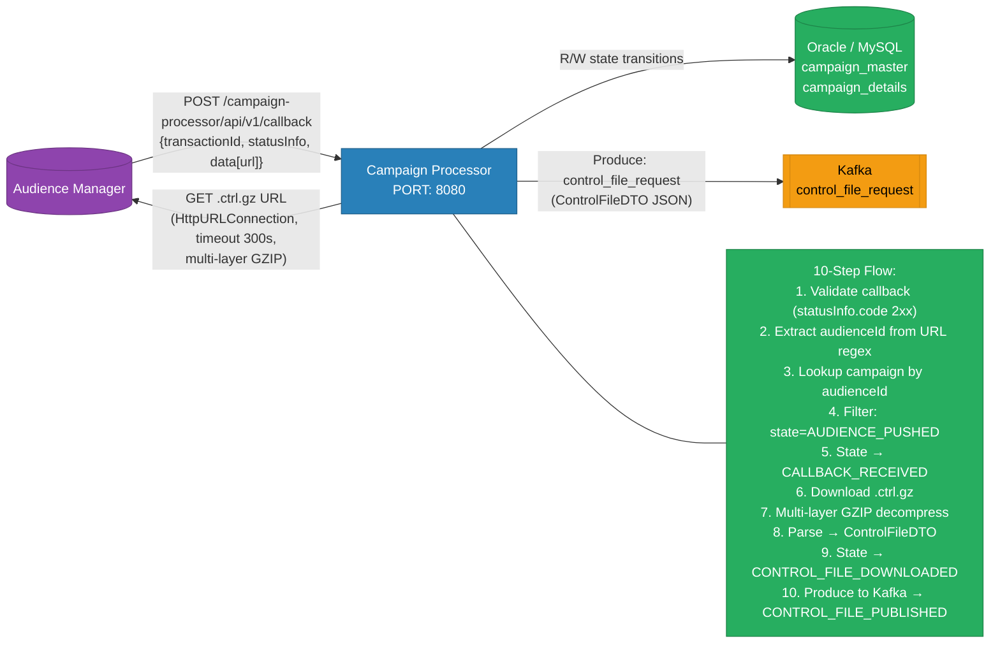
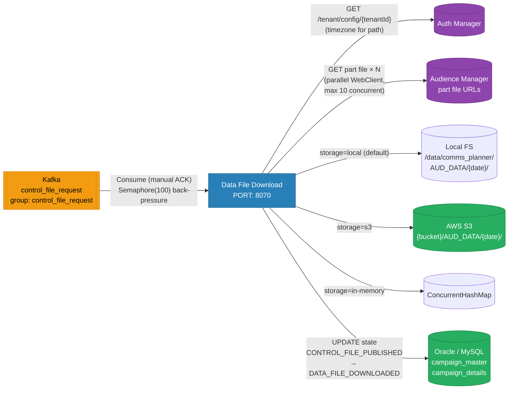
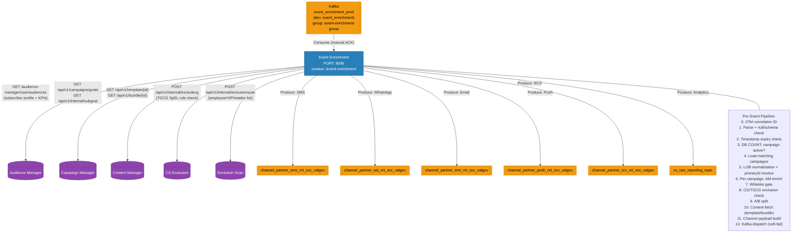
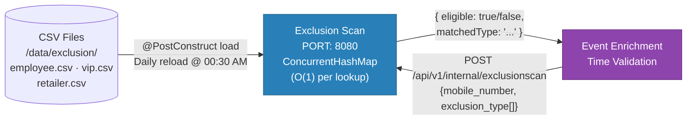
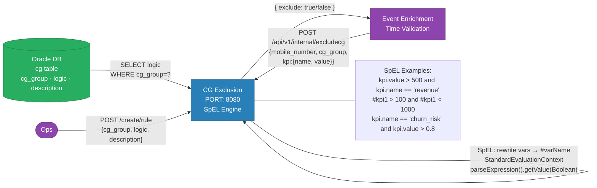
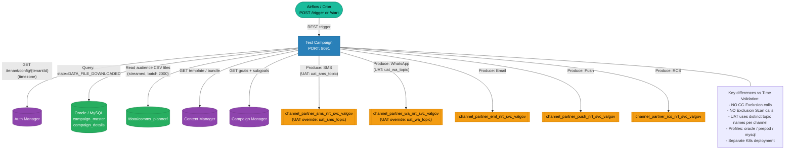
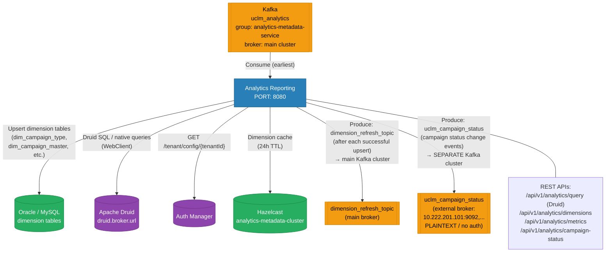

# Service Details — Per-Service Deep Dive

> ⚠️ **Source of truth:** All details verified directly from source code and `application.yml` / `application.properties` files in each service repo.

---

## 1. uclm-campaign-manager

> **Role:** Owns all campaign domain data. Central CRUD API and state machine. Source of truth for campaign lifecycle.

| Attribute | Value |
|-----------|-------|
| Port | `8080` |
| Framework | Spring Boot 3.5.6 · Spring Data JPA · Caffeine Cache · Resilience4j 2.3.0 · Thymeleaf |
| Database | Oracle / MySQL — **owns all campaign tables** |
| Kafka | **Producer only** — `uclm_analytics` (lifecycle events) · `orchestrator.request` (approval email HTML) |
| Kafka Auth (UAT) | Kerberos GSSAPI · brokers: `10.92.36.48:9092, 10.92.36.44:9092, 10.92.36.46:9092` |
| External REST | CMS Service (`cms.base-url`) — cohort + campaign config sync |
| External REST | Content Manager — `GET /media/filter` for email attachment validation |
| Toggle | `campaign.kafka.enabled=true` / `campaign.analytics.kafka.enabled=true` |
| Special | OpenAPI/Swagger UI enabled · Resilience4j rate limiter on goal/subgoal creation |

---

## 2. uclm-campaign-audience-push

> **Role:** Triggered by Airflow or manually. Scans DB for eligible campaigns, calls Audience Manager to push audience files, drives `PUBLISHED → AUDIENCE_PUSHED` state transitions.

| Attribute | Value |
|-----------|-------|
| Port | `8095` |
| Framework | Spring Boot · WebClient (reactive) · Resilience4j · OpenTelemetry |
| Database | Oracle / MySQL — reads `campaign_master` / `campaign_details`, writes state transitions |
| Kafka | **None** — pure REST service |
| External REST | Auth Manager — `GET /auth-manager/api/v1/tenant/config/{tenantId}` (tenant timezone) |
| External REST | Audience Manager — `POST /audience/v1/fetch` + `POST /push/file/v1/create` |
| Eligible campaigns | `scheduleType IN (ONETIME, RECURRING)` · `state = PUBLISHED` · `startDate` within today in tenant timezone |
| On AM failure | All detail states rolled back to `PUBLISHED` → retried on next trigger |

---

## 3. uclm-campaign-processor

> **Role:** Receives async HTTP callback from Audience Manager when `.ctrl.gz` control file is ready. Downloads, decompresses, parses the file, and publishes to Kafka.

| Attribute | Value |
|-----------|-------|
| Port | `8080` |
| Framework | Spring Boot 3.5.6 · Resilience4j · OpenAPI |
| Database | Oracle / MySQL — reads by `audienceId`, writes state at each of the 10 steps |
| Kafka | **Producer only** — `control_file_request` (topic configurable via `$CONTROL_FILE_PUSH_TOPIC`) |
| Kafka Auth (UAT) | Kerberos GSSAPI · brokers: `10.92.36.48:9092, 10.92.36.44:9092, 10.92.36.46:9092` |
| External REST | Audience Manager — passive HTTP callback receiver; also GETs `.ctrl.gz` file URL |
| Max File Size | 500 MB (configurable via `app.control-file.max-size-mb`) |
| GZIP | Multi-layer decompression loop |
| On Kafka failure | Rolls back state to `PUBLISHED` |
| On other failure | Sets state to `CALLBACK_FAILED` |

---

## 4. uclm-campaign-data-file-download

> **Role:** Consumes `control_file_request` from Kafka. Downloads audience part files in parallel from Audience Manager URLs. Writes to local FS / S3 / in-memory.

| Attribute | Value |
|-----------|-------|
| Port | `8070` |
| Framework | Spring Boot **WebFlux** · AWS S3 SDK · Resilience4j · Jasypt encryption |
| Database | Oracle / MySQL — reads campaign state; writes `DATA_FILE_DOWNLOADED` / `DATA_FILE_DOWNLOAD_FAILED` |
| Kafka | **Consumer only** — `control_file_request` · group: `control_file_request` · manual ACK |
| Kafka Auth (UAT) | Kerberos GSSAPI · brokers: `10.92.36.48:9092, 10.92.36.44:9092, 10.92.36.46:9092` |
| External REST | Auth Manager — `GET /auth-manager/api/v1/tenant/config` (tenant timezone for file paths) |
| External REST | Audience Manager — downloads part file URLs listed in `ControlFileDTO.partFiles[]` |
| Parallel Downloads | Configurable (`$PARALLEL_DOWNLOADS`, default 1) |
| Storage Modes | `local` (default) / `s3` / `in-memory` |
| Back-pressure | `Semaphore(100)` — max 100 inflight batches at once |
| Download Timeout | 600 min (configurable via `$DOWNLOAD_TIMEOUT`) |

---

## 5. uclm-campaign-manager-event-enrichment

> **Role:** NRT (Near Real-Time) event pipeline. Consumes raw trigger events, validates against campaign DB, enriches subscriber records, applies CG exclusion / exclusion scan / A/B testing, builds channel payloads, and dispatches directly to channel Kafka topics.

| Attribute | Value |
|-----------|-------|
| Port | `8095` |
| Context Path | `/event-enrichment` |
| Framework | Spring Boot 3.5.6 · OpenFeign (Apache HttpClient pool) · Caffeine (24h TGCG rule cache) · Resilience4j · OpenTelemetry |
| Database | Oracle — reads `CAMPAIGN_MASTER`, `cg` table (Caffeine-cached TGCG rules) |
| Kafka In | **Consumer** — `event_enrichment_prod` (prod) / `event_enrichment` (dev) · group: `event-enrichment-group` · manual ACK |
| Kafka Out | **Producer** — 5 × `channel_partner_*_nrt_svc_valgov` + `cs_raw_reporting_topic` |
| Kafka Auth (UAT) | Kerberos GSSAPI · brokers: `10.92.36.48:9092, 10.92.36.44:9092, 10.92.36.46:9092` |
| External REST | Audience Manager — `GET /audience-manager/user/audiences` (subscriber enrichment) |
| External REST | Campaign Manager — goals + subgoals (Feign, 3 retries) |
| External REST | Content Manager — template / bundle fetch (Feign, 3 s timeout) |
| External REST | CG Exclusion — `POST /api/v1/internal/excludecg` (Feign, 3 retries) |
| External REST | Exclusion Scan — `POST /api/v1/internal/exclusionscan` (Feign, 3 retries) |
| HTTP Client | OpenFeign with Apache HttpClient — `max-connections: 500`, `max-connections-per-route: 200` |
| Producer Settings | `acks=all` · `batch.size=64KB` · `linger.ms=5` · `compression=lz4` · `enable.idempotence=true` |

---

## 6. uclm-campaign-time-validation

> **Role:** Scheduled campaign execution engine. Reads eligible campaigns from DB, streams audience CSVs from disk, applies a 7-stage per-record pipeline (whitelist → TGCG → exclusion → AB → template → payload → Kafka), dispatches to channel Kafka topics.

```mermaid
flowchart TD
    AIRFLOW(["Airflow / Cron\nPOST /trigger or /start"]) -->|REST trigger| TV["Time Validation\nPORT: 8091"]

    TV -->|"GET /tenant/config/{tenantId}\n(timezone for day window)"| AUTH[("Auth Manager")]
    TV -->|"Query: state=DATA_FILE_DOWNLOADED\nscheduleType IN (ONETIME,RECURRING)\nactualScheduleTs within day window"| DB[("Oracle / MySQL\ncampaign_master\ncampaign_details\ncg · whitelist")]
    TV -->|"Read audience CSV files\n(streamed, batch 2000)"| FS[("/data/comms_planner/\nAUD_DATA/{audienceId}/")]

    TV -->|"POST /api/v1/internal/excludecg\n(TGCG SpEL rule check)"| CGX[("CG Exclusion")]
    TV -->|"POST /api/v1/internal/exclusionscan\n(employee/VIP/retailer)"| ESC[("Exclusion Scan")]
    TV -->|"GET /api/v1/template/{id}\nGET /api/v1/bundle/{id}"| CONT[("Content Manager")]
    TV -->|"GET /api/v1/campaigns/goals\nGET /api/v1/internal/subgoal"| CM[("Campaign Manager")]

    TV -->|"Produce: SMS\nkey=mobile"| K1[["channel_partner_sms_nrt_svc_valgov"]]
    TV -->|"Produce: WhatsApp\nkey=mobile"| K2[["channel_partner_wa_nrt_svc_valgov"]]
    TV -->|"Produce: Email\nkey=email"| K3[["channel_partner_eml_nrt_svc_valgov"]]
    TV -->|"Produce: Push\nkey=uid"| K4[["channel_partner_push_nrt_svc_valgov"]]
    TV -->|"Produce: RCS\nkey=rcs"| K5[["channel_partner_rcs_nrt_svc_valgov"]]
    TV -->|"Produce: Analytics"| K6[["cs_raw_reporting_topic"]]

    TV --- STAGES["7-Stage Per-Record Pipeline:\n1. Whitelist gate\n2. TGCG (SpEL CG rule)\n3. Exclusion scan (employee/VIP/retailer)\n4. A/B test assignment\n5. Template / bundle resolve\n6. Channel payload build\n7. Kafka dispatch (sync, 3 retries)"]

    classDef kafka fill:#f39c12,color:#000,stroke:#d68910
    classDef svc fill:#2980b9,color:#fff,stroke:#1f618d
    classDef db fill:#27ae60,color:#fff,stroke:#1e8449
    classDef ext fill:#8e44ad,color:#fff,stroke:#6c3483
    classDef af fill:#1abc9c,color:#000,stroke:#148f77
    class DB db
    class AUTH,CM,CONT,CGX,ESC ext
    class AIRFLOW af
    class TV svc
    class FS db
    class K1,K2,K3,K4,K5,K6 kafka
```

| Attribute | Value |
|-----------|-------|
| Port | `8091` (configurable via `$CLM_SERVER_PORT`) |
| Framework | Spring Boot 3.5.6 · OpenFeign · **Virtual Threads (Project Loom)** · Resilience4j · Springdoc OpenAPI |
| Database | Oracle / MySQL — reads `campaign_master`, `campaign_details`, `cg` (TGCG), whitelist |
| Kafka | **Producer only** — No Kafka consumption; reads audience data from **CSV files on disk** |
| Kafka Out | 5 × `channel_partner_*_nrt_svc_valgov` + `cs_raw_reporting_topic` |
| Kafka Auth (UAT) | SCRAM-SHA-512 or Kerberos · brokers: `10.20.5.166:9092, 10.20.5.177:9092, 10.20.5.142:9092` |
| External REST | Auth Manager — `GET /auth-manager/api/v1/tenant/config` (per-tenant timezone) |
| External REST | Campaign Manager — goals + subgoals (Feign) |
| External REST | Content Manager — template + bundle (Feign, 3 s timeout) |
| External REST | CG Exclusion — `POST /api/v1/internal/excludecg` (Feign) |
| External REST | Exclusion Scan — `POST /api/v1/internal/exclusionscan` (Feign, 2 retries max) |
| File Input | Reads CSV from `$INGEST_BASE_FOLDER` (default `/data/comms_planner`) |
| Concurrency | `audienceExecutor` = Virtual Threads · `campaignTriggerExecutor` = fixed pool (10–20 threads) |
| Batch Size | 2,000 records/batch · Semaphore(100) back-pressure |
| Producer Settings | `acks=all` · `batch.size=64KB` · `linger.ms=5` · `compression=lz4` · `enable.idempotence=true` |
| State Machine | `DATA_FILE_DOWNLOADED → PROCESSING_START → DELIVERED_TO_CHANNEL_PARTNER` (or `FAILED_TO_DELIVER`) |

---

## 7. uclm-campaign-exclusion-scan

> **Role:** Fast O(1) in-memory mobile number exclusion lookup from CSV lists (employee, VIP, retailer). Pure REST, no DB or Kafka.

| Attribute | Value |
|-----------|-------|
| Port | `8080` |
| Framework | Spring Boot 4.0.0 · Jakarta Bean Validation · OpenTelemetry Java Agent |
| Database | **None** — pure in-memory from CSV files |
| Kafka | **None** |
| Storage | `ConcurrentHashMap<type, Set<String>>` — O(1) lookup |
| CSV path | `$INGEST_BASE_FOLDER` (default `/data/exclusion`) |
| Reload | Daily at 00:30 AM via `@Scheduled` (no restart needed) |
| Validation | Mobile must match `^[6-9]\d{9}$` (10-digit Indian mobile) |
| Tracing | `X-Trace-Id` propagated via `TraceFilter` using OTel span or UUID fallback |

---

## 8. uclm-campaign-cg-exclusion

> **Role:** SpEL-based Control Group / Target Group rule evaluation. Loads rules from Oracle `cg` table and evaluates Spring Expression Language boolean expressions against subscriber KPIs.

| Attribute | Value |
|-----------|-------|
| Port | `8080` |
| Framework | Spring Boot 4.0.1 · Spring Data JPA · Spring Expression Language (SpEL) |
| Database | Oracle — `cg` table (id, cg_group, logic, description, tenant_id, dept_id) |
| Kafka | **None** |
| Rule Engine | SpEL with word-boundary variable rewriting (`varName → #varName`) |
| Rules storage | Oracle DB — loaded per request (no caching in this service; callers cache locally) |
| Endpoints | `POST /create/rule` (create rule) · `POST /api/v1/internal/excludecg` (evaluate) |

---

## 9. uclm-test-campaign

> **Role:** Pre-production mirror of `uclm-campaign-time-validation` for safe feature validation and A/B testing. Reads CSV files from disk and dispatches to **separate UAT-specific Kafka topics** (does not share production channel topics).

| Attribute | Value |
|-----------|-------|
| Port | `8091` (configurable via `$CLM_SERVER_PORT`) |
| Framework | Same codebase as `uclm-campaign-time-validation` · Virtual Threads · OpenFeign |
| Database | Oracle / MySQL — same schema as time-validation |
| Kafka | **Producer only** — No Kafka consumption; reads CSV from disk |
| Kafka Out (prod default) | 5 × `channel_partner_*_nrt_svc_valgov` |
| Kafka Out (UAT override) | `uat_sms_topic` · `uat_wa_topic` · `uat_email_topic` · `uat_push_topic` · `uat_rcs_topic` |
| External REST | Auth Manager, Content Manager, Campaign Manager (goals) — same as time-validation |
| **NOT called** | ~~CG Exclusion~~ · ~~Exclusion Scan~~ — these are NOT wired in test-campaign |
| Profiles | `application-oracle.yml` · `application-prepod.yml` · `application-mysql.yml` |
| Purpose | Pre-prod feature validation, A/B testing, safe rollout without touching production pipeline |

---

## 10. uclm-analytics-reporting-service

> **Role:** Consumes campaign lifecycle events from Kafka, upserts dimension data into Oracle/MySQL and Apache Druid, re-publishes dimension refresh and campaign status events. Serves analytics REST APIs backed by Druid + Hazelcast cache.

| Attribute | Value |
|-----------|-------|
| Port | `8080` |
| Framework | Spring Boot · Spring WebFlux (Druid client) · Spring Data JPA · Hazelcast (embedded) · OpenTelemetry |
| Database | Oracle / MySQL — dimension tables (`dim_campaign_type`, `dim_campaign_master`, etc.) |
| External DB | Apache Druid — queried via WebClient (`druid.broker.url`); used for analytics query APIs |
| Kafka In | **Consumer** — `uclm_analytics` · group: `analytics-metadata-service` · `auto-offset-reset: latest` (UAT) / `earliest` (local) |
| Kafka Out #1 | **Producer** — `dimension_refresh_topic` · **same main broker** (`10.92.36.48:9092,...`) · Kerberos GSSAPI (UAT) |
| Kafka Out #2 | **Producer** — `uclm_campaign_status` · **separate broker** (`10.222.201.101:9092, 10.222.201.102:9092, 10.222.201.103:9092`) · PLAINTEXT / no auth |
| ⚠️ Two Kafka clusters | `uclm_analytics` + `dimension_refresh_topic` → **main Kerberos cluster**; `uclm_campaign_status` → **separate PLAINTEXT cluster** |
| External REST | Auth Manager — `GET /auth-manager/api/v1/tenant/config` |
| In-memory Cache | Hazelcast cluster `analytics-metadata-cluster` — dimension + metadata caching |
| CORS | Configurable via `analytics.ui.allowed-origins` |
