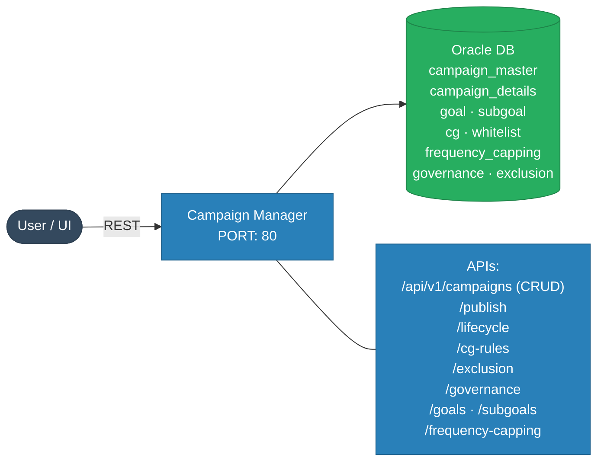
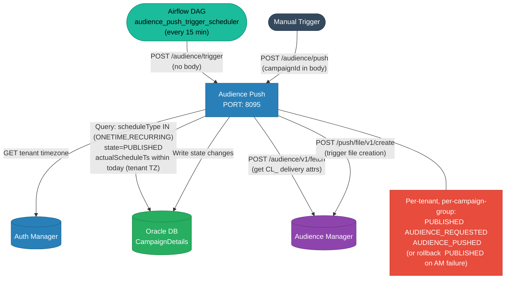
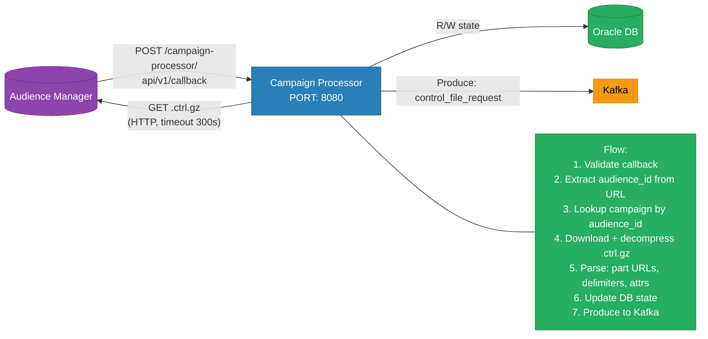
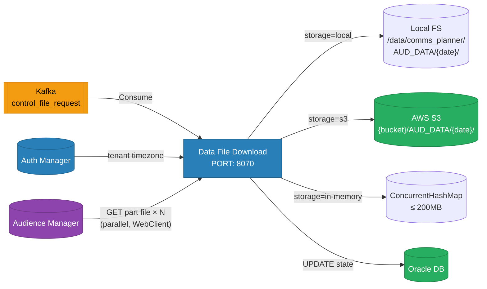
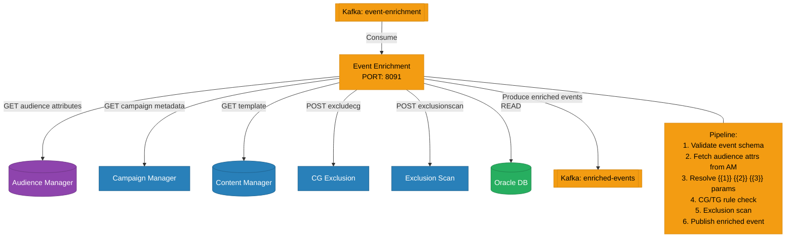
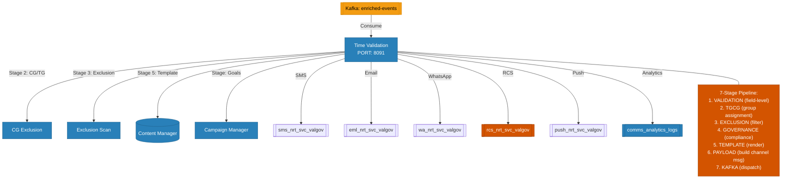
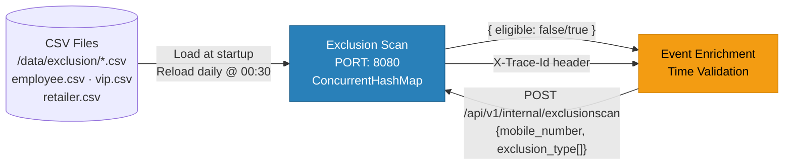
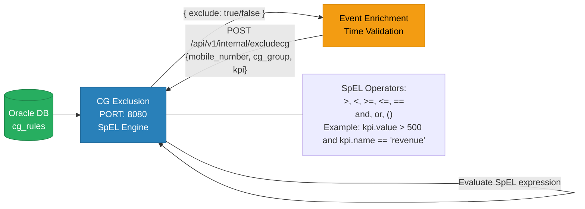
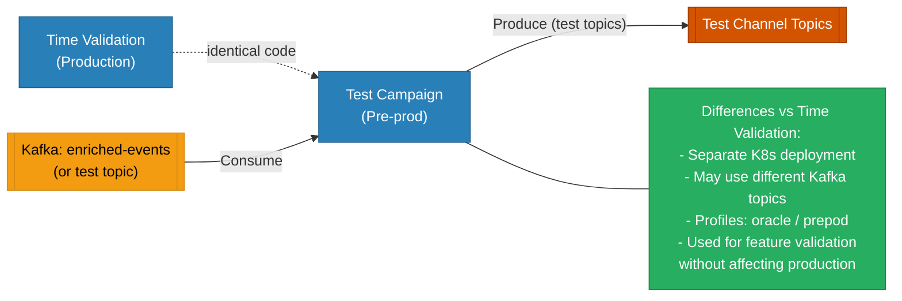

# Service Details — Per-Service Deep Dive

---

## 1. uclm-campaign-manager

> **Role:** Owns all campaign domain data. Central CRUD API. Source of truth for state.

| Attribute | Value |
|-----------|-------|
| Port | `80` (K8s cluster) |
| Framework | Spring Boot 3.5.6 · Spring Data JPA · Caffeine Cache · Resilience4j 2.3.0 |
| Database | Oracle / MySQL — **owns all tables** |
| Kafka | Producer — `uclm_analytics` (state change events) · `orchestrator.request` (approval email notifications) |
| External Calls | None |
| Special | OpenAPI/Swagger UI enabled |

---

## 2. uclm-campaign-audience-push

> **Role:** Triggered by Airflow DAG every 15 min. Scans for eligible `CampaignDetails`, calls Audience Manager to trigger file creation, and manages `PUBLISHED → AUDIENCE_PUSHED` state transitions.

| Attribute | Value |
|-----------|-------|
| Port | `8095` |
| Framework | Spring Boot · RestTemplate · Resilience4j · OpenTelemetry |
| Triggered by | Airflow DAG `audience_push_trigger_scheduler` (every 15 min) OR manual `POST /audience/push` |
| Eligible campaigns | `scheduleType IN (ONETIME, RECURRING)` · `state = PUBLISHED` · `actualScheduleTs` within today in tenant timezone |
| Tenant handling | Iterates all configured tenant IDs; each tenant gets its own timezone-aware day window |
| AM calls per campaign | ① `POST /audience/v1/fetch` → extract `CL_` identifiers ② `POST /push/file/v1/create` → trigger file + get `transactionId` |
| On AM failure | Detail states rolled back to `PUBLISHED` → retried on next DAG run |
| CL_* attributes | Extracted from delivery response and added to AM file-create request `targeting` map |

---

## 3. uclm-campaign-processor

> **Role:** Receives async callback from Audience Manager, parses control file, publishes to Kafka.

| Attribute | Value |
|-----------|-------|
| Port | `8080` |
| Framework | Spring Boot 3.5.6 · RestTemplate · Resilience4j · OpenAPI |
| Kafka | Produces → `control_file_request` |
| Max File | 500 MB (configurable) |
| GZIP | Multi-layer decompression supported |
| Security | NONE / KERBEROS / SCRAM / PLAIN |

---

## 4. uclm-campaign-data-file-download

> **Role:** Downloads audience part files in parallel from AM URLs. Stores to local/S3/in-memory.

| Attribute | Value |
|-----------|-------|
| Port | `8070` |
| Framework | Spring Boot **WebFlux** · AWS S3 SDK · Resilience4j |
| Kafka | Consumes ← `control_file_request` · Consumer Group: `control_file_request` |
| Parallel Downloads | Up to 10 threads (configurable) |
| Validation | Samples first 1000 rows per file for column count check |
| Storage Modes | `local` / `s3` / `in-memory` |
| Timeout | 600 minutes (configurable) |

---

## 5. uclm-campaign-manager-event-enrichment

> **Role:** Enriches raw events — fetches audience attributes, resolves dynamic content, checks exclusions.

| Attribute | Value |
|-----------|-------|
| Port | `8091` |
| Framework | Spring Boot 3.5.6 · OpenFeign · Caffeine · Resilience4j · OpenTelemetry |
| Kafka | Consumes ← `event-enrichment` · Produces → `enriched-events` |
| Dynamic Params | Resolves `{{1}}`, `{{2}}`, `{{3}}` from audience attrs / event data / constants |
| HTTP Client | OpenFeign (declarative) |

---

## 6. uclm-campaign-time-validation

> **Role:** Final 7-stage validation pipeline. Builds channel payloads. Dispatches to channel Kafka topics.

| Attribute | Value |
|-----------|-------|
| Port | `8091` |
| Framework | Spring Boot 3.5.6 · OpenFeign · Virtual Threads (Project Loom) · Resilience4j |
| Kafka | Consumes ← `enriched-events` · Produces → 5 channel topics + analytics |
| Channels | SMS · Email · WhatsApp · RCS · Push |
| Special | RCS supports rich cards, buttons, carousels, deep linking |

---

## 7. uclm-campaign-exclusion-scan

> **Role:** Fast in-memory mobile number exclusion lookup from CSV lists (employee, VIP, retailer).

| Attribute | Value |
|-----------|-------|
| Port | `8080` |
| Framework | Spring Boot 4.0.0 · Jakarta Validation · OpenTelemetry |
| Storage | In-memory `ConcurrentHashMap` — O(1) lookup |
| Reload | Daily at 00:30 AM (no restart needed) |
| Trace | `X-Trace-Id` propagated in response header |

---

## 8. uclm-campaign-cg-exclusion

> **Role:** SpEL-based Control Group / Target Group rule evaluation from database.

| Attribute | Value |
|-----------|-------|
| Port | `8080` |
| Framework | Spring Boot 4.0.1 · Spring Data JPA · SpEL |
| Rule Engine | Spring Expression Language (SpEL) |
| Rules stored | Oracle DB (loaded per request) |

---

## 9. uclm-test-campaign

> **Role:** Identical mirror of `uclm-campaign-time-validation` for pre-production / A-B testing.

| Attribute | Value |
|-----------|-------|
| Framework | Identical to `uclm-campaign-time-validation` |
| Purpose | Pre-prod validation, A/B testing, safe rollout |
| Config | `application-oracle.yml`, `application-prepod.yml` |
