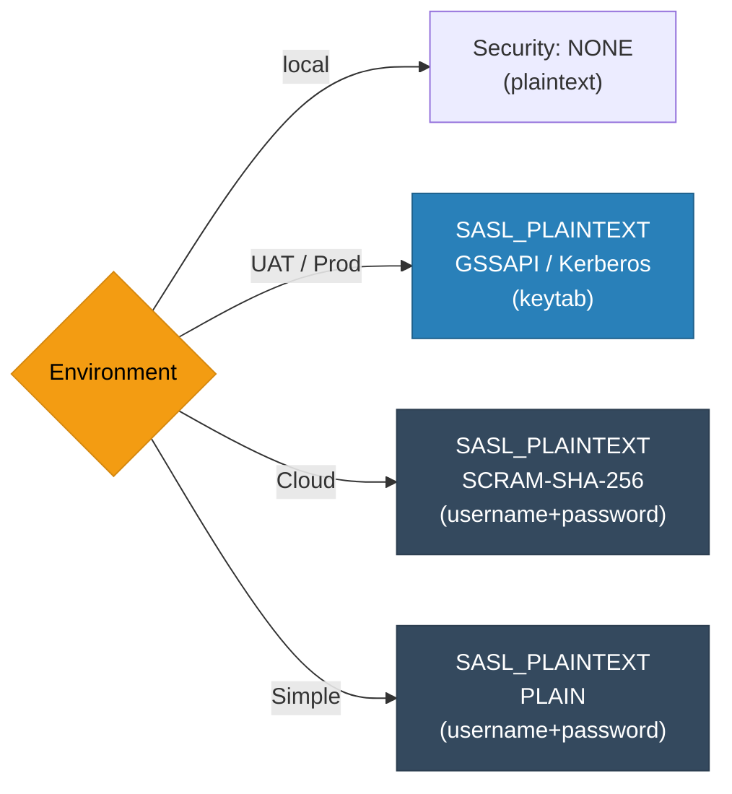
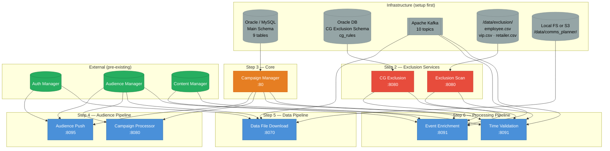

# UCLM Deployment Guide — Infrastructure & Service Dependencies

---

## 1. Databases Required

### A. Oracle / MySQL — Main Shared Schema

> Owner: **Campaign Manager**. All other services READ/UPDATE this schema.

#### Tables to create:

| Table | Owner | Columns |
|-------|-------|---------|
| `campaign_master` | Campaign Manager | `id PK`, `name`, `audience_id`, `schedule_type`, `state`, `tenant_id`, `created_by`, `created_at`, `updated_at` |
| `campaign_details` | Campaign Manager | `id PK`, `parent_campaign_id FK`, `state`, `transaction_id`, `attribute_list`, `field_delimiter`, `record_delimiter`, `record_count`, `uuid`, `parts_files`, `schedule_start_date`, `updated_by`, `updated_at` |
| `goal` | Campaign Manager | `id PK`, `campaign_id FK`, `kpi_name`, `kpi_value`, `goal_type` |
| `subgoal` | Campaign Manager | `id PK`, `goal_id FK`, `name`, `value` |
| `cg` | Campaign Manager | (control group definition) |
| `whitelist` | Campaign Manager | (whitelist entries) |
| `frequency_capping` | Campaign Manager | (cap rules) |
| `governance` | Campaign Manager | (compliance rules) |
| `exclusion` | Campaign Manager | (exclusion config) |

**Services accessing this DB:**
- Campaign Manager → Full CRUD
- Audience Push → READ `campaign_master`, READ+UPDATE `campaign_details`
- Campaign Processor → READ `campaign_master`, READ+UPDATE `campaign_details`
- Data File Download → READ `campaign_master`, READ+UPDATE `campaign_details`
- Event Enrichment → READ `campaign_master`, `campaign_details`, `goal`, `subgoal`, `cg`, `whitelist`
- Time Validation → READ `campaign_master`, `campaign_details`, `goal`, `subgoal`, `whitelist`

---

### B. Oracle DB — CG Exclusion Schema (separate)

> Owner: **CG Exclusion Service**

| Table | Columns |
|-------|---------|
| `cg_rules` | SpEL expression rules (e.g., `kpi.value > 500 and kpi.name == 'revenue'`) |

**Services accessing:** CG Exclusion only (read/write)

---

## 2. Kafka — Topics to Create

| Topic | Producer | Consumer | Consumer Group | Ack |
|-------|----------|----------|----------------|-----|
| `control_file_request` | Campaign Processor | Data File Download | `control_file_request` | Manual |
| `event-enrichment` | Upstream trigger | Event Enrichment | `event-enrichment-group` | Manual |
| `enriched-events` | Event Enrichment | Time Validation | `validation-service-group` | Manual |
| `channel_partner_sms_nrt_svc_valgov` | Time Validation | SMS Gateway | — | `acks=all` |
| `channel_partner_eml_nrt_svc_valgov` | Time Validation | Email Service | — | `acks=all` |
| `channel_partner_wa_nrt_svc_valgov` | Time Validation | WhatsApp Business | — | `acks=all` |
| `channel_partner_rcs_nrt_svc_valgov` | Time Validation | RCS Provider | — | `acks=all` |
| `channel_partner_push_nrt_svc_valgov` | Time Validation | FCM/APNs | — | `acks=all` |
| `comms_analytics_logs` | Time Validation | Analytics System | — | — |
| `comms_planner_logs` | Time Validation | Logging System | — | optional |

**Kafka Security Modes:**



---

## 3. File Storage

### Option A — Local FS (default)
Mount path: `/data/comms_planner/AUD_DATA/{date}/`
> Required by: **Data File Download** service

### Option B — AWS S3
Bucket path: `{bucket}/AUD_DATA/{date}/`
> Needs: AWS credentials / IAM role, S3 bucket pre-created

### Option C — In-Memory
Up to 200 MB in `ConcurrentHashMap` — no infra needed, but data is lost on restart.

---

## 4. CSV Exclusion Files

Required by: **Exclusion Scan** service  
Mount path: `/data/exclusion/`

| File | Purpose |
|------|---------|
| `employee.csv` | Employee exclusion list |
| `vip.csv` | VIP customer exclusion list |
| `retailer.csv` | Retailer exclusion list |

> Files are loaded at startup and reloaded daily at **00:30 AM** (no restart needed).  
> Must be present and mounted **before** Exclusion Scan starts.

---

## 5. External Services (must be reachable before deployment)

| Service | Used By | Purpose |
|---------|---------|---------|
| **Auth Manager** | Audience Push, Data File Download | Tenant timezone lookup |
| **Audience Manager** | Audience Push, Campaign Processor, Data File Download, Event Enrichment | Audience file push, callback, part file download, attribute fetch |
| **Content Manager** | Event Enrichment, Time Validation | Template fetch for message rendering |

---

## 6. Deployment Order

Deploy in this strict sequence to avoid startup failures:

```
Step 1 — INFRASTRUCTURE
  ├── Oracle/MySQL DB (with all tables created)
  ├── Kafka cluster (with all 10 topics created)
  └── File mounts (/data/exclusion CSVs + /data/comms_planner or S3 bucket)

Step 2 — EXCLUSION SERVICES  (no UCLM upstream dependencies)
  ├── uclm-campaign-exclusion-scan   (port 8080)  ← needs /data/exclusion CSVs
  └── uclm-campaign-cg-exclusion     (port 8080)  ← needs cg_rules DB table

Step 3 — CORE SERVICE
  └── uclm-campaign-manager          (port 80)    ← needs main DB (owns all tables)

Step 4 — AUDIENCE PIPELINE
  ├── uclm-campaign-audience-push    (port 8095)  ← needs Campaign Manager + Auth Manager + AM
  └── uclm-campaign-processor        (port 8080)  ← needs Campaign Manager + AM + Kafka

Step 5 — DATA PIPELINE
  └── uclm-campaign-data-file-download (port 8070) ← needs Kafka + AM + Auth Manager + storage

Step 6 — PROCESSING PIPELINE
  ├── uclm-campaign-manager-event-enrichment (port 8091)
  │     ← needs Kafka + Campaign Manager + AM + Content Manager + CG Exclusion + Exclusion Scan
  └── uclm-campaign-time-validation  (port 8091)
        ← needs Kafka + Campaign Manager + Content Manager + CG Exclusion + Exclusion Scan

Step 7 — TEST / PRE-PROD  (optional)
  └── uclm-test-campaign  ← identical to time-validation, separate K8s deployment
```

---

## 7. Service Port Summary

| Service | Port | Notes |
|---------|------|-------|
| Campaign Manager | `80` | K8s cluster port |
| Audience Push | `8095` | |
| Campaign Processor | `8080` | |
| Data File Download | `8070` | Spring WebFlux (reactive) |
| Event Enrichment | `8091` | |
| Time Validation | `8091` | Same port — separate K8s deployment |
| CG Exclusion | `8080` | |
| Exclusion Scan | `8080` | |
| Test Campaign | varies | Mirror of Time Validation |

---

## 8. Infrastructure Summary Diagram



---

## 9. Pre-Deployment Checklist

- [ ] Oracle/MySQL instance running and reachable
- [ ] Main schema — all 9 tables created (`campaign_master`, `campaign_details`, `goal`, `subgoal`, `cg`, `whitelist`, `frequency_capping`, `governance`, `exclusion`)
- [ ] CG Exclusion schema — `cg_rules` table created and seeded with rules
- [ ] Kafka cluster running with all 10 topics created
- [ ] `/data/exclusion/employee.csv`, `vip.csv`, `retailer.csv` present on Exclusion Scan pod/mount
- [ ] File storage configured — local mount `/data/comms_planner/` OR S3 bucket created
- [ ] Auth Manager URL reachable from Audience Push and Data File Download
- [ ] Audience Manager URL reachable from Audience Push, Campaign Processor, Data File Download, Event Enrichment
- [ ] Content Manager URL reachable from Event Enrichment and Time Validation
- [ ] Kafka security credentials configured (keytab for Kerberos / username+password for SCRAM or PLAIN)
- [ ] AWS credentials/IAM role configured if using S3 storage mode
- [ ] OpenTelemetry collector endpoint configured (optional, for observability)
