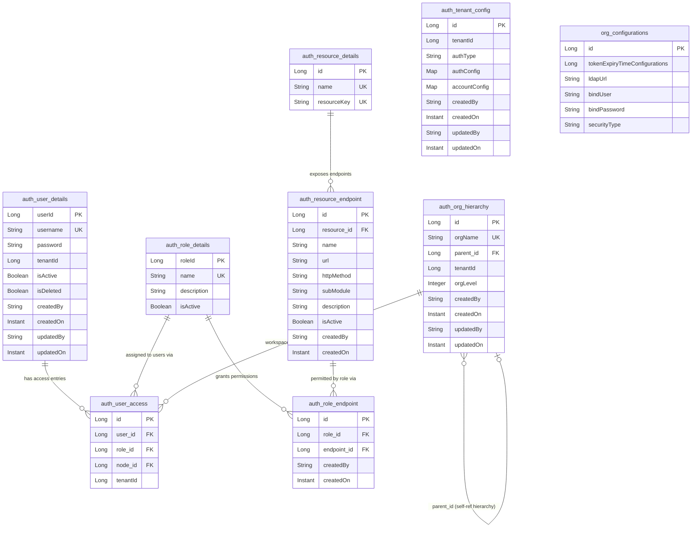

# 09 — ER Diagram: All Entities

> Complete Entity-Relationship diagrams across **uclm-auth-manager** and all **comms** services, with table purpose and usage notes.

---

## Table of Contents

1. [Auth Manager — ER Diagram](#auth-manager--er-diagram)
2. [Comms Services — ER Diagram](#comms-services--er-diagram)
3. [Cross-Service Logical Link](#cross-service-logical-link)
4. [Auth Manager — Table Descriptions](#auth-manager--table-descriptions)
5. [Comms Services — Table Descriptions](#comms-services--table-descriptions)

---

## Auth Manager — ER Diagram

> Service: `uclm-auth-manager` | DB schema: `auth_*`



---

## Comms Services — ER Diagram

> Shared DB tables used across: `uclm-campaign-manager`, `uclm-campaign-processor`,  
> `uclm-campaign-manager-event-enrichment`, `uclm-campaign-time-validation`,  
> `uclm-campaign-audience-push`, `uclm-campaign-cg-exclusion`, `uclm-test-campaign`

```mermaid
erDiagram

    CAMPAIGN_MASTER {
        Long    id                      PK
        String  name
        String  channel
        String  state
        String  type
        List    tags
        Long    goal                    FK
        Long    subGoal                 FK
        String  eventId
        String  audienceId
        List    audienceAttributes
        Boolean experimentation
        Boolean frequencyCapping
        List    exclusionObjective
        List    exclusionCustom
        List    exclusionCg
        Boolean advLinkTracking
        Boolean advKeyboardBlacklisting
        List    advReplyTo
        String  advDeviceType
        Long    advAttributionWindow
        String  scheduleType
        String  onetimeScheduleType
        Instant startTimestamp
        Instant endTimestamp
        String  cronExpression
        String  eventWindowStart
        String  eventWindowEnd
        String  expiryDurationSec
        String  scheduleEvent
        String  scheduleDuration
        Integer scheduleDelayMinutes
        String  scheduleSpecificTime
        String  exitMetric
        String  exitOperator
        Long    exitValue
        Long    tenantId
        Long    deptId
        String  userHierarchy
        Instant lastExecutedTs
        Object  rawPayload
        String  requestType
        String  comments
        String  createdBy
        Instant createdAt
        String  updatedBy
        Instant updatedAt
    }

    campaign_details {
        Long    id                          PK
        Long    parent_campaign_id          FK
        String  campaignInstanceName
        String  contentType
        String  senderPeid
        String  senderHeader
        String  senderWaba
        String  senderPhoneNo
        String  senderEmailId
        String  senderName
        String  senderRcsAgent
        String  senderBundleId
        String  senderPriority
        String  templateBundleId
        String  templateId
        List    paramsMapping
        String  templateLang
        List    templateButtons
        String  templateMediaUrl
        List    templateCtaButtons
        String  templateIosMediaUrl
        List    templateIosButtons
        String  templateAndroidMediaUrl
        List    templateAndroidButtons
        List    iosDeepLinkingUrl
        List    androidDeepLinkingUrl
        List    emailAttachments
        Boolean templateNotificationIsSticky
        Integer templateExpireNotificationAfter
        Integer templateRemoveNotificationAfter
        Double  percentage
        Instant actualScheduleTs
        String  state
        String  transactionId
        Integer partsFiles
        String  uuid
        List    attributeList
        String  fieldDelimiter
        String  recordDelimiter
        Long    recordCount
        String  createdBy
        Instant createdAt
        String  updatedBy
        Instant updatedAt
    }

    goal {
        Long    goalId      PK
        String  goalName
        String  goalDescription
        String  lob
        Long    tenantId
        Long    deptId
        String  createdBy
        Instant createdAt
        String  updatedBy
        Instant updatedAt
    }

    subgoal {
        Long    subgoalId   PK
        String  name
        String  description
        Long    goalId      FK
        String  lob
        Long    tenantId
        Long    deptId
        String  createdBy
        Instant createdAt
    }

    cg {
        Long    id          PK
        String  cgGroup     UK
        String  logic
        String  description
        Long    tenantId
        Long    deptId
        Instant createdAt
        String  createdBy
        Instant updatedAt
    }

    config_master {
        Long    id          PK
        Long    tenantId
        Long    deptId
        String  ruleName
        String  cohort
        Integer custDailyLimit
        Integer custWeeklyLimit
        Integer custMonthlyLimit
        String  channel
        String  goal
        String  subgoal
        String  lob
        String  eventType
        Integer campDailyLimit
        Integer campWeeklyLimit
        Integer campMonthlyLimit
        String  createdBy
        Instant createdOn
        String  modifiedBy
        Instant modifiedOn
    }

    whitelist {
        Long    id      PK
        String  type
        String  value
        Integer active
    }

    %% Relationships
    CAMPAIGN_MASTER ||--o{ campaign_details : "has detail instances (1 per schedule/variant)"
    goal            ||--o{ subgoal          : "breaks down into"
    CAMPAIGN_MASTER }o--o| goal             : "goal (logical ref by ID)"
    CAMPAIGN_MASTER }o--o| subgoal          : "subGoal (logical ref by ID)"
    subgoal         }o--|| goal             : "belongs to (goalId)"
```



---

## Cross-Service Logical Link

> These are **not hard foreign keys** — they are enforced via request context headers.

```
auth_tenant_config.tenantId
        │
        │  (x-tenant-id header)
        ▼
CAMPAIGN_MASTER.tenantId ←── campaign_details (via parent_campaign_id)
cg.tenantId
goal.tenantId
subgoal.tenantId
config_master.tenantId

auth_org_hierarchy.id
        │
        │  (x-workspace-id header → deptId)
        ▼
CAMPAIGN_MASTER.deptId
cg.deptId
goal.deptId
subgoal.deptId
config_master.deptId
```

---

## Auth Manager — Table Descriptions

---

### `auth_user_details`
**Purpose:** Stores all registered users in the system.

**Used by:**
- Login API — looks up user by `username` for password/SAML verification
- Token generation — fetches user to embed `x-user-id` and `x-tenant-id` in JWT
- User management APIs — CRUD on user accounts

**Key behaviour:**
- Soft-delete via `isDeleted` flag (filtered using Hibernate `@Filter`)
- Multi-tenant: each user belongs to one `tenantId`
- One user can have **multiple** `UserAccess` entries (different roles in different workspaces)

---

### `auth_role_details`
**Purpose:** Master list of roles (e.g., Admin, Manager, Viewer).

**Used by:**
- Role management API — create/list roles
- `auth_user_access` — users are assigned a role per workspace
- `auth_role_endpoint` — roles are granted access to specific API endpoints
- JWT token — `x-role-id` claim embeds the user's active role ID

**Key behaviour:**
- `isActive` flag controls whether a role can be assigned
- `name` is unique across the system

---

### `auth_user_access`  ⭐ Core RBAC Bridge
**Purpose:** Junction table binding a **User ↔ Role ↔ Workspace** together. This is the heart of RBAC.

**Used by:**
- User onboarding API — creates a record when a user is added to a workspace
- Permission update API — switches role or workspace node for a user
- Revoke access API — deletes the record to remove all access
- Login flow — queried to fetch the user's role and workspace at login time, then embedded into JWT

**Key behaviour:**
- Unique constraint on `(user_id, node_id)` — a user can only have **one role per workspace**
- `tenantId` is denormalised here for fast tenant-scoped queries
- Cascade delete from `User` — if user is deleted, all access records are removed

---

### `auth_org_hierarchy`
**Purpose:** Hierarchical tree of organisations / workspaces / departments.

**Used by:**
- User access management — a user's workspace node (`node_id`) in `auth_user_access` references this table
- JWT token — full ancestor chain is serialised as `x-user-hierarchy` claim (e.g., `1->5->456`)
- Org management API — create/list workspace nodes, set parent-child relationships

**Key behaviour:**
- Self-referencing: each node has an optional `parent_id` pointing to another row in the same table
- `orgLevel` tracks depth in the tree
- Multi-tenant: each org node belongs to one `tenantId`
- Enables **hierarchical access** — services can check if a user's hierarchy path covers a given node

---

### `auth_resource_details`
**Purpose:** Master catalogue of resources/modules (e.g., "Campaign Management", "User Management").

**Used by:**
- Resource management API — register new application modules
- Grouping of `auth_resource_endpoint` entries
- Role-endpoint permission screens in the admin UI

**Key behaviour:**
- `resourceKey` is the machine-readable identifier, `name` is the human-readable label
- Acts as a parent grouping for endpoints — each resource has many endpoints

---

### `auth_resource_endpoint`
**Purpose:** Catalogue of all individual API endpoints that can be permission-gated.

**Used by:**
- Role permission assignment API — admin maps endpoints to roles
- `auth_role_endpoint` — each entry here can be granted to one or more roles
- JWT validation — at login, the system checks which endpoints the user's role can access

**Key behaviour:**
- Unique constraint on `(resource_id, url, httpMethod)` — prevents duplicate endpoint registrations
- `isActive` allows deactivating an endpoint without deleting it
- `subModule` gives finer grouping within a resource

---

### `auth_role_endpoint`  ⭐ Permission Grant Table
**Purpose:** Junction table binding **Role ↔ ResourceEndPoint**. Each row is a permission grant: "this role may call this endpoint".

**Used by:**
- Role permission assignment API — `POST /auth/role/endpoints` creates rows here
- Auth validation — at request time, the system checks if the user's `role_id` has a row for the requested `url + httpMethod`
- Role details API — lists all permitted endpoints for a role

**Key behaviour:**
- Unique constraint on `(role_id, endpoint_id)` — no duplicate grants
- Audit trail via `createdBy` / `createdOn`

---

### `auth_tenant_config`
**Purpose:** Per-tenant authentication configuration — controls whether a tenant uses PASSWORD login or SAML/SSO.

**Used by:**
- Login flow — checked at the start to decide which auth strategy to apply
- SAML integration — `authConfig` stores SAML metadata (IdP URL, certificates, etc.)
- Account policy — `accountConfig` stores tenant-level account lockout, password rules, etc.

**Key behaviour:**
- `authType` values: `"PASSWORD"` or `"SAML"`
- `authConfig` and `accountConfig` are stored as JSON (`Map<String, Object>`) using a custom JPA converter
- One record per tenant

---

### `org_configurations`
**Purpose:** Global system-level configuration for LDAP integration and token expiry.

**Used by:**
- LDAP authentication path — when a tenant uses AD/LDAP, these settings are used to bind and authenticate
- Token service — `tokenExpiryTimeConfigurations` controls JWT TTL

**Key behaviour:**
- Single-row configuration table (global, not per-tenant)
- `bindPassword` is an LDAP service-account credential — should be encrypted at rest

---

## Comms Services — Table Descriptions

---

### `CAMPAIGN_MASTER`  ⭐ Central Campaign Record
**Purpose:** The top-level record for every marketing campaign in the system. Defines *what* the campaign is, *who* it targets, *when* it runs, and *how* it behaves.

**Used by:**
- `uclm-campaign-manager` — creates and manages campaigns via REST API; owns the state machine transitions
- `uclm-campaign-processor` — reads campaigns to process and dispatch messages
- `uclm-campaign-manager-event-enrichment` — reads campaign to enrich event-triggered executions
- `uclm-campaign-time-validation` — validates campaign schedule windows before triggering
- `uclm-campaign-audience-push` — reads campaign to push audience files for processing

**Key behaviour:**
- Unique constraint on `(NAME, TENANT_ID)` — campaign names must be unique per tenant
- `state` drives the lifecycle: `DRAFT → ACTIVE → PAUSED → COMPLETED → FAILED`
- `scheduleType` determines execution model: `ONE_TIME`, `RECURRING`, `EVENT_TRIGGERED`
- `tenantId + deptId` provide workspace-level data isolation — all queries filter by both
- `userHierarchy` captures the org path of the creator for hierarchical access control
- `rawPayload` stores the full original request JSON for audit/replay purposes
- `goal` and `subGoal` are FK references (by ID) to the `goal` and `subgoal` tables
- `exclusionObjective`, `exclusionCustom`, `exclusionCg` are JSON arrays of CG group names to exclude from targeting

---

### `campaign_details`
**Purpose:** Stores per-execution-instance details for a campaign — the **content/template configuration** for each scheduled run or variant (e.g., A/B split).

**Used by:**
- `uclm-campaign-manager` — creates one or more detail records per campaign (one per channel variant or A/B arm)
- `uclm-campaign-processor` — reads details to know which template, sender ID, and content params to use when dispatching
- `uclm-campaign-audience-push` — reads to get `templateBundleId` and sender info for push jobs
- `uclm-campaign-time-validation` — reads to validate content before scheduling

**Key behaviour:**
- `parent_campaign_id` → FK to `CAMPAIGN_MASTER.id` — links this detail to its parent campaign
- `contentType` drives which sender/template fields are used: SMS, WhatsApp, Email, RCS, Push
- `percentage` supports A/B experimentation — what share of the audience gets this variant
- `state` and `transactionId` track per-instance dispatch status
- `uuid` is a unique message ID for deduplication and tracking
- `partsFiles`, `attributeList`, `fieldDelimiter`, `recordDelimiter` are used for file-based audience push campaigns
- `recordCount` tracks how many audience records were processed in this instance

---

### `goal`
**Purpose:** Master list of business goals (e.g., "Upsell", "Retention", "Acquisition") that campaigns are aligned to.

**Used by:**
- `uclm-campaign-manager` — campaign creation UI populates the goal dropdown from this table; `CAMPAIGN_MASTER.goal` stores the selected `goal_id`
- `config_master` (FrequencyCapping) — frequency capping rules can be scoped to a specific goal
- Reporting — campaigns grouped/filtered by goal for business analytics

**Key behaviour:**
- `lob` (Line of Business) — categorises goals by business unit (e.g., Prepaid, Postpaid, Broadband)
- `tenantId + deptId` — goals are workspace-scoped
- Audit fields: `createdBy`, `createdAt`, `updatedBy`, `updatedAt`

---

### `subgoal`
**Purpose:** Sub-categories under a goal — provides finer-grained classification of campaign intent (e.g., Goal: "Retention" → Subgoal: "Churn Prevention").

**Used by:**
- `uclm-campaign-manager` — `CAMPAIGN_MASTER.subGoal` stores the selected `subgoal_id`
- `config_master` — frequency capping rules can also be scoped to a specific subgoal
- Reporting — drill-down analytics by subgoal

**Key behaviour:**
- `goalId` → FK to `goal.goalId` — subgoal always belongs to a parent goal
- Note: in some services (`uclm-campaign-manager-event-enrichment`), `GOAL` column is stored **by name** (String) rather than by ID — a deliberate design difference for that service's read-only view
- `lob` mirrors the parent goal's line of business
- `tenantId + deptId` — workspace-scoped like goals

---

### `cg` (Control Group / Exclusion Group)
**Purpose:** Defines **exclusion rules** — named customer groups or segments that should be excluded from campaign targeting. Used to protect customers from over-communication.

**Used by:**
- `uclm-campaign-manager` — admin UI lists available CG groups; `CAMPAIGN_MASTER.exclusionCg` stores selected group names
- `uclm-campaign-cg-exclusion` — this service owns the `cg` table directly and enforces exclusion logic at audience-scan time; entity is called `ExclusionRule` in that service
- `uclm-campaign-exclusion-scan` — scans audiences against CG rules to filter out excluded customers
- `uclm-campaign-manager-event-enrichment` / `uclm-campaign-time-validation` — read-only reference to check active exclusion groups

**Key behaviour:**
- `cgGroup` is unique — each exclusion group has a business name (e.g., `"DNC_LIST"`, `"PREMIUM_PROTECT"`)
- `logic` — defines the rule logic for the group (filter criteria / query expression)
- `description` — human-readable explanation of what the group excludes
- `tenantId + deptId` — workspace-scoped, so different departments can maintain their own exclusion lists
- `updatedAt` tracked (via `@UpdateTimestamp`) so the latest version of rules is always applied

---

### `config_master` (Frequency Capping)
**Purpose:** Defines **frequency capping rules** — limits on how many messages a customer or campaign can send within daily/weekly/monthly windows, preventing customer fatigue.

**Used by:**
- `uclm-campaign-manager` — when `CAMPAIGN_MASTER.frequencyCapping = true`, the system looks up applicable rules from this table before scheduling
- `uclm-campaign-processor` — checks frequency caps at dispatch time to gate sends
- Admin API — `POST /config` to create/update capping rules

**Key behaviour:**
- Unique constraint on `(tenant_id, dept_id, rule_name)` — one rule per name per workspace
- **Customer-level caps:** `custDailyLimit`, `custWeeklyLimit`, `custMonthlyLimit` — max messages a single customer can receive
- **Campaign-level caps:** `campDailyLimit`, `campWeeklyLimit`, `campMonthlyLimit` — max messages a campaign can send
- `cohort` — optionally scopes a rule to a specific customer segment
- `channel`, `goal`, `subgoal`, `lob`, `eventType` — allows rules to be applied only when these attributes match the campaign
- Audit: `createdBy/On`, `modifiedBy/On`

---

### `whitelist`
**Purpose:** A whitelist of mobile numbers or email addresses that are **always permitted** to receive messages, bypassing exclusion rules or DNC checks (typically used for testing and UAT).

**Used by:**
- `uclm-campaign-manager-event-enrichment` — checks if a target is whitelisted before applying exclusion filters
- `uclm-campaign-time-validation` — validates whitelist entries as part of pre-dispatch checks
- Test campaigns (`uclm-test-campaign`) — test sends are validated against this list

**Key behaviour:**
- `type` — `"MOBILE"` or `"EMAIL"` — determines which field type the `value` represents
- `value` — the actual mobile number or email address
- `active` — integer flag (`1` = active, `0` = inactive) — allows temporary deactivation without deletion
- Scoped to schema `UCLM_CMS_API` (Oracle schema qualifier)
- **No tenant/dept scoping** — global whitelist shared across all workspaces

---

## Summary Reference Table

| Table | DB | Owner Service | Type | Key Relations |
|---|---|---|---|---|
| `auth_user_details` | Auth DB | uclm-auth-manager | Master | → auth_user_access |
| `auth_role_details` | Auth DB | uclm-auth-manager | Master | → auth_user_access, auth_role_endpoint |
| `auth_user_access` | Auth DB | uclm-auth-manager | Junction | User + Role + OrgHierarchy |
| `auth_org_hierarchy` | Auth DB | uclm-auth-manager | Hierarchy | Self-ref (parent_id) |
| `auth_resource_details` | Auth DB | uclm-auth-manager | Master | → auth_resource_endpoint |
| `auth_resource_endpoint` | Auth DB | uclm-auth-manager | Master | → auth_role_endpoint |
| `auth_role_endpoint` | Auth DB | uclm-auth-manager | Junction | Role + Endpoint (permissions) |
| `auth_tenant_config` | Auth DB | uclm-auth-manager | Config | Per-tenant auth strategy |
| `org_configurations` | Auth DB | uclm-auth-manager | Config | Global LDAP + token config |
| `CAMPAIGN_MASTER` | Comms DB | uclm-campaign-manager | Master | → campaign_details, goal, subgoal |
| `campaign_details` | Comms DB | uclm-campaign-manager | Child | → CAMPAIGN_MASTER |
| `goal` | Comms DB | uclm-campaign-manager | Master | → subgoal |
| `subgoal` | Comms DB | uclm-campaign-manager | Master | → goal |
| `cg` | Comms DB | uclm-campaign-cg-exclusion | Master | Standalone (referenced by name) |
| `config_master` | Comms DB | uclm-campaign-manager | Config | Standalone (tenant+dept scoped) |
| `whitelist` | Comms DB | uclm-campaign-manager | Config | Standalone (global) |
