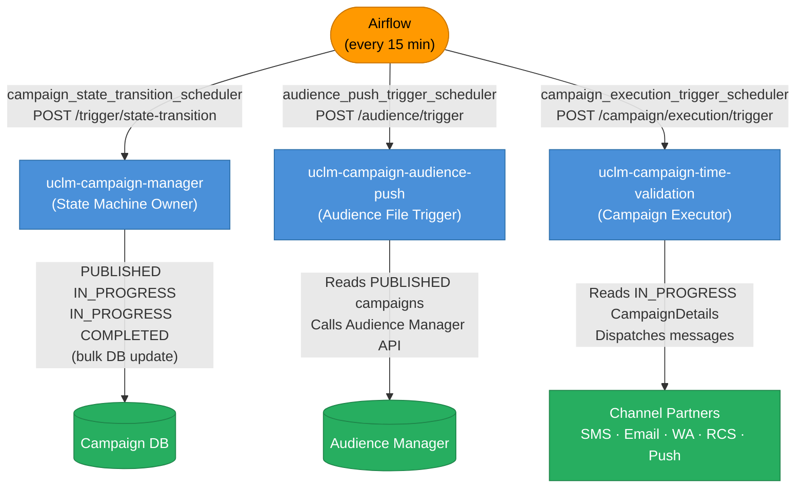
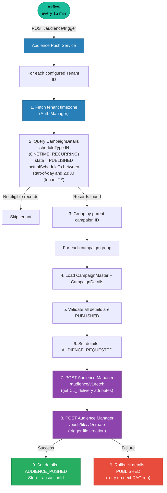
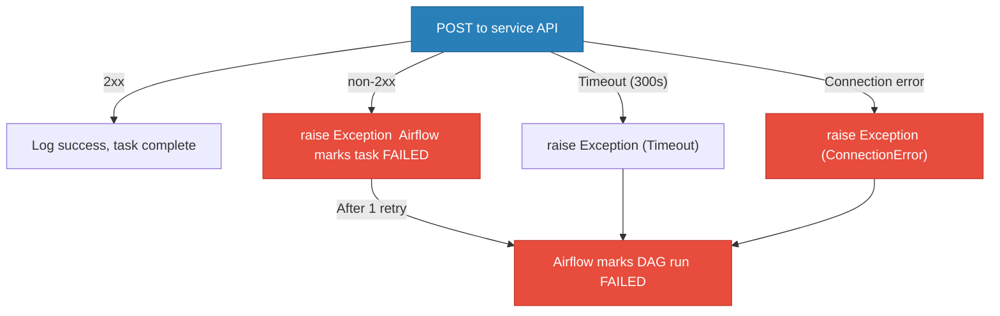

# Airflow DAGs — Scheduled Triggers

All three DAGs run **every 15 minutes**, are **paused on creation** (must be manually activated), and share the same pattern: generate a UUID request/correlation ID → POST to a service API → fail loudly on non-2xx.

---

## DAG Summary

| DAG ID | Target Service | Endpoint | Schedule |
|--------|---------------|----------|----------|
| `campaign_state_transition_scheduler` | uclm-campaign-manager | `POST /campaign-manager/api/v1/campaigns/trigger/state-transition` | `*/15 * * * *` |
| `audience_push_trigger_scheduler` | uclm-campaign-audience-push | `POST /campaign-manager/api/v1/audience/trigger` | `*/15 * * * *` |
| `campaign_execution_trigger_scheduler` | uclm-campaign-time-validation | `POST /api/v1/campaign/execution/trigger` | `*/15 * * * *` |

---

## How They Fit Together



---

## DAG 1 — `campaign_state_transition_scheduler`

**File:** `campaign_state_transition_scheduler.py`  
**Target:** `uclm-campaign-manager`  
**Endpoint:** `POST /campaign-manager/api/v1/campaigns/trigger/state-transition`  
**Auth:** No tenant/dept headers required (endpoint is excluded from auth interceptor)  
**SSL:** `verify=False` — bypasses self-signed cert check (non-prod environment)

### What it does
Calls the Campaign Manager's bulk state transition engine every 15 minutes. Inside Campaign Manager, three operations run:

| Operation | Condition | Transition |
|-----------|-----------|-----------|
| Scheduled campaigns start | `state=PUBLISHED` AND `scheduleType != EVENT` AND `startTimestamp <= now` | `PUBLISHED → IN_PROGRESS` |
| Scheduled campaigns end | `state=IN_PROGRESS` AND `scheduleType != EVENT` AND `endTimestamp <= now` | `IN_PROGRESS → COMPLETED` |
| Event campaigns go live | `state=PUBLISHED` AND `scheduleType = EVENT` | `PUBLISHED → IN_PROGRESS` immediately |

### Response (on success)
```json
{
  "markScheduleFromPublishedToInProgress": 3,
  "markScheduleFromInProgressToCompleted": 1,
  "markEventFromPublishedToInProgress": 2,
  "processedAt": "2026-05-05T07:00:00Z",
  "status": "SUCCESS"
}
```

### Configuration
| Property | Value |
|----------|-------|
| `API_BASE_URL` | `https://campaign-manager-nextgenclm-api-develop.apps.n2ocp-dart-tclus-01.india.airtel.itm` |
| `TRIGGER_ENDPOINT` | `/campaign-manager/api/v1/campaigns/trigger/state-transition` |
| `REQUEST_TIMEOUT` | 300s |
| `RETRY_ATTEMPTS` | 1 retry, 2-minute delay |

---

## DAG 2 — `audience_push_trigger_scheduler`

**File:** `audience_push_trigger_dag.py`  
**Target:** `uclm-campaign-audience-push`  
**Endpoint:** `POST /campaign-manager/api/v1/audience/trigger`  
**Response:** `204 No Content`  
**Headers:** `X-Request-Id`, `X-Correlation-Id` (optional)

### What it does — step by step



### Eligibility Query
The DB query that determines which `CampaignDetails` rows are picked up:

```sql
SELECT cd FROM CampaignDetails cd
JOIN cd.campaignMaster cm
WHERE LOWER(cm.scheduleType) IN ('onetime', 'recurring')
  AND LOWER(cd.state) IN ('published')
  AND cd.actualScheduleTs >= :startOfDay      -- 00:00 in tenant TZ
  AND cd.actualScheduleTs < :endOfDay         -- 23:30 in tenant TZ
  AND cm.tenantId = :tenantId
ORDER BY cd.actualScheduleTs ASC
```

> ⚠️ **EVENT campaigns are excluded** — they have no `actualScheduleTs` and are handled separately by the `campaign_state_transition_scheduler` DAG.

### State transitions driven by this API

| Step | State change | Where |
|------|-------------|-------|
| On AM call start | `PUBLISHED → AUDIENCE_REQUESTED` | `CampaignDetails` |
| On AM success | `AUDIENCE_REQUESTED → AUDIENCE_PUSHED` | `CampaignDetails` |
| On AM failure | `AUDIENCE_REQUESTED → PUBLISHED` (rollback) | `CampaignDetails` |

### Audience Manager calls made internally

| Call | Method | Purpose |
|------|--------|---------|
| `/audience-manager/audience/v1/fetch` | `POST` | Fetch delivery attributes, extract `CL_` identifiers |
| `/audience-manager/push/file/v1/create` | `POST` | Trigger audience file creation, get `transactionId` |

### Configuration
| Property | Value |
|----------|-------|
| `API_BASE_URL` | `http://campaign-audience-push-audience-push-api.nextgenclm-api-develop.apps.n2ocp-dart-tclus-01.india.airtel.itm` |
| `TRIGGER_ENDPOINT` | `/campaign-manager/api/v1/audience/trigger` |
| `eligible-schedule-types` | `ONETIME`, `RECURRING` |
| `eligible-states` | `PUBLISHED` |
| `REQUEST_TIMEOUT` | 300s |
| `RETRY_ATTEMPTS` | 1 retry, 2-minute delay |

---

## DAG 3 — `campaign_execution_trigger_scheduler`

**File:** `campaign_execution_trigger_dag.py`  
**Target:** `uclm-campaign-time-validation`  
**Endpoint:** `POST /api/v1/campaign/execution/trigger`  
**Headers:** `x-request-id`, `x-correlation-id` *(lowercase)*

### What it does
Triggers the **Time Validation** service to scan for `IN_PROGRESS` campaign detail records whose scheduled send timestamps are due, and dispatch the actual messages to channel partners (SMS, Email, WhatsApp, RCS, Push).

> This is the DAG that actually **executes** campaigns — reading `CampaignDetails` rows created during approval and dispatching them to channel Kafka topics.

### Configuration
| Property | Value |
|----------|-------|
| `API_BASE_URL` | `http://campaign-time-validation-nextgenclm-api-develop.apps.n2ocp-dart-tclus-01.india.airtel.itm` |
| `TRIGGER_ENDPOINT` | `/api/v1/campaign/execution/trigger` |
| `REQUEST_TIMEOUT` | 300s |
| `RETRY_ATTEMPTS` | 1 retry, 2-minute delay |

---

## Common DAG Properties

| Property | Value | Notes |
|----------|-------|-------|
| `schedule_interval` | `*/15 * * * *` | Every 15 minutes |
| `catchup` | `False` | Missed runs not backfilled |
| `is_paused_upon_creation` | `True` | Must be manually activated |
| `depends_on_past` | `False` | Each run is independent |
| `email_on_failure` | `False` | Failure not emailed |
| `retries` | `1` | One retry on failure |
| `retry_delay` | `2 minutes` | Wait before retry |

---

## Error Handling

All three DAGs follow the same pattern:


