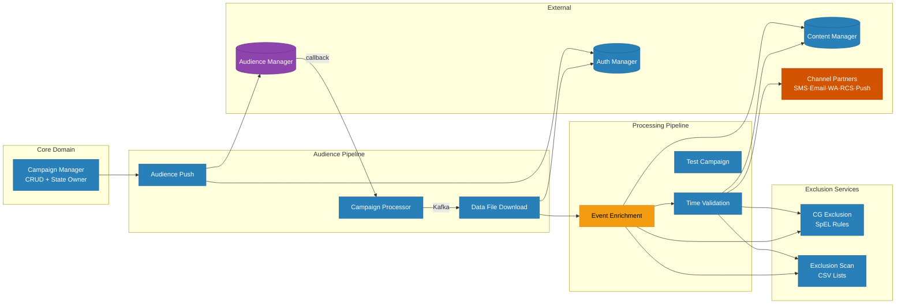

# UCLM Campaign Platform — High-Level Design (HLD)

> Generated from full source-code analysis of all 10 microservices  
> Namespace: `nextgenclm-api-develop` | Stack: Java 17 · Spring Boot 3.x · Kafka · Oracle · Kubernetes

---

## Files in This Folder

| File | Description |
|------|-------------|
| `01-end-to-end-flow.md` | Full integration flow across all 9 services |
| `02-kafka-flows.md` | Kafka topic producers & consumers |
| `03-state-machine.md` | Campaign lifecycle state machine |
| `04-rest-api-calls.md` | Synchronous HTTP/REST call graph |
| `05-database-map.md` | DB table ownership & service access |
| `06-service-details.md` | Per-service deep dive (ports, env vars, endpoints) |
| `10-airflow-dags.md` | Airflow DAG scripts — scheduled triggers for state transitions, audience push, and campaign execution |
| `11-critical-bugs.md` | Deep static-analysis bug report — 26 confirmed bugs across 5 campaign services (20 Critical · 5 High · 1 Medium) |

---

## System Overview

The UCLM platform manages the **complete lifecycle of multi-channel marketing campaigns** —
from creation and audience selection, through exclusion filtering, data enrichment, and validation,
to final delivery over **SMS · Email · WhatsApp · RCS · Push**.

### 9 Services at a Glance

---

## Tech Stack

| Layer | Technology |
|-------|-----------|
| Language | Java 17 |
| Frameworks | Spring Boot 3.5.6 / 4.0.x |
| Messaging | Apache Kafka |
| Database | Oracle (primary) · MySQL (secondary) |
| ORM | Spring Data JPA + Hibernate |
| HTTP Clients | RestTemplate · OpenFeign · WebClient |
| Cloud Storage | AWS S3 SDK 2.25.56 |
| Resilience | Resilience4j 2.x (circuit breaker + retry) |
| Observability | OpenTelemetry 1.38.0 · Prometheus |
| Caching | Caffeine |
| Concurrency | Virtual Threads (Project Loom) |
| Rule Engine | Spring Expression Language (SpEL) |
| Container | Docker · Kubernetes |
