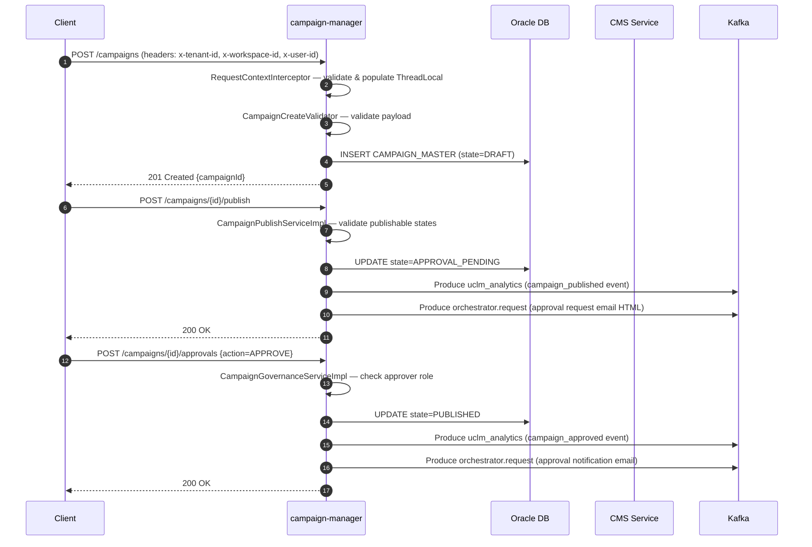
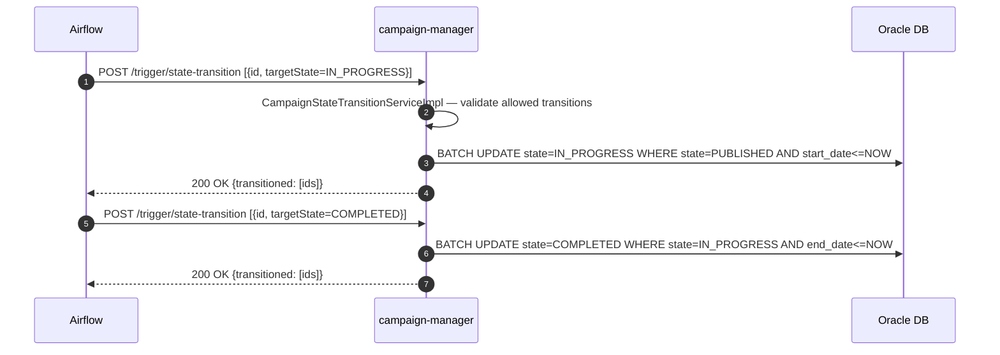
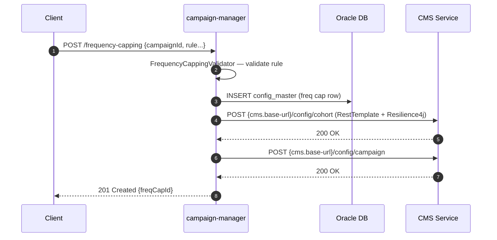

# HLD — uclm-campaign-manager

**Role:** Central source of truth for campaign lifecycle management — owns CRUD, state transitions, governance, goals, subgoals, control groups, and frequency capping.

---

## 1. Purpose & Responsibilities

| Responsibility | Detail |
|---|---|
| Campaign CRUD | Create, read, update, search, and copy campaigns across all lifecycle states |
| Publish & Governance | Submit campaign for approval (→ APPROVAL_PENDING); approve or reject via governance workflow |
| Lifecycle Management | Pause, resume, and kill in-flight campaigns via dedicated lifecycle endpoints |
| State Transitions (Airflow) | Bulk state transition endpoint polled by Airflow: PUBLISHED → IN_PROGRESS → COMPLETED |
| Control Groups (CG) | Create and list control groups scoped to a campaign |
| Goals & Subgoals | Define and list campaign goals and sub-goals for measurement |
| Frequency Capping | Create, list, and update frequency cap rules; sync rules to CMS service |
| Analytics Events | Publish campaign created / approved events to `uclm_analytics` Kafka topic |
| Email Notifications | Send async HTML email notifications via `orchestrator.request` Kafka topic (Thymeleaf templates) |
| Request Context | Validate `x-tenant-id`, `x-workspace-id`, `x-user-id` headers; populate ThreadLocal `RequestContext` |
| CMS Synchronisation | Push frequency-capping config to CMS service via RestTemplate on create/update |

---

## 2. High-Level Architecture

```
┌──────────────────────────────────────────────────────────────────────────────────┐
│                          uclm-campaign-manager  :8080                            │
│                                                                                  │
│  ┌──────────────────────────────────────────────────────────────────────────┐   │
│  │                     Spring MVC  (Controllers)                            │   │
│  │  CampaignController  │ CampaignLifecycleController                       │   │
│  │  CampaignPublishController  │ CampaignGovernanceController                │   │
│  │  CampaignStateTransitionController  │ CampaignCgController                │   │
│  │  CampaignGoalController  │ CampaignSubgoalController                      │   │
│  │  FrequencyCappingController  │ CampaignExclusionController                │   │
│  └────────────────────────────┬─────────────────────────────────────────────┘   │
│                               │                                                  │
│  ┌────────────────────────────▼─────────────────────────────────────────────┐   │
│  │                      Service Layer                                        │   │
│  │  CampaignServiceImpl  │ CampaignPublishServiceImpl                        │   │
│  │  CampaignGovernanceServiceImpl  │ CampaignLifecycleServiceImpl            │   │
│  │  CampaignStateTransitionServiceImpl  │ CampaignAnalyticsServiceImpl       │   │
│  │  FrequencyCappingServiceImpl  │ CmsFacadeServiceImpl                      │   │
│  │  CampaignGoalServiceImpl  │ CampaignSubgoalServiceImpl                    │   │
│  │  CampaignCgServiceImpl  │ EmailNotificationServiceImpl                    │   │
│  └───────────┬──────────────────────────────────┬────────────────────────────┘  │
│              │                                  │                                │
│  ┌───────────▼──────────┐          ┌────────────▼────────────────────────────┐  │
│  │   Spring Data JPA    │          │           Outbound Clients              │  │
│  │  (Oracle DB)         │          │  RestTemplate → CMS service             │  │
│  │  CAMPAIGN_MASTER     │          │  RestTemplate → Content Manager         │  │
│  │  campaign_details    │          │  KafkaProducer → uclm_analytics         │  │
│  │  config_master       │          │  KafkaProducer → orchestrator.request   │  │
│  │  cg / goal / subgoal │          └─────────────────────────────────────────┘  │
│  └──────────────────────┘                                                        │
│                                                                                  │
│  ┌──────────────────────────────────────────────────────────────────────────┐   │
│  │  RequestContextInterceptor  (x-tenant-id / x-workspace-id / x-user-id)  │   │
│  │  Resilience4j (circuit-breaker on CMS calls)                             │   │
│  └──────────────────────────────────────────────────────────────────────────┘   │
└──────────────────────────────────────────────────────────────────────────────────┘
         ▲                        │                        │
  REST callers              Oracle DB              Kafka Broker
  (UI / Airflow /          (campaigns,             (uclm_analytics,
   audience-push)           cg, goals)              orchestrator.request)
```

---

## 3. Detailed Processing Flow

### 3a. Campaign Creation → Publish → Approval



### 3b. Airflow State Transition (PUBLISHED → IN_PROGRESS → COMPLETED)



### 3c. Frequency Capping Create & CMS Sync



---

## 4. Key Business Logic / Algorithms

### Campaign State Machine

```
                     ┌──────────┐
                     │  DRAFT   │◄──────────────────────────────┐
                     └────┬─────┘                               │ (copy)
                          │ publish()                           │
                          ▼                                     │
               ┌──────────────────────┐                        │
               │  APPROVAL_PENDING    │                        │
               └──────┬───────┬───────┘                        │
              approve()│       │reject()                        │
                       ▼       ▼                                │
               ┌──────────┐  ┌──────────┐                      │
               │ PUBLISHED│  │ REJECTED │                      │
               └────┬─────┘  └──────────┘                      │
                    │ Airflow/state-transition                  │
                    ▼                                           │
             ┌─────────────┐   pause()  ┌────────┐            │
             │ IN_PROGRESS │──────────►│ PAUSED │            │
             └─────┬───────┘            └───┬────┘            │
                   │                    resume()│              │
                   │◄──────────────────────────┘              │
                   │ Airflow/state-transition                  │
                   ▼                                           │
            ┌───────────┐   kill()    ┌──────────┐           │
            │ COMPLETED │            │  KILLED  │           │
            └───────────┘            └──────────┘           │
```

### Validation Chain

Each mutating endpoint runs a chain of validators before touching the DB:

| Endpoint | Validators Applied |
|---|---|
| POST /campaigns | CampaignCreateValidator, CampaignScheduleValidator, CampaignContentValidator |
| PUT /campaigns/{id} | CampaignUpdateValidator, CampaignActionValidator, CampaignScheduleValidator |
| POST /campaigns/{id}/publish | CampaignActionValidator (state check) |
| POST /campaigns/{id}/approvals | CampaignActionValidator (role + state check) |
| POST /cg | CampaignCgValidator |
| POST /goals | GoalValidator |
| POST /subgoals | SubgoalValidator |
| POST /frequency-capping | FrequencyCappingValidator |

### Frequency Capping Sync Logic

On every create/update of a frequency cap rule, `CmsFacadeServiceImpl` calls two CMS endpoints:
1. `/config/cohort` — registers audience cohort-level cap
2. `/config/campaign` — registers campaign-level cap

Both calls are wrapped with Resilience4j circuit-breaker to tolerate transient CMS failures.

---

## 5. Data Models

### CAMPAIGN_MASTER

| Column | Type | Notes |
|---|---|---|
| id | VARCHAR | PK, UUID |
| tenant_id | VARCHAR | From request context |
| workspace_id | VARCHAR | From request context |
| name | VARCHAR | Campaign display name |
| state | VARCHAR | DRAFT / APPROVAL_PENDING / PUBLISHED / IN_PROGRESS / COMPLETED / REJECTED / PAUSED / KILLED |
| event_id | VARCHAR | Trigger event ID |
| start_date | TIMESTAMP | Campaign start |
| end_date | TIMESTAMP | Campaign end |
| created_by | VARCHAR | From x-user-id header |
| created_at | TIMESTAMP | |
| updated_at | TIMESTAMP | |

### campaign_details

| Column | Type | Notes |
|---|---|---|
| id | VARCHAR | PK |
| campaign_id | VARCHAR | FK → CAMPAIGN_MASTER |
| channel | VARCHAR | SMS / EMAIL / PUSH / WA / RCS |
| state | VARCHAR | Mirrors master or channel-specific sub-state |
| audience_id | VARCHAR | Audience segment ID |
| template_id | VARCHAR | Content template ID |
| transaction_id | VARCHAR | Set by audience-push |

### config_master (Frequency Capping)

| Column | Type | Notes |
|---|---|---|
| id | VARCHAR | PK |
| campaign_id | VARCHAR | FK → CAMPAIGN_MASTER |
| rule_type | VARCHAR | DAILY / WEEKLY / MONTHLY / TOTAL |
| cap_value | INTEGER | Max sends |
| synced_to_cms | BOOLEAN | Whether CMS sync succeeded |

### goal / subgoal

| Column | Type | Notes |
|---|---|---|
| id | VARCHAR | PK |
| campaign_id | VARCHAR | FK → CAMPAIGN_MASTER |
| name | VARCHAR | Goal name |
| metric | VARCHAR | KPI metric key |
| target_value | DECIMAL | Target threshold |

### cg (Control Group)

| Column | Type | Notes |
|---|---|---|
| id | VARCHAR | PK |
| campaign_id | VARCHAR | FK → CAMPAIGN_MASTER |
| percentage | DECIMAL | % of audience withheld |
| description | VARCHAR | |

---

## 6. Kafka Topics

| Topic | Direction | Description |
|---|---|---|
| `uclm_analytics` | PRODUCE | Campaign lifecycle events: created, published, approved, rejected for analytics ingestion |
| `orchestrator.request` | PRODUCE | Async email notification requests containing Thymeleaf-rendered HTML bodies sent to email orchestrator |

---

## 7. REST API Endpoints

| Method | Path | Description |
|---|---|---|
| POST | `/campaign-manager/api/v1/campaigns` | Create campaign (state = DRAFT) |
| GET | `/campaign-manager/api/v1/campaigns/{id}` | Get campaign by ID |
| PUT | `/campaign-manager/api/v1/campaigns/{id}` | Full update of campaign |
| PATCH | `/campaign-manager/api/v1/campaigns/{id}` | Partial update |
| GET | `/campaign-manager/api/v1/campaigns` | Search campaigns with query filters |
| POST | `/campaign-manager/api/v1/campaigns/{id}/copy` | Deep-copy a campaign (new DRAFT) |
| POST | `/campaign-manager/api/v1/campaigns/{id}/publish` | Submit for approval → APPROVAL_PENDING |
| POST | `/campaign-manager/api/v1/campaigns/{id}/approvals` | Approve or reject a pending campaign |
| GET | `/campaign-manager/api/v1/campaigns/approvals` | List all campaigns pending approval |
| POST | `/campaign-manager/api/v1/campaigns/{id}/pause` | Pause an IN_PROGRESS campaign |
| POST | `/campaign-manager/api/v1/campaigns/{id}/resume` | Resume a PAUSED campaign |
| POST | `/campaign-manager/api/v1/campaigns/{id}/kill` | Hard-stop a campaign |
| POST | `/campaign-manager/api/v1/trigger/state-transition` | Airflow bulk state transition (batch) |
| POST | `/campaign-manager/api/v1/cg` | Create control group for a campaign |
| GET | `/campaign-manager/api/v1/cg` | List control groups |
| POST | `/campaign-manager/api/v1/goals` | Create campaign goal |
| GET | `/campaign-manager/api/v1/goals` | List campaign goals |
| POST | `/campaign-manager/api/v1/subgoals` | Create campaign subgoal |
| GET | `/campaign-manager/api/v1/subgoals` | List campaign subgoals |
| GET | `/campaign-manager/api/v1/exclusions` | Get available exclusion types |
| POST | `/campaign-manager/api/v1/frequency-capping` | Create frequency cap rule |
| GET | `/campaign-manager/api/v1/frequency-capping` | List frequency cap rules |
| PUT | `/campaign-manager/api/v1/frequency-capping/{id}` | Update frequency cap rule |

---

## 8. Component Map

| Class | Package | Responsibility |
|---|---|---|
| `CampaignController` | controllers | Campaign CRUD + copy REST handler |
| `CampaignLifecycleController` | controllers | pause / resume / kill endpoints |
| `CampaignPublishController` | controllers | publish endpoint |
| `CampaignGovernanceController` | controllers | approve / reject endpoint |
| `CampaignStateTransitionController` | controllers | Airflow bulk transition endpoint |
| `CampaignCgController` | controllers | Control group endpoints |
| `CampaignGoalController` | controllers | Goal CRUD endpoints |
| `CampaignSubgoalController` | controllers | Subgoal CRUD endpoints |
| `FrequencyCappingController` | controllers | Frequency cap CRUD endpoints |
| `CampaignExclusionController` | controllers | Exclusion type lookup |
| `RequestContextInterceptor` | interceptors | Header validation + ThreadLocal population |
| `CampaignServiceImpl` | services.impl | Core CRUD and search logic |
| `CampaignPublishServiceImpl` | services.impl | Publish state transition and validation |
| `CampaignGovernanceServiceImpl` | services.impl | Approve/reject business logic |
| `CampaignLifecycleServiceImpl` | services.impl | pause / resume / kill orchestration |
| `CampaignStateTransitionServiceImpl` | services.impl | Airflow bulk transition logic |
| `CampaignAnalyticsServiceImpl` | services.impl | Kafka analytics event publisher |
| `EmailNotificationServiceImpl` | services.impl | Async Thymeleaf email via Kafka |
| `FrequencyCappingServiceImpl` | services.impl | Freq cap CRUD + CMS sync |
| `CmsFacadeServiceImpl` | services.impl | RestTemplate calls to CMS service |
| `CampaignGoalServiceImpl` | services.impl | Goal CRUD |
| `CampaignSubgoalServiceImpl` | services.impl | Subgoal CRUD |
| `CampaignCgServiceImpl` | services.impl | Control group CRUD |
| `CampaignCreateValidator` | validators | Validate campaign creation payload |
| `CampaignUpdateValidator` | validators | Validate update payload |
| `CampaignActionValidator` | validators | Validate state-action compatibility |
| `CampaignScheduleValidator` | validators | Validate start/end date rules |
| `CampaignContentValidator` | validators | Validate content/template references |
| `CampaignCgValidator` | validators | Validate CG percentage and constraints |
| `GoalValidator` | validators | Validate goal metric and target |
| `SubgoalValidator` | validators | Validate subgoal under parent goal |
| `FrequencyCappingValidator` | validators | Validate cap type, value, and scope |

---

## 9. Configuration Reference

| Property | Default | Description |
|---|---|---|
| `server.port` | `8080` | HTTP port (deployed as 80) |
| `spring.profiles.active` | `uat` | Active Spring profile |
| `spring.datasource.url` | — | Oracle JDBC connection URL |
| `spring.datasource.username` | — | DB username |
| `spring.datasource.password` | — | DB password |
| `cms.base-url` | — | Base URL for CMS service |
| `kafka.topic.analytics` | `uclm_analytics` | Analytics Kafka topic name |
| `kafka.topic.notification` | `orchestrator.request` | Notification Kafka topic name |
| `campaign.publish-allowed-in-states` | — | Comma-separated states from which publish is allowed |
| `spring.mail.host` | — | SMTP host for email (used by Thymeleaf email service) |
| `spring.mail.port` | `587` | SMTP port |
| `spring.mail.username` | — | SMTP username |
| `spring.mail.password` | — | SMTP password |
| `spring.mail.properties.mail.smtp.auth` | `true` | Enable SMTP auth |
| `resilience4j.circuitbreaker.instances.cms.failure-rate-threshold` | `50` | CB failure threshold % for CMS calls |
| `resilience4j.circuitbreaker.instances.cms.wait-duration-in-open-state` | `10s` | CB open state wait |

---

## 10. External Dependencies

| Service | Type | Purpose |
|---|---|---|
| Oracle DB | Database | Persistent store for campaigns, CG, goals, subgoals, freq cap rules |
| Apache Kafka | Message Broker | Async analytics events (`uclm_analytics`) and email notifications (`orchestrator.request`) |
| CMS Service | REST (RestTemplate) | Sync frequency-capping cohort and campaign config on create/update |
| Content Manager | REST (RestTemplate) | Validate email attachment media references during content validation |
| Apache Airflow | REST Client (calls us) | Polls `/trigger/state-transition` to advance campaign states on schedule |
| Email Orchestrator | Kafka Consumer (downstream) | Receives Thymeleaf HTML email payloads from `orchestrator.request` topic |
