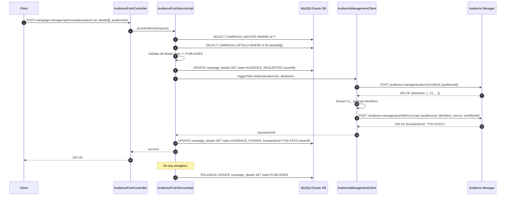
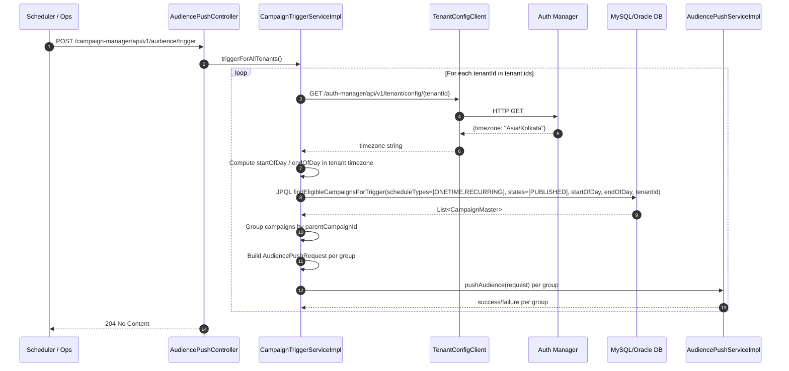

# HLD — uclm-campaign-audience-push

**Role:** Pushes audience files for CLM campaigns to the external Audience Manager. Runs on a scheduler (per-tenant, timezone-aware) or can be triggered manually. Manages campaign state transitions PUBLISHED → AUDIENCE_REQUESTED → AUDIENCE_PUSHED.

---

## 1. Purpose & Responsibilities

| Responsibility | Detail |
|---|---|
| Manual Audience Push | Accept explicit REST push request for a specific campaign detail and audienceId |
| Scheduled Trigger | Periodically scan DB for campaigns whose start date falls today (per-tenant, timezone-aware) |
| Audience Attribute Fetch | Call Audience Manager `/fetch` API to retrieve audience attributes; extract `CL_` prefixed identifiers |
| File Push Job Creation | Call Audience Manager `/create` API to create an audience file push job; capture returned `transactionId` |
| Timezone Resolution | Retrieve per-tenant timezone from Auth Manager to compute correct start-of-day / end-of-day boundaries |
| State Transitions | Drive detail-level state: PUBLISHED → AUDIENCE_REQUESTED → AUDIENCE_PUSHED; rollback to PUBLISHED on failure |
| Error Recovery | On any exception during push, reset all processed details back to PUBLISHED for safe retry |

---

## 2. High-Level Architecture

```
┌──────────────────────────────────────────────────────────────────────────────┐
│                   uclm-campaign-audience-push  :8095                         │
│                                                                              │
│  ┌─────────────────────────────────────────────────────────────────────┐    │
│  │                  REST Controllers                                    │    │
│  │  AudiencePushController                                              │    │
│  │    POST /push   (manual trigger — explicit campaign + audienceId)    │    │
│  │    POST /trigger (scheduled trigger — scan all tenants today)        │    │
│  └─────────────────────────────┬───────────────────────────────────────┘    │
│                                │                                             │
│  ┌─────────────────────────────▼───────────────────────────────────────┐    │
│  │                  Service Layer                                        │    │
│  │                                                                       │    │
│  │  AudiencePushServiceImpl          CampaignTriggerServiceImpl         │    │
│  │  ─────────────────────────        ──────────────────────────         │    │
│  │  • Load master + details          • Iterate tenant.ids list          │    │
│  │  • Validate state==PUBLISHED      • Get timezone (Auth Manager)      │    │
│  │  • Update → AUDIENCE_REQUESTED    • Compute startOfDay / endOfDay    │    │
│  │  • Call AudienceMgmtClient        • Query eligible campaigns (JPQL)  │    │
│  │  • Update → AUDIENCE_PUSHED       • Group by parentCampaignId        │    │
│  │  • Rollback on failure            • Delegate to AudiencePushService  │    │
│  └──────────┬─────────────────────────────────┬───────────────────────┘    │
│             │                                 │                             │
│  ┌──────────▼──────────────┐    ┌─────────────▼────────────────────────┐   │
│  │  Spring Data JPA / ORM  │    │        Outbound REST Clients         │   │
│  │  (MySQL / Oracle)        │    │                                      │   │
│  │                          │    │  AudienceManagementClientImpl        │   │
│  │  campaign_master         │    │   POST /audience-manager/            │   │
│  │  campaign_details        │    │        audience/v1/fetch             │   │
│  │                          │    │   POST /audience-manager/            │   │
│  │  JPQL filter:            │    │        push/file/v1/create           │   │
│  │   state IN (PUBLISHED)   │    │                                      │   │
│  │   scheduleType IN        │    │  TenantConfigClientImpl              │   │
│  │   (ONETIME, RECURRING)   │    │   GET /auth-manager/api/v1/          │   │
│  │   startDate within today │    │       tenant/config/{tenantId}       │   │
│  └──────────────────────────┘    └──────────────────────────────────────┘   │
└──────────────────────────────────────────────────────────────────────────────┘
         ▲                         ▲                         ▲
   REST caller               MySQL/Oracle DB           External Systems
   (scheduler /             (campaign state)       (Audience Manager,
    manual ops)                                      Auth Manager)
```

---

## 3. Detailed Processing Flow

### 3a. Manual Audience Push (POST /push)



### 3b. Scheduled Trigger (POST /trigger)



---

## 4. Key Business Logic / Algorithms

### State Transition Flow (Detail Level)

```
   PUBLISHED
      │
      │ saveAll(state=AUDIENCE_REQUESTED)       ← atomic before external call
      ▼
 AUDIENCE_REQUESTED
      │
      │ AM /fetch → extract CL_ identifiers
      │ AM /create → get transactionId
      │
      ├─── success ───► AUDIENCE_PUSHED (transactionId stored)
      │
      └─── any exception ───► PUBLISHED  (rollback saveAll)
```

### CL_ Identifier Extraction

After calling `/audience-manager/audience/v1/fetch`, the response contains a list of attribute objects. Only those whose key starts with `CL_` are forwarded to the file-create job. This filters raw demographic/product attributes down to the CLM-specific column identifiers needed for the push file schema.

### Timezone-Aware Day Boundary Computation

```
tenantTimezone = GET /auth-manager/.../{tenantId} → config.timezone
    (fallback: tenant.default-timezone = Asia/Kolkata)

ZonedDateTime startOfDay = LocalDate.now(ZoneId.of(tenantTimezone)).atStartOfDay(zoneId)
ZonedDateTime endOfDay   = startOfDay.plusDays(1).minusNanos(1)

// Used in JPQL:
WHERE start_date BETWEEN :startOfDay AND :endOfDay
  AND schedule_type IN ('ONETIME','RECURRING')
  AND state = 'PUBLISHED'
  AND tenant_id = :tenantId
```

### Grouping by parentCampaignId

A single parent campaign may have multiple child detail rows (one per channel). The trigger service groups details by `parentCampaignId` to construct one `AudiencePushRequest` per parent, ensuring all channels of the same campaign are pushed together in a single Audience Manager job.

---

## 5. Data Models

### campaign_master (read)

| Column | Type | Notes |
|---|---|---|
| id | VARCHAR | PK |
| tenant_id | VARCHAR | Tenant identifier |
| state | VARCHAR | PUBLISHED at this stage |
| schedule_type | VARCHAR | ONETIME / RECURRING |
| start_date | TIMESTAMP | Used for day-boundary filtering |
| audience_id | VARCHAR | Default audience ID |

### campaign_details (read + write)

| Column | Type | Notes |
|---|---|---|
| id | VARCHAR | PK |
| campaign_id | VARCHAR | FK → campaign_master |
| parent_campaign_id | VARCHAR | Grouping key for multi-channel campaigns |
| channel | VARCHAR | SMS / EMAIL / PUSH / WA / RCS |
| state | VARCHAR | PUBLISHED → AUDIENCE_REQUESTED → AUDIENCE_PUSHED |
| audience_id | VARCHAR | Override audience ID for this detail |
| transaction_id | VARCHAR | Set by Audience Manager after file create |
| tenant_id | VARCHAR | Denormalised from master |

### AudiencePushRequest DTO

| Field | Type | Notes |
|---|---|---|
| id | String | Campaign master ID |
| detailIds | List\<String\> | Selected detail IDs to push |
| audienceId | String | Audience segment identifier |

### AudienceFileCreateResponse DTO

| Field | Type | Notes |
|---|---|---|
| transactionId | String | Returned by Audience Manager; stored in campaign_details |
| status | String | Job creation status |

---

## 6. Kafka Topics

| Topic | Direction | Description |
|---|---|---|
| — | — | This service does **not** use Kafka. All integrations are synchronous REST calls via RestTemplate. |

---

## 7. REST API Endpoints

| Method | Path | Description |
|---|---|---|
| POST | `/campaign-manager/api/v1/audience/push` | Manual audience push for specific campaign + audienceId |
| POST | `/campaign-manager/api/v1/audience/trigger` | Scheduled trigger — scan all tenants and push eligible campaigns; returns 204 No Content |

---

## 8. Component Map

| Class | Package | Responsibility |
|---|---|---|
| `AudiencePushController` | controllers | REST handler for `/push` and `/trigger` endpoints |
| `AudiencePushServiceImpl` | services.impl | Core transactional push logic: load, validate, transition states, call AM client, rollback on error |
| `CampaignTriggerServiceImpl` | services.impl | Per-tenant scheduler logic: timezone resolution, day boundary, DB query, grouping, delegation |
| `AudienceManagementClientImpl` | clients | RestTemplate wrapper for Audience Manager `/fetch` and `/create` APIs |
| `TenantConfigClientImpl` | clients | RestTemplate wrapper for Auth Manager tenant config API |
| `CampaignMasterRepository` | repositories | JPA repository for `campaign_master` |
| `CampaignDetailsRepository` | repositories | JPA repository for `campaign_details`; contains `findEligibleCampaignsForTrigger` JPQL |

---

## 9. Configuration Reference

| Property | Default | Description |
|---|---|---|
| `server.port` | `8095` | HTTP port |
| `am.base-url` | — | Audience Manager base URL |
| `am.api.file-create` | `/audience-manager/push/file/v1/create` | File push job creation endpoint |
| `am.api.audience-delivery` | `/audience-manager/audience/v1/fetch` | Audience attribute fetch endpoint |
| `am.source` | `CLM_PUSH` | Source identifier sent to Audience Manager |
| `am.workflow-id` | — | Static workflow-id header sent on file-create calls |
| `am.api-key` | — | API key for file-create calls |
| `am.audience-delivery-api-key` | — | API key for audience delivery fetch |
| `am.default-parent-group` | `OPTIMUS` | Default parent group header for AM requests |
| `am.client.connect-timeout-ms` | `5000` | HTTP connect timeout (ms) |
| `am.client.read-timeout-sec` | `60` | HTTP read timeout (seconds) |
| `auth-manager.base-url` | — | Auth Manager service base URL |
| `auth-manager.api.tenant-config` | `/auth-manager/api/v1/tenant/config` | Tenant config endpoint path |
| `tenant.ids` | — | Comma-separated list of tenantIds to process during scheduled trigger |
| `tenant.default-timezone` | `Asia/Kolkata` | Fallback timezone when Auth Manager returns none |
| `campaign.states.published` | `PUBLISHED` | State constant used in eligibility query |
| `campaign.states.audience-requested` | `AUDIENCE_REQUESTED` | Intermediate state after fetch, before create |
| `campaign.states.audience-pushed` | `AUDIENCE_PUSHED` | Terminal success state; transactionId also stored |

---

## 10. External Dependencies

| Service | Type | Purpose |
|---|---|---|
| MySQL / Oracle DB | Database | Read campaign eligibility; write state transitions and transactionId on campaign_details |
| Audience Manager | REST (RestTemplate) | `/fetch` — get audience attributes and extract CL_ identifiers; `/create` — create file push job and get transactionId |
| Auth Manager | REST (RestTemplate) | `GET /tenant/config/{tenantId}` — retrieve per-tenant timezone for day-boundary computation |
