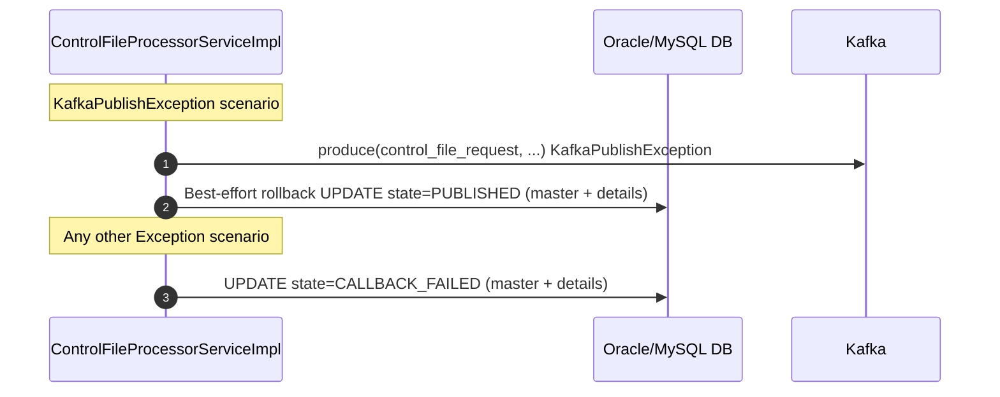

# HLD — uclm-campaign-processor

**Role:** Receives async HTTP callback from Audience Manager when audience control file (`.ctrl.gz`) is ready. Downloads, decompresses (multi-layer GZIP), and parses the control file. Updates campaign state and publishes control file data to Kafka for downstream consumers.

---

## 1. Purpose & Responsibilities

| Responsibility | Detail |
|---|---|
| Callback Reception | Expose HTTP endpoint for Audience Management System to deliver async completion callbacks |
| Callback Validation | Validate `statusInfo.code` is 2xx and `data[].url` is not blank before processing |
| AudienceId Extraction | Parse the control file URL with regex `/([^/]+)\.ctrl\.gz` to extract the audienceId |
| Campaign Lookup | Query DB by audienceId to find matching `CAMPAIGN_MASTER` and `CAMPAIGN_DETAILS` rows |
| State Filtering | Filter masters to `state == AUDIENCE_PUSHED`; filter details to `state == AUDIENCE_PUSHED AND transactionId matches` |
| Control File Download | HTTP GET the `.ctrl.gz` URL via `HttpURLConnection` (or local file if `use-local=true`); enforce 500 MB cap |
| Decompression & Parse | Multi-layer GZIP decompress + JSON parse into `ControlFileDTO` (attributeList, delimiters, recordCount) |
| State Progression | Drive states: AUDIENCE_PUSHED → CALLBACK_RECEIVED → CONTROL_FILE_DOWNLOADED → CONTROL_FILE_PUBLISHED |
| Kafka Publish | Publish `ControlFileDTO` JSON to `control_file_request` topic for downstream consumers |
| Error Handling | `KafkaPublishException` → rollback state to PUBLISHED; any other Exception → state = CALLBACK_FAILED |

---

## 2. High-Level Architecture

```
┌────────────────────────────────────────────────────────────────────────────────┐
│                      uclm-campaign-processor  :8080                            │
│                                                                                │
│  ┌──────────────────────────────────────────────────────────────────────┐     │
│  │                     REST Layer                                        │     │
│  │  CallbackController                                                   │     │
│  │    POST /campaign-processor/api/v1/callback                          │     │
│  └──────────────────────────────┬───────────────────────────────────────┘     │
│                                 │                                              │
│  ┌──────────────────────────────▼───────────────────────────────────────┐     │
│  │              ControlFileProcessorServiceImpl  (orchestrator)          │     │
│  │                                                                       │     │
│  │  Step 1: Validate callback (statusInfo.code, url)                    │     │
│  │  Step 2: Extract audienceId via regex                                 │     │
│  │  Step 3: findByAudienceId → List<CampaignMaster>                     │     │
│  │  Step 4: findByParentCampaignIdIn → List<CampaignDetails>            │     │
│  │  Step 5: Filter by state + transactionId                             │     │
│  │  Step 6: Update state → CALLBACK_RECEIVED                            │     │
│  │  Step 7: Download .ctrl.gz                                           │     │
│  │  Step 8: Decompress + Parse → ControlFileDTO; state → DOWNLOADED     │     │
│  │  Step 9: Publish ControlFileDTO to Kafka                             │     │
│  │  Step 10: Update state → CONTROL_FILE_PUBLISHED                      │     │
│  └─────┬─────────────────────────────────────────────────┬─────────────┘     │
│        │                                                  │                   │
│  ┌─────▼──────────────────────┐          ┌───────────────▼───────────────┐   │
│  │  ControlFileDownloadService│          │       ControlFilePublisher    │   │
│  │  (HttpURLConnection)        │          │       (KafkaProducer)         │   │
│  │  • HTTP GET or local file   │          │       topic: control_file_    │   │
│  │  • Multi-layer GZIP unzip   │          │              request          │   │
│  │  • JSON parse → DTO         │          └───────────────────────────────┘   │
│  └─────┬──────────────────────┘                                                │
│        │                                                                       │
│  ┌─────▼──────────────────────┐                                                │
│  │   Spring Data JPA           │                                                │
│  │   (Oracle / MySQL)          │                                                │
│  │   CAMPAIGN_MASTER           │                                                │
│  │   CAMPAIGN_DETAILS          │                                                │
│  │   JPA Converters:           │                                                │
│  │   • AudienceAttributeList   │                                                │
│  │   • CampaignRequest         │                                                │
│  │   • ParamsMappingList       │                                                │
│  │   • StringList              │                                                │
│  │   • TemplateButtonList      │                                                │
│  └─────────────────────────────┘                                                │
└────────────────────────────────────────────────────────────────────────────────┘
          ▲                            │                        │
  Audience Manager               Oracle/MySQL DB          Kafka Broker
  (async callback)              (campaign state)         (control_file_request)
```

---

## 3. Detailed Processing Flow

### 3a. Happy Path — Callback to Published

```mermaid
sequenceDiagram
    autonumber
    participant AM as Audience Manager
    participant CC as CallbackController
    participant CFPS as ControlFileProcessorServiceImpl
    participant CFDS as ControlFileDownloadServiceImpl
    participant DB as Oracle/MySQL DB
    participant K as Kafka

    AM->>CC: POST /campaign-processor/api/v1/callback {transactionId, statusInfo, data[{url,count}]}
    CC->>CFPS: process(callbackRequest)

    CFPS->>CFPS: Step 1 — Validate statusInfo.code is 2xx AND data[0].url not blank

    CFPS->>CFPS: Step 2 — Regex /([^/]+)\.ctrl\.gz on URL  audienceId = "AUD_4"

    CFPS->>DB: Step 3 — SELECT * FROM CAMPAIGN_MASTER WHERE audience_id = 'AUD_4'
    DB-->>CFPS: List<CampaignMaster>

    CFPS->>DB: Step 4 — SELECT * FROM CAMPAIGN_DETAILS WHERE parent_campaign_id IN (masterIds)
    DB-->>CFPS: List<CampaignDetails>

    CFPS->>CFPS: Step 5 — Filter masters: state==AUDIENCE_PUSHED; filter details: state==AUDIENCE_PUSHED AND transactionId matches

    CFPS->>DB: Step 6 — UPDATE CAMPAIGN_MASTER + CAMPAIGN_DETAILS SET state=CALLBACK_RECEIVED
    DB-->>CFPS: saved

    CFPS->>CFDS: Step 7 — download(url)
    CFDS->>CFDS: HttpURLConnection GET (or local file if use-local=true)
    CFDS->>CFDS: Multi-layer GZIP decompress loop
    CFDS->>CFDS: JSON parse  ControlFileDTO {attributeList, delimiters, recordCount}
    CFDS-->>CFPS: ControlFileDTO

    CFPS->>DB: Step 8 — UPDATE state=CONTROL_FILE_DOWNLOADED; persist attributeList, delimiters, recordCount
    DB-->>CFPS: saved

    CFPS->>K: Step 9 — produce(control_file_request, ControlFileDTO JSON)
    K-->>CFPS: ack

    CFPS->>DB: Step 10 — UPDATE state=CONTROL_FILE_PUBLISHED
    DB-->>CFPS: saved

    CFPS-->>CC: success
    CC-->>AM: 200 OK
```

### 3b. Error Paths



---

## 4. Key Business Logic / Algorithms

### 10-Step Processing Pipeline

| Step | Action | State After |
|---|---|---|
| 1 | Validate `statusInfo.code` is 2xx; validate `data[0].url` not blank | — |
| 2 | Extract `audienceId` from URL: regex `/([^/]+)\.ctrl\.gz` on last path segment | — |
| 3 | `findByAudienceId(audienceId)` → `List<CampaignMaster>` | — |
| 4 | `findByParentCampaignIdIn(parentIds)` → `List<CampaignDetails>` | — |
| 5 | Filter: master `state==AUDIENCE_PUSHED`; details `state==AUDIENCE_PUSHED` AND `transactionId` in callback matches | — |
| 6 | `saveAll(state=CALLBACK_RECEIVED)` — both master and details | `CALLBACK_RECEIVED` |
| 7 | HTTP GET `.ctrl.gz` URL via `HttpURLConnection`; enforce 500 MB max size cap during stream | — |
| 8 | Multi-layer GZIP decompress (loop until not GZIP); JSON parse → `ControlFileDTO`; persist `attributeList`, `delimiters`, `recordCount` | `CONTROL_FILE_DOWNLOADED` |
| 9 | `ControlFilePublisher.publish(controlFileDTO)` → Kafka `control_file_request` | — |
| 10 | Update state → `CONTROL_FILE_PUBLISHED` | `CONTROL_FILE_PUBLISHED` |

### AudienceId Extraction Regex

```java
Pattern CTRL_FILE_PATTERN = Pattern.compile("/([^/]+)\\.ctrl\\.gz");
// URL: https://storage.example.com/audiences/AUD_4.ctrl.gz
// Group 1 → "AUD_4"
```

### Multi-Layer GZIP Decompress

The `.ctrl.gz` files may be double-compressed. The download service loops:
```
InputStream in = new GZIPInputStream(rawStream);
while (isGzipMagicBytes(in)) {
    in = new GZIPInputStream(in);
}
// Then JSON parse remaining bytes
```

### Campaign State Machine (Processor segment)

```
AUDIENCE_PUSHED
      │
      │ callback received + validated
      ▼
CALLBACK_RECEIVED
      │
      │ file downloaded + parsed
      ▼
CONTROL_FILE_DOWNLOADED
      │
      │ Kafka publish succeeded
      ▼
CONTROL_FILE_PUBLISHED
      │
      ├── KafkaPublishException ──► PUBLISHED  (rollback)
      │
      └── Other Exception ─────► CALLBACK_FAILED
```

---

## 5. Data Models

### Callback Request Body

| Field | Type | Notes |
|---|---|---|
| `transactionId` | String | Must match stored `transaction_id` in campaign_details |
| `statusInfo.code` | Integer | Must be 2xx for processing to proceed |
| `statusInfo.message` | String | Informational |
| `data[].url` | String | Full HTTPS URL to the `.ctrl.gz` control file |
| `data[].count` | Long | Approximate record count (informational) |

**Example:**
```json
{
  "transactionId": "TXN-12345",
  "statusInfo": { "code": 200, "message": "Success" },
  "data": [{ "url": "https://storage.example.com/AUD_4.ctrl.gz", "count": 50000 }]
}
```

### ControlFileDTO

| Field | Type | Notes |
|---|---|---|
| `audienceId` | String | Extracted from URL |
| `attributeList` | List\<AudienceAttribute\> | Column definitions from control file |
| `recordDelimiter` | String | Row delimiter character |
| `columnDelimiter` | String | Column delimiter character |
| `recordCount` | Long | Number of records in data files |
| `partFileUrls` | List\<String\> | URLs of individual part data files |
| `campaignId` | String | Matched campaign master ID |

### JPA Converters (stored as serialised JSON in DB columns)

| Converter | Target Column Type | Purpose |
|---|---|---|
| `AudienceAttributeListConverter` | CLOB / TEXT | Serialise/deserialise `List<AudienceAttribute>` |
| `CampaignRequestConverter` | CLOB / TEXT | Serialise/deserialise campaign request metadata |
| `ParamsMappingListConverter` | CLOB / TEXT | Serialise/deserialise parameter mapping list |
| `StringListConverter` | VARCHAR / TEXT | Serialise/deserialise `List<String>` |
| `TemplateButtonListConverter` | CLOB / TEXT | Serialise/deserialise template button definitions |

---

## 6. Kafka Topics

| Topic | Direction | Description |
|---|---|---|
| `control_file_request` | PRODUCE | Full `ControlFileDTO` JSON published after successful control file download and parse; consumed by `uclm-campaign-data-file-download` and other downstream processors |

---

## 7. REST API Endpoints

| Method | Path | Description |
|---|---|---|
| POST | `/campaign-processor/api/v1/callback` | Async callback endpoint called by Audience Manager when `.ctrl.gz` file is ready. Triggers the 10-step processing pipeline. |

---

## 8. Component Map

| Class | Package | Responsibility |
|---|---|---|
| `CallbackController` | controllers | Exposes POST `/callback`; delegates to `ControlFileProcessorServiceImpl` |
| `ControlFileProcessorServiceImpl` | services.impl | Orchestrates the full 10-step pipeline from validation to Kafka publish |
| `ControlFileDownloadServiceImpl` | services.impl | HTTP GET via `HttpURLConnection`; multi-layer GZIP decompress; JSON parse to `ControlFileDTO` |
| `ControlFilePublisher` | kafka | Wraps `KafkaTemplate`; produces `ControlFileDTO` JSON to `control_file_request` topic |
| `CampaignMasterRepository` | repositories | JPA repository for `CAMPAIGN_MASTER`; provides `findByAudienceId` |
| `CampaignDetailsRepository` | repositories | JPA repository for `CAMPAIGN_DETAILS`; provides `findByParentCampaignIdIn` |
| `AudienceAttributeListConverter` | converters | JPA `@Converter` for `List<AudienceAttribute>` ↔ JSON string |
| `CampaignRequestConverter` | converters | JPA `@Converter` for campaign request metadata ↔ JSON string |
| `ParamsMappingListConverter` | converters | JPA `@Converter` for parameter mapping list ↔ JSON string |
| `StringListConverter` | converters | JPA `@Converter` for `List<String>` ↔ JSON string |
| `TemplateButtonListConverter` | converters | JPA `@Converter` for template button list ↔ JSON string |

---

## 9. Configuration Reference

| Property | Default | Description |
|---|---|---|
| `server.port` | `8080` | HTTP port |
| `spring.profiles.active` | `uat` | Active Spring profile |
| `app.kafka.topic.control-file-push` | `control_file_request` | Kafka topic to produce ControlFileDTO to (env: `$CONTROL_FILE_PUSH_TOPIC`) |
| `campaign.control-file.kafka.enabled` | `true` | Master switch to enable/disable Kafka publishing |
| `campaign.control-file.kafka.security.enabled` | `false` | Enable SASL/TLS security for Kafka |
| `campaign.control-file.kafka.security.auth-type` | `NONE` | Auth type: `NONE` / `KERBEROS` / `SCRAM` / `PLAIN` |
| `app.audience.state-filter` | `AUDIENCE_PUSHED` | Required state for campaigns to be processed on callback |
| `app.audience.download-timeout-seconds` | `300` | Max seconds to wait for `.ctrl.gz` download |
| `app.control-file.max-size-mb` | `500` | Max allowed size of control file in MB |
| `app.control-file.use-local` | `false` | If true, read control file from local path instead of downloading |
| `app.control-file.local-path` | — | Local file path used when `use-local=true` (e.g. `/path/to/AUD_x.ctrl.gz`) |
| `spring.datasource.url` | — | Oracle/MySQL JDBC connection URL |
| `spring.datasource.username` | — | DB username |
| `spring.datasource.password` | — | DB password |

---

## 10. External Dependencies

| Service | Type | Purpose |
|---|---|---|
| Oracle / MySQL DB | Database | Read campaign state by audienceId; write state transitions at each processing step |
| Audience Manager | HTTP Callback Sender | Sends `POST /callback` when the `.ctrl.gz` control file is ready at the given URL; this service is the passive receiver |
| Apache Kafka | Message Broker | Publish `ControlFileDTO` to `control_file_request` topic for downstream data-file-download and enrichment services |
