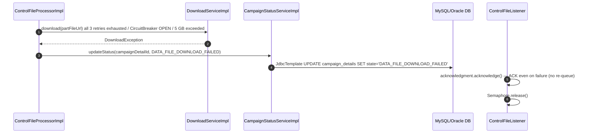

# HLD — uclm-campaign-data-file-download

**Role:** Consumes Kafka control file events and downloads all audience part files in parallel from remote HTTP URLs. Validates column integrity (first 1 000 rows), stores files to local disk / S3 / in-memory, and updates campaign state to DATA_FILE_DOWNLOADED.

---

## 1. Purpose & Responsibilities

| Responsibility | Detail |
|---|---|
| Kafka Consumption | Consume `control_file_request` messages with manual ACK; backpressure via `Semaphore(100)` |
| Control File Parse | Deserialise `ControlFileDTO` JSON: extract part file URLs, record/column delimiters, attributeList |
| Parallel Downloads | Download all part files concurrently using a configurable fixed thread pool (`parallelDownloads`, default 1) |
| Size Enforcement | Enforce 5 GB max file size cap during streaming; abort and fail if exceeded |
| Column Validation | Auto-detect GZIP; split on `recordDelimiter`; verify column count matches attributeList for first 1 000 rows per file |
| Pluggable Storage | Store downloaded bytes to local disk, AWS S3, or in-memory ConcurrentHashMap depending on `ingestor.storage` config |
| State Transitions | Update `campaign_details.state`: `CONTROL_FILE_PUBLISHED` → `DATA_FILE_DOWNLOADED` (success) or `DATA_FILE_DOWNLOAD_FAILED` (failure) |
| Timezone Resolution | Resolve tenant timezone from DB + Auth Manager to derive date-partitioned local storage paths |
| Resilience | Retry (3 attempts, 500 ms backoff) + circuit-breaker (50% failure threshold) on each part file download |
| Health & Metrics | Expose `/health`, `/actuator/health`, `/actuator/metrics`, `/actuator/prometheus` |

---

## 2. High-Level Architecture

```
┌───────────────────────────────────────────────────────────────────────────────────┐
│                  uclm-campaign-data-file-download  :8070                          │
│                  (internal name: control-file-ingestor)                           │
│                                                                                   │
│  ┌──────────────────────────────────────────────────────────────────────────┐    │
│  │  ControlFileListener  (@KafkaListener, manual ACK)                       │    │
│  │  Semaphore(100) — backpressure gate                                      │    │
│  └────────────────────────────────┬─────────────────────────────────────────┘    │
│                                   │                                               │
│  ┌────────────────────────────────▼─────────────────────────────────────────┐    │
│  │              ControlFileProcessorImpl  (orchestrator)                     │    │
│  │                                                                            │    │
│  │  1. Parse ControlFileDTO (part URLs, delimiters, attributeList)           │    │
│  │  2. Resolve tenant timezone (TenantTimezoneService)                       │    │
│  │  3. Submit part files to fixed thread pool (parallelDownloads)            │    │
│  │  4. Per file: download → validate → store                                 │    │
│  │  5. On all success: update state → DATA_FILE_DOWNLOADED                  │    │
│  │  6. On any failure: update state → DATA_FILE_DOWNLOAD_FAILED             │    │
│  └──────┬──────────────────────────────────────────────────────────────────┘    │
│         │                                                                         │
│  ┌──────▼────────────────────────────────────────────────────────────────────┐   │
│  │  DownloadServiceImpl                    ValidationServiceImpl              │   │
│  │  • HTTP GET (Resilience4j @Retry x3,    • Auto-detect GZIP magic bytes    │   │
│  │    @CircuitBreaker 50%)                 • Split lines on recordDelimiter   │   │
│  │  • Stream with read timeout             • Check column count per row       │   │
│  │  • Enforce 5 GB cap                     • Sample first 1 000 rows only     │   │
│  └──────────────────────────────────────────────────────────────────────────┘   │
│                                                                                   │
│  ┌──────────────────────────────────────────────────────────────────────────┐    │
│  │  StorageService  (interface)                                              │    │
│  │                                                                            │    │
│  │  LocalStorageServiceImpl          InMemoryStorageServiceImpl              │    │
│  │  • baseFolder/AUD_DATA/yyyyMMdd/  • ConcurrentHashMap<String,byte[]>      │    │
│  │  • File.write()                   • 200 MB hard cap                       │    │
│  │                                                                            │    │
│  │  S3StorageServiceImpl                                                     │    │
│  │  • AWS SDK v2                                                             │    │
│  │  • Write to temp file, then S3 putObject                                  │    │
│  │  • Bucket: ingestor.s3Bucket / Path: ingestor.s3BasePath/AUD_DATA/date   │    │
│  └──────────────────────────────────────────────────────────────────────────┘    │
│                                                                                   │
│  ┌──────────────────────────────────────────────────────────────────────────┐    │
│  │  CampaignStatusServiceImpl  (JdbcTemplate UPDATE)                        │    │
│  │  TenantTimezoneService  (JdbcTemplate SELECT + REST)                     │    │
│  │  TenantConfigClientImpl  → GET /auth-manager/api/v1/tenant/config/{id}   │    │
│  └──────────────────────────────────────────────────────────────────────────┘    │
│                                                                                   │
│  ┌──────────────────────────────────────────────────────────────────────────┐    │
│  │  StatusController: GET /filedownloder/api/status/health                  │    │
│  │  Actuator: /actuator/health  /actuator/metrics  /actuator/prometheus     │    │
│  └──────────────────────────────────────────────────────────────────────────┘    │
└───────────────────────────────────────────────────────────────────────────────────┘
         ▲                    │                     │                    │
   Kafka Broker          MySQL/Oracle DB        Auth Manager      Storage Backend
   (consume              (JdbcTemplate           (REST timezone    (local disk /
   control_file_request)  state updates)          lookup)           S3 / in-memory)
```

---

## 3. Detailed Processing Flow

### 3a. Happy Path — Kafka Message to DATA_FILE_DOWNLOADED

```mermaid
sequenceDiagram
    autonumber
    participant K as Kafka (control_file_request)
    participant CFL as ControlFileListener
    participant CFPI as ControlFileProcessorImpl
    participant TZ as TenantTimezoneService
    participant DS as DownloadServiceImpl
    participant VS as ValidationServiceImpl
    participant SS as StorageService
    participant CSS as CampaignStatusServiceImpl
    participant DB as MySQL/Oracle DB

    K->>CFL: poll()  ControlFileDTO JSON message
    CFL->>CFL: Semaphore.acquire() — backpressure gate (100 in-flight max)
    CFL->>CFPI: process(controlFileDTO)

    CFPI->>TZ: resolveTimezone(tenantId)
    TZ->>DB: SELECT tenant_id, timezone FROM ... WHERE tenant_id=?
    TZ-->>CFPI: timezone (fallback: UTC)

    CFPI->>CFPI: Compute storage date path = yyyyMMdd in tenant timezone

    loop For each partFileUrl (parallel, thread pool size = parallelDownloads)
        CFPI->>DS: download(partFileUrl, timeout=600s)
        DS->>DS: Resilience4j @Retry(3, 500ms) + @CircuitBreaker(50%)
        DS->>DS: HTTP GET with connect=10s / read=60s timeout
        DS->>DS: Stream bytes; enforce 5 GB cap
        DS-->>CFPI: byte[] / InputStream

        CFPI->>VS: validate(bytes, recordDelimiter, expectedColumnCount)
        VS->>VS: Auto-detect GZIP magic (0x1f 0x8b)
        VS->>VS: Decompress if GZIP
        VS->>VS: Split on recordDelimiter; check first 1 000 rows
        VS-->>CFPI: validation OK

        CFPI->>SS: store(fileName, bytes, datePath)
        alt storage = local
            SS->>SS: Write to baseFolder/AUD_DATA/yyyyMMdd/fileName
        else storage = s3
            SS->>SS: Write to temp file  AWS S3 putObject
        else storage = in-memory
            SS->>SS: ConcurrentHashMap.put(fileName, bytes) — check 200 MB cap
        end
        SS-->>CFPI: stored
    end

    CFPI->>CSS: updateStatus(campaignDetailId, DATA_FILE_DOWNLOADED)
    CSS->>DB: JdbcTemplate UPDATE campaign_details SET state='DATA_FILE_DOWNLOADED'
    DB-->>CSS: 1 row updated

    CFL->>CFL: acknowledgment.acknowledge() — manual ACK
    CFL->>CFL: Semaphore.release()
```

### 3b. Failure Path



---

## 4. Key Business Logic / Algorithms

### State Transition

```
CONTROL_FILE_PUBLISHED
        │
        │ Kafka message consumed
        │ All part files downloaded + validated + stored
        ▼
DATA_FILE_DOWNLOADED
        │
        ├── download failure (retry exhausted / CB open / size exceeded)
        │           ▼
        │   DATA_FILE_DOWNLOAD_FAILED
        │
        └── validation failure (column mismatch)
                    ▼
            DATA_FILE_DOWNLOAD_FAILED
```

### Backpressure Mechanism

```
Semaphore sem = new Semaphore(100);

// ControlFileListener.onMessage():
sem.acquire();              // blocks consumer thread if 100 batches in-flight
try {
    processor.process(dto);
} finally {
    sem.release();
}
```

This prevents unbounded memory growth if downloads are slow.

### Parallel Download Execution

```
ExecutorService pool = Executors.newFixedThreadPool(parallelDownloads);
List<Future<StoredFile>> futures = partFileUrls.stream()
    .map(url -> pool.submit(() -> downloadValidateStore(url)))
    .collect(toList());

// Wait for all:
for (Future<StoredFile> f : futures) {
    f.get(downloadTimeout, SECONDS);  // timeout per file
}
```

### Column Validation Algorithm

```
1. Read bytes
2. If first 2 bytes == 0x1f 0x8b → decompress GZIP
3. Split by recordDelimiter
4. For rows 0..min(1000, rowCount-1):
     cols = row.split(columnDelimiter)
     assert cols.length == attributeList.size()
5. Throw ColumnCountMismatchException if any row fails
```

### Storage Path Convention

| Backend | Path Pattern |
|---|---|
| Local | `{baseFolder}/AUD_DATA/{yyyyMMdd}/{audienceId}/{filename}` |
| S3 | `s3://{s3Bucket}/{s3BasePath}/AUD_DATA/{yyyyMMdd}/{audienceId}/{filename}` |
| In-Memory | `ConcurrentHashMap` key: `{audienceId}/{filename}` |

---

## 5. Data Models

### ControlFileDTO (consumed from Kafka)

| Field | Type | Notes |
|---|---|---|
| `audienceId` | String | Audience segment identifier |
| `campaignId` | String | Parent campaign ID |
| `campaignDetailId` | String | Detail row ID for state update |
| `tenantId` | String | Tenant scoping |
| `partFileUrls` | List\<String\> | HTTPS URLs of individual data part files |
| `attributeList` | List\<AudienceAttribute\> | Column definitions: name, type, position |
| `recordDelimiter` | String | Row delimiter (e.g. `\n`) |
| `columnDelimiter` | String | Column delimiter (e.g. `,` or `|`) |
| `recordCount` | Long | Total expected record count |

### campaign_details (JdbcTemplate write)

| Column | Type | Notes |
|---|---|---|
| `id` | VARCHAR | PK — campaignDetailId |
| `state` | VARCHAR | Updated to `DATA_FILE_DOWNLOADED` or `DATA_FILE_DOWNLOAD_FAILED` |
| `tenant_id` | VARCHAR | Used for timezone resolution |

### StoredFile DTO (internal)

| Field | Type | Notes |
|---|---|---|
| `fileName` | String | Part file name |
| `storagePath` | String | Resolved local/S3/memory key |
| `sizeBytes` | Long | Actual downloaded byte count |
| `columnCountValid` | Boolean | Validation result |

---

## 6. Kafka Topics

| Topic | Direction | Description |
|---|---|---|
| `control_file_request` | CONSUME | Receives `ControlFileDTO` JSON from `uclm-campaign-processor`; triggers parallel part file download pipeline |

---

## 7. REST API Endpoints

| Method | Path | Description |
|---|---|---|
| GET | `/filedownloder/api/status/health` | Simple health check; returns 200 `"OK"` |
| GET | `/actuator/health` | Spring Boot Actuator health endpoint |
| GET | `/actuator/metrics` | Micrometer metrics endpoint |
| GET | `/actuator/prometheus` | Prometheus scrape endpoint |

---

## 8. Component Map

| Class | Package | Responsibility |
|---|---|---|
| `ControlFileListener` | kafkaconsumer | `@KafkaListener` entry point; manual ACK; Semaphore backpressure |
| `ControlFileProcessorImpl` | processor | Orchestrates parse → timezone → parallel download → validate → store → state update |
| `DownloadServiceImpl` | services.impl | HTTP GET with Resilience4j retry + circuit-breaker; 5 GB stream cap |
| `ValidationServiceImpl` | services.impl | GZIP detection; column count validation on first 1 000 rows |
| `StorageService` | services | Interface: `store(name, bytes, path)` / `open(name)` / `delete(name)` |
| `LocalStorageServiceImpl` | services.impl | Write to `baseFolder/AUD_DATA/yyyyMMdd/` |
| `InMemoryStorageServiceImpl` | services.impl | `ConcurrentHashMap<String,byte[]>`; 200 MB cap guard |
| `S3StorageServiceImpl` | services.impl | AWS SDK v2; temp file then `S3Client.putObject()` |
| `CampaignStatusServiceImpl` | services.impl | `JdbcTemplate` UPDATE on `campaign_details.state` |
| `TenantTimezoneService` | services.impl | `JdbcTemplate` SELECT for cached tenant timezone; falls back to Auth Manager REST |
| `TenantConfigClientImpl` | clients | RestTemplate call to Auth Manager `/tenant/config/{tenantId}` |
| `StatusController` | controllers | `GET /filedownloder/api/status/health` |

---

## 9. Configuration Reference

| Property | Default | Description |
|---|---|---|
| `server.port` | `8070` | HTTP port |
| `ingestor.topic` | `control_file_request` | Kafka topic to consume |
| `ingestor.kafkaConcurrency` | `1` | Number of concurrent Kafka listener threads |
| `ingestor.storage` | `local` | Storage backend: `local` / `in-memory` / `s3` |
| `ingestor.baseFolder` | `/data/comms_planner` | Root folder for local storage |
| `ingestor.s3Bucket` | — | S3 bucket name |
| `ingestor.s3Region` | `ap-south-1` | AWS region for S3 |
| `ingestor.s3BasePath` | `AUD_DATA` | S3 key prefix |
| `ingestor.parallelDownloads` | `1` | Fixed thread pool size for concurrent part file downloads |
| `ingestor.downloadTimeout` | `600` | Per-file download timeout in seconds |
| `ingestor.maxFileSize` | `5368709120` | Max allowed bytes per file (5 GB) |
| `ingestor.inMemoryMaxBytes` | `209715200` | Max total bytes for in-memory storage (200 MB) |
| `ingestor.validationSampleLimit` | `1000` | Number of rows to validate column count |
| `ingestor.connectTimeout` | `10s` | HTTP connect timeout |
| `ingestor.readTimeout` | `60s` | HTTP read timeout per chunk |
| `campaign.status.required.before-download[0]` | `CONTROL_FILE_PUBLISHED` | Required state before download begins |
| `campaign.status.success.after-download` | `DATA_FILE_DOWNLOADED` | State to set on success |
| `campaign.status.failure.after-download` | `DATA_FILE_DOWNLOAD_FAILED` | State to set on failure |
| `auth-manager.base-url` | `http://authmanager-deployment:7002` | Auth Manager base URL |
| `auth-manager.api.tenant-config` | `/auth-manager/api/v1/tenant/config` | Tenant config path |
| `tenant.default-timezone` | `UTC` | Fallback timezone when Auth Manager unavailable |
| `resilience4j.retry.instances.download.max-attempts` | `3` | Max download retry attempts |
| `resilience4j.retry.instances.download.wait-duration` | `500ms` | Wait between retries |
| `resilience4j.circuitbreaker.instances.download.failure-rate-threshold` | `50` | CB opens when 50% of calls fail |
| `kafka.security` | `SASL_PLAINTEXT + KERBEROS/GSSAPI` | Kafka security config (prod) |

---

## 10. External Dependencies

| Service | Type | Purpose |
|---|---|---|
| Apache Kafka | Message Broker (Consumer) | Consume `control_file_request` topic; manual ACK for at-least-once processing |
| MySQL / Oracle DB | Database | `JdbcTemplate` UPDATE of `campaign_details` state; `JdbcTemplate` SELECT for tenant timezone |
| Auth Manager | REST (RestTemplate) | `GET /tenant/config/{tenantId}` — retrieve tenant timezone for date-partitioned storage paths |
| HTTP File Server | HTTP (HttpURLConnection) | Serve audience part files at URLs listed in `ControlFileDTO.partFileUrls`; downloaded via streaming GET |
| AWS S3 | Object Storage (AWS SDK v2) | Optional storage backend; part files stored as objects under configurable bucket/prefix |
| Micrometer / Prometheus | Metrics | Expose download latency, failure rates, and Kafka consumer lag metrics |
