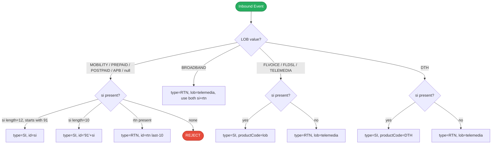

# HLD — uclm-campaign-manager-event-enrichment

**Role:** Kafka-driven NRT enrichment engine. Consumes raw trigger events, validates against campaign DB, enriches subscriber records via Audience Manager API, runs CG exclusion / exclusion scan / A-B testing, builds channel-specific payloads, and dispatches to channel Kafka topics.

---

## 1. Purpose & Responsibilities

| Responsibility | Detail |
|---|---|
| Event Consumption | Consume raw trigger events from `event_enrichment_prod` Kafka topic with configurable group-id |
| Event Validation | Validate non-null JSON; parse `eventId`, `si`, `rtn`, `lob`, `src`, `meta`; reject expired timestamps |
| Campaign DB Validation | `SELECT COUNT(*) FROM CAMPAIGN_MASTER WHERE EVENT_ID=? AND STATE IN ('PUBLISHED','IN_PROGRESS')` |
| Campaign Loading | Load all campaigns matching `eventId` via `CampaignService` |
| LOB Normalisation | Normalise inbound LOB values: MOBILITY / PREPAID / POSTPAID / APB → `"mobility"` |
| PrimaryId Resolution | LOB-branched logic to determine `type` (SI / RTN) and `id` from `si` and `rtn` fields |
| Subscriber Enrichment | Call Audience Manager API (Feign) per campaign to fetch profile, segments, KPI values, language preference |
| CG / Exclusion Gate | Caffeine-cached TGCG rules (24 h TTL) → remote ExclusionClient Feign scan |
| A/B Testing | AudienceDecisionServiceImpl applies A/B split after exclusion |
| Content Fetch | Feign call to Content Manager for template or bundle per campaign |
| Payload Build | `ChannelPayloadFactory` strategy pattern per channel (SMS / EMAIL / PUSH / WA / RCS) |
| Dispatch | `UnifiedKafkaProducer` publishes `CommonDispatchPayload` to channel-specific Kafka topic; soft-fail, buffer flush at 50 |
| Analytics | `AnalyticsLogPublisher` publishes events to `cs_raw_reporting_topic`; fire-and-forget |
| Whitelist Gate | Optional in-memory whitelist (refreshed on schedule); controlled by `whitelist.enabled` |
| OTel Tracing | Correlation ID resolved from OpenTelemetry `traceId` or fallback UUID per message |

---

## 2. High-Level Architecture

```
┌─────────────────────────────────────────────────────────────────────────────────────┐
│              uclm-campaign-manager-event-enrichment  :8095                          │
│              context-path: /event-enrichment                                        │
│                                                                                     │
│  ┌──────────────────────────────────────────────────────────────────────────────┐  │
│  │  EventProcessingConsumer  (@KafkaListener, groupId=event-enrichment-group)   │  │
│  │  topic: event_enrichment_prod                                                 │  │
│  └─────────────────────────────────┬────────────────────────────────────────────┘  │
│                                    │                                                │
│  ┌─────────────────────────────────▼────────────────────────────────────────────┐  │
│  │  Per-Message Pipeline                                                          │  │
│  │                                                                                │  │
│  │  0. OTel correlation ID (traceId or UUID)                                     │  │
│  │  1. Safety check: null / blank / non-JSON → skip                              │  │
│  │  2. Parse JSON → eventId, si, rtn (last 10 digits), lob, src, meta           │  │
│  │  3. Timestamp validation → reject if expired                                  │  │
│  │  4. EventValidationService  →  DB COUNT check                                 │  │
│  │  5. CampaignService.getCampaignsByEventId(eventId)                           │  │
│  │  6. LOB normalisation                                                         │  │
│  │  7. PrimaryId resolution (LOB-branched)                                       │  │
│  │  8. For each campaign: clone AudienceRecord → AM enrich → filter → orchestrate│  │
│  └──────────────────────────┬──────────────────────────────────────────────────┘  │
│                             │ Per Campaign                                          │
│  ┌──────────────────────────▼──────────────────────────────────────────────────┐  │
│  │  CampaignExecutionOrchestrator                                               │  │
│  │                                                                               │  │
│  │  ┌─────────────────────┐  ┌──────────────────────┐  ┌─────────────────────┐ │  │
│  │  │ GovernanceService   │  │ AudienceDecisionSvc  │  │ ContentManagerSvc   │ │  │
│  │  │ Feign → Goal +      │  │ LocalTgcgService     │  │ Feign → template    │ │  │
│  │  │ SubGoal from CM     │  │ (Caffeine 24h TTL)   │  │ or bundle from CM   │ │  │
│  │  └─────────────────────┘  │ ExclusionClient      │  └─────────────────────┘ │  │
│  │                            │ (Feign scan)         │                          │  │
│  │                            │ A/B split            │                          │  │
│  │                            └──────────────────────┘                          │  │
│  │                                                                               │  │
│  │  ┌────────────────────────────────────────────────────────────────────────┐  │  │
│  │  │  ChannelPayloadFactory  (strategy per channel)                         │  │  │
│  │  │  → CommonPayloadAssembler → CommonDispatchPayload                      │  │  │
│  │  └────────────────────────────────────────────────────────────────────────┘  │  │
│  │                                                                               │  │
│  │  UnifiedKafkaProducer ──► SMS / WA / EMAIL / PUSH / RCS channel topics      │  │
│  │  AnalyticsLogPublisher ──► cs_raw_reporting_topic                            │  │
│  └───────────────────────────────────────────────────────────────────────────┘  │
│                                                                                     │
│  ┌──────────────────────────────────────────────────────────────────────────────┐  │
│  │  LocalTgcgService  (Caffeine cache, 24h TTL) ← Oracle: cg table             │  │
│  │  WhitelistService  (in-memory Set, scheduled refresh)                        │  │
│  │  Spring Cloud Feign Clients (AM, Content Manager, Goal, SubGoal, Exclusion)  │  │
│  └──────────────────────────────────────────────────────────────────────────────┘  │
└─────────────────────────────────────────────────────────────────────────────────────┘
       ▲                   │                     │                    │
 Kafka Broker         Oracle DB           Feign Upstreams       Kafka Broker
 (consume             (campaign          (AM, Content Mgr,      (produce channel
 event_enrichment     validation,         Goal, Exclusion)       + analytics topics)
 _prod)               cg cache)
```

---

## 3. Detailed Processing Flow

### 3a. Full Per-Message Pipeline

```mermaid
sequenceDiagram
    autonumber
    participant K as Kafka (event_enrichment_prod)
    participant EPC as EventProcessingConsumer
    participant EVS as EventValidationService
    participant CS as CampaignService
    participant AS as AudienceService
    participant CEO as CampaignExecutionOrchestrator
    participant GS as GovernanceService
    participant ADS as AudienceDecisionService
    participant CMS as ContentManagerService
    participant CPF as ChannelPayloadFactory
    participant UKP as UnifiedKafkaProducer
    participant ALP as AnalyticsLogPublisher
    participant DB as Oracle DB

    K->>EPC: poll()  raw event JSON string
    EPC->>EPC: Step 0 — resolve correlation ID (OTel traceId or UUID)
    EPC->>EPC: Step 1 — null / blank / non-JSON check  skip if invalid
    EPC->>EPC: Step 2 — parse: eventId, si, rtn (last 10 digits), lob, src, meta
    EPC->>EPC: Step 3 — timestamp validation; discard if expired
    EPC->>EVS: Step 4 — validate(eventId)
    EVS->>DB: SELECT COUNT(*) FROM CAMPAIGN_MASTER WHERE EVENT_ID=? AND STATE IN ('PUBLISHED','IN_PROGRESS')
    DB-->>EVS: count > 0
    EVS-->>EPC: valid

    EPC->>CS: Step 5 — getCampaignsByEventId(eventId)
    CS->>DB: SELECT * FROM CAMPAIGN_MASTER WHERE EVENT_ID=? AND STATE IN (...)
    DB-->>CS: List<Campaign>
    CS-->>EPC: campaigns

    EPC->>EPC: Step 6 — normalise LOB (PREPAID/POSTPAID/APB  mobility)
    EPC->>EPC: Step 7 — resolve primaryIds (LOB-branched: SI or RTN)
    EPC->>AS: Step 8 — enrich(subscriber, primaryIds)
    AS->>AS: POST /audience-manager/user/audiences (Feign)
    AS-->>EPC: enriched AudienceRecord

    loop For each campaign
        EPC->>EPC: clone base AudienceRecord; filter by campaign audienceId
        EPC->>CEO: execute(campaign, audienceRecord)

        CEO->>GS: resolveGoals(campaignId)
        GS->>GS: Feign GET /campaign-manager-service/goals/{id}
        GS->>GS: Feign GET /campaign-manager-service/goals/{id}/subgoals
        GS-->>CEO: GovernanceContext

        CEO->>ADS: evaluate(audienceRecord, campaign)
        ADS->>ADS: LocalTgcgService.check() (Caffeine cache)
        ADS->>ADS: ExclusionClient.scan() (Feign POST /api/v1/internal/exclusionscan)
        ADS->>ADS: A/B split logic
        ADS-->>CEO: INCLUDE / EXCLUDE

        alt INCLUDE
            CEO->>CMS: fetchContent(campaign.templateId or bundleId)
            CMS->>CMS: Feign GET /content-manager/api/v1/template/{id} or /bundle/{id}
            CMS-->>CEO: ContentPayload

            CEO->>CPF: build(channel, audienceRecord, content, campaign)
            CPF-->>CEO: CommonDispatchPayload

            CEO->>UKP: publish(channel, payload) — soft-fail; flush at 50 buffered
            CEO->>ALP: logAnalytics(payload) — fire-and-forget  cs_raw_reporting_topic
        end
    end
```

### 3b. LOB PrimaryId Resolution



---

## 4. Key Business Logic / Algorithms

### Per-Message Processing Steps

| Step | Component | Action |
|---|---|---|
| 0 | `EventProcessingConsumer` | Resolve correlation ID: OTel `traceId` if available, else random UUID; attach to MDC |
| 1 | `EventProcessingConsumer` | Skip null, blank, or non-parseable JSON messages |
| 2 | `EventProcessingConsumer` | Parse JSON; extract `eventId`, `si`, `rtn` (last 10 digits), `lob`, `src`, `meta` |
| 3 | `EventProcessingConsumer` | Reject if event timestamp is in the past beyond configured TTL |
| 4 | `EventValidationService` | DB `COUNT(*)` check for active campaign with matching `eventId` |
| 5 | `CampaignService` | Load full campaign objects by `eventId` |
| 6 | `EventProcessingConsumer` | Normalise LOB: `PREPAID` / `POSTPAID` / `APB` → `"mobility"` |
| 7 | `EventProcessingConsumer` | LOB-branched primaryId resolution (see table above) |
| 8 | `AudienceService` | Call AM API; enrich `AudienceRecord` with profile, segments, KPIs, language |

### CampaignExecutionOrchestrator Pipeline (per campaign)

| Stage | Service | Detail |
|---|---|---|
| Governance | `GovernanceServiceImpl` | Feign: fetch Goal + SubGoal from Campaign Manager |
| CG Exclusion | `LocalTgcgService` | Caffeine-cached CG rules (24 h TTL); loaded from Oracle `cg` table |
| Exclusion Scan | `ExclusionClient` | Feign: `POST /api/v1/internal/exclusionscan` |
| A/B Test | `AudienceDecisionServiceImpl` | Apply A/B split percentage from campaign config |
| Content | `ContentManagerServiceImpl` | Feign: GET template or bundle |
| Payload Build | `ChannelPayloadFactory` | Strategy per channel; delegates to `CommonPayloadAssembler` |
| Dispatch | `UnifiedKafkaProducer` | Publish `CommonDispatchPayload`; buffered, flush at 50; soft-fail on error |
| Analytics | `AnalyticsLogPublisher` | Fire-and-forget produce to `cs_raw_reporting_topic` |

### Whitelist Gate

When `whitelist.enabled=true` (production), the `WhitelistService` holds an in-memory `Set<String>` of allowed `si` / `rtn` values. The set is refreshed on a configurable schedule. Any subscriber **not** in the whitelist is dropped before enrichment.

### LocalTgcgService Caching

```
Caffeine cache: maximumSize=10000, expireAfterWrite=24h
Key: campaignId + cgId
Load: JPA SELECT from Oracle cg table on cache miss
Purpose: avoid per-event DB round-trip for CG exclusion rules
```

---

## 5. Data Models

### Inbound Event JSON (from `event_enrichment_prod`)

| Field | Type | Notes |
|---|---|---|
| `eventId` | String | Maps to `CAMPAIGN_MASTER.event_id` |
| `si` | String | Subscriber identity (mobile number or fixed-line SI) |
| `rtn` | String | Routing/reference number; only last 10 digits used |
| `lob` | String | Line of business: MOBILITY / BROADBAND / DTH / TELEMEDIA / FLVOICE / etc. |
| `src` | String | Event source system |
| `meta` | Object | Arbitrary key-value metadata from source |
| `timestamp` | Long | Event epoch timestamp; validated against expiry window |

### AudienceRecord DTO (enriched)

| Field | Type | Notes |
|---|---|---|
| `primaryId` | String | Resolved SI or RTN value |
| `primaryIdType` | String | `SI` or `RTN` |
| `lob` | String | Normalised LOB |
| `productCode` | String | e.g. `DTH`, `FLVOICE` |
| `attributes` | Map\<String,Object\> | Profile attributes from Audience Manager |
| `audienceSegments` | List\<String\> | Segment memberships |
| `kpiValues` | Map\<String,Double\> | KPI scores |
| `languagePreference` | String | Preferred communication language |

### CommonDispatchPayload DTO

| Field | Type | Notes |
|---|---|---|
| `campaignId` | String | Source campaign |
| `channel` | String | SMS / EMAIL / PUSH / WA / RCS |
| `subscriberId` | String | Resolved primaryId |
| `templateId` | String | Content template or bundle ID |
| `templateParams` | Map\<String,String\> | Personalisation parameter substitutions |
| `correlationId` | String | OTel traceId or UUID for end-to-end tracing |
| `eventId` | String | Source event ID |
| `metadata` | Map\<String,Object\> | Additional channel-specific metadata |

---

## 6. Kafka Topics

| Topic | Direction | Description |
|---|---|---|
| `event_enrichment_prod` | CONSUME | Raw trigger events from upstream event ingestion systems (dev alias: `event_enrichment`) |
| `channel_partner_sms_nrt_svc_valgov` | PRODUCE | SMS dispatch payloads for SMS channel partner |
| `channel_partner_wa_nrt_svc_valgov` | PRODUCE | WhatsApp dispatch payloads for WA channel partner |
| `channel_partner_eml_nrt_svc_valgov` | PRODUCE | Email dispatch payloads for email channel partner |
| `channel_partner_push_nrt_svc_valgov` | PRODUCE | Push notification dispatch payloads |
| `channel_partner_rcs_nrt_svc_valgov` | PRODUCE | RCS dispatch payloads for RCS channel partner |
| `cs_raw_reporting_topic` | PRODUCE | Analytics / reporting events published fire-and-forget after each dispatch |

---

## 7. REST API Endpoints

| Method | Path | Description |
|---|---|---|
| GET | `/event-enrichment/kafka/test` | Diagnostic: Kafka connectivity check (non-production use only) |
| GET | `/event-enrichment/api/audience/send` | Diagnostic: hardcoded Audience Manager test call (non-production use only) |

---

## 8. Component Map

| Class | Package | Responsibility |
|---|---|---|
| `EventProcessingConsumer` | kafkaconsumer | Entry point; `@KafkaListener`; full per-message pipeline driver; OTel correlation |
| `EventValidationService` | services.impl | DB `COUNT(*)` check — validates active campaign exists for `eventId` |
| `CampaignService` | services.impl | Load `List<Campaign>` by `eventId` from Oracle |
| `AudienceService` | services.impl | Feign call to Audience Manager; builds enriched `AudienceRecord` |
| `CampaignExecutionOrchestrator` | orchestrator | Per-campaign pipeline: governance → decision → content → payload → dispatch |
| `GovernanceServiceImpl` | services.impl | Feign: Goal + SubGoal resolution from Campaign Manager service |
| `AudienceDecisionServiceImpl` | services.impl | TGCG exclusion + ExclusionClient scan + A/B split |
| `ContentManagerServiceImpl` | services.impl | Feign: fetch template or bundle from Content Manager |
| `ChannelPayloadFactory` | factory | Strategy pattern; delegates to channel-specific payload builder |
| `CommonPayloadAssembler` | assembler | Assembles final `CommonDispatchPayload` from enriched record + content |
| `UnifiedKafkaProducer` | kafka | Publish to channel Kafka topics; buffer flush at 50; soft-fail on error |
| `AnalyticsLogPublisher` | kafka | Fire-and-forget produce to `cs_raw_reporting_topic` |
| `LocalTgcgService` | services.impl | Caffeine-cached (24 h TTL) CG rules from Oracle `cg` table |
| `WhitelistService` | services.impl | In-memory `Set<String>` whitelist; scheduled refresh; controlled by `whitelist.enabled` |

---

## 9. Configuration Reference

| Property | Default | Description |
|---|---|---|
| `server.port` | `8095` | HTTP port |
| `server.servlet.context-path` | `/event-enrichment` | Spring MVC context path |
| `spring.kafka.consumer.group-id` | `event-enrichment-group` | Kafka consumer group |
| `kafka.topics.inbound` | `event_enrichment` (dev) / `event_enrichment_prod` (prod) | Inbound topic name |
| `kafka.campaign.topics.SMS` | `channel_partner_sms_nrt_svc_valgov` | SMS channel dispatch topic |
| `kafka.campaign.topics.WHATSAPP` | `channel_partner_wa_nrt_svc_valgov` | WhatsApp channel dispatch topic |
| `kafka.campaign.topics.EMAIL` | `channel_partner_eml_nrt_svc_valgov` | Email channel dispatch topic |
| `kafka.campaign.topics.PUSH` | `channel_partner_push_nrt_svc_valgov` | Push notification dispatch topic |
| `kafka.campaign.topics.RCS` | `channel_partner_rcs_nrt_svc_valgov` | RCS channel dispatch topic |
| `kafka.logs.analytics-topic` | `cs_raw_reporting_topic` | Analytics reporting topic |
| `kafka.security.enabled` | `false` (dev) / `true` (prod) | Enable SASL/TLS for Kafka |
| `external.audience.baseUrl` | — | Audience Manager service base URL |
| `external.audience.source` | `CLM_PUSH` | Source identifier sent to Audience Manager |
| `external.content-manager.baseUrl` | — | Content Manager service base URL |
| `audience.bb_to_comms` | `N` | Flag for BROADBAND-to-COMMS LOB mapping behaviour |
| `whitelist.enabled` | `false` (dev) / `true` (prod) | Enable subscriber whitelist gate |
| `resilience4j.retry.maxAttempts` | `3` | Retry attempts for Feign calls |
| `resilience4j.retry.waitDuration` | `500ms` | Wait between retries |
| `spring.cache.caffeine.spec` | `expireAfterWrite=24h,maximumSize=10000` | Caffeine cache spec for `LocalTgcgService` |

---

## 10. External Dependencies

| Service | Type | Purpose |
|---|---|---|
| Apache Kafka | Message Broker (Consumer + Producer) | Consume raw events from `event_enrichment_prod`; publish `CommonDispatchPayload` to 5 channel topics + analytics topic |
| Oracle DB | Database | Campaign validation (`COUNT(*)`), campaign loading, CG rules for `LocalTgcgService` |
| Audience Manager | REST (Feign) | `POST /audience-manager/user/audiences` — enrich subscriber with profile, segments, KPI values, language preference |
| Content Manager | REST (Feign) | `GET /template/{id}` and `GET /bundle/{id}` — fetch communication template or multi-channel bundle |
| Campaign Manager | REST (Feign) | `GET /goals/{id}` and `GET /goals/{id}/subgoals` — retrieve governance context for campaign execution |
| Exclusion Service | REST (Feign) | `POST /api/v1/internal/exclusionscan` — check subscriber against exclusion lists |
| TGCG CG Service | REST (Feign, fallback) | `POST /api/v1/internal/excludecg` — remote CG exclusion (preferred: `LocalTgcgService` Caffeine cache) |
| Spring Cloud / Eureka | Service Discovery | Feign client `campaign-manager-service` resolved via Spring Cloud service registry |
