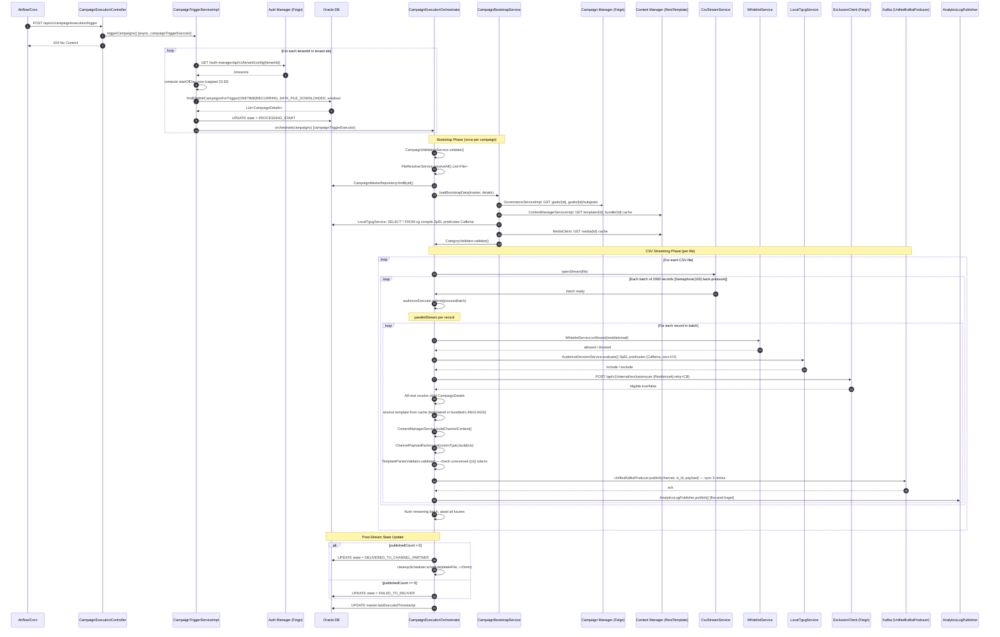

# HLD — uclm-campaign-time-validation

**Role:** Campaign execution engine that reads eligible campaigns from Oracle, streams audience CSVs, applies a 7-stage per-record pipeline (whitelist → TGCG → exclusion → AB test → template → payload → Kafka), and dispatches to channel partners via Kafka topics.

---

## 1. Purpose & Responsibilities

| Responsibility | Detail |
|---|---|
| Time-window validation | Compare `actual_schedule_timestamp` against tenant's day window (`start_of_day → now`, capped at 23:30 in tenant timezone) |
| Eligibility gating | Only campaigns with state `DATA_FILE_DOWNLOADED` and schedule `ONETIME` or `RECURRING` are processed |
| Per-record pipeline | Whitelist → TGCG exclusion → AB-test → template resolve → payload build → Kafka publish |
| State machine management | `DATA_FILE_DOWNLOADED → PROCESSING_START → DELIVERED_TO_CHANNEL_PARTNER` (or `FAILED_TO_DELIVER`) |
| Analytics events | Fire-and-forget publish to `cs_raw_reporting_topic` and `comms_analytics_logs` |
| Audience CSV streaming | O(1) memory streaming with batch size 2,000 and semaphore back-pressure (max 100 inflight batches) |
| Multi-tenant support | Iterates `tenant.ids` list; each tenant resolved to its timezone via Auth Manager |
| Template language resolution | Supports direct templateId lookup, bundleId + CSV language column, USER_PREF defaulting to ENGLISH |
| Concurrency | Virtual thread pool (`audienceExecutor`) for batch processing; `campaignTriggerExecutor` for per-tenant orchestration |
| File cleanup | Schedules CSV file deletion 15 minutes after successful delivery |

---

## 2. High-Level Architecture

```
┌────────────────────────────────────────────────────────────────────────────────────┐
│                      uclm-campaign-time-validation  (:8091)                        │
│                                                                                    │
│  ┌──────────────────────┐      ┌──────────────────────────────────────────────┐   │
│  │  REST Trigger Layer   │      │              Bootstrap Phase                 │   │
│  │  POST /trigger        │      │  CampaignValidationService                  │   │
│  │  POST /start          │      │  FileResolverService  (/data/comms_planner/) │   │
│  └──────────┬───────────┘      │  GovernanceServiceImpl (Feign → CampaignMgr) │   │
│             │                  │  ContentManagerServiceImpl (RestTemplate+cache)│   │
│  ┌──────────▼───────────┐      │  LocalTgcgService (SpEL→Caffeine predicates) │   │
│  │ CampaignTrigger       │      │  MediaClient (Feign → CM)                    │   │
│  │ ServiceImpl           │      │  CategoryValidator                           │   │
│  │  • timezone fetch     │      └──────────────────────────────────────────────┘   │
│  │  • eligible query     │                                                         │
│  │  • PROCESSING_START   │      ┌──────────────────────────────────────────────┐   │
│  └──────────┬───────────┘      │            CSV Streaming Phase               │   │
│             │                  │  CsvStreamService (O(1) memory)              │   │
│  ┌──────────▼───────────┐      │  Semaphore(100) back-pressure                │   │
│  │ CampaignExecution     │      │  VirtualThread audienceExecutor              │   │
│  │ Orchestrator          │─────▶│  Batch size: 2,000 records                  │   │
│  │  (bootstrap + stream) │      │  LOG_EVERY: 100,000 records                 │   │
│  └──────────────────────┘      └──────────────────────────────────────────────┘   │
│                                                                                    │
│  ┌─────────────────────────────────────────────────────────────────────────────┐  │
│  │                   Per-Record Pipeline (handleRecord)                        │  │
│  │  [1] WhitelistService   [2] TGCG(SpEL)   [3] ExclusionClient(HTTP)         │  │
│  │  [4] AB-Test assign     [5] Template resolve  [6] PayloadFactory            │  │
│  │  [7] UnifiedKafkaProducer (sync, 3 retries)                                │  │
│  └─────────────────────────────────────────────────────────────────────────────┘  │
└────────────────────────────────────────────────────────────────────────────────────┘
         │                        │                           │
         ▼                        ▼                           ▼
  ┌─────────────┐       ┌──────────────────┐       ┌──────────────────────┐
  │   Oracle DB  │       │  Kafka Topics     │       │  External Services   │
  │  CAMPAIGN_   │       │  sms / wa / eml  │       │  Auth Manager        │
  │  MASTER      │       │  push / rcs      │       │  Campaign Manager    │
  │  campaign_   │       │  cs_raw_reporting│       │  Content Manager     │
  │  details     │       │  comms_analytics │       │  Exclusion Scan      │
  │  cg / white  │       └──────────────────┘       └──────────────────────┘
  └─────────────┘
```

---

## 3. Detailed Processing Flow



---

## 4. Key Business Logic / Algorithms

### 4.1 Time-Window Computation

```
startOfDay  = ZonedDateTime.now(tenantTimezone).truncatedTo(DAYS)
currentTime = ZonedDateTime.now(tenantTimezone)
if currentTime.toLocalTime() > 23:30:
    currentTime = today at 23:30 (tenantTimezone)
// Eligible if: startOfDay <= actual_schedule_timestamp <= currentTime
```

### 4.2 Campaign State Machine

```
                  ┌─────────────────────────────────────────┐
                  │          DATA_FILE_DOWNLOADED             │
                  └──────────────────┬──────────────────────┘
                                     │ triggerCampaigns()
                                     ▼
                  ┌─────────────────────────────────────────┐
                  │            PROCESSING_START              │
                  └──────────┬──────────────────────────────┘
                             │
              ┌──────────────┴──────────────┐
              │ publishedCount > 0           │ publishedCount == 0
              ▼                             ▼
  ┌──────────────────────┐      ┌────────────────────────┐
  │DELIVERED_TO_CHANNEL  │      │   FAILED_TO_DELIVER    │
  │    _PARTNER          │      └────────────────────────┘
  └──────────────────────┘
```

### 4.3 Template Language Resolution

| Scenario | Key Used |
|---|---|
| Direct templateId | `templateId` |
| BundleId + CSV `preferred_lang` column | `bundleId:LANGUAGE` |
| BundleId + `language` column | `bundleId:LANGUAGE` |
| No language column | `bundleId:ENGLISH` (default) |
| `USER_PREF` mode | Read from CSV row; default ENGLISH if absent |

### 4.4 Whitelist Refresh (Background)

- `WhitelistService` holds a `volatile Set<String>` in memory
- Refreshed from Oracle `whitelist` table every **5 minutes** via `@Scheduled`
- Gate enabled only when `whitelist.enabled=true`
- On block: record dropped, analytics event published with `WHITELIST_BLOCKED` status

### 4.5 SMS Parts Calculation

```
if any char in message is outside GSM-7 charset:
    encoding = UCS-2 (Unicode)
    singleSmsLimit = 70 chars
    multipartLimit = 67 chars
else:
    encoding = GSM-7
    singleSmsLimit = 160 chars
    multipartLimit = 153 chars

smsParts = ceil(messageLength / multipartLimit)  [if > singleSmsLimit]
```

### 4.6 Kafka Retry Strategy

```
Attempt 1: immediate
Attempt 2: +100ms delay
Attempt 3: +300ms delay
Attempt 4: +500ms delay
On all failed: record marked FAILED, analytics event published
```

---

## 5. Data Models

### CampaignMaster (CAMPAIGN_MASTER table)

| Column | Type | Description |
|---|---|---|
| id | BIGINT PK | Primary key |
| campaign_name | VARCHAR | Unique campaign name |
| tenant_id | VARCHAR | Tenant identifier |
| state | VARCHAR | Campaign lifecycle state |
| comm_type | VARCHAR | SMS / WA / EMAIL / RCS / PUSH |
| actual_schedule_timestamp | TIMESTAMP | When to execute |
| schedule_type | VARCHAR | ONETIME / RECURRING |
| last_executed_timestamp | TIMESTAMP | Updated after each run |
| raw_payload | CLOB | JSON config including AB test config |
| goal_id | BIGINT | FK to goal table |
| sub_goal_id | BIGINT | FK to subgoal table |

### CampaignDetails (campaign_details table)

| Column | Type | Description |
|---|---|---|
| id | BIGINT PK | Primary key |
| parent_campaign_id | BIGINT FK | → CAMPAIGN_MASTER.id |
| template_id | VARCHAR | CM template reference |
| bundle_id | VARCHAR | CM bundle reference |
| child_name | VARCHAR | AB variant name |
| ab_percentage | INT | Traffic split % |
| state | VARCHAR | Mirrors master state |
| tenant_id | VARCHAR | Tenant identifier |

### WhitelistEntry (whitelist table)

| Column | Type | Description |
|---|---|---|
| id | BIGINT PK | Primary key |
| mobile_number | VARCHAR | Mobile / email identifier |
| tenant_id | VARCHAR | Tenant scope |
| created_at | TIMESTAMP | Record creation time |

### CG Rule (cg table)

| Column | Type | Description |
|---|---|---|
| id | BIGINT PK | Primary key |
| cg_group | VARCHAR | Group identifier |
| logic | TEXT | SpEL expression string |
| tenant_id | VARCHAR | Tenant scope |

---

## 6. Kafka Topics

| Topic | Direction | Description |
|---|---|---|
| `channel_partner_sms_nrt_svc_valgov` | PRODUCE | SMS dispatch to channel partner |
| `channel_partner_wa_nrt_svc_valgov` | PRODUCE | WhatsApp dispatch to channel partner |
| `channel_partner_eml_nrt_svc_valgov` | PRODUCE | Email dispatch to channel partner |
| `channel_partner_push_nrt_svc_valgov` | PRODUCE | Push / FCM dispatch to channel partner |
| `channel_partner_rcs_nrt_svc_valgov` | PRODUCE | RCS dispatch to channel partner |
| `cs_raw_reporting_topic` | PRODUCE | Analytics and reporting events (per-record) |
| `comms_analytics_logs` | PRODUCE | Structured analytics logs |

**Producer Settings:**

| Property | Value | Notes |
|---|---|---|
| acks | all | Strongest durability guarantee |
| enable.idempotence | true | Exactly-once per partition |
| compression.type | lz4 | Fast compression |
| batch.size | 65536 | 64 KB |
| linger.ms | 5 | Micro-batching |
| max.block.ms | 10000 | Back-pressure limit |
| security.protocol | SASL_PLAINTEXT | Kerberos (GSSAPI) in prod |

---

## 7. REST API Endpoints

| Method | Path | Description |
|---|---|---|
| POST | `/api/v1/campaign/execution/trigger` | Scheduled trigger (Airflow/cron); returns 204 async, fires `campaignTriggerExecutor` |
| POST | `/api/v1/campaign/execution/start` | Manual immediate trigger; same pipeline, synchronous caller experience |

### Request / Response

**POST /trigger / /start**
```
Request:  (no body required; reads tenant.ids from config)
Response: 204 No Content
```

---

## 8. Component Map

| Class | Package | Responsibility |
|---|---|---|
| `Field_Level_and_Time_Validation` | `main` | Spring Boot entry point; `@EnableFeignClients`, `@EnableAsync` |
| `CampaignExecutionController` | `controller` | Exposes `/trigger` and `/start` REST endpoints |
| `CampaignTriggerServiceImpl` | `service` | Per-tenant eligible campaign scan; timezone compute; state → PROCESSING_START |
| `CampaignExecutionOrchestrator` | `orchestrator` | Sequential bootstrap + parallel CSV streaming pipeline |
| `CampaignBootstrapService` | `service` | Pre-flight data loading (templates, goals, CG rules, media) into memory |
| `CampaignValidationServiceImpl` | `validator` | Field-level campaign validation before processing starts |
| `LocalTgcgService` | `service` | Loads CG rules from Oracle; compiles SpEL predicates into Caffeine cache |
| `GovernanceServiceImpl` | `service` | Feign calls to Campaign Manager for Goal and SubGoal objects |
| `ContentManagerServiceImpl` | `service` | Template / bundle fetch via RestTemplate; maintains `Map<templateId, CMResponse>` cache |
| `ExclusionClient` | `feign` | HTTP POST to exclusion-scan service; wrapped with Resilience4j retry + circuit breaker |
| `WhitelistService` | `service` | In-memory `volatile Set<String>`; refreshed every 5 min from Oracle |
| `UnifiedKafkaProducer` | `kafka` | Synchronous channel topic publish; 3 retries with 100/300/500 ms backoff |
| `AnalyticsLogPublisher` | `kafka` | Fire-and-forget publish to `cs_raw_reporting_topic` |
| `TenantContextFilter` | `filter` | Extracts tenant headers into `ThreadLocal` (`TenantContextHolder`) |
| `AsyncConfig` | `config` | Defines `campaignTriggerExecutor`, `audienceExecutor`, `kafkaPublishExecutor`, `cleanupScheduler` beans |
| `SmsPayloadBuilder` | `payload` | Builds SMS `CommonDispatchPayload`; invokes `SmsUtil.calculateSmsParts()` |
| `WhatsAppPayloadBuilder` | `payload` | Builds WhatsApp `CommonDispatchPayload` |
| `EmailPayloadBuilder` | `payload` | Builds Email `CommonDispatchPayload` |
| `RcsPayloadBuilder` | `payload` | Builds RCS `CommonDispatchPayload` |
| `PushPayloadBuilder` | `payload` | Builds Push/FCM `CommonDispatchPayload` |
| `CsvStreamService` | `service` | Reads CSV one record at a time; manages batching and EOF flush |
| `FileResolverService` | `service` | Resolves audience files from `/data/comms_planner/` by campaign |
| `ChannelPayloadFactory` | `factory` | Strategy map: `commType → PayloadBuilder` |
| `TemplateParamValidator` | `validator` | Detects unresolved `{{n}}` tokens after script body substitution |
| `CampaignMasterRepository` | `repository` | JPA repository for `CAMPAIGN_MASTER` table |
| `CampaignDetailsRepository` | `repository` | JPA repository; `findEligibleCampaignsForTrigger()` native query |

---

## 9. Configuration Reference

| Property | Default | Description |
|---|---|---|
| `server.port` | `8091` | HTTP port (env: `CLM_SERVER_PORT`) |
| `spring.profiles.active` | `dev,oracle` | Active Spring profiles |
| `spring.datasource.url` | — | Oracle JDBC connection string |
| `tenant.ids` | — | Comma-separated list of tenant IDs to process |
| `tenant.default-timezone` | `Asia/Kolkata` | Fallback timezone if Auth Manager call fails |
| `whitelist.enabled` | `false` (dev) / `true` (prod) | Enables whitelist gate in per-record pipeline |
| `external.content-manager.baseUrl` | — | Content Manager service base URL |
| `external.content-manager.timeout-ms` | `3000` | RestTemplate read timeout for CM calls |
| `external.goal.baseUrl` | — | Campaign Manager service base URL |
| `ingestor.baseFolder` | `/data/comms_planner` | Root path for audience CSV files |
| `kafka.bootstrap-servers` | — | Comma-separated Kafka broker list |
| `kafka.security.protocol` | `SASL_PLAINTEXT` | Kerberos security in prod |
| `kafka.security.sasl-mechanism` | `GSSAPI` | SASL mechanism (Kerberos) |
| `spring.task.execution.pool.core-size` | `10` | Core thread pool size for async executors |
| `spring.task.execution.pool.max-size` | `20` | Max thread pool size for async executors |
| `BATCH_SIZE` | `2000` | Records per CSV processing batch |
| `MAX_INFLIGHT` | `100` | Max concurrent batches (Semaphore) |
| `LOG_EVERY` | `100000` | Log progress every N records |
| `DRAIN_EVERY_BATCHES` | `50` | Force drain future queue every N batches |

---

## 10. External Dependencies

| Service | Type | Purpose |
|---|---|---|
| Oracle DB | Database | `CAMPAIGN_MASTER`, `campaign_details`, `cg`, `whitelist` tables |
| Auth Manager | REST (Feign) | Fetch tenant timezone config (`/auth-manager/api/v1/tenant/config/{id}`) |
| Campaign Manager | REST (Feign) | Fetch Goal (`/goals/{id}`) and SubGoal (`/goals/{id}/subgoals`) for governance |
| Content Manager | REST (RestTemplate) | Fetch templates (`/template/{id}`), bundles (`/bundle/{id}`), media (`/media/{id}`) |
| Exclusion Scan | REST (Feign) | Per-record exclusion check (`POST /api/v1/internal/exclusionscan`) |
| Kafka | Message Broker | Dispatch to 5 channel topics + 2 analytics topics |
| Apache Airflow | Scheduler | Calls `/trigger` endpoint on schedule |
| Resilience4j | Library | Retry + Circuit Breaker wrapping `ExclusionClient` |
| Caffeine | Library | In-process cache for SpEL CG predicates and templates |
