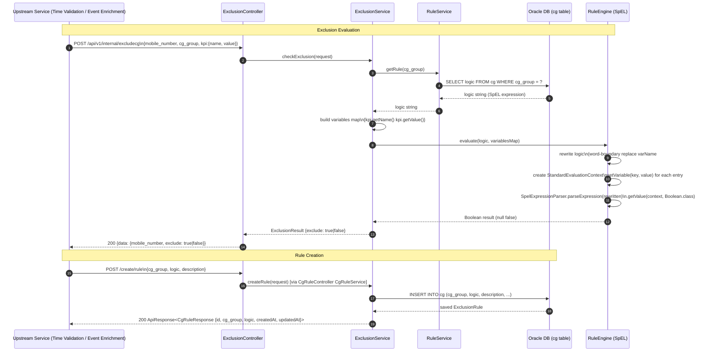

# HLD — uclm-campaign-cg-exclusion

**Role:** SpEL-based rule evaluation engine for Control Group / Target Group exclusion logic. Loads rules from Oracle `cg` table, evaluates Spring Expression Language expressions against subscriber KPI values, and returns `exclude: true/false`. Called by Event Enrichment and Time Validation services.

---

## 1. Purpose & Responsibilities

| Responsibility | Detail |
|---|---|
| Rule persistence | Store CG exclusion rules (`cg_group`, SpEL `logic`, `description`) in Oracle `cg` table via JPA |
| Rule evaluation | Evaluate whether a subscriber should be excluded from a CG group based on a KPI value using Spring SpEL |
| Flexible logic | Accept any valid SpEL expression; support KPI comparisons, range checks, equality tests |
| Shared microservice | Stateless REST service called by multiple upstream consumers (Event Enrichment, Time Validation) |
| Variable rewriting | Automatically rewrite bare variable names to SpEL `#varName` notation before evaluation |
| Safe null handling | Return `false` (do not exclude) on null or unparseable SpEL result |
| Legacy isolation | `RuleRepository` (in-memory hardcoded map) present but NOT wired into active flow |
| Multi-tenancy | `tenant_id` and `dept_id` columns on `ExclusionRule`; optional filter support |

---

## 2. High-Level Architecture

```
┌─────────────────────────────────────────────────────────────────────┐
│                  uclm-campaign-cg-exclusion  (:8080)                │
│                          (artifact: tgcg_v1)                        │
│                                                                     │
│  ┌──────────────────┐          ┌──────────────────────────────────┐ │
│  │  REST Endpoints   │          │       Rule Management            │ │
│  │                   │          │                                  │ │
│  │  POST /create/rule│─────────▶│  CgRuleController                │ │
│  │                   │          │  CgRuleService                   │ │
│  │  POST /api/v1/    │          │  ExclusionRuleRepository (JPA)   │ │
│  │  internal/        │          │  → Oracle cg table               │ │
│  │  excludecg        │          └──────────────────────────────────┘ │
│  └────────┬──────────┘                                              │
│           │                                                         │
│  ┌────────▼──────────────────────────────────────────────────────┐  │
│  │                  Exclusion Evaluation Flow                     │  │
│  │                                                               │  │
│  │  ExclusionController                                          │  │
│  │       │                                                       │  │
│  │       ▼                                                       │  │
│  │  ExclusionService                                             │  │
│  │       │  1. fetch rule logic from DB (via RuleService)       │  │
│  │       │  2. build KPI variable map                           │  │
│  │       │  3. rewrite logic: varName → #varName                │  │
│  │       ▼                                                       │  │
│  │  RuleEngine (SpEL)                                            │  │
│  │       │  StandardEvaluationContext                           │  │
│  │       │  SpelExpressionParser.parseExpression(rewritten)     │  │
│  │       │  .getValue(context, Boolean.class)                   │  │
│  │       ▼                                                       │  │
│  │  Response: {mobile_number, exclude: true|false}               │  │
│  └───────────────────────────────────────────────────────────────┘  │
└─────────────────────────────────────────────────────────────────────┘
                              │
                              ▼
                   ┌──────────────────────┐
                   │   Oracle DB           │
                   │   table: cg           │
                   │   id, cg_group,       │
                   │   logic, description  │
                   │   tenant_id, dept_id  │
                   └──────────────────────┘
```

---

## 3. Detailed Processing Flow



---

## 4. Key Business Logic / Algorithms

### 4.1 SpEL Rule Engine Algorithm

```
Input:  logic (String), variables (Map<String,Object>)

Step 1: Variable Rewriting
  For each key in variables:
    pattern = \b{key}\b  (word boundary)
    logic   = logic.replaceAll(pattern, "#" + key)
  
  Example:
    Input:  "kpi1 > 100 and kpi1 < 1000"
    Output: "#kpi1 > 100 and #kpi1 < 1000"

Step 2: Context Construction
  context = new StandardEvaluationContext()
  for (key, value) in variables:
    context.setVariable(key, value)

Step 3: Expression Evaluation
  parser    = new SpelExpressionParser()
  expr      = parser.parseExpression(rewrittenLogic)
  result    = expr.getValue(context, Boolean.class)

Step 4: Safe Return
  return Boolean.TRUE.equals(result)   // null-safe
```

### 4.2 SpEL Expression Examples

| Expression | Meaning |
|---|---|
| `kpi.value > 500 and kpi.name == 'revenue'` | Exclude if revenue KPI > 500 |
| `#kpi1 > 100 and #kpi1 < 1000` | Exclude if kpi1 in range (100, 1000) |
| `kpi.value >= 0` | Exclude all non-negative KPI values |
| `kpi.name == 'churn_risk' and kpi.value > 0.8` | Exclude high churn-risk subscribers |

### 4.3 Variable Rewriting Detail

```
Word-boundary regex ensures partial name matches are avoided:
  "kpi10 > 5" with variable "kpi1" → must NOT become "#kpi10 > 5"
  Pattern \bkpi1\b correctly matches "kpi1" but not "kpi10"
```

### 4.4 Legacy vs Active Flow

```
┌─────────────────────────────────────────────────────┐
│  ACTIVE flow (wired via Spring @Autowired):          │
│  ExclusionController → ExclusionService              │
│                      → RuleService → Oracle DB       │
│                      → RuleEngine (SpEL)             │
│                                                     │
│  LEGACY (NOT active, @Component but not wired):      │
│  RuleRepository (in-memory Map with hardcoded        │
│  CG_GROUP1, CG_GROUP2 rules) — remains as code       │
│  artefact, does not affect runtime behaviour         │
└─────────────────────────────────────────────────────┘
```

---

## 5. Data Models

### ExclusionRule Entity (table: `cg`)

| Column | Type | Description |
|---|---|---|
| `id` | BIGINT PK | Auto-generated primary key |
| `cg_group` | VARCHAR | CG group identifier (e.g., `CG_GROUP1`) |
| `logic` | TEXT | SpEL expression string |
| `description` | VARCHAR | Human-readable rule description |
| `tenant_id` | VARCHAR (nullable) | Tenant scope for multi-tenancy |
| `dept_id` | VARCHAR (nullable) | Department scope |
| `created_at` | TIMESTAMP | Record creation timestamp |
| `updated_at` | TIMESTAMP | Last update timestamp |

### CgRuleRequest DTO

| Field | Type | Validation | Description |
|---|---|---|---|
| `cg_group` | String | `@NotBlank` | CG group identifier |
| `logic` | String | `@NotBlank` | SpEL expression |
| `description` | String | Optional | Rule description |

### ExclusionRequest DTO

| Field | Type | Validation | Description |
|---|---|---|---|
| `mobile_number` | String | `@NotBlank` | Subscriber mobile or ID |
| `cg_group` | String | `@NotBlank` | CG group to evaluate against |
| `kpi` | KpiDTO | `@NotNull` | KPI object with `name` and `value` |

### KpiDTO

| Field | Type | Description |
|---|---|---|
| `name` | String | KPI name (used as SpEL variable key) |
| `value` | Object | KPI value (Number, Boolean, or String) |

### CgRuleResponse DTO

| Field | Type | Description |
|---|---|---|
| `id` | Long | Persisted rule ID |
| `cg_group` | String | CG group identifier |
| `logic` | String | SpEL expression as stored |
| `description` | String | Rule description |
| `createdAt` | Timestamp | Creation time |
| `updatedAt` | Timestamp | Last update time |

---

## 6. Kafka Topics

_This service has **no Kafka** dependency. It is a pure synchronous REST microservice._

| Topic | Direction | Description |
|---|---|---|
| — | — | No Kafka topics consumed or produced |

---

## 7. REST API Endpoints

| Method | Path | Description |
|---|---|---|
| POST | `/create/rule` | Persist a new CG exclusion rule to Oracle |
| POST | `/api/v1/internal/excludecg` | Evaluate whether a subscriber is excluded from a CG group |

### POST `/create/rule`

**Request:**
```json
{
  "cg_group": "CG_GROUP_PREMIUM",
  "logic": "kpi.value > 500 and kpi.name == 'revenue'",
  "description": "Exclude high-revenue subscribers from control group"
}
```

**Response (200):**
```json
{
  "data": {
    "id": 42,
    "cg_group": "CG_GROUP_PREMIUM",
    "logic": "kpi.value > 500 and kpi.name == 'revenue'",
    "description": "Exclude high-revenue subscribers from control group",
    "createdAt": "2025-01-15T10:30:00",
    "updatedAt": "2025-01-15T10:30:00"
  }
}
```

### POST `/api/v1/internal/excludecg`

**Request:**
```json
{
  "mobile_number": "9876543210",
  "cg_group": "CG_GROUP_PREMIUM",
  "kpi": {
    "name": "revenue",
    "value": 750
  }
}
```

**Response (200):**
```json
{
  "data": {
    "mobile_number": "9876543210",
    "exclude": true
  }
}
```

---

## 8. Component Map

| Class | Package | Responsibility |
|---|---|---|
| `TgcgV1Application` | `main` | Spring Boot entry point; `@SpringBootApplication` |
| `CgRuleController` | `controller` | Handles `POST /create/rule`; delegates to `CgRuleService` |
| `ExclusionController` | `controller` | Handles `POST /api/v1/internal/excludecg`; delegates to `ExclusionService` |
| `CgRuleService` | `service` | Maps `CgRuleRequest` → `ExclusionRule` entity; persists via repository |
| `ExclusionService` | `service` | Orchestrates exclusion check: fetch rule → build vars → call `RuleEngine` |
| `RuleService` | `service` | `getRule(cgGroup)`: queries `ExclusionRuleRepository.findByCgGroup()` → returns logic string |
| `RuleEngine` | `rule` | SpEL evaluator: variable rewriting + `StandardEvaluationContext` + expression parse/eval |
| `ExclusionRuleRepository` | `repository` | Spring Data JPA; `findByCgGroup(String)` + `save()` |
| `RuleRepository` | `repository` | Legacy `@Component` — in-memory static `Map<String, String>` with hardcoded rules; NOT wired into active flow |
| `ExclusionRule` | `entity` | JPA entity mapped to `cg` table |

---

## 9. Configuration Reference

| Property | Default | Description |
|---|---|---|
| `server.port` | `8080` | HTTP server port |
| `spring.application.name` | `tgcg_v1` | Application name (artifact ID) |
| `spring.profiles.active` | `uat` | Active Spring profile |
| `spring.datasource.url` | `jdbc:oracle:thin:@10.222.164.174:1535/NCHBDEV` | Oracle JDBC connection string |
| `spring.datasource.username` | `uclm_cms_api` | DB username (from K8s secret in prod) |
| `spring.datasource.password` | — | DB password (from K8s secret `cg-exclusion-db-secret`) |
| `spring.jpa.hibernate.ddl-auto` | `none` | No auto schema changes |
| `spring.jpa.show-sql` | `true` | Log SQL queries |
| `spring.jpa.properties.hibernate.dialect` | `org.hibernate.dialect.OracleDialect` | Oracle dialect |
| `management.endpoints.web.exposure.include` | `health,info` | Actuator endpoints |

**Kubernetes Resource Limits:**

| Parameter | Request | Limit |
|---|---|---|
| CPU | `500m` | `1000m` |
| Memory | `512Mi` | `1Gi` |

**Kubernetes Probes:**

| Probe | Path |
|---|---|
| Liveness | `/actuator/health/liveness` |
| Readiness | `/actuator/health/readiness` |

---

## 10. External Dependencies

| Service | Type | Purpose |
|---|---|---|
| Oracle DB | Database | Persists and reads CG exclusion rules from `cg` table |
| Spring SpEL | Library | Evaluates arbitrary boolean expressions in rule `logic` field |
| Spring Data JPA | Library | ORM for `ExclusionRule` entity; `findByCgGroup` derived query |
| Hibernate (Oracle Dialect) | Library | SQL generation and connection pool management |
| Spring Boot Actuator | Library | Health probes for Kubernetes liveness/readiness checks |
| Kubernetes Secrets | K8s | `cg-exclusion-db-secret` injects DB credentials as env vars |
