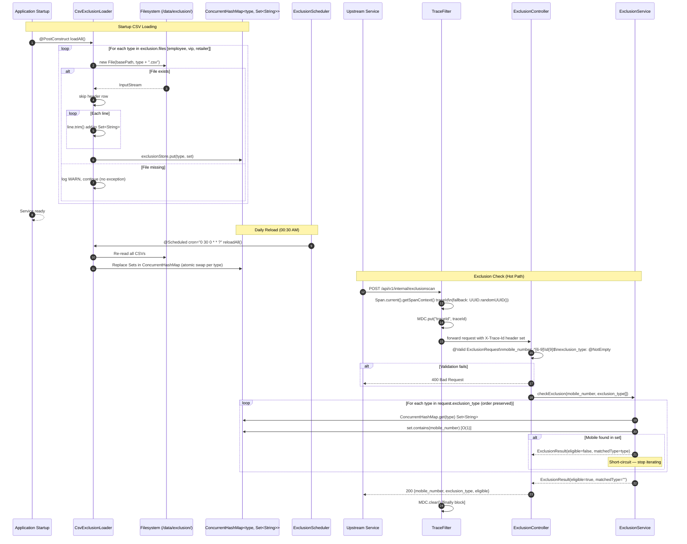

# HLD — uclm-campaign-exclusion-scan

**Role:** Fast in-memory mobile number exclusion checker. Loads employee, VIP, and retailer exclusion lists from CSV files at startup into `ConcurrentHashMap` (O(1) lookup). Returns `eligible: true/false` based on exclusion list membership. Reloads CSV files daily at 00:30 AM without service restart.

---

## 1. Purpose & Responsibilities

| Responsibility | Detail |
|---|---|
| CSV loading at startup | Load `employee.csv`, `vip.csv`, `retailer.csv` from filesystem into `ConcurrentHashMap<type, Set<String>>` at `@PostConstruct` |
| O(1) exclusion lookup | Hash-based membership test; no DB or network I/O on hot path |
| Short-circuit evaluation | Iterate requested types in order; return on first match (do not check remaining types) |
| Daily reload | `@Scheduled(cron = "0 30 0 * * ?")` rebuilds Sets from CSV at 00:30 AM every day without restart |
| Request validation | `mobile_number` must match `^[6-9]\\d{9}$` (10-digit Indian mobile); `exclusion_type` list must be non-empty |
| Graceful missing files | Log warning and continue if a CSV file is absent; service remains operational |
| OpenTelemetry tracing | `TraceFilter` reads OTel span context or falls back to UUID; sets MDC `traceId` and `X-Trace-Id` response header |
| No DB / No Kafka | Purely in-memory with CSV file backing; zero persistence dependencies |

---

## 2. High-Level Architecture

```
┌─────────────────────────────────────────────────────────────────────────────┐
│                   uclm-campaign-exclusion-scan  (:8080)                     │
│                                                                             │
│  ┌─────────────────────────────────────────────────────────────────────┐   │
│  │  Startup (CsvExclusionLoader @PostConstruct)                        │   │
│  │                                                                     │   │
│  │  /data/exclusion/employee.csv ──┐                                  │   │
│  │  /data/exclusion/vip.csv       ─┼──▶ ConcurrentHashMap             │   │
│  │  /data/exclusion/retailer.csv  ─┘    <type, Set<String>>           │   │
│  │                                      (O(1) lookup store)           │   │
│  └─────────────────────────────────────────────────────────────────────┘   │
│                                                                             │
│  ┌──────────────────────┐    ┌──────────────────────────────────────────┐  │
│  │  TraceFilter          │    │  ExclusionController                    │  │
│  │  (OncePerRequestFilter│    │  POST /api/v1/internal/exclusionscan    │  │
│  │   OTel → MDC traceId) │    └──────────────────┬───────────────────--┘  │
│  └──────────────────────┘                        │                         │
│                                                  ▼                         │
│                                   ┌──────────────────────────────────────┐ │
│                                   │  ExclusionService                    │ │
│                                   │  for type in request.exclusion_type: │ │
│                                   │    CsvExclusionLoader.isExcluded()   │ │
│                                   │    → ConcurrentHashMap.get(type)     │ │
│                                   │           .contains(mobile)          │ │
│                                   │    if match: return early (excluded) │ │
│                                   │  no match: return eligible=true      │ │
│                                   └──────────────────────────────────────┘ │
│                                                                             │
│  ┌─────────────────────────────────────────────────────────────────────┐   │
│  │  ExclusionScheduler  @Scheduled(cron = "0 30 0 * * ?")             │   │
│  │  Daily at 00:30 AM → CsvExclusionLoader.reloadAll()                │   │
│  └─────────────────────────────────────────────────────────────────────┘   │
└─────────────────────────────────────────────────────────────────────────────┘
          │
          ▼
  ┌───────────────────────────┐         ┌──────────────────────────────────┐
  │  Filesystem (CSV files)    │         │  OpenTelemetry Java Agent        │
  │  /data/exclusion/          │         │  endpoint: http://10.92.19.86:   │
  │    employee.csv            │         │  8200                            │
  │    vip.csv                 │         │  service: campaign-exclusion-scan│
  │    retailer.csv            │         └──────────────────────────────────┘
  └───────────────────────────┘
```

---

## 3. Detailed Processing Flow



---

## 4. Key Business Logic / Algorithms

### 4.1 CSV Loading Algorithm

```
@PostConstruct loadAll():
  for type in exclusion.files:               // employee, vip, retailer
    file = new File(exclusion.path, type + ".csv")
    if not file.exists():
      log.warn("Missing exclusion file: {}", type)
      continue
    set = new HashSet<String>()
    reader = new BufferedReader(new FileReader(file))
    reader.readLine()                         // skip header
    while (line = reader.readLine()) != null:
      set.add(line.trim())
    exclusionStore.put(type, set)             // ConcurrentHashMap
```

### 4.2 Exclusion Check (Short-Circuit)

```
checkExclusion(mobile, types[]):
  for type in types:
    set = exclusionStore.get(type)
    if set != null and set.contains(mobile):
      return ExclusionResult(eligible=false, matchedType=type)
  return ExclusionResult(eligible=true, matchedType="")

Complexity: O(k) where k = number of types checked (max 3), each lookup O(1)
```

### 4.3 Daily Reload Strategy

```
reloadAll():
  Build NEW Map<String, Set<String>> from scratch
  Read all CSV files fresh
  For each type: exclusionStore.put(type, newSet)  // atomic per-key replacement
  No service downtime, no lock contention — ConcurrentHashMap handles concurrent reads
```

### 4.4 TraceFilter Trace Propagation

```
TraceFilter extends OncePerRequestFilter:
  try:
    spanContext = Span.current().getSpanContext()
    traceId = spanContext.isValid()
              ? spanContext.getTraceId()
              : UUID.randomUUID().toString()
    MDC.put("traceId", traceId)
    response.setHeader("X-Trace-Id", traceId)
    filterChain.doFilter(request, response)
  finally:
    MDC.clear()
```

### 4.5 Mobile Number Validation Rule

```
Pattern: ^[6-9]\\d{9}$
- Must start with digit 6, 7, 8, or 9
- Followed by exactly 9 more digits
- Total: 10 digits
- Covers all valid Indian mobile number prefixes
```

---

## 5. Data Models

### ExclusionRequest DTO

| Field | Type | Validation | Description |
|---|---|---|---|
| `mobile_number` | String | `@NotBlank`, `@Pattern(^[6-9]\\d{9}$)` | 10-digit Indian mobile number |
| `exclusion_type` | List\<String\> | `@NotEmpty`, each `@NotBlank` | Ordered list of exclusion types to check |

### ExclusionResponse DTO

| Field | Type | Description |
|---|---|---|
| `mobile_number` | String | Echo of the request mobile number |
| `exclusion_type` | String | Type that matched (empty string if eligible) |
| `eligible` | boolean | `true` = not excluded; `false` = excluded |

### ExclusionResult (Internal)

| Field | Type | Description |
|---|---|---|
| `eligible` | boolean | Result of exclusion check |
| `matchedType` | String | Which exclusion type caused the match |

### In-Memory Store Structure

```
ConcurrentHashMap<String, Set<String>> exclusionStore = {
  "employee" → HashSet { "9876543210", "9123456789", ... },
  "vip"      → HashSet { "9000000001", "9000000002", ... },
  "retailer" → HashSet { "8000000001", "8000000002", ... }
}
```

### CSV File Format

```
mobile_number          ← header row (skipped)
9876543210
9123456789
...
```

---

## 6. Kafka Topics

_This service has **no Kafka** dependency. Pure synchronous REST + filesystem._

| Topic | Direction | Description |
|---|---|---|
| — | — | No Kafka topics consumed or produced |

---

## 7. REST API Endpoints

| Method | Path | Description |
|---|---|---|
| POST | `/api/v1/internal/exclusionscan` | Check if a mobile number is in any of the requested exclusion lists |

### POST `/api/v1/internal/exclusionscan`

**Request:**
```json
{
  "mobile_number": "9876543210",
  "exclusion_type": ["employee", "vip"]
}
```

**Response — excluded (200):**
```json
{
  "mobile_number": "9876543210",
  "exclusion_type": "employee",
  "eligible": false
}
```

**Response — eligible (200):**
```json
{
  "mobile_number": "9876543210",
  "exclusion_type": "",
  "eligible": true
}
```

**Response — validation error (400):**
```json
{
  "errors": [
    { "field": "mobile_number", "message": "must match ^[6-9]\\d{9}$" }
  ]
}
```

**HTTP Status Codes:**

| Status | Scenario |
|---|---|
| 200 | Both eligible and ineligible results |
| 400 | Request validation failure (invalid mobile or empty type list) |
| 500 | Unexpected server error |

---

## 8. Component Map

| Class | Package | Responsibility |
|---|---|---|
| `ExclusionApplication` | `main` | `@SpringBootApplication`, `@EnableScheduling` — Spring Boot entry point |
| `TraceFilter` | `config` | `OncePerRequestFilter`; reads OTel `Span.current()` or generates UUID traceId; sets MDC and `X-Trace-Id` header; clears MDC in finally |
| `ExclusionController` | `controller` | `POST /api/v1/internal/exclusionscan`; `@Valid` request; delegates to `ExclusionService` |
| `ExclusionService` | `service` | Ordered type iteration with short-circuit on first exclusion match |
| `CsvExclusionLoader` | `service` | `@PostConstruct` CSV loading; `reloadAll()` for scheduled refresh; `isExcluded(type, mobile)` O(1) lookup |
| `ExclusionScheduler` | `scheduler` | `@Scheduled(cron="0 30 0 * * ?")` daily 00:30 AM reload trigger |
| `ExclusionRequest` | `model` | Request DTO with Bean Validation annotations |
| `ExclusionResponse` | `model` | Response DTO with `mobile_number`, `exclusion_type`, `eligible` |

---

## 9. Configuration Reference

| Property | Default | Description |
|---|---|---|
| `spring.application.name` | `exclusion` | Application name |
| `spring.profiles.active` | `uat` | Active profile (`local` / `uat` / `prod`) |
| `server.port` | `8080` | HTTP server port |
| `exclusion.path` | `/data/exclusion` | Base filesystem path for CSV files (env: `INGEST_BASE_FOLDER`) |
| `exclusion.files` | `employee,vip,retailer` | Comma-separated list of exclusion type names (also used as CSV filenames) |
| `logging.pattern.level` | `%5p [traceId=%X{traceId}]` | Log pattern including MDC traceId |
| `logging.level.com.phase1.exclusion` | `DEBUG` (local) / `INFO` (uat) / `WARN` (prod) | Package-level log verbosity |

**Kubernetes Environment Variables:**

| Variable | Value | Description |
|---|---|---|
| `SPRING_PROFILES_ACTIVE` | `uat` | Override active profile |
| `JAVA_TOOL_OPTIONS` | `-Djava.io.tmpdir=/opt/app/tmp` | JVM tmp directory override |
| `logs.file.path` | `/var/logs` | Log file output path |
| `spring.application.name` | `exclusion-scan-service` | OCP override for service name |

**OpenTelemetry Agent:**

| Property | Value |
|---|---|
| OTel Java agent endpoint | `http://10.92.19.86:8200` |
| `service.name` | `campaign-exclusion-scan` |

---

## 10. External Dependencies

| Service | Type | Purpose |
|---|---|---|
| Filesystem (`/data/exclusion/`) | File I/O | Source of `employee.csv`, `vip.csv`, `retailer.csv` exclusion lists |
| OpenTelemetry Java Agent | Instrumentation | Distributed tracing; span context extraction for `X-Trace-Id` propagation |
| Spring Boot Actuator | Library | Health endpoints for Kubernetes liveness/readiness probes |
| Kubernetes ConfigMap / ENV | K8s | Injects `INGEST_BASE_FOLDER` and profile overrides |
