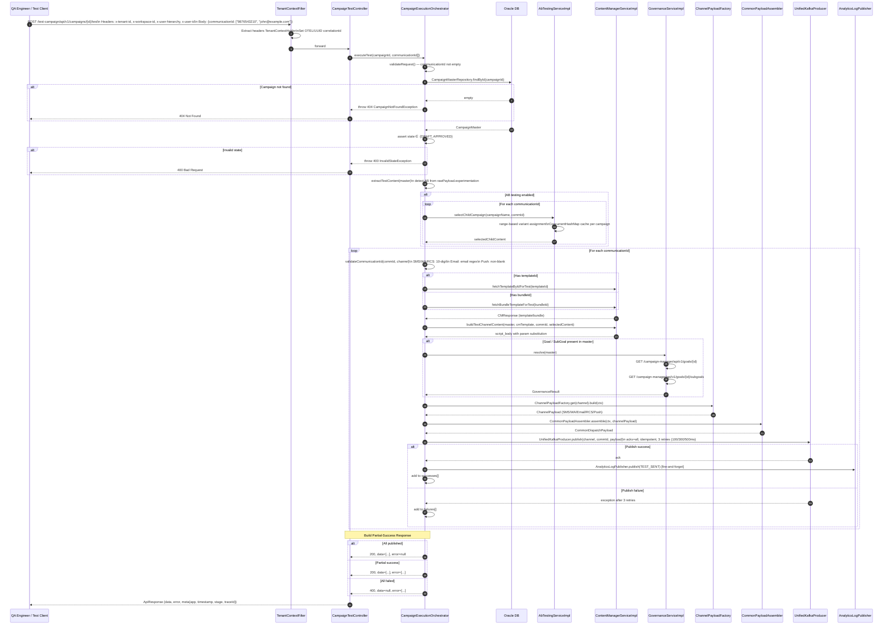

# HLD — uclm-test-campaign

**Role:** Pre-production mirror of `uclm-campaign-time-validation`. Accepts a `campaignId` + `communicationId` list, resolves AB-test variants, fetches Content Manager templates, builds channel payloads, and publishes to delivery Kafka topics. Used for feature validation without impacting production traffic.

---

## 1. Purpose & Responsibilities

| Responsibility | Detail |
|---|---|
| Pre-production testing | Execute real template rendering + channel payload building against actual CM templates without affecting live audience |
| Explicit communicationId targeting | Takes a `communicationId[]` list from REST request body instead of streaming audience CSVs |
| DRAFT / APPROVED campaigns only | Validates campaign state ∈ `{DRAFT, APPROVED}`; rejects campaigns in other states with HTTP 400 |
| AB-test variant resolution | `AbTestingServiceImpl` range-based variant assignment per `communicationId` using `ConcurrentHashMap` per campaign |
| Multi-channel payload build | SMS, WhatsApp, Email, RCS, Push via `ChannelPayloadFactory` strategy pattern |
| Kafka dispatch | Publishes to same channel topics as production; uses `cs_raw_reporting_topic` for `TEST_SENT` analytics events |
| Partial success support | Returns mixed `data[]` + `error[]` response; does not fail entirely on partial errors |
| Governance resolution | Fetches Goal + SubGoal from Campaign Manager via Feign when present in campaign config |
| Tenant context propagation | `TenantContextFilter` extracts 4 headers into `TenantContextHolder` per request |
| Whitelist gate (configurable) | `whitelist.enabled=false` (dev/uat); when enabled, returns error code `2004` for blocked IDs |

---

## 2. High-Level Architecture

```
┌─────────────────────────────────────────────────────────────────────────────────┐
│                        uclm-test-campaign  (:8091)                              │
│                                                                                 │
│  ┌──────────────────────┐   ┌────────────────────────────────────────────────┐ │
│  │  TenantContextFilter  │   │  CampaignTestController                       │ │
│  │  x-tenant-id          │──▶│  POST /test-campaign/api/v1/campaigns/{id}/   │ │
│  │  x-workspace-id       │   │       test                                    │ │
│  │  x-user-hierarchy     │   └──────────────────────┬─────────────────────-─┘ │
│  │  x-user-id            │                          │                          │
│  └──────────────────────┘                          ▼                          │
│                                  ┌─────────────────────────────────────────┐  │
│                                  │  CampaignExecutionOrchestrator           │  │
│                                  │  .executeTest()                          │  │
│                                  │                                          │  │
│                                  │  1. validateRequest()                   │  │
│                                  │  2. findCampaignMaster (404 if absent)  │  │
│                                  │  3. assert DRAFT | APPROVED             │  │
│                                  │  4. extractTestContent (AB detection)   │  │
│                                  │  5. AB pre-computation per commId       │  │
│                                  └──────────────────┬──────────────────────┘  │
│                                                     │                          │
│                          ┌──────────────────────────┼────────────────────┐    │
│                          │  For each communicationId │                    │    │
│                          ▼                           ▼                    ▼    │
│               ┌──────────────────┐    ┌─────────────────────┐  ┌──────────────┐ │
│               │ Validate CommId   │    │ ContentManager Svc   │  │ Governance   │ │
│               │ SMS/WA/RCS:      │    │ fetchTemplate/Bundle │  │ Svc          │ │
│               │  10-digit mobile  │    │ buildTestContent()   │  │ Goal+SubGoal │ │
│               │ Email: email fmt  │    └──────────┬──────────┘  └──────┬───────┘ │
│               │ Push: non-blank   │               │                     │         │
│               └──────────────────┘               ▼                     ▼         │
│                                      ┌──────────────────────────────────────┐    │
│                                      │  ChannelPayloadFactory.build(ctx)    │    │
│                                      │  CommonPayloadAssembler.assemble()   │    │
│                                      │  UnifiedKafkaProducer.publish()      │    │
│                                      │  AnalyticsLogPublisher (TEST_SENT)   │    │
│                                      └──────────────────────────────────────┘    │
└─────────────────────────────────────────────────────────────────────────────────┘
         │                       │                          │
         ▼                       ▼                          ▼
  ┌─────────────┐     ┌─────────────────────┐    ┌───────────────────────┐
  │  Oracle DB   │     │  Kafka Topics        │    │  External Services    │
  │  CAMPAIGN_   │     │  sms / wa / eml      │    │  Campaign Manager     │
  │  MASTER      │     │  push / rcs          │    │  Content Manager      │
  │  campaign_   │     │  cs_raw_reporting    │    │  (Feign + RestTemplate│
  │  details     │     └─────────────────────┘    └───────────────────────┘
  └─────────────┘
```

---

## 3. Detailed Processing Flow



---

## 4. Key Business Logic / Algorithms

### 4.1 AB Testing — Range-Based Variant Assignment

```
AbTestingServiceImpl.selectChildCampaign(campaignName, commId):
  
  cache = ConcurrentHashMap<campaignName, List<ABRange>>
  
  ABRange = { variantName, start%, end% }
  Variants loaded from CampaignDetails children at bootstrap
  
  hash   = abs(commId.hashCode()) % 100   // 0–99 bucket
  for range in sortedRanges:
    if hash >= range.start and hash < range.end:
      return range.variantName
  
  return defaultVariant  // fallback
```

### 4.2 Communication ID Validation by Channel

```
channel = master.comm_type

SMS / WA / RCS:  commId matches ^[6-9]\\d{9}$   (10-digit Indian mobile)
EMAIL:           commId matches standard email regex
PUSH:            commId is non-blank (FCM token or device ID)

On validation failure:
  add to failures[] with status=INVALID_COMM_ID
  continue to next commId
```

### 4.3 Response Partial-Success Logic

```
successes = []
failures  = []

for each commId:
  try:
    → build + publish
    successes.add({id: commId, status: SENT})
  catch:
    failures.add({id: commId, status: ERROR, reason: ...})

if failures.empty():   return 200, data=successes, error=null
elif successes.empty(): return 400, data=null, error=failures
else:                   return 200, data=successes, error=failures
```

### 4.4 Campaign State Gate

```
Allowed states for test execution: DRAFT, APPROVED

If state == PROCESSING_START, DELIVERED_TO_CHANNEL_PARTNER, FAILED_TO_DELIVER, etc.:
  throw InvalidCampaignStateException(HTTP 400)

Rationale: test execution must not interfere with live campaigns
```

### 4.5 Kafka Retry Strategy (same as Time Validation)

```
Attempt 1: immediate
Attempt 2: +100ms
Attempt 3: +300ms
Attempt 4: +500ms (final)
Producer: acks=all, enable.idempotence=true, compression=lz4
```

---

## 5. Data Models

### CampaignMaster (CAMPAIGN_MASTER table)

| Column | Type | Description |
|---|---|---|
| `id` | BIGINT PK | Primary key |
| `campaign_name` | VARCHAR | Unique campaign name |
| `tenant_id` | VARCHAR | Tenant identifier |
| `state` | VARCHAR | `DRAFT` / `APPROVED` / `PROCESSING_START` / etc. |
| `comm_type` | VARCHAR | `SMS` / `WA` / `EMAIL` / `RCS` / `PUSH` |
| `raw_payload` | CLOB | JSON config including `experimentation` (AB config) |
| `goal_id` | BIGINT | FK → goal |
| `sub_goal_id` | BIGINT | FK → subgoal |

### TestCampaignRequest DTO

| Field | Type | Validation | Description |
|---|---|---|---|
| `communicationId` | List\<String\> | `@NotEmpty` | Target mobile / email / push tokens |

### TestCampaignResponse DTO

| Field | Type | Description |
|---|---|---|
| `data.communicationId` | List\<{id, status}\> | Successful dispatches |
| `error` | List\<{id, status, reason}\> | Failed dispatches |
| `meta.app` | String | Application name |
| `meta.timestamp` | String | ISO-8601 response time |
| `meta.stage` | String | Active profile stage |
| `meta.traceId` | String | OTel / UUID correlation ID |

---

## 6. Kafka Topics

| Topic | Direction | Description |
|---|---|---|
| `channel_partner_sms_nrt_svc_valgov` | PRODUCE | SMS test dispatch to channel partner |
| `channel_partner_wa_nrt_svc_valgov` | PRODUCE | WhatsApp test dispatch to channel partner |
| `channel_partner_eml_nrt_svc_valgov` | PRODUCE | Email test dispatch to channel partner |
| `channel_partner_push_nrt_svc_valgov` | PRODUCE | Push / FCM test dispatch to channel partner |
| `channel_partner_rcs_nrt_svc_valgov` | PRODUCE | RCS test dispatch to channel partner |
| `cs_raw_reporting_topic` | PRODUCE | `TEST_SENT` analytics events (fire-and-forget) |

**Producer Settings:**

| Property | Value |
|---|---|
| `acks` | `all` |
| `enable.idempotence` | `true` |
| `compression.type` | `lz4` |
| `batch.size` | `65536` (64 KB) |
| `linger.ms` | `5` |
| `max.block.ms` | `10000` |
| `security.protocol` | `SASL_PLAINTEXT` (Kerberos in prod) |

---

## 7. REST API Endpoints

| Method | Path | Description |
|---|---|---|
| POST | `/test-campaign/api/v1/campaigns/{id}/test` | Execute test campaign dispatch for given `communicationId` list |

### POST `/test-campaign/api/v1/campaigns/{id}/test`

**Required Headers:**

| Header | Description |
|---|---|
| `x-tenant-id` | Tenant identifier |
| `x-workspace-id` | Workspace identifier |
| `x-user-hierarchy` | User hierarchy info |
| `x-user-id` | Requesting user ID |

**Request:**
```json
{
  "communicationId": ["9876543210", "john.doe@example.com"]
}
```

**Response — all success (200):**
```json
{
  "data": {
    "communicationId": [
      { "id": "9876543210", "status": "SENT" },
      { "id": "john.doe@example.com", "status": "SENT" }
    ]
  },
  "error": null,
  "meta": {
    "app": "test-campaign",
    "timestamp": "2025-01-15T10:30:00Z",
    "stage": "uat",
    "traceId": "abc123"
  }
}
```

**Response codes:**

| HTTP | Scenario |
|---|---|
| 200 | All published, or partial success |
| 400 | All failed, invalid state, or validation error |
| 404 | Campaign not found |
| 500 | System error |

---

## 8. Component Map

| Class | Package | Responsibility |
|---|---|---|
| `Field_Level_and_Time_Validation` | `main` | Spring Boot entry; `@EnableFeignClients`, `@EnableAsync` |
| `TenantContextFilter` | `filter` | `OncePerRequestFilter`; extracts 4 tenant headers → `TenantContextHolder`; sets OTel/UUID correlationId |
| `SecurityConfig` | `config` | CSRF disabled; all paths permitted (internal service) |
| `CampaignTestController` | `controller` | `POST /test-campaign/api/v1/campaigns/{id}/test`; delegates to orchestrator |
| `CampaignExecutionOrchestrator` | `orchestrator` | Full test execution pipeline from validation to Kafka publish |
| `CampaignBootstrapService` | `service` | Pre-fetches CM templates per campaign into memory |
| `ContentManagerServiceImpl` | `service` | Template / bundle fetch + test param substitution into `script_body` |
| `GovernanceServiceImpl` | `service` | Feign calls to Campaign Manager for Goal + SubGoal resolution |
| `AbTestingServiceImpl` | `service` | Range-based AB variant assignment; `ConcurrentHashMap` cache per campaign name |
| `ChannelPayloadFactory` | `factory` | Strategy map: `commType → PayloadBuilder` |
| `SmsPayloadBuilder` | `payload` | Builds SMS `CommonDispatchPayload` |
| `EmailPayloadBuilder` | `payload` | Builds Email `CommonDispatchPayload` |
| `WhatsAppPayloadBuilder` | `payload` | Builds WhatsApp `CommonDispatchPayload` |
| `RcsPayloadBuilder` | `payload` | Builds RCS `CommonDispatchPayload` |
| `PushPayloadBuilder` | `payload` | Builds Push/FCM `CommonDispatchPayload` |
| `CommonPayloadAssembler` | `assembler` | Final `CommonDispatchPayload` assembly from channel-specific payload + context |
| `UnifiedKafkaProducer` | `kafka` | Synchronous publish with 3 retries and exponential backoff (100/300/500ms) |
| `AnalyticsLogPublisher` | `kafka` | Fire-and-forget `TEST_SENT` events to `cs_raw_reporting_topic` |
| `CampaignMasterRepository` | `repository` | JPA repository for `CAMPAIGN_MASTER` table (Oracle) |
| `CampaignDetailsRepository` | `repository` | JPA repository for `campaign_details` table (Oracle) |

---

## 9. Configuration Reference

| Property | Default | Description |
|---|---|---|
| `server.port` | `8091` | HTTP port (env: `CLM_SERVER_PORT`) |
| `spring.application.name` | `test-campaign` | Application name |
| `spring.profiles.active` | `dev,oracle` | Active Spring profiles |
| `external.content-manager.baseUrl` | — | Content Manager base URL |
| `external.content-manager.fetchPath` | `/api/v1/template/` | CM template endpoint prefix |
| `external.content-manager.fetchPath2` | `/api/v1/bundle/` | CM bundle endpoint prefix |
| `external.content-manager.timeout-ms` | `3000` | CM call timeout in milliseconds |
| `external.goal.baseUrl` | — | Campaign Manager base URL for governance |
| `tenant.ids` | `[1]` | List of tenant IDs (used for context validation) |
| `tenant.default-timezone` | `Asia/Kolkata` | Fallback tenant timezone |
| `whitelist.enabled` | `false` (dev/uat) / `true` (prod) | Enables whitelist gate; error code `2004` on block |
| `spring.task.execution.pool.core-size` | `10` | Core async thread pool size |
| `spring.task.execution.pool.max-size` | `20` | Max async thread pool size |
| `spring.task.execution.pool.queue-capacity` | `200` | Task queue capacity |
| `kafka.bootstrap-servers` | — | Kafka broker list |
| `kafka.security.protocol` | `SASL_PLAINTEXT` | Kerberos auth in prod |
| `spring.datasource.url` | — | Oracle JDBC connection string |

---

## 10. External Dependencies

| Service | Type | Purpose |
|---|---|---|
| Oracle DB | Database | `CAMPAIGN_MASTER` and `campaign_details` tables; campaign lookup and state validation |
| Content Manager | REST (Feign + RestTemplate) | Fetch templates (`/template/{id}`) and bundles (`/bundle/{id}`) for test rendering |
| Campaign Manager | REST (Feign) | Governance: Goal (`/goals/{id}`) and SubGoal (`/goals/{id}/subgoals`) resolution |
| Kafka | Message Broker | Dispatch test payloads to 5 channel topics; `TEST_SENT` analytics to `cs_raw_reporting_topic` |
| Spring Cloud OpenFeign | Library | Declarative HTTP clients for Campaign Manager, Content Manager, Media |
| Spring Cloud 2025.0.0 | Framework | Service discovery, config, Feign integration |
| Resilience4j | Library | (via Feign fallback) Retry and circuit breaker for external calls |
