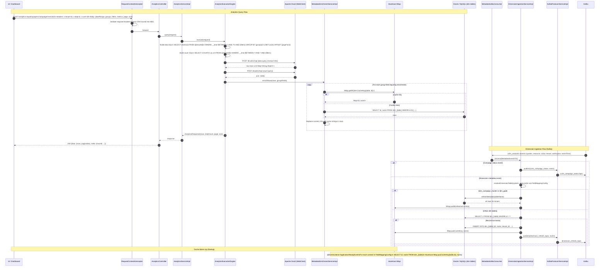

# HLD — uclm-analytics-reporting-service

**Role:** Analytics and reporting layer with dual capability: (1) **Analytics Query Engine** — builds SQL for Apache Druid, enriches IDs with Hazelcast-cached names, and returns paginated UI analytics; (2) **Dimension Metadata Pipeline** — consumes Kafka events from Campaign Manager, upserts dimension tables, warms Hazelcast cache, and republishes refresh events.

---

## 1. Purpose & Responsibilities

| Responsibility | Detail |
|---|---|
| Analytics query engine | Accept UI queries (date range, dimension groups, filters, metrics); build and execute Druid SQL; paginate results |
| Druid SQL construction | Datasource = `a{tenantId}`; build data SQL + count SQL with GROUP BY, LIMIT, OFFSET |
| ID enrichment | Replace raw numeric IDs in Druid rows with human-readable names using Hazelcast batch lookups |
| Excel download | Apache POI `.xlsx` generation for 3 analytics views (overview, detail, channel) |
| Dimension ingestion | Consume `uclm_analytics` Kafka events; upsert dimension tables in Oracle/MySQL |
| Hazelcast cache warm-up | At startup, load all dimension tables into Hazelcast `IMap` (`analytics-metadata-cluster`) |
| Cache refresh | On Kafka event or POST `/internal/cache/refresh`, refresh specific dimension IMap entries |
| Republish events | After dimension upsert: publish to `dimension_refresh_topic`; on campaign status: publish to `uclm_campaign_status` |
| 12 analytics endpoints | Campaign overview, campaign detail view, channel overview (totals, trends, SMS parts, delivery errors) |
| Metadata dropdowns | `POST /metadata` returns dimension filter options for UI dropdowns |
| Multi-tenant Druid | Each tenant has its own Druid datasource: `a1`, `a2`, etc. |

---

## 2. High-Level Architecture

```
┌──────────────────────────────────────────────────────────────────────────────────────┐
│                    uclm-analytics-reporting-service  (:8080)                         │
│                                                                                      │
│  ┌───────────────────────────────────────────────────────────────────────────────┐  │
│  │  REST Layer (12 analytics + metadata + dimension + cache endpoints)            │  │
│  │                                                                               │  │
│  │  AnalyticsController   MetadataController   DimensionController               │  │
│  │       │                      │                   │                            │  │
│  │  RequestContextInterceptor (header validation + OTel MDC traceId)             │  │
│  └───────────────────┬───────────────────────────────────────────────────────────┘  │
│                      │                                                               │
│       ┌──────────────┴──────────────────────────────────────────┐                  │
│       │                                                          │                  │
│       ▼  QUERY PATH                                              ▼  METADATA PATH   │
│  ┌──────────────────────────┐                    ┌──────────────────────────────┐  │
│  │  AnalyticsExecutionEngine │                    │  MetadataServiceImpl         │  │
│  │  • Build data SQL         │                    │  MetadataEnrichmentServiceImpl│  │
│  │  • Build count SQL        │                    │  DatabaseMetadataServiceImpl  │  │
│  │  • DruidClient (WebClient)│                    │  (JDBC fallback)              │  │
│  │  → POST /druid/v2/sql     │                    └──────────────┬───────────────┘  │
│  │  • Paginate rows          │                                   │                  │
│  └────────────┬─────────────┘                                   │                  │
│               │                                                  │                  │
│               ▼                                                  ▼                  │
│  ┌────────────────────────────────┐           ┌───────────────────────────────┐   │
│  │  MetadataEnrichmentServiceImpl  │           │  Hazelcast IMap               │   │
│  │  Batch ID→name lookup          │◀──────────│  "analytics-metadata-cluster"  │   │
│  │  Hazelcast → JDBC fallback     │           │  Key: CacheKey{table, id}      │   │
│  └────────────────────────────────┘           │  Value: name (String)          │   │
│                                               └───────────────────────────────┘   │
│  ┌───────────────────────────────────────────────────────────────────────────────┐ │
│  │  Kafka Consumer Path                                                           │ │
│  │                                                                               │ │
│  │  MetadataKafkaConsumer [uclm_analytics]                                       │ │
│  │       │  DimensionIngestionServiceImpl.process(event)                         │ │
│  │       │    → check exists → INSERT dim table                                  │ │
│  │       │    → refreshMetadata(table) → Hazelcast IMap.put()                   │ │
│  │       │    → KafkaProducerServiceImpl → dimension_refresh_topic               │ │
│  │       │    → if campaign status event → uclm_campaign_status                 │ │
│  └───────────────────────────────────────────────────────────────────────────────┘ │
└──────────────────────────────────────────────────────────────────────────────────────┘
         │                    │                     │
         ▼                    ▼                     ▼
  ┌─────────────┐   ┌──────────────────┐   ┌──────────────────────────┐
  │  Apache Druid│   │  Kafka Topics     │   │  Oracle / MySQL          │
  │  broker      │   │  uclm_analytics   │   │  Dimension Tables        │
  │  datasource  │   │  (CONSUME)        │   │  dim_channel             │
  │  a{tenantId} │   │  dimension_refresh│   │  dim_campaign_type       │
  └─────────────┘   │  (PRODUCE)        │   │  dim_goal                │
                    │  uclm_campaign_   │   │  dim_campaign_master     │
                    │  status (PRODUCE) │   │  + others                │
                    └──────────────────┘   └──────────────────────────┘
```

---

## 3. Detailed Processing Flow



---

## 4. Key Business Logic / Algorithms

### 4.1 Druid SQL Generation

```
datasource = "a" + tenantId          // e.g. a1, a2

DATA SQL:
  SELECT {metric_columns}
  FROM {datasource}
  WHERE __time BETWEEN '{startDate}' AND '{endDate}'
    AND {dimension_filters}
  GROUP BY {group_columns}
  ORDER BY {sort_column} {direction}
  LIMIT {pageSize}
  OFFSET {page * pageSize}

COUNT SQL:
  SELECT COUNT(*) as cnt
  FROM {datasource}
  WHERE __time BETWEEN '{startDate}' AND '{endDate}'
    AND {dimension_filters}

Time format: UTC timezone (druid.time-format-timezone=UTC)
Retry on failure: up to druid.max.retry=3 times
```

### 4.2 Hazelcast Cache Key Strategy

```
CacheKey { tableName: String, id: Long }

IMap name: "analytics-metadata-cluster"

Lookup order:
  1. Hazelcast IMap.getAll(keys) — batch fetch
  2. On cache miss: JDBC SELECT from Oracle/MySQL dim table
  3. Store result back in Hazelcast (lazy population)

Warm-up: ApplicationReadyEvent → load all dim tables → IMap.putAll()
```

### 4.3 Dimension Ingestion Decision Tree

```
Consume uclm_analytics event {system, resource, value, tenant}
  │
  ├─ Is campaign status event?
  │    YES → publish to uclm_campaign_status topic
  │
  └─ Is dimension metadata event?
       │
       ├─ Resolve dim table from FieldMappingConfig(system, resource)
       │
       ├─ Table == dim_campaign_master OR dim_goal?
       │    YES → full refresh: SELECT all → Hazelcast IMap.putAll()
       │
       └─ Other table:
            ├─ SELECT EXISTS → if not found → INSERT
            ├─ Hazelcast IMap.put(key, name)
            └─ Publish to dimension_refresh_topic
```

### 4.4 FieldMappingConfig — Context Mapping

```
Supported contexts (UI field ↔ Druid column ↔ dim table ↔ Kafka key):

  campaign          → campaign_id      → dim_campaign_master   → campaign
  channel           → channel_id       → dim_channel           → channel
  campaignType      → campaign_type_id → dim_campaign_type     → campaignType
  campaignStatus    → status_id        → dim_campaign_status   → campaignStatus
  goal              → goal_id          → dim_goal              → goal
  template          → template_id      → dim_template          → template
  channelContentType→ content_type_id  → dim_channel_content   → channelContentType
  deliveryErrorDesc → error_code       → dim_delivery_error    → deliveryErrorDesc
```

### 4.5 Excel Generation (Apache POI)

```
FileServiceImpl.generateExcel(analyticsResponse):
  workbook = new XSSFWorkbook()
  sheet    = workbook.createSheet("Analytics")
  
  Row 0: header row from column names
  Rows 1+: data rows, one per Druid result row
  
  Output: ByteArrayOutputStream → StreamingResponseBody
  Content-Type: application/vnd.openxmlformats-officedocument.spreadsheetml.sheet
  Content-Disposition: attachment; filename="analytics_{timestamp}.xlsx"
```

---

## 5. Data Models

### Dimension Tables (Oracle / MySQL)

| Table | Key Columns | Description |
|---|---|---|
| `dim_channel` | id, name, tenant_id | Channel types (SMS, WA, EMAIL, etc.) |
| `dim_campaign_type` | id, name, tenant_id | Campaign types (PROMOTIONAL, TRANSACTIONAL, etc.) |
| `dim_campaign_master` | id, name, tenant_id, status | Campaign name lookup |
| `dim_goal` | id, name, tenant_id | Goal names |
| `dim_campaign_status` | id, name | Campaign lifecycle states |
| `dim_template` | id, name, tenant_id | Template name lookup |
| `dim_channel_content_type` | id, name | Content type codes |
| `dim_delivery_error` | error_code, description | Delivery error code descriptions |

### MetadataEventDTO (Kafka Event)

| Field | Type | Description |
|---|---|---|
| `system` | String | Source system identifier |
| `resource` | String | Resource type (maps to dim table) |
| `value` | Object | The dimension entity payload |
| `tenant` | String | Tenant identifier |
| `workspace` | String | Workspace identifier |
| `eventTime` | String | ISO-8601 event timestamp |

### AnalyticsRequest DTO

| Field | Type | Description |
|---|---|---|
| `dateRange` | `{from, to}` | ISO-8601 date range for `__time` filter |
| `groups` | List\<String\> | Dimension columns to GROUP BY |
| `filters` | Map\<String,Object\> | Dimension filter predicates |
| `metrics` | List\<String\> | Metric columns to SELECT |
| `page` | int | Zero-based page number |
| `size` | int | Page size |
| `sort` | `{column, direction}` | Optional sort config |

### AnalyticsResponse DTO

| Field | Type | Description |
|---|---|---|
| `rows` | List\<Map\<String,Object\>\> | Enriched result rows |
| `totalCount` | long | Total matching rows (from count query) |
| `page` | int | Current page |
| `size` | int | Page size |

---

## 6. Kafka Topics

| Topic | Direction | Description |
|---|---|---|
| `uclm_analytics` | CONSUME | Dimension metadata events from Campaign Manager; triggers DB upsert + cache refresh |
| `dimension_refresh_topic` | PRODUCE | Published after each successful dimension upsert |
| `uclm_campaign_status` | PRODUCE | Campaign status change events forwarded from `uclm_analytics` |

**Consumer Config:**

| Property | Value |
|---|---|
| `group-id` | `analytics-metadata-service` |
| `auto-offset-reset` | `earliest` |
| `kafka.auth.type` | `NONE` (local) / `GSSAPI` (UAT/Prod) |

---

## 7. REST API Endpoints

| Method | Path | Description |
|---|---|---|
| POST | `/analytics-reporting/api/v1/campaignOverview` | Campaign KPIs: sent, delivered, read, clicked, CTR |
| POST | `/analytics-reporting/api/v1/campaignOverview/download` | `.xlsx` stream of campaign overview |
| POST | `/analytics-reporting/api/v1/campaignDetailView/totalStats` | Single campaign aggregate stats |
| POST | `/analytics-reporting/api/v1/campaignDetailView/dateTrendChart` | Day-by-day trend for one campaign |
| POST | `/analytics-reporting/api/v1/campaignDetailView/download` | `.xlsx` stream of campaign detail |
| POST | `/analytics-reporting/api/v1/channelOverview/totalStats` | Cross-campaign channel aggregate stats |
| POST | `/analytics-reporting/api/v1/channelOverview/dateTrend` | Channel day-by-day trend |
| POST | `/analytics-reporting/api/v1/channelOverview/summary` | Channel summary table |
| POST | `/analytics-reporting/api/v1/channelOverview/smsTotalStats` | SMS-specific stats including parts count |
| POST | `/analytics-reporting/api/v1/channelOverview/smsParts` | SMS parts breakdown by message length |
| POST | `/analytics-reporting/api/v1/channelOverview/deliveryError` | Delivery error breakdown by error code |
| POST | `/analytics-reporting/api/v1/channelOverview/summary/download` | `.xlsx` stream of channel summary |
| POST | `/analytics-reporting/api/v1/metadata` | Dimension filter options for UI dropdowns |
| GET | `/api/v1/dimensions/{dimension}` | Flat list for a single dimension table |
| POST | `/internal/cache/refresh` | Refresh specific dimension cache entry (requires `X-INTERNAL-CALL` header) |

---

## 8. Component Map

| Class | Package | Responsibility |
|---|---|---|
| `UclmAnalyticsReportingServiceApplication` | `main` | Spring Boot bootstrap; `@EnableKafka`, Hazelcast config |
| `AnalyticsController` | `controller` | 12 analytics query + download endpoints |
| `MetadataController` | `controller` | `POST /metadata` — dimension filter options |
| `DimensionController` | `controller` | `GET /dimensions/{dim}` — flat dimension list |
| `MetadataCacheRefreshController` | `controller` | `POST /internal/cache/refresh`; validates `X-INTERNAL-CALL` header |
| `RequestContextInterceptor` | `interceptor` | Required header validation; injects OTel traceId into MDC |
| `AnalyticsExecutionEngine` | `engine` | Druid SQL build (data + count), execute via `DruidClient`, paginate |
| `AnalyticsServiceImpl` | `service` | Orchestrates query pipeline: engine → enrichment → response build |
| `MetadataServiceImpl` | `service` | Fetch dimension items from Hazelcast for dropdown population |
| `MetadataEnrichmentServiceImpl` | `service` | Batch ID→name enrichment using Hazelcast with JDBC fallback |
| `DatabaseMetadataServiceImpl` | `service` | JDBC-based dim table queries (fallback for Hazelcast misses) |
| `DimensionIngestionServiceImpl` | `service` | Kafka event → dim table upsert + Hazelcast refresh + republish |
| `FileServiceImpl` | `service` | Apache POI XSSFWorkbook `.xlsx` generation + streaming |
| `KafkaProducerServiceImpl` | `service` | Publishes to `dimension_refresh_topic` and `uclm_campaign_status` |
| `MetadataKafkaConsumer` | `kafka` | `@KafkaListener` on `uclm_analytics` topic; delegates to `DimensionIngestionServiceImpl` |
| `DruidClient` | `client` | Spring WebClient wrapper for Druid broker `POST /druid/v2/sql` with retry |
| `TenantConfigClient` | `client` | REST call to Auth Manager for tenant timezone |
| `MetadataCacheServiceImpl` | `cache` | Hazelcast `IMap` wrapper: `get`, `put`, `getAll`, `putAll` |
| `CacheWarmUp` | `cache` | `@EventListener(ApplicationReadyEvent)` — loads all dim tables into Hazelcast at startup |
| `FieldMappingConfig` | `config` | Maps UI field ↔ Druid column ↔ dim table ↔ Kafka event key |
| `DruidQueryConfig` | `config` | `@ConfigurationProperties(prefix="druid")` — broker URL, timeouts, retry count |
| `HazelcastConfig` | `config` | Cluster name, instance name, network join mode (k8s vs multicast) |

---

## 9. Configuration Reference

| Property | Default | Description |
|---|---|---|
| `server.port` | `8080` | HTTP server port |
| `spring.application.name` | `analytics-reporting-service` | Application name |
| `app.name` | `ANALYTICS_REPORTING` | Application identifier used in response meta |
| `spring.profiles.active` | `uat` | Active Spring profile |
| `druid.broker.url` | `http://druid-uclm-uat.airtel.com` | Druid broker base URL |
| `druid.datasource-prefix` | `a` | Tenant datasource prefix (`a` + tenantId) |
| `druid.datasource` | `a1` | Fallback datasource when tenantId unavailable |
| `druid.query.timeout` | `30000` | Druid query timeout in milliseconds |
| `druid.connection.timeout` | `10000` | Druid connection timeout in milliseconds |
| `druid.max.retry` | `3` | Max retries on Druid query failure |
| `druid.time-format-timezone` | `UTC` | Timezone for `__time` column formatting |
| `spring.kafka.consumer.group-id` | `analytics-metadata-service` | Kafka consumer group |
| `app.kafka.topic.analytics-metadata-dimension` | `uclm_analytics` | Kafka topic consumed for dimension events |
| `app.kafka.topic.dimension-refresh` | `dimension_refresh_topic` | Kafka topic produced after dimension upsert |
| `app.kafka.topic.campaign-status` | `uclm_campaign_status` | Kafka topic produced for campaign status events |
| `kafka.auth.type` | `NONE` (local) / `GSSAPI` (UAT/Prod) | Kafka authentication type |
| `hazelcast.cluster.name` | `analytics-metadata-cluster` | Hazelcast cluster identifier |
| `hazelcast.instance.name` | `analytics-hazelcast-instance` | Hazelcast member instance name |
| `hazelcast.network.join.kubernetes.enabled` | `false` (local) / `true` (prod) | K8s-based member discovery |
| `hazelcast.network.join.multicast.enabled` | `false` | Multicast disabled (use K8s DNS in prod) |
| `auth.manager.base-url` | `http://authmanager-deployment...:7002` | Auth Manager base URL for tenant config |

---

## 10. External Dependencies

| Service | Type | Purpose |
|---|---|---|
| Apache Druid | Time-series DB (WebClient) | Stores and serves campaign analytics events; queried via `POST /druid/v2/sql` |
| Oracle / MySQL | Database | Dimension lookup tables (`dim_channel`, `dim_goal`, `dim_campaign_master`, etc.) |
| Hazelcast 5.4.0 | In-memory Data Grid | IMap cache for dimension ID→name enrichment; K8s cluster discovery in prod |
| Kafka | Message Broker | Consume `uclm_analytics`; produce `dimension_refresh_topic` + `uclm_campaign_status` |
| Auth Manager | REST | Fetch tenant timezone and configuration |
| Apache POI | Library | XSSFWorkbook `.xlsx` generation for download endpoints |
| Spring WebFlux (WebClient) | Library | Non-blocking HTTP client for Druid broker calls |
| OpenTelemetry | Instrumentation | Distributed trace context propagation via `RequestContextInterceptor` |
| Kubernetes | Platform | K8s service discovery for Hazelcast cluster formation in prod |
