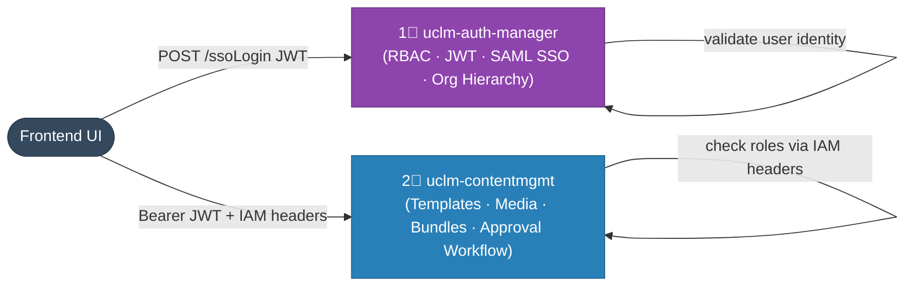
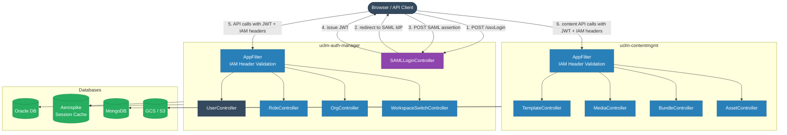

# User Management — Services Overview

> Two microservices that together manage identity, access control, and multi-channel content across the UCLM platform.

---

## At a Glance

---

## 1. uclm-auth-manager

**Port:** `${PORT}` (env var) | **DB:** Oracle (primary), H2 (dev) | **Cache:** Aerospike

The **authentication and RBAC gateway** for the entire UCLM platform.

### Responsibilities

| Area | Detail |
|------|--------|
| User lifecycle | Create, soft-delete, re-activate, paginated list users |
| Org/workspace hierarchy | Create org tree nodes, rename nodes, build hierarchical trees |
| Role management | Define roles, list roles with endpoint mappings |
| Resource management | Register API resources and map specific endpoints |
| SAML 2.0 SSO | Generate AuthnRequest redirect URL, receive SAML assertions, validate and parse |
| JWT issuance | Issue HS256-signed JWTs with tenant/workspace/role/hierarchy claims |
| Workspace switching | Re-issue JWT scoped to a different workspace |
| Session management | Store SSO sessions in Aerospike with configurable TTL (default 300 s) |
| Tenant configuration | Store and retrieve per-tenant SSO and account configuration |
| User notifications | Fire async HTTP notification to campaign service on user creation |

### API Base Path

`/auth-manager/api/v1`

### Key External Integrations

| System | Type | Purpose |
|--------|------|---------|
| SAML IdP (AD FS) | SAML 2.0 | Single Sign-On authentication |
| Aerospike | NoSQL Cache | Store SSO sessions with TTL |
| Oracle DB | Relational DB | Persist users, roles, org hierarchy, tenant config |
| Notification Service | REST HTTP (async) | Alert on user creation |

---

## 2. uclm-contentmgmt

**Port:** `${PORT}` (env var) | **DB:** MongoDB | **Storage:** GCS (primary) / S3

The **content lifecycle management** service for all communication channels.

### Responsibilities

| Area | Detail |
|------|--------|
| Template management | Create and manage message templates for SMS, Email, WhatsApp, RCS, Push, Voice |
| Approval workflow | Multi-stage L1 → L2 approval with rejection/edit cycle |
| Channel registration | Submit approved templates to WhatsApp/RCS platform and poll for approval |
| Media management | Upload images/videos/documents to GCS/S3 with L1/L2 approval |
| Bundle management | Group multiple templates into bundles |
| Channel config | Store per-tenant channel-specific configurations (sender IDs, keys, etc.) |
| Audit logging | Track all field-level changes across template and media lifecycle |
| Analytics events | Publish template/media change events to Kafka |

### API Base Path

`/content-manager/api/v1`

### Key External Integrations

| System | Type | Purpose |
|--------|------|---------|
| MongoDB | NoSQL DB | Persist templates, media, bundles, channel configs |
| GCS / S3 | Object Storage | Store uploaded media files |
| WhatsApp IQ Platform | REST HTTP | Register and poll WhatsApp template approvals |
| RCS IQ Platform | REST HTTP | Register and poll RCS template approvals |
| Kafka | Messaging | Publish analytics and change events |

---

## Summary Table

| # | Service | Role | Port | DB | External Deps |
|---|---------|------|------|----|---------------|
| 1 | `uclm-auth-manager` | RBAC gateway, SAML SSO, JWT, org hierarchy | `${PORT}` | Oracle + Aerospike | SAML IdP, Notification Service |
| 2 | `uclm-contentmgmt` | Template/media/bundle lifecycle with approval workflow | `${PORT}` | MongoDB + GCS/S3 | WhatsApp IQ, RCS IQ, Kafka |

---

## Service Interaction Diagram

