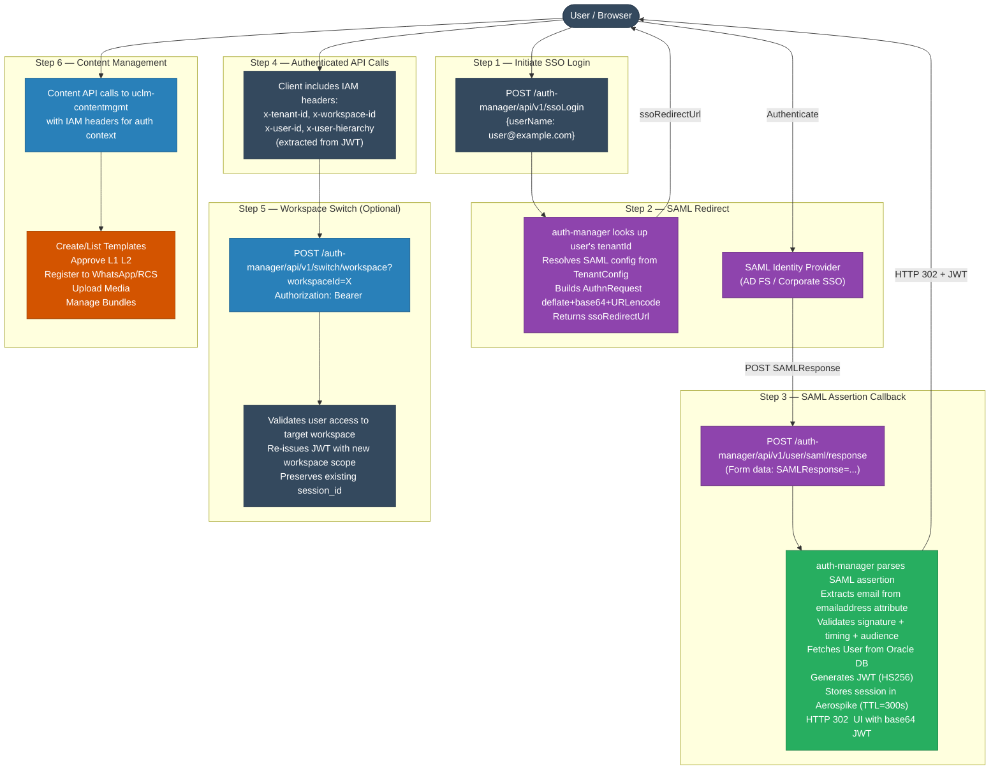
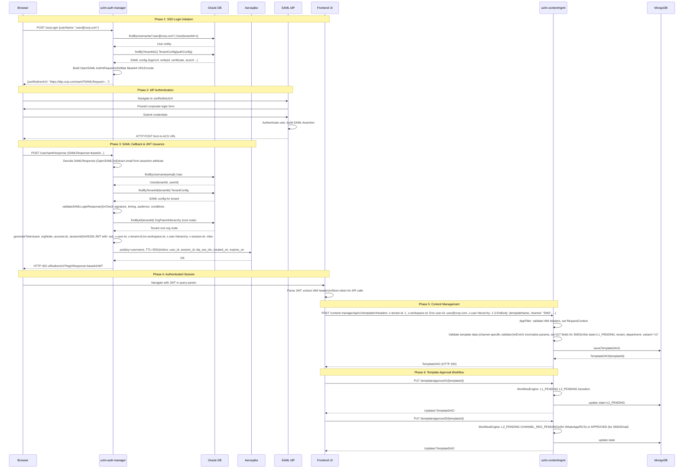
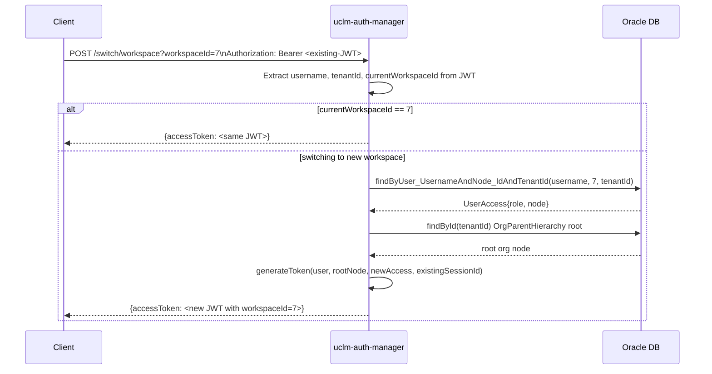

# User Management — End-to-End Flow

> Full integrated flow from initial login through token-based authorization to content management operations.

---

## Flow Overview

---

## Detailed Flow: Login to Content Creation

---

## IAM Header Flow

Every request to both services (except whitelisted paths) must carry these headers:

| Header | Source | Used For |
|--------|--------|----------|
| `x-tenant-id` | JWT claim | Tenant data isolation |
| `x-workspace-id` | JWT claim | Workspace/department scoping |
| `x-user-id` | JWT claim | Audit trails, self-service prevention |
| `x-user-hierarchy` | JWT claim (format: `1-3-5`) | Hierarchical access checks |

### Whitelisted Paths (No IAM Headers Required)

| Service | Path | Reason |
|---------|------|--------|
| auth-manager | `POST /ssoLogin` | Login initiation — user not yet authenticated |
| auth-manager | `POST /user/saml/response` | SAML callback from IdP |
| auth-manager | `GET /tenant/config/**` | Public tenant config lookup |
| auth-manager | `GET /user/saml/logout/response` | SAML logout callback |
| contentmgmt | `POST /template/callback/sms` | DLT webhook callback from SMS provider |

---

## Workspace Switch Sub-Flow

